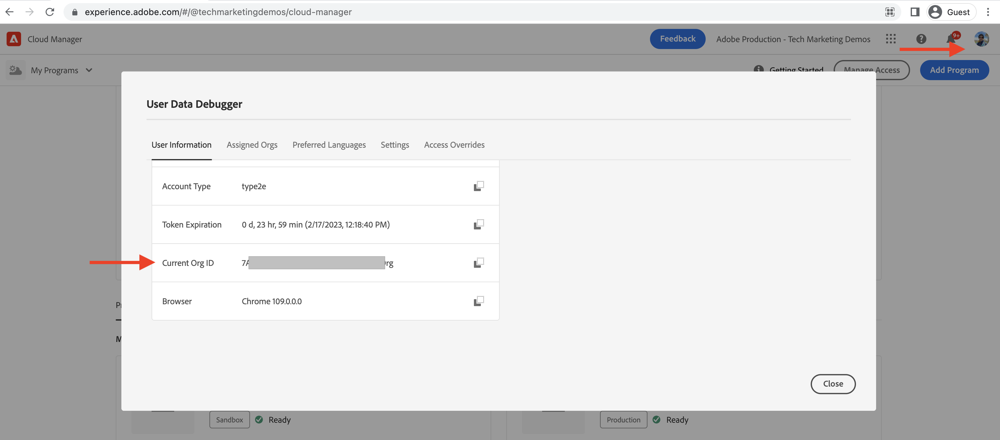

# Come creare un ambiente di sviluppo rapido

Scopri **come impostare** Ambiente di sviluppo rapido (RDE) in AEM as a Cloud Service.

Questo video mostra:

- Aggiunta di un RDE al programma tramite Cloud Manager
- Flusso di accesso RDE tramite Adobe IMS, simile a qualsiasi altro ambiente AEM as a Cloud Service
- Configurazione di [CLI estensibile Adobe I/O Runtime](https://developer.adobe.com/runtime/docs/guides/tools/cli_install/) noto anche come `aio CLI`
- Configurazione e configurazione di AEM RDE e Cloud Manager `aio CLI` plugin

>[!VIDEO](https://video.tv.adobe.com/v/3415490/?quality=12&learn=on)

## Prerequisito

È necessario installare localmente quanto segue:

- [Node.js](https://nodejs.org/it/) (LTS - Supporto a lungo termine)
- [npm 8+](https://docs.npmjs.com/)

## Configurazione locale

Per distribuire il [Progetto WKND Sites](https://github.com/adobe/aem-guides-wknd#aem-wknd-sites-project) codice e contenuto nell’RDE dal computer locale, completa i seguenti passaggi.

### CLI estensibile Adobe I/O Runtime

Installa Adobe I/O Runtime Extensible CLI, noto anche come `aio CLI` eseguendo il comando seguente dalla riga di comando.

```shell
$ npm install -g @adobe/aio-cli
```

### Plug-in AEM

Installa i plug-in Cloud Manager e AEM RDE utilizzando `aio cli`s `plugins:install` comando.

```shell
$ aio plugins:install @adobe/aio-cli-plugin-cloudmanager

$ aio plugins:install @adobe/aio-cli-plugin-aem-rde
```

Il plug-in Cloud Manager consente agli sviluppatori di interagire con Cloud Manager dalla riga di comando.

Il plug-in RDE AEM, consente agli sviluppatori di distribuire codice e contenuto dal computer locale.

Inoltre, per aggiornare i plug-in utilizza il `aio plugins:update` comando.

## Configurare AEM plug-in

I plug-in AEM devono essere configurati per interagire con il tuo RDE. Innanzitutto, utilizza l’interfaccia utente di Cloud Manager e copia i valori dell’ID organizzazione, programma e ambiente.

1. ID organizzazione: Copia il valore da **Immagine profilo > Informazioni account (interno) > Finestra modale > ID organizzazione corrente**

   

1. ID programma: Copia il valore da **Panoramica del programma > Ambienti > {ProgramName}-rde > URI del browser > numeri tra `program/` e`/environment`**

1. ID ambiente: Copia il valore da **Panoramica del programma > Ambienti > {ProgramName}-rde > URI del browser > numeri dopo`environment/`**

   

1. Quindi, utilizzando il `aio cli`s `config:set` impostare questi valori eseguendo il comando seguente.

   ```shell
   $ aio config:set cloudmanager_orgid <org-id>
   
   $ aio config:set cloudmanager_programid <program-id>
   
   $ aio config:set cloudmanager_environmentid <env-id>
   ```

Puoi verificare i valori di configurazione correnti eseguendo il comando seguente.

```shell
$ aio config:list
```

Inoltre, per cambiare o sapere a quale organizzazione si è attualmente connessi, puoi utilizzare il comando sottostante.

```shell
$ aio where
```

## Verifica accesso RDE

Verifica l’installazione e la configurazione del plug-in RDE AEM eseguendo il seguente comando.

```shell
$ aio aem:rde:status
```

Le informazioni sullo stato dell’RDE vengono visualizzate come lo stato dell’ambiente, l’elenco di _progetto AEM_ bundle e configurazioni sul servizio di authoring e pubblicazione.

## Passaggio successivo

Scopri [come utilizzare](./how-to-use.md) un RDE per distribuire codice e contenuti dall&#39;IDE (Integrated Development Environment) preferito per cicli di sviluppo più rapidi.


## Altro materiale di riferimento

[Abilitazione di RDE nella documentazione di un programma](https://experienceleague.adobe.com/docs/experience-manager-cloud-service/content/implementing/developing/rapid-development-environments.html#enabling-rde-in-a-program)

Configurazione di [CLI estensibile Adobe I/O Runtime](https://developer.adobe.com/runtime/docs/guides/tools/cli_install/) noto anche come `aio CLI`

[Utilizzo e comandi di AIO CLI](https://github.com/adobe/aio-cli#usage)

[Plug-in Adobe I/O Runtime CLI per le interazioni con gli ambienti di sviluppo rapido AEM](https://github.com/adobe/aio-cli-plugin-aem-rde#aio-cli-plugin-aem-rde)

[Plug-in CLI di Cloud Manager AIO](https://github.com/adobe/aio-cli-plugin-cloudmanager)
