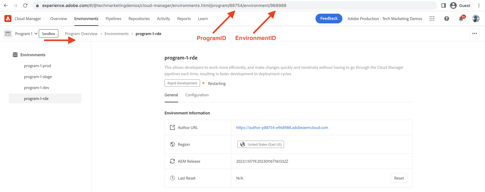

# Come impostare un ambiente di sviluppo rapido

Scopri **come configurare** l&#39;ambiente di sviluppo rapido (RDE) in AEM as a Cloud Service.

Questo video mostra:

- Aggiunta di un RDE al programma tramite Cloud Manager
- Flusso degli accessi RDE con Adobe IMS: come è simile a qualsiasi altro ambiente AEM as a Cloud Service
- Impostazione di [Adobe I/O Runtime Extensible CLI](https://developer.adobe.com/runtime/docs/guides/tools/cli_install/) nota anche come `aio CLI`
- Impostazione e configurazione del plug-in AEM RDE e Cloud Manager `aio CLI` utilizzando la modalità non interattiva. Per la modalità interattiva, vedere le [istruzioni di installazione](#setup-the-aem-rde-plugin)

>[!VIDEO](https://video.tv.adobe.com/v/3415490?quality=12&learn=on)

## Prerequisito

È necessario installare localmente quanto segue:

- [Node.js](https://nodejs.org/it/) (LTS - Supporto a lungo termine)
- [npm 8+](https://docs.npmjs.com/)

## Configurazione locale

Per distribuire il codice e il contenuto del progetto [WKND Sites](https://github.com/adobe/aem-guides-wknd#aem-wknd-sites-project) nell&#39;RDE dal computer locale, completare la procedura seguente.

### CLI estensibile Adobe I/O Runtime

Installare Adobe I/O Runtime Extensible CLI, noto anche come `aio CLI` eseguendo il comando seguente dalla riga di comando.

```shell
$ npm install -g @adobe/aio-cli
```

### Installare e configurare i plug-in CLI aio

Per interagire con l&#39;RDE, l&#39;interfaccia CLI dell&#39;aio deve disporre di plug-in installati e configurati con l&#39;ID ambiente organizzazione, programma e RDE. L&#39;installazione può essere eseguita tramite CLI dell&#39;aio utilizzando la modalità interattiva più semplice o la modalità non interattiva.

>[!BEGINTABS]

>[!TAB Modalità interattiva]

Installare e configurare i plug-in AEM RDE utilizzando il comando `plugins:install` di `aio cli`.

1. Installare il plug-in AEM RDE di CLI aio utilizzando il comando `plugins:install` di `aio cli`.

   ```shell
   $ aio plugins:install @adobe/aio-cli-plugin-aem-rde    
   $ aio plugins:update
   ```

   Il plug-in AEM RDE consente agli sviluppatori di distribuire codice e contenuto dal computer locale.

2. Accedi a Adobe I/O Runtime Extensible CLI eseguendo il seguente comando per ottenere il token di accesso. Assicurati di accedere alla stessa organizzazione Adobe del tuo Cloud Manager.

   ```shell
   $ aio login
   ```

3. Esegui il comando seguente per impostare RDE utilizzando la modalità interattiva.

   ```shell
   $ aio aem:rde:setup
   ```

4. La CLI richiede di immettere l&#39;ID organizzazione, l&#39;ID programma e l&#39;ID ambiente.

   ```shell
   Setup the CLI configuration necessary to use the RDE commands.
   ? Do you want to store the information you enter in this setup procedure locally? (y/N)
   ```

   - Scegliere __No__ se si utilizza un solo RDE e si desidera archiviare la configurazione RDE a livello globale nel computer locale.

   - Scegliere __Sì__ se si utilizzano più RDE o se si desidera archiviare la configurazione RDE localmente nel file `.aio` della cartella corrente per ogni progetto.

5. Seleziona l’ID organizzazione, l’ID programma e l’ID ambiente RDE dall’elenco delle opzioni disponibili.

6. Verificare che l&#39;organizzazione, il programma e l&#39;ambiente siano impostati correttamente eseguendo il comando seguente.

   ```shell
   $ aio aem rde setup --show
   ```

>[!TAB Modalità non interattiva]

Installare e configurare i plug-in Cloud Manager e AEM RDE utilizzando il comando `plugins:install` di `aio cli`.

```shell
$ aio plugins:install @adobe/aio-cli-plugin-cloudmanager
$ aio plugins:install @adobe/aio-cli-plugin-aem-rde
$ aio plugins:update
```

Il plug-in Cloud Manager consente agli sviluppatori di interagire con Cloud Manager dalla riga di comando.

Il plug-in AEM RDE consente agli sviluppatori di distribuire codice e contenuto dal computer locale.

I plug-in CLI dell&#39;aio devono essere configurati per interagire con l&#39;RDE.

1. Innanzitutto, utilizzando Cloud Manager, copia i valori dell’ID organizzazione, programma e ambiente.

   - ID organizzazione: copia il valore da **Immagine profilo > Informazioni account (interno) > Finestra modale > ID organizzazione corrente**

   

   - ID programma: copia il valore da **Panoramica programma > Ambienti > {ProgramName}-rde > URI browser > numeri tra `program/` e`/environment`**

   

   - ID ambiente: copia il valore da **Panoramica programma > Ambienti > {ProgramName}-rde > URI browser > numeri dopo`environment/`**

   

1. Utilizzare il comando `config:set` di `aio cli` per impostare questi valori eseguendo il comando seguente.

   ```shell
   $ aio config:set cloudmanager_orgid <ORGANIZATION ID>
   $ aio config:set cloudmanager_programid <PROGRAM ID>
   $ aio config:set cloudmanager_environmentid <ENVIRONMENT ID>
   ```

1. Verifica i valori di configurazione correnti eseguendo il comando seguente.

   ```shell
   $ aio config:list
   ```

1. Cambia o controlla l&#39;organizzazione a cui hai effettuato l&#39;accesso:

   ```shell
   $ aio where
   ```

>[!ENDTABS]

## Verifica accesso RDE

Verifica l’installazione e la configurazione del plug-in AEM RDE eseguendo il comando seguente.

```shell
$ aio aem:rde:status
```

Le informazioni sullo stato RDE vengono visualizzate come stato dell&#39;ambiente, l&#39;elenco dei _bundle e configurazioni del progetto AEM_ nel servizio di authoring e pubblicazione.

## Passaggio successivo

Scopri [come utilizzare](./how-to-use.md) un RDE per distribuire codice e contenuti dall&#39;ambiente di sviluppo integrato (IDE) preferito per cicli di sviluppo più rapidi.


## Risorse aggiuntive

[Abilitazione di RDE nella documentazione di un programma](https://experienceleague.adobe.com/docs/experience-manager-cloud-service/content/implementing/developing/rapid-development-environments.html?lang=it#enabling-rde-in-a-program)

Impostazione di [Adobe I/O Runtime Extensible CLI](https://developer.adobe.com/runtime/docs/guides/tools/cli_install/) nota anche come `aio CLI`

[Comandi e utilizzo CLI aio](https://github.com/adobe/aio-cli#usage)

[Plug-in CLI di Adobe I/O Runtime per interazioni con ambienti di sviluppo rapido AEM](https://github.com/adobe/aio-cli-plugin-aem-rde#aio-cli-plugin-aem-rde)

[Plug-in Cloud Manager aio CLI](https://github.com/adobe/aio-cli-plugin-cloudmanager)
