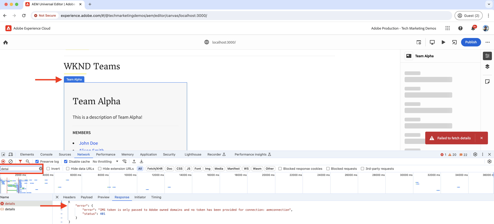
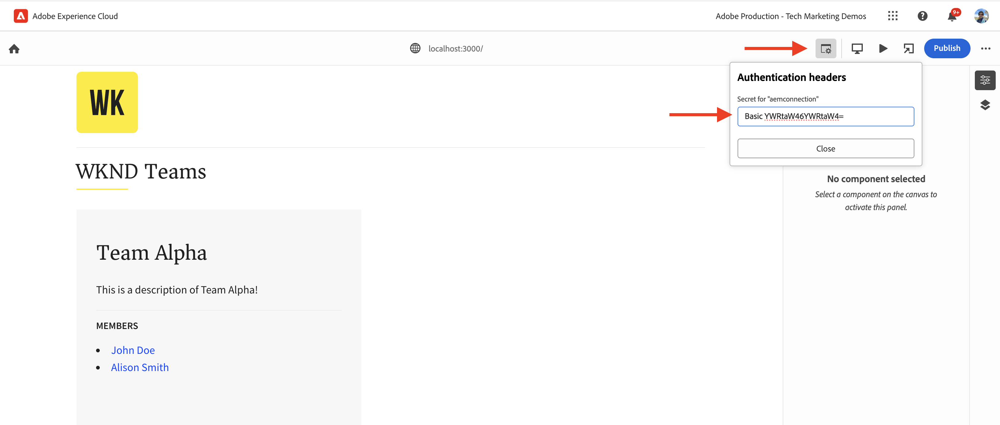

# Dotare l’app React di strumenti per modificare i contenuti tramite l’editor universale

Scopri come dotare di strumenti l’app React per modificare i contenuti con l’editor universale

## Prerequisiti

Hai configurato l’ambiente di sviluppo locale come descritto nel precedente passaggio della [configurazione dello sviluppo locale](./local-development-setup.md).

## Includere la libreria principale dell’editor universale

Iniziamo includendo la libreria principale dell’editor universale nell’app React WKND Teams. Si tratta di una libreria JavaScript che fornisce il livello di comunicazione tra l’app modificata e l’editor universale.

Esistono due modi per includere la libreria principale dell’editor universale nell’app React:

1. Dipendenza del modulo del nodo dal registro npm. Consulta [@adobe/universal-editor-cors](https://www.npmjs.com/package/@adobe/universal-editor-cors).
1. Tag Script (`<script>`) all’interno del file HTML.

Per questa esercitazione, utilizziamo l’approccio del tag Script.

1. Installa il pacchetto `react-helmet-async` per gestire il tag `<script>` nell’app React.

   ```bash
   $ npm install react-helmet-async
   ```

1. Aggiorna il file `src/App.js` dell’app WKND Teams React per includere la libreria principale dell’editor universale.

   ```javascript
   ...
   import { Helmet, HelmetProvider } from "react-helmet-async";
   
   function App() {
   return (
       <HelmetProvider>
           <div className="App">
               <Helmet>
                   {/* AEM Universal Editor :: CORE Library
                     Loads the LATEST Universal Editor library
                   */}
                   <script
                       src="https://universal-editor-service.adobe.io/cors.js"
                       async
                   />
               </Helmet>
               <Router>
                   <header>
                       <Link to={"/"}>
                       
                       </Link>
                       <hr />
                   </header>
                   <Routes>
                       <Route path="/" element={<Home />} />
                       <Route path="/person/:fullName" element={<Person />} />
                   </Routes>
               </Router>
           </div>
       </HelmetProvider>
   );
   }
   
   export default App;
   ```

## Aggiungere metadati: origine del contenuto

Per connettere l’app WKND Teams React _all’origine del contenuto_ per la modifica, è necessario fornire i metadati della connessione. Il servizio dell’editor universale utilizza questi metadati per stabilire una connessione con l’origine del contenuto.

I metadati della connessione sono memorizzati come tag `<meta>` nel file HTML. La sintassi per i metadati della connessione è la seguente:

```html
<meta name="urn:adobe:aue:<category>:<referenceName>" content="<protocol>:<url>">
```

Aggiungiamo i metadati della connessione all’app WKND Teams React all’interno del componente `<Helmet>`. Aggiorna il file `src/App.js` con il seguente tag `<meta>`. In questo esempio, l’origine del contenuto è un’istanza AEM locale in esecuzione su `https://localhost:8443`.

```javascript
...
function App() {
return (
    <HelmetProvider>
        <div className="App">
            <Helmet>
                {/* AEM Universal Editor :: CORE Library
                    Loads the LATEST Universal Editor library
                */}
                <script
                    src="https://universal-editor-service.adobe.io/cors.js"
                    async
                />
                {/* AEM Universal Editor :: Connection metadata 
                    Connects to local AEM instance
                */}
                <meta
                    name="urn:adobe:aue:system:aemconnection"
                    content={`aem:https://localhost:8443`}
                />
            </Helmet>
            ...
    </HelmetProvider>
);
}

export default App;
```

`aemconnection` fornisce un nome breve dell’origine del contenuto. La strumentazione successiva utilizza il nome breve per fare riferimento all’origine del contenuto.

## Aggiungere metadati: configurazione del servizio dell’editor universale locale

Al posto del servizio dell’editor universale ospitato da Adobe, viene utilizzata una copia locale del servizio dell’editor universale per lo sviluppo locale. Il servizio locale associa l’editor universale e AEM SDK, quindi aggiungiamo i metadati del servizio dell’editor universale locale all’app WKND Teams React.

Queste impostazioni di configurazione vengono memorizzate anche come tag `<meta>` nel file HTML. La sintassi per i metadati del servizio dell’editor universale locale è la seguente:

```html
<meta name="urn:adobe:aue:config:service" content="<url>">
```

Aggiungiamo i metadati della connessione all’app WKND Teams React all’interno del componente `<Helmet>`. Aggiorna il file `src/App.js` con il seguente tag `<meta>`. In questo esempio, il servizio dell’editor universale locale è in esecuzione su `https://localhost:8001`.

```javascript
...

function App() {
  return (
    <HelmetProvider>
      <div className="App">
        <Helmet>
          {/* AEM Universal Editor :: CORE Library
              Loads the LATEST Universal Editor library
          */}
          <script
            src="https://universal-editor-service.adobe.io/cors.js"
            async
          />
          {/* AEM Universal Editor :: Connection metadata 
              Connects to local AEM instance
          */}
          <meta
            name="urn:adobe:aue:system:aemconnection"
            content={`aem:https://localhost:8443`}
          />
          {/* AEM Universal Editor :: Configuration for Service
              Using locally running Universal Editor service
          */}
          <meta
            name="urn:adobe:aue:config:service"
            content={`https://localhost:8001`}
          />
        </Helmet>
        ...
    </HelmetProvider>
);
}
export default App;
```

## Dotare di strumenti i componenti React

Per modificare il contenuto dell’app WKND Teams React, ad esempio _titolo del team e descrizione del team_, è necessario dotare di strumenti i componenti React. La strumentazione comporta l’aggiunta di attributi di dati rilevanti (`data-aue-*`) agli elementi HTML che desideri rendere modificabili utilizzando l’editor universale. Per ulteriori informazioni sugli attributi dei dati, consulta [Attributi e tipi](https://experienceleague.adobe.com/it/docs/experience-manager-cloud-service/content/implementing/developing/universal-editor/attributes-types).

### Definire gli elementi modificabili

Iniziamo definendo gli elementi che desideri modificare utilizzando l’editor universale. Nell’app WKND Teams React, il titolo e la descrizione del team sono memorizzati nel frammento di contenuto Team in AEM, che rappresenta quindi i candidati migliori per la modifica.

Dotiamo di strumenti il componente React `Teams` per rendere modificabili il titolo e la descrizione del team.

1. Apri il file `src/components/Teams.js` dell’app WKND Teams React.
1. Aggiungi gli attributi `data-aue-prop`, `data-aue-type` e `data-aue-label` agli elementi titolo e descrizione del team.

   ```javascript
   ...
   function Teams() {
       const { teams, error } = useAllTeams();
       ...
   
       return (
           <div className="team">
               // AEM Universal Editor :: Instrumentation using data-aue-* attributes
               <h2 className="team__title" data-aue-prop="title" data-aue-type="text" data-aue-label="title">{title}</h2>
               <p className="team__description" data-aue-prop="description" data-aue-type="richtext" data-aue-label="description">{description.plaintext}</p>
               ...
           </div>
       );
   }
   
   export default Teams;
   ```

1. Aggiorna la pagina dell’editor universale nel browser che carica l’app WKND Teams React. Ora puoi vedere che gli elementi titolo e descrizione del team sono modificabili.

   

1. Se cerchi di modificare il titolo o la descrizione del team utilizzando la modifica in linea o la barra delle proprietà, viene visualizzato un pulsante di caricamento che non consente di modificare il contenuto. Perché l’editor universale non è a conoscenza dei dettagli delle risorse AEM per il caricamento e il salvataggio del contenuto.

   

In sintesi, le modifiche di cui sopra contrassegnano gli elementi del titolo e della descrizione del team come modificabili nell’editor universale. Tuttavia, **non puoi ancora modificare (tramite la modifica in linea o la barra delle proprietà) e salvare le modifiche**, per questo è necessario che tu aggiunga i dettagli della risorsa AEM utilizzando l’attributo `data-aue-resource`. Facciamolo nel passaggio successivo.

### Definire i dettagli delle risorse AEM

Per salvare di nuovo il contenuto modificato in AEM e per caricarlo, inoltre, nella barra delle proprietà, devi fornire i dettagli della risorsa AEM all’editor universale.

In questo caso, la risorsa AEM è il percorso del frammento di contenuto del team. Pertanto, aggiungiamo i dettagli della risorsa al componente `Teams` React nell’elemento `<div>` di livello superiore.

1. Aggiorna il file `src/components/Teams.js` per aggiungere gli attributi `data-aue-resource`, `data-aue-type` e `data-aue-label` all’elemento `<div>` di livello superiore.

   ```javascript
   ...
   function Teams() {
       const { teams, error } = useAllTeams();
       ...
   
       // Render single Team
       function Team({ _path, title, shortName, description, teamMembers }) {
           // Must have title, shortName and at least 1 team member
           if (!_path || !title || !shortName || !teamMembers) {
               return null;
           }
   
         return (
           // AEM Universal Editor :: Instrumentation using data-aue-* attributes
           <div className="team" data-aue-resource={`urn:aemconnection:${_path}/jcr:content/data/master`} data-aue-type="reference" data-aue-label={title}>
           ...
           </div>
       );
       }
   }
   export default Teams;
   ```

   Il valore dell’attributo `data-aue-resource` è il percorso della risorsa AEM del frammento di contenuto del team. Il prefisso `urn:aemconnection:` utilizza il nome breve dell’origine di contenuto definita nei metadati della connessione.

1. Aggiorna la pagina dell’editor universale nel browser che carica l’app WKND Teams React. Ora puoi vedere che l’elemento Team di livello superiore è modificabile, ma la barra delle proprietà non carica ancora il contenuto. Nella scheda di rete del browser, puoi visualizzare l’errore 401 Unauthorized per la richiesta `details` che carica il contenuto. Sta tentando di utilizzare il token IMS per l’autenticazione, ma l’SDK AEM locale non supporta l’autenticazione IMS.

   

1. Per correggere l’errore 401 Unauthorized, devi fornire i dettagli di autenticazione AEM SDK locale all’editor universale utilizzando l’opzione **Intestazioni di autenticazione** nell’editor universale. Come AEM SDK locale, imposta il valore su `Basic YWRtaW46YWRtaW4=` per le credenziali `admin:admin`.

   

1. Aggiorna la pagina dell’editor universale nel browser che carica l’app WKND Teams React. Ora puoi vedere che la barra delle proprietà sta caricando il contenuto e puoi modificare il titolo e la descrizione del team in linea o utilizzando la barra delle proprietà.

   

#### Dietro le quinte

La barra delle proprietà carica il contenuto dalla risorsa AEM utilizzando il servizio dell’editor universale locale. Utilizzando la scheda di rete del browser, puoi visualizzare la richiesta POST nell’editor universale locale (`https://localhost:8001/details`) per il caricamento del contenuto.

Quando modifichi il contenuto in linea o utilizzando la barra delle proprietà, le modifiche vengono salvate nuovamente nella risorsa AEM utilizzando il servizio dell’editor universale locale. Utilizzando la scheda di rete del browser, puoi visualizzare la richiesta POST nel servizio dell’editor universale locale (`https://localhost:8001/update` o `https://localhost:8001/patch`) per il salvataggio del contenuto.


L’oggetto JSON del payload della richiesta contiene i dettagli necessari come il server dei contenuti (`connections`), il percorso della risorsa (`target`) e il contenuto aggiornato (`patch`).


### Espandere il contenuto modificabile

Espandiamo il contenuto modificabile e applichiamo la strumentazione ai **membri del team** in modo che sia possibile modificare i membri del team utilizzando la barra delle proprietà.

Come sopra, aggiungiamo gli attributi `data-aue-*` rilevanti ai membri del team nel componente `Teams` React.

1. Aggiorna il file `src/components/Teams.js` per aggiungere attributi di dati all’elemento `<li key={index} className="team__member">`.

   ```javascript
   ...
   function Teams() {
       const { teams, error } = useAllTeams();
       ...
   
       <div>
           <h4 className="team__members-title">Members</h4>
           <ul className="team__members">
               {/* Render the referenced Person models associated with the team */}
               {teamMembers.map((teamMember, index) => {
                   return (
                       // AEM Universal Editor :: Instrumentation using data-aue-* attributes
                       <li key={index} className="team__member" data-aue-resource={`urn:aemconnection:${teamMember?._path}/jcr:content/data/master`} data-aue-type="component" data-aue-label={teamMember.fullName}>
                       <Link to={`/person/${teamMember.fullName}`}>
                           {teamMember.fullName}
                       </Link>
                       </li>
                   );
               })}
           </ul>
       </div>
       ...
   }
   export default Teams;
   ```

   Il valore dell’attributo `data-aue-type` è `component` in quanto i membri del team sono memorizzati come frammenti di contenuto `Person` in AEM e consente di indicare le parti movibili/eliminabili del contenuto.

1. Aggiorna la pagina dell’editor universale nel browser che carica l’app WKND Teams React. Ora puoi vedere che i membri del team sono modificabili utilizzando la barra delle proprietà.

   

#### Dietro le quinte

Come sopra, il recupero e il salvataggio dei contenuti vengono eseguiti dal servizio dell’editor universale locale. Le richieste `/details`, `/update` o `/patch` vengono inviate al servizio dell’editor universale locale per il caricamento e il salvataggio del contenuto.

### Definire l’aggiunta e l’eliminazione dei contenuti

Finora hai reso modificabile il contenuto esistente, ma cosa succede se desiderassi aggiungere nuovi contenuti? Aggiungiamo la possibilità di aggiungere o eliminare membri al team WKND utilizzando l’editor universale. Pertanto, gli autori dei contenuti non devono passare ad AEM per aggiungere o eliminare membri del team.

Tuttavia, per ricapitolare rapidamente, i membri del team WKND sono memorizzati come frammenti di contenuto `Person` in AEM e sono associati al frammento di contenuto del team utilizzando la proprietà `teamMembers`. Per rivedere la definizione del modello in AEM, visita [Progetto personale](http://localhost:4502/libs/dam/cfm/models/console/content/models.html/conf/my-project).

1. Crea innanzitutto il file di definizione del componente `/public/static/component-definition.json`. Il file contiene la definizione del componente per il frammento di contenuto `Person`. Il plug-in `aem/cf` consente di inserire frammenti di contenuto in base a un modello e a un template che fornisce i valori predefiniti da applicare.

   ```json
   {
       "groups": [
           {
           "title": "Content Fragments",
           "id": "content-fragments",
           "components": [
               {
               "title": "Person",
               "id": "person",
               "plugins": {
                   "aem": {
                       "cf": {
                           "name": "person",
                           "cfModel": "/conf/my-project/settings/dam/cfm/models/person",
                           "cfFolder": "/content/dam/my-project/en",
                           "title": "person",
                           "template": {
                               "fullName": "New Person",
                               "biographyText": "This is biography of new person"
                               }
                           }
                       }
                   }
               }
           ]
           }
       ]
   }
   ```

1. Fai quindi riferimento al file di definizione del componente in `index.html` dell’app WKND Team React. Aggiorna la sezione `<head>` del file `public/index.html` per includere il file di definizione del componente.

   ```html
   ...
   <script
       type="application/vnd.adobe.aue.component+json"
       src="/static/component-definition.json"
   ></script>
   <title>WKND App - Basic GraphQL Tutorial</title>
   </head>
   ...
   ```

1. Infine, aggiorna il file `src/components/Teams.js` per aggiungere attributi di dati. La sezione **MEMBRI** funge da contenitore per i membri del team. Aggiungiamo gli attributi `data-aue-prop`, `data-aue-type` e `data-aue-label` all’elemento `<div>`.

   ```javascript
   ...
   function Teams() {
       const { teams, error } = useAllTeams();
       ...
   
       {/* AEM Universal Editor :: Team Members as container */}
       <div data-aue-prop="teamMembers" data-aue-type="container" data-aue-label="members">
           <h4 className="team__members-title">Members</h4>
           <ul className="team__members">
           {/* Render the referenced Person models associated with the team */}
           {teamMembers.map((teamMember, index) => {
               return (
               // AEM Universal Editor :: Instrumentation using data-aue-* attributes
               <li key={index} className="team__member" data-aue-resource={`urn:aemconnection:${teamMember?._path}/jcr:content/data/master`} data-aue-type="component" data-aue-label={teamMember.fullName}>
                   <Link to={`/person/${teamMember.fullName}`}>
                   {teamMember.fullName}
                   </Link>
               </li>
               );
           })}
           </ul>
       </div>
       ...
   }
   export default Teams;
   ```

1. Aggiorna la pagina dell’editor universale nel browser che carica l’app WKND Teams React. Ora puoi vedere che la sezione **MEMBRI** funge da contenitore. Puoi inserire nuovi membri del team utilizzando la barra delle proprietà e l’icona **+**.

   

1. Per eliminare un membro del team, seleziona il membro del team e fai clic sull’icona **Elimina**.

   

#### Dietro le quinte

Le operazioni di aggiunta ed eliminazione dei contenuti vengono eseguite dal servizio dell’editor universale locale. La richiesta POST a `/add` o `/remove` con un payload dettagliato viene effettuata nell’editor universale locale per l’aggiunta o l’eliminazione del contenuto in AEM.

## File di soluzione

Per verificare le modifiche apportate all’implementazione o se non riesci a utilizzare l’app WKND Teams React con l’editor universale, consulta il ramo della soluzione [basic-tutorial-instrumented-for-UE](https://github.com/adobe/aem-guides-wknd-graphql/tree/solution/basic-tutorial-instrumented-for-UE).

Il confronto file per file con il ramo **basic-tutorial** funzionante è disponibile [qui](https://github.com/adobe/aem-guides-wknd-graphql/compare/solution/basic-tutorial...solution/basic-tutorial-instrumented-for-UE?expand=1).

## Congratulazioni

Hai dotato di strumenti l’app WKND Teams React in modo corretto, per aggiungere, modificare ed eliminare contenuti tramite l’editor universale. Hai imparato come includere la libreria principale, aggiungere la connessione e i metadati del servizio dell’editor universale locale e dotare di strumenti il componente React utilizzando vari attributi di dati (`data-aue-*`).
