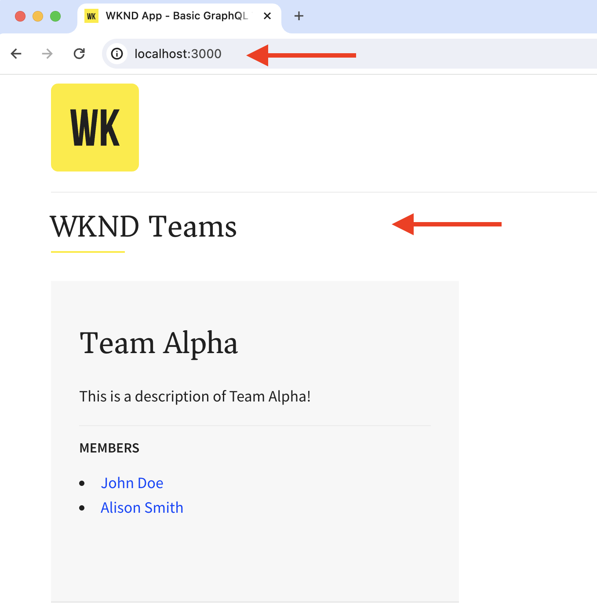
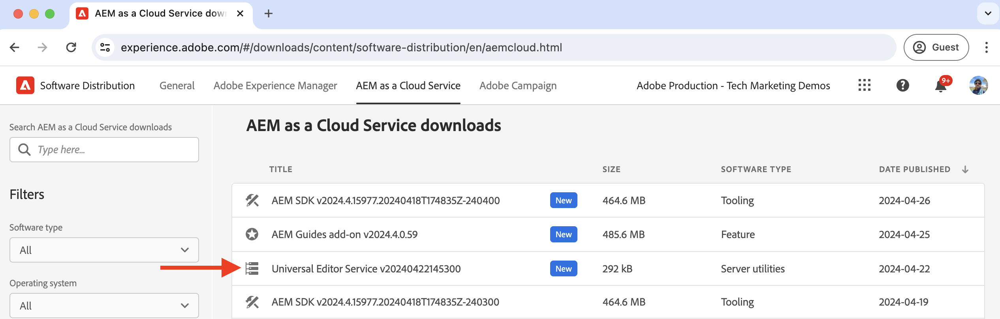

# Configurazione sviluppo locale

Scopri come impostare un ambiente di sviluppo locale per modificare i contenuti di un’app React utilizzando AEM Universal Editor.

## Prerequisiti

Per seguire questa esercitazione sono necessari i seguenti elementi:

- Competenze di base in HTML e JavaScript.
- I seguenti strumenti devono essere installati localmente:
   - [Node.js](https://nodejs.org/it/download/)
   - [Git](https://git-scm.com/downloads)
   - Un IDE o un editor di codice, ad esempio [Visual Studio Code](https://code.visualstudio.com/)
- Scarica e installa quanto segue:
   - [AEM as a Cloud Service SDK](https://experienceleague.adobe.com/it/docs/experience-manager-learn/cloud-service/local-development-environment-set-up/aem-runtime#download-the-aem-as-a-cloud-service-sdk): contiene il file JAR Quickstart utilizzato per eseguire AEM Author e Publish localmente a scopo di sviluppo.
   - [Servizio Editor universale](https://experienceleague.adobe.com/it/docs/experience-cloud/software-distribution/home): copia locale del servizio Editor universale, con un sottoinsieme di funzionalità e scaricabile dal portale di distribuzione software.
   - [local-ssl-proxy](https://www.npmjs.com/package/local-ssl-proxy#local-ssl-proxy): un semplice proxy HTTP SSL locale che utilizza un certificato autofirmato per lo sviluppo locale. AEM Universal Editor richiede l’URL HTTPS dell’app React per caricarlo nell’editor.

## Configurazione locale

Per configurare l’ambiente di sviluppo locale, segui i passaggi seguenti:

### AEM SDK

Per fornire i contenuti per l’app WKND Teams React, installa i seguenti pacchetti nel SDK AEM locale.

- [Team WKND - Pacchetto di contenuti](./assets/basic-tutorial-solution.content.zip): contiene i modelli per frammenti di contenuto, frammenti di contenuto e query GraphQL persistenti.
- [Team WKND - Pacchetto di configurazione](./assets/basic-tutorial-solution.ui.config.zip): contiene le configurazioni CORS (Cross-Origin Resource Sharing) e del gestore di autenticazione token. CORS facilita l’esecuzione di chiamate lato client non AEM alle API GraphQL di AEM basate su browser e il gestore di autenticazione token viene utilizzato per autenticare ogni richiesta in AEM.

  

### React app

Per configurare l’app WKND Teams React, effettua le seguenti operazioni:

1. Clona l&#39;app di reazione [WKND Teams](https://github.com/adobe/aem-guides-wknd-graphql/tree/solution/basic-tutorial) dal ramo della soluzione `basic-tutorial`.

   ```bash
   $ git clone -b solution/basic-tutorial git@github.com:adobe/aem-guides-wknd-graphql.git
   ```

1. Passare alla directory `basic-tutorial` e aprirla nell&#39;editor di codice.

   ```bash
   $ cd aem-guides-wknd-graphql/basic-tutorial
   $ code .
   ```

1. Installa le dipendenze e avvia l’app React.

   ```bash
   $ npm install
   $ npm start
   ```

1. Apri l&#39;app WKND Teams React nel browser in [http://localhost:3000](http://localhost:3000). Viene visualizzato un elenco dei membri del team e dei relativi dettagli. Il contenuto dell&#39;app React è fornito dal SDK AEM locale tramite le API GraphQL (`/graphql/execute.json/my-project/all-teams`), che puoi verificare utilizzando la scheda di rete del browser.

   

### Servizio editor universale

Per configurare il servizio **local** Universal Editor, effettuare le seguenti operazioni:

1. Scaricare la versione più recente del servizio Universal Editor dal [portale di distribuzione software](https://experience.adobe.com/downloads).

   

1. Estrarre il file zip scaricato e copiare il file `universal-editor-service.cjs` in una nuova directory denominata `universal-editor-service`.

   ```bash
   $ unzip universal-editor-service-vproduction-<version>.zip
   $ mkdir universal-editor-service
   $ cp universal-editor-service.cjs universal-editor-service
   ```

1. Creare il file `.env` nella directory `universal-editor-service` e aggiungere le seguenti variabili di ambiente:

   ```bash
   # The port on which the Universal Editor service runs
   EXPRESS_PORT=8000
   # Disable SSL verification
   NODE_TLS_REJECT_UNAUTHORIZED=0
   ```

1. Avviare il servizio Universal Editor locale.

   ```bash
   $ cd universal-editor-service
   $ node universal-editor-service.cjs
   ```

Il comando precedente avvia il servizio Universal Editor sulla porta `8000`. Dovrebbe essere visualizzato il seguente output:

```bash
Either no private key or certificate was set. Starting as HTTP server
Universal Editor Service listening on port 8000 as HTTP Server
```

### Proxy HTTP SSL locale

AEM Universal Editor richiede che l’app React sia gestita tramite HTTPS. Configuriamo un proxy HTTP SSL locale che utilizza un certificato autofirmato per lo sviluppo locale.

Segui i passaggi seguenti per configurare il proxy HTTP SSL locale e distribuire il servizio AEM SDK e Universal Editor tramite HTTPS:

1. Installa il pacchetto `local-ssl-proxy` a livello globale.

   ```bash
   $ npm install -g local-ssl-proxy
   ```

1. Avvia due istanze del proxy HTTP SSL locale per i servizi seguenti:

   - Proxy HTTP SSL locale di AEM SDK sulla porta `8443`.
   - Proxy HTTP SSL locale del servizio Universal Editor sulla porta `8001`.

   ```bash
   # AEM SDK local SSL HTTP proxy on port 8443
   $ local-ssl-proxy --source 8443 --target 4502
   
   # Universal Editor service local SSL HTTP proxy on port 8001
   $ local-ssl-proxy --source 8001 --target 8000
   ```

### Aggiornare l’app React per utilizzare HTTPS

Per abilitare HTTPS per l’app WKND Teams React, effettua le seguenti operazioni:

1. Arrestare React premendo `Ctrl + C` nel terminale.
1. Aggiornare il file `package.json` per includere la variabile di ambiente `HTTPS=true` nello script `start`.

   ```json
   "scripts": {
       "start": "HTTPS=true react-scripts start",
       ...
   }
   ```

1. Aggiornare `REACT_APP_HOST_URI` nel file `.env.development` per utilizzare il protocollo HTTPS e la porta proxy HTTP SSL locale di AEM SDK.

   ```bash
   REACT_APP_HOST_URI=https://localhost:8443
   ...
   ```

1. Aggiornare il file `../src/proxy/setupProxy.auth.basic.js` per utilizzare le impostazioni SSL flessibili utilizzando l&#39;opzione `secure: false`.

   ```javascript
   ...
   module.exports = function(app) {
   app.use(
       ['/content', '/graphql'],
       createProxyMiddleware({
       target: REACT_APP_HOST_URI,
       changeOrigin: true,
       secure: false, // Ignore SSL certificate errors
       // pass in credentials when developing against an Author environment
       auth: `${REACT_APP_BASIC_AUTH_USER}:${REACT_APP_BASIC_AUTH_PASS}`
       })
   );
   };
   ```

1. Avvia l’app React.

   ```bash
   $ npm start
   ```

## Verificare la configurazione

Dopo aver configurato l’ambiente di sviluppo locale seguendo i passaggi precedenti, verifichiamo la configurazione.

### Verifica locale

Assicurati che i seguenti servizi siano in esecuzione localmente su HTTPS. Potrebbe essere necessario accettare l’avviso di sicurezza nel browser per il certificato autofirmato:

1. App di reazione team WKND su [https://localhost:3000](https://localhost:3000)
1. AEM SDK su [https://localhost:8443](https://localhost:8443)
1. Servizio Editor universale su [https://localhost:8001](https://localhost:8001)

### Caricare l’app WKND Teams React nell’editor universale

Carichiamo l’app WKND Teams React nell’editor universale per verificare la configurazione:

1. Apri Universal Editor https://experience.adobe.com/#/aem/editor nel browser. Se richiesto, effettua l’accesso con il tuo Adobe ID.

1. Immettere l&#39;URL dell&#39;app React WKND Teams nel campo di input URL sito dell&#39;editor universale e fare clic su `Open`.

   

1. L&#39;app WKND Teams React viene caricata nell&#39;editor universale **ma non è ancora possibile modificare il contenuto**. È necessario dotare l’app React di strumenti che consentano di modificare i contenuti mediante l’editor universale.

   


## Passaggio successivo

Scopri come [dotare l&#39;app React per modificare il contenuto](./instrument-to-edit-content.md).
