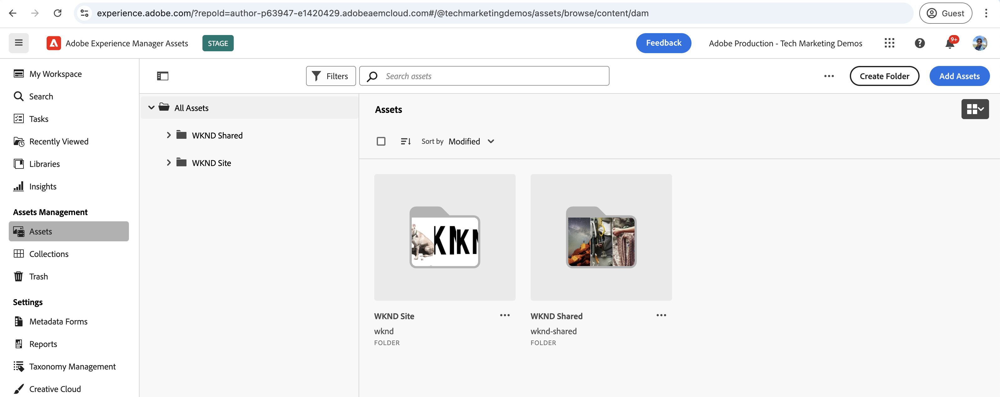
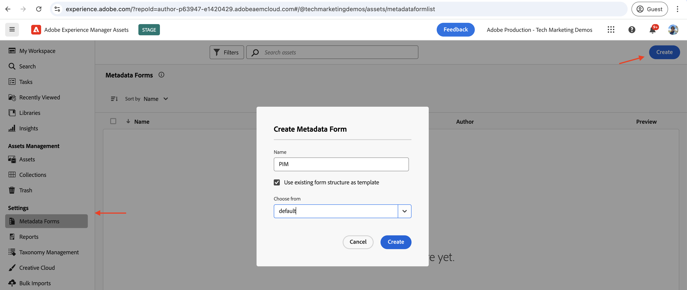
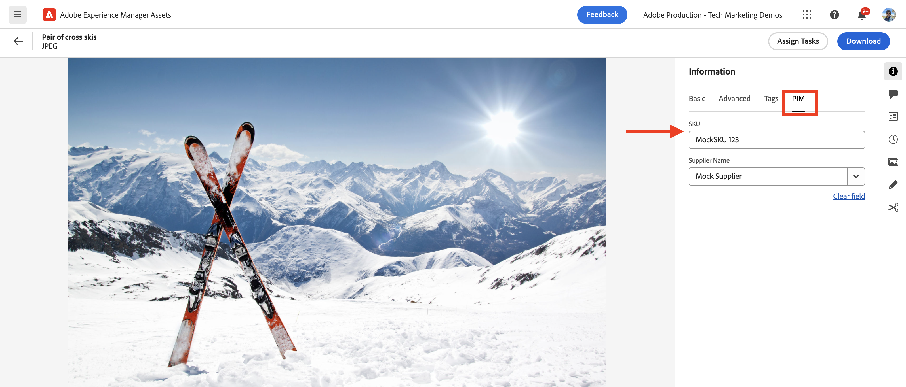

# Eventi AEM Assets per l’integrazione con la soluzione PIM

>[!IMPORTANT]
>
>Questa esercitazione utilizza le API AEM basate su OpenAPI. Sono disponibili come parte di un programma di accesso anticipato. Se sei interessato ad accedervi, ti invitiamo a inviare un&#39;e-mail a [aem-apis@adobe.com](mailto:aem-apis@adobe.com) con una descrizione del tuo caso d&#39;uso.

Scopri come ricevere un evento AEM e agire di conseguenza per aggiornare lo stato dei contenuti in AEM utilizzando l’API di authoring Assets basata su OpenAPI.

La modalità di elaborazione dell’evento ricevuto dipende dai requisiti aziendali. Ad esempio, i dati dell’evento possono essere utilizzati per aggiornare il sistema di terze parti, AEM o entrambi.

In questo esempio viene illustrato come integrare con AEM as a Cloud Service Assets un sistema di terze parti, ad esempio un sistema di gestione delle informazioni sui prodotti (PIM, Product Information Management). Quando viene ricevuto un evento AEM Assets, questo viene elaborato per recuperare metadati aggiuntivi dal sistema PIM e aggiornare i metadati della risorsa in AEM. I metadati aggiornati delle risorse possono includere informazioni aggiuntive come SKU, nome del fornitore o altri dettagli sul prodotto.

Per ricevere ed elaborare l&#39;evento AEM Assets, [Adobe I/O Runtime](https://developer.adobe.com/runtime/docs/guides/overview/what_is_runtime/), viene utilizzata una piattaforma senza server. Tuttavia, è possibile utilizzare anche altri sistemi di elaborazione degli eventi come Webhook nel sistema di terze parti o Amazon EventBridge.

Il flusso di alto livello dell’integrazione è il seguente:


1. Il servizio AEM Author attiva un evento _Elaborazione risorsa completata_ al completamento del caricamento di una risorsa e di tutte le attività di elaborazione delle risorse. In attesa del completamento dell’elaborazione delle risorse, viene verificata l’avvenuto completamento di qualsiasi elaborazione predefinita, ad esempio l’estrazione dei metadati.
1. Evento inviato al servizio [Adobe I/O Events](https://developer.adobe.com/events/).
1. Il servizio Adobe I/O Events passa l&#39;evento all&#39;[azione Adobe I/O Runtime](https://developer.adobe.com/runtime/docs/guides/using/creating_actions/) per l&#39;elaborazione.
1. L’azione Adobe I/O Runtime richiama l’API del sistema PIM per recuperare metadati aggiuntivi come SKU, informazioni sul fornitore o altri dettagli.
1. I metadati aggiuntivi recuperati da PIM vengono quindi aggiornati in AEM Assets utilizzando l&#39;[API Autore Assets](https://developer.adobe.com/experience-cloud/experience-manager-apis/api/experimental/assets/author/) basata su OpenAPI.

## Prerequisiti

Per completare questa esercitazione, è necessario:

- Ambiente AEM as a Cloud Service con [evento AEM abilitato](https://developer.adobe.com/experience-cloud/experience-manager-apis/guides/events/#enable-aem-events-on-your-aem-cloud-service-environment). Inoltre, il progetto [WKND Sites](https://github.com/adobe/aem-guides-wknd?#aem-wknd-sites-project) di esempio deve essere distribuito su di esso.

- Accesso a [Adobe Developer Console](https://developer.adobe.com/developer-console/docs/guides/getting-started).

- [Adobe Developer CLI](https://developer.adobe.com/runtime/docs/guides/tools/cli_install/) installato nel computer locale.

## Passaggi di sviluppo

Le fasi di sviluppo di alto livello sono:

1. [Modernizzazione dell&#39;ambiente AEM as a Cloud Service](https://experienceleague.adobe.com/it/docs/experience-manager-learn/cloud-service/aem-apis/invoke-openapi-based-aem-apis#modernization-of-aem-as-a-cloud-service-environment)
1. [Abilitare l&#39;accesso alle API di AEM](https://experienceleague.adobe.com/it/docs/experience-manager-learn/cloud-service/aem-apis/invoke-openapi-based-aem-apis#enable-aem-apis-access)
1. [Creare un progetto in Adobe Developer Console (ADC)](./runtime-action.md#Create-project-in-Adobe-Developer-Console)
1. [Inizializzare il progetto per lo sviluppo locale](./runtime-action.md#initialize-project-for-local-development)
1. Configurare il progetto in ADC
1. Configura il servizio AEM Author per abilitare la comunicazione tra progetti ADC
1. Sviluppa un’azione di runtime per orchestrare
   1. recupero dei metadati dal sistema PIM
   1. Aggiornamento dei metadati in AEM Assets tramite l’API di authoring di Assets
1. Creare e applicare lo schema di metadati delle risorse
1. Verifica del caricamento delle risorse e dell’aggiornamento dei metadati

Per informazioni dettagliate sui passaggi 1-2, consulta la guida [Richiama API AEM basate su OpenAPI](https://experienceleague.adobe.com/it/docs/experience-manager-learn/cloud-service/aem-apis/invoke-openapi-based-aem-apis) e per i passaggi 3-4 fai riferimento all&#39;esempio [Adobe I/O Runtime Action and AEM Events](./runtime-action.md#). Per i passaggi 5-9, fare riferimento alle sezioni seguenti.

### Configurare il progetto in Adobe Developer Console (ADC)

Per ricevere gli eventi AEM Assets ed eseguire l’azione Adobe I/O Runtime creata nel passaggio precedente, configura il progetto in ADC.

- In ADC, passa al [progetto](https://developer.adobe.com/console/projects) creato al passaggio 3. Da tale progetto, selezionare l&#39;area di lavoro `Stage` in cui l&#39;azione di runtime viene distribuita quando si esegue `aio app deploy` come parte delle istruzioni del passaggio 4.

- Fare clic sul pulsante **Aggiungi servizio** e selezionare l&#39;opzione **Evento**. Nella finestra di dialogo **Aggiungi eventi**, seleziona **Experience Cloud** > **AEM Assets** e fai clic su **Avanti**.
  

- Nel passaggio **Configura registrazione evento**, seleziona l&#39;istanza AEMCS desiderata, quindi l&#39;evento _Elaborazione risorsa completata_ e il tipo di autenticazione server-to-server OAuth.

  

- Infine, nel passaggio **Come ricevere gli eventi**, espandi l&#39;opzione **Azione di runtime** e seleziona l&#39;azione _generica_ creata nel passaggio precedente. Fai clic su **Salva eventi configurati**.

  

- Fare clic sul pulsante **Aggiungi servizio** e selezionare l&#39;opzione **API**. Nella finestra modale **Aggiungi API**, seleziona **Experience Cloud** > **AEM Assets Author API** e fai clic su **Avanti**.

  

- Quindi seleziona **OAuth Server-to-Server** per il tipo di autenticazione e fai clic su **Avanti**.

- Quindi seleziona il **profilo di prodotto** corretto associato all&#39;ambiente AEM Assets da cui viene prodotto l&#39;evento e disponi di accesso sufficiente per aggiornare le risorse. Infine, fare clic sul pulsante **Salva API configurata**.

  

  Nel mio caso, il profilo di prodotto _Amministratori AEM - Autore - Programma XXX - Ambiente YYY_ è selezionato e il servizio **Utenti API AEM Assets** è abilitato.

  

## Configura istanza AEM per abilitare la comunicazione del progetto ADC

Per abilitare le credenziali server-to-server OAuth del progetto ADC ClientID per la comunicazione con l&#39;istanza di AEM, è necessario configurare l&#39;istanza di AEM.

Questa operazione viene eseguita definendo la configurazione nel file `api.yaml` nel progetto AEM. Quindi, distribuisci il file `api.yaml` utilizzando la pipeline di configurazione in Cloud Manager.

- In AEM Project individuare o creare il file `api.yaml` dalla cartella `config`.

  

- Aggiungi la seguente configurazione al file `api.yaml`.

  ```yaml
  kind: "API"
  version: "1.0"
  metadata: 
      envTypes: ["dev", "stage", "prod"]
  data:
      allowedClientIDs:
          author:
          - "<ADC Project's OAuth Server-to-Server credential ClientID>"
  ```

  Sostituire `<ADC Project's OAuth Server-to-Server credential ClientID>` con l&#39;ID client effettivo delle credenziali server-to-server OAuth del progetto ADC.

  >[!CAUTION]
  >
  > A scopo dimostrativo, viene utilizzato lo stesso ClientID per tutti gli ambienti. Si consiglia di utilizzare un ClientID separato per ogni ambiente (dev, stage, prod) per migliorare la sicurezza e il controllo.


- Esegui il commit delle modifiche di configurazione nell’archivio Git e invia le modifiche all’archivio remoto.

- Distribuisci le modifiche precedenti utilizzando la pipeline di configurazione in Cloud Manager. Il file `api.yaml` può essere installato anche in un RDE, utilizzando gli strumenti della riga di comando.

  

### Azione di sviluppo runtime

Per eseguire il recupero e l&#39;aggiornamento dei metadati, aggiornare il codice azione _generico_ creato automaticamente nella cartella `src/dx-excshell-1/actions/generic`.

Per il codice completo, fai riferimento al file [WKND-Assets-PIM-Integration.zip](../assets/examples/assets-pim-integration/WKND-Assets-PIM-Integration.zip) allegato e la sezione seguente evidenzia i file chiave.

- Il file `src/dx-excshell-1/actions/generic/mockPIMCommunicator.js` ironizza sulla chiamata API PIM per recuperare metadati aggiuntivi come SKU e nome del fornitore. Questo file viene utilizzato a scopo dimostrativo. Una volta che il flusso end-to-end funziona, sostituisci questa funzione con una chiamata al tuo vero sistema PIM per recuperare i metadati per la risorsa.

  ```javascript
  /**
   * Mock PIM API to get the product data such as SKU, Supplier, etc.
   *
   * In a real-world scenario, this function would call the PIM API to get the product data.
   * For this example, we are returning mock data.
   *
   * @param {string} assetId - The assetId to get the product data.
   */
  module.exports = {
      async getPIMData(assetId) {
          if (!assetId) {
          throw new Error('Invalid assetId');
          }
          // Mock response data for demo purposes
          const data = {
          SKUID: 'MockSKU 123',
          SupplierName: 'mock-supplier',
          // ... other product data
          };
          return data;
      },
  };
  ```

- Il file `src/dx-excshell-1/actions/generic/aemCommunicator.js` aggiorna i metadati delle risorse in AEM utilizzando [Assets Author API](https://developer.adobe.com/experience-cloud/experience-manager-apis/api/experimental/assets/author/).

  ```javascript
  const fetch = require('node-fetch');
  ...
  /**
  *  Get IMS Access Token using Client Credentials Flow
  *
  * @param {*} clientId - IMS Client ID from ADC project's OAuth Server-to-Server Integration
  * @param {*} clientSecret - IMS Client Secret from ADC project's OAuth Server-to-Server Integration
  * @param {*} scopes - IMS Meta Scopes from ADC project's OAuth Server-to-Server Integration as comma separated strings
  * @returns {string} - Returns the IMS Access Token
  */
  async function getIMSAccessToken(clientId, clientSecret, scopes) {
    const adobeIMSV3TokenEndpointURL = 'https://ims-na1.adobelogin.com/ims/token/v3';
    const options = {
      method: 'POST',
      headers: {
        'Content-Type': 'application/x-www-form-urlencoded',
      },
      body: `grant_type=client_credentials&client_id=${clientId}&client_secret=${clientSecret}&scope=${scopes}`,
    };
    const response = await fetch(adobeIMSV3TokenEndpointURL, options);
    const responseJSON = await response.json();
    return responseJSON.access_token;
  }    
  async function updateAEMAssetMetadata(metadataDetails, aemAssetEvent, params) {
    ...
    // Transform the metadata details to JSON Patch format,
    // see https://developer.adobe.com/experience-cloud/experience-manager-apis/api/experimental/assets/author/#operation/patchAssetMetadata
    const transformedMetadata = Object.keys(metadataDetails).map((key) => ({
      op: 'add',
      path: `wknd-${key.toLowerCase()}`,
      value: metadataDetails[key],
    }));
    ...
    // Get ADC project's OAuth Server-to-Server Integration credentials
    const clientId = params.ADC_CECREDENTIALS_CLIENTID;
    const clientSecret = params.ADC_CECREDENTIALS_CLIENTSECRET;
    const scopes = params.ADC_CECREDENTIALS_METASCOPES;
    // Get IMS Access Token using Client Credentials Flow
    const access_token = await getIMSAccessToken(clientId, clientSecret, scopes);
    // Call AEM Author service to update the metadata using Assets Author API
    // See https://developer.adobe.com/experience-cloud/experience-manager-apis/api/experimental/assets/author/
    const res = await fetch(`${aemAuthorHost}/adobe/assets/${assetId}/metadata`, {
      method: 'PATCH',
      headers: {
        'Content-Type': 'application/json-patch+json',
        'If-Match': '*',
        'X-Adobe-Accept-Experimental': '1',
        'X-Api-Key': '12345676', // Use the `ClientID` value from the ADC Project's credentials section
        Authorization: `Bearer ${access_token}`,
      },
      body: JSON.stringify(transformedMetadata),
    });
    ...
  }
  module.exports = { updateAEMAssetMetadata };
  ```

  Il file `.env` memorizza i dettagli delle credenziali server-to-server OAuth del progetto ADC e vengono passati come parametri all&#39;azione utilizzando il file `ext.config.yaml`. Consulta [File di configurazione di App Builder](https://developer.adobe.com/app-builder/docs/guides/configuration/) per la gestione dei segreti e dei parametri delle azioni.
- La cartella `src/dx-excshell-1/actions/model` contiene `aemAssetEvent.js` e `errors.js` file, utilizzati dall&#39;azione rispettivamente per analizzare l&#39;evento ricevuto e gestire gli errori.
- Il file `src/dx-excshell-1/actions/generic/index.js` utilizza i moduli sopra indicati per orchestrare il recupero e l&#39;aggiornamento dei metadati.

  ```javascript
  ...
  let responseMsg;
  // handle the challenge probe request, they are sent by I/O to verify the action is valid
  if (params.challenge) {
    logger.info('Challenge probe request detected');
    responseMsg = JSON.stringify({ challenge: params.challenge });
  } else {
    logger.info('AEM Asset Event request received');
    // create AEM Asset Event object from request parameters
    const aemAssetEvent = new AEMAssetEvent(params);
    // Call mock PIM API to get the product data such as SKU, Supplier, etc.
    const mockPIMData = await mockPIMAPI.getPIMData(
      aemAssetEvent.getAssetName(),
    );
    logger.info('Mock PIM API response', mockPIMData);
    // Update PIM received data in AEM as Asset metadata
    const aemUpdateStatus = await updateAEMAssetMetadata(
      mockPIMData,
      aemAssetEvent,
      params,
    );
    logger.info('AEM Asset metadata update status', aemUpdateStatus);
    if (aemUpdateStatus) {
      // create response message
      responseMsg = JSON.stringify({
        message:
          'AEM Asset Event processed successfully, updated the asset metadata with PIM data.',
        assetdata: {
          assetName: aemAssetEvent.getAssetName(),
          assetPath: aemAssetEvent.getAssetPath(),
          assetId: aemAssetEvent.getAssetId(),
          aemHost: aemAssetEvent.getAEMHost(),
          pimdata: mockPIMData,
        },
      });
    } 
    // response object
    const response = {
      statusCode: 200,
      body: responseMsg,
    };
    // Return the response to the caller
    return response;
    ...
  }
  ```

- Distribuisci l’azione aggiornata in Adobe I/O Runtime utilizzando il seguente comando:

  ```bash
  $ aio app deploy
  ```

### Creare e applicare lo schema di metadati delle risorse

Per impostazione predefinita, il progetto WKND Sites non dispone dello schema metadati risorse per visualizzare i metadati specifici PIM come SKU, Nome fornitore, ecc. Creiamo e applichiamo lo schema di metadati di risorse a una cartella di risorse nell’istanza di AEM.

1. Accedi all&#39;istanza di AEM as a Cloud Service Asset e accedi alla [visualizzazione risorse](https://experienceleague.adobe.com/it/docs/experience-manager-learn/assets/authoring/switch-views).

   

1. Passa all&#39;opzione **Impostazioni** > **Forms metadati** dalla barra a sinistra e fai clic sul pulsante **Crea**. Nella finestra di dialogo **Crea modulo metadati**, immetti i dettagli seguenti e fai clic su **Crea**.
   - Nome: `PIM`
   - Usa la struttura del modulo esistente come modello: `Check`
   - Scegli tra: `default`

   

1. Fai clic sull&#39;icona **+** per aggiungere una nuova scheda **PIM** e aggiungere **componenti Testo a riga singola**.

   

   Nella tabella seguente sono elencate le proprietà dei metadati e i campi corrispondenti.

   | Etichetta | Segnaposto | Proprietà metadati |
   | --- | --- | --- |
   | SKU | Compilazione automatica tramite l’integrazione di AEM Eventing | `wknd-skuid` |
   | Nome fornitore | Compilazione automatica tramite l’integrazione di AEM Eventing | `wknd-suppliername` |

1. Fai clic su **Salva** e **Chiudi** per salvare il modulo metadati.

1. Infine, applicare lo schema di metadati **PIM** alla cartella **PIM**.

   

Con i passaggi precedenti, le risorse della cartella **Avventure** sono pronte per visualizzare metadati specifici PIM come SKU, Nome fornitore, ecc.

### Caricamento delle risorse e verifica dei metadati

Per verificare l&#39;integrazione di AEM Assets e PIM, carica una risorsa nella cartella **Adventures** in AEM Assets. Nella scheda PIM della pagina dei dettagli della risorsa devono essere visualizzati i metadati SKU e Nome fornitore.



## Concetto e soluzioni chiave

Spesso nell’azienda è necessaria la sincronizzazione dei metadati delle risorse tra AEM e altri sistemi come PIM. Utilizzando AEM Eventing è possibile soddisfare tali requisiti.

- Il codice di recupero dei metadati delle risorse viene eseguito al di fuori di AEM, evitando il carico sul servizio AEM Author, e creando così un’architettura basata su eventi scalabile in modo indipendente.
- La nuova API Assets Author viene utilizzata per aggiornare i metadati delle risorse in AEM.
- L&#39;autenticazione API utilizza OAuth server-to-server (flusso di credenziali client). Vedere [Guida all&#39;implementazione delle credenziali server-to-server OAuth](https://developer.adobe.com/developer-console/docs/guides/authentication/ServerToServerAuthentication/implementation).
- Al posto di Adobe I/O Runtime Actions, è possibile utilizzare altri webhook o Amazon EventBridge per ricevere l&#39;evento AEM Assets ed elaborare l&#39;aggiornamento dei metadati.
- Gli eventi Asset tramite AEM Eventing consentono alle aziende di automatizzare e semplificare i processi critici, promuovendo l’efficienza e la coerenza nell’ecosistema dei contenuti.
