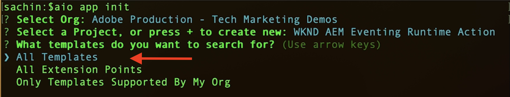

# Azione Adobe I/O Runtime ed eventi AEM

Scopri come ricevere eventi AEM utilizzando l&#39;azione [Adobe I/O Runtime](https://developer.adobe.com/runtime/docs/guides/overview/what_is_runtime/) e rivedere i dettagli dell&#39;evento come payload, intestazioni e metadati.

>[!VIDEO](https://video.tv.adobe.com/v/3427053?quality=12&learn=on)

Adobe I/O Runtime è una piattaforma senza server che consente l’esecuzione del codice in risposta a Adobe I/O Events. In questo modo è possibile creare applicazioni basate su eventi senza preoccuparsi dell&#39;infrastruttura.

In questo esempio si crea un&#39;azione [Azione](https://developer.adobe.com/runtime/docs/guides/using/creating_actions/) Adobe I/O Runtime che riceve eventi AEM e registra i dettagli dell&#39;evento.
https://developer.adobe.com/runtime/docs/guides/overview/what_is_runtime/

I passaggi di alto livello sono i seguenti:

- Crea progetto in Adobe Developer Console
- Inizializza progetto per sviluppo locale
- Configurare un progetto in Adobe Developer Console
- Attivare l’evento AEM e verificare l’esecuzione dell’azione

## Prerequisiti

Per completare questa esercitazione, è necessario:

- Ambiente AEM as a Cloud Service con [evento AEM abilitato](https://developer.adobe.com/experience-cloud/experience-manager-apis/guides/events/#enable-aem-events-on-your-aem-cloud-service-environment).

- Accesso a [Adobe Developer Console](https://developer.adobe.com/developer-console/docs/guides/getting-started/).

- [Adobe Developer CLI](https://developer.adobe.com/runtime/docs/guides/tools/cli_install/) installato nel computer locale.

## Crea progetto in Adobe Developer Console

Per creare un progetto in Adobe Developer Console, effettua le seguenti operazioni:

- Passa a [Adobe Developer Console](https://developer.adobe.com/) e fai clic sul pulsante **Console**.

- Nella sezione **Guida rapida**, fai clic su **Crea progetto da modello**. Quindi, nella finestra di dialogo **Sfoglia modelli**, seleziona il modello **App Builder**.

- Se necessario, aggiorna il titolo del progetto, il nome dell’app e l’area di lavoro Aggiungi. Quindi fare clic su **Salva**.

  


## Inizializza progetto per sviluppo locale

Per aggiungere un&#39;azione Adobe I/O Runtime al progetto, è necessario inizializzare il progetto per lo sviluppo locale. Nel terminale aperto del computer locale, individua il punto in cui inizializzare il progetto e segui la procedura riportata di seguito:

- Inizializza progetto eseguendo

  ```bash
  aio app init
  ```

- Selezionare `Organization`, `Project` creati nel passaggio precedente e l&#39;area di lavoro. Nel passaggio `What templates do you want to search for?`, selezionare l&#39;opzione `All Templates`.

  

- Dall&#39;elenco dei modelli, selezionare l&#39;opzione `@adobe/generator-app-excshell`.

  

- Apri il progetto nell’IDE preferito, ad esempio VSCode.

- Il _modello di estendibilità_ (`@adobe/generator-app-excshell`) selezionato fornisce un&#39;azione di runtime generica. Il codice si trova nel file `src/dx-excshell-1/actions/generic/index.js`. Aggiorniamolo per semplificarlo, registra i dettagli dell’evento e restituisce una risposta di successo. Tuttavia, nell’esempio successivo, viene migliorato per elaborare gli eventi AEM ricevuti.

  ```javascript
  const fetch = require("node-fetch");
  const { Core } = require("@adobe/aio-sdk");
  const {
  errorResponse,
  getBearerToken,
  stringParameters,
  checkMissingRequestInputs,
  } = require("../utils");
  
  // main function that will be executed by Adobe I/O Runtime
  async function main(params) {
  // create a Logger
  const logger = Core.Logger("main", { level: params.LOG_LEVEL || "info" });
  
  try {
      // 'info' is the default level if not set
      logger.info("Calling the main action");
  
      // log parameters, only if params.LOG_LEVEL === 'debug'
      logger.debug(stringParameters(params));
  
      const response = {
      statusCode: 200,
      body: {
          message: "Received AEM Event, it will be processed in next example",
      },
      };
  
      // log the response status code
      logger.info(`${response.statusCode}: successful request`);
      return response;
  } catch (error) {
      // log any server errors
      logger.error(error);
      // return with 500
      return errorResponse(500, "server error", logger);
  }
  }
  
  exports.main = main;
  ```

- Infine, distribuisci l’azione aggiornata in Adobe I/O Runtime eseguendo.

  ```bash
  aio app deploy
  ```

## Configurare un progetto in Adobe Developer Console

Per ricevere gli eventi AEM ed eseguire l’azione Adobe I/O Runtime creata nel passaggio precedente, configura il progetto in Adobe Developer Console.

- In Adobe Developer Console, passa al [progetto](https://developer.adobe.com/console/projects) creato nel passaggio precedente e fai clic su per aprirlo. Selezionare l&#39;area di lavoro `Stage`, dove è stata distribuita l&#39;azione.

- Fai clic sul pulsante **Aggiungi servizio** e seleziona l&#39;opzione **API**. Nella finestra modale **Aggiungi API**, seleziona **Adobe Services** > **API di gestione I/O** e fai clic su **Avanti**, segui i passaggi di configurazione aggiuntivi e fai clic su **Salva API configurata**.

  

- Fare clic sul pulsante **Aggiungi servizio** e selezionare l&#39;opzione **Evento**. Nella finestra di dialogo **Aggiungi eventi**, seleziona **Experience Cloud** > **AEM Sites** e fai clic su **Avanti**. Segui i passaggi di configurazione aggiuntivi, seleziona l’istanza AEMCS, i tipi di evento e altri dettagli.

- Infine, nel passaggio **Ricezione degli eventi**, espandi l&#39;opzione **Azione di runtime** e seleziona l&#39;azione _generica_ creata nel passaggio precedente. Fai clic su **Salva eventi configurati**.

  

- Rivedi i dettagli di registrazione dell&#39;evento, la scheda **Traccia debug** e verifica la richiesta e la risposta di **Challenge Probe**.

  


## Attivare eventi AEM

Per attivare gli eventi di AEM dall’ambiente AEM as a Cloud Service registrato nel progetto Adobe Developer Console precedente, effettua le seguenti operazioni:

- Accedi all&#39;ambiente di authoring AEM as a Cloud Service tramite [Cloud Manager](https://my.cloudmanager.adobe.com/).

- A seconda dei **eventi sottoscritti**, crea, aggiorna, elimina, pubblica o annulla la pubblicazione di un frammento di contenuto.

## Rivedi dettagli evento

Dopo aver completato i passaggi precedenti, dovresti vedere gli eventi AEM consegnati all’azione generica.

È possibile esaminare i dettagli dell&#39;evento nella scheda **Traccia debug** dei dettagli Registrazione evento.


## Passaggi successivi

Nell’esempio successivo, miglioriamo questa azione per elaborare gli eventi AEM, richiamare il servizio AEM Author per ottenere i dettagli del contenuto, archiviare i dettagli nell’archiviazione Adobe I/O Runtime e visualizzarli tramite l’applicazione a pagina singola (SPA).
