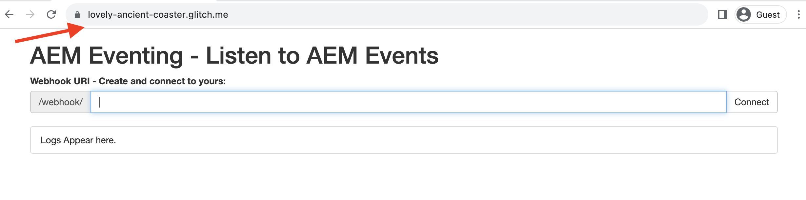
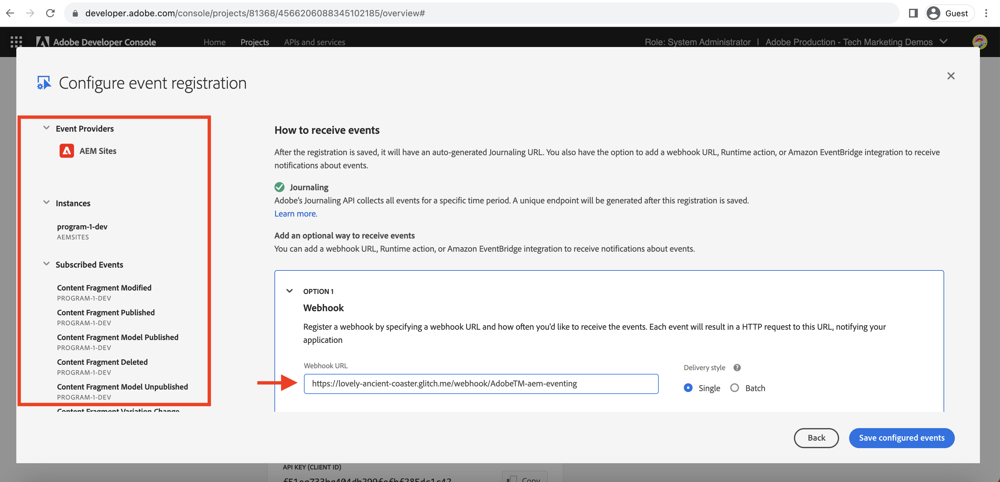

# Webhook ed eventi AEM

Scopri come ricevere eventi AEM su un webhook e rivedere i dettagli dell’evento come payload, intestazioni e metadati.

>[!VIDEO](https://video.tv.adobe.com/v/3427051?quality=12&learn=on)

In questo esempio, l&#39;utilizzo di un _webhook ospitato_ fornito dall&#39;Adobe consente di ricevere eventi AEM senza dover configurare un webhook personalizzato. Questo webhook fornito dall&#39;Adobe è ospitato su [Glitch](https://glitch.com/), una piattaforma nota per offrire un ambiente basato su Web che favorisce la creazione e la distribuzione di applicazioni Web. Tuttavia, se preferisci, è anche disponibile l’opzione per utilizzare il tuo webhook.

## Prerequisiti

Per completare questa esercitazione, è necessario:

- Ambiente AEM as a Cloud Service con [evento AEM abilitato](https://developer.adobe.com/experience-cloud/experience-manager-apis/guides/events/#enable-aem-events-on-your-aem-cloud-service-environment).

- [Progetto Adobe Developer Console configurato per gli eventi AEM](https://developer.adobe.com/experience-cloud/experience-manager-apis/guides/events/#how-to-subscribe-to-aem-events-in-the-adobe-developer-console).

>[!IMPORTANT]
>
>L’evento AEM as a Cloud Service è disponibile solo per gli utenti registrati in modalità non definitiva. Per abilitare gli eventi AEM nel tuo ambiente AEM as a Cloud Service, contatta il [team AEM-Eventing](mailto:grp-aem-events@adobe.com).

## Accedi al webhook

Per accedere al webhook fornito dall’Adobe, effettua le seguenti operazioni:

- Verifica di poter accedere al [Glitch - webhook ospitato](https://lovely-ancient-coaster.glitch.me/) in una nuova scheda del browser.

  

- Immetti un nome univoco per il webhook, ad esempio `<YOUR_PETS_NAME>-aem-eventing` e fai clic su **Connetti**. Dovresti vedere `Connected to: ${YOUR-WEBHOOK-URL}` messaggio visualizzato sullo schermo.

  

- Prendere nota dell&#39;**URL webhook**. Ne avrai bisogno più avanti in questa esercitazione.

## Configurare il webhook in Adobe Developer Console Project

Per ricevere gli eventi AEM dall’URL del webhook precedente, effettua le seguenti operazioni:

- In [Adobe Developer Console](https://developer.adobe.com), passa al progetto e fai clic per aprirlo.

- Nella sezione **Prodotti e servizi**, fai clic sui puntini di sospensione `...` accanto alla scheda degli eventi desiderati che deve inviare gli eventi AEM al webhook e seleziona **Modifica**.

  

- Nella finestra di dialogo **Configura registrazione evento** appena aperta, fai clic su **Avanti** per passare al passaggio **Come ricevere gli eventi**.

  

- Nel passaggio **Ricezione degli eventi**, seleziona l&#39;opzione **Webhook** e incolla il **URL del webhook** copiato in precedenza dal webhook ospitato da Glitch, quindi fai clic su **Salva eventi configurati**.

  

- Nella pagina del webook Glitch dovrebbe essere visualizzata una richiesta di GET, una richiesta di verifica inviata dagli eventi Adobe I/O per verificare l’URL del webhook.

  


## Attivare gli eventi AEM

Per attivare gli eventi AEM dall’ambiente AEM as a Cloud Service registrato nel progetto Adobe Developer Console precedente, effettua le seguenti operazioni:

- Accedi all&#39;ambiente di authoring AEM as a Cloud Service tramite [Cloud Manager](https://my.cloudmanager.adobe.com/).

- A seconda dei **eventi sottoscritti**, crea, aggiorna, elimina, pubblica o annulla la pubblicazione di un frammento di contenuto.

## Rivedi dettagli evento

Dopo aver completato i passaggi precedenti, dovresti vedere gli Eventi AEM inviati al webhook. Cerca la richiesta POST nella pagina del webhook Glitch.


Di seguito sono riportati i dettagli chiave della richiesta POST:

- percorso: `/webhook/${YOUR-WEBHOOK-URL}`, ad esempio `/webhook/AdobeTM-aem-eventing`

- intestazioni: richiedi le intestazioni inviate dagli eventi Adobe I/O, ad esempio:

```json
{
"connection": "close",
"x-forwarded-for": "34.205.178.127,::ffff:10.10.10.136,::ffff:10.10.84.114",
"x-forwarded-proto": "https,http,http",
"x-forwarded-port": "443,80,80",
"host": "lovely-ancient-coaster.glitch.me",
"content-length": "826",
"x-adobe-public-key2-path": "/prod/keys/pub-key-IkpzhSpTw0.pem",
"x-adobe-delivery-id": "18abfb47-d24a-4684-ade8-f442a3444033",
"x-adobe-provider": "aemsites_7ABB3E6A5A7491460A495D61@AdobeOrg_acct-aem-p46652-e1074060@adobe.com",
"x-adobe-public-key1-path": "/prod/keys/pub-key-Ptc2pD9vT9.pem",
"x-adobe-event-id": "a0f3fb7d-b02c-4612-aac6-e472b80af793",
"x-adobe-event-code": "aem.sites.contentFragment.modified",
"user-agent": "Adobe/1.0",
"x-adobe-digital-signature-2": "zGLso15+6PV6X6763/x6WqgxDlEXpkv5ty8q4njaq3aUngAI9VCcYonbScEjljRluzjZ05uMJmRfNxwjj60syxEJPuc0dpmMU635gfna7I4T7IaHs496wx4m2E5mvCM+aKbNQ+NPOutyTqI8Ovq29P2P87GIgMlGhAtOaxRVGNc6ksBxc2tCWbrKUhW8hPJ0sHphU499dN4TT32xrZaiRw4akT3M/hYydsA8dcWpJ7S4dpuDS21YyDHAB8s9Dawtr3fyPEyLgZzpwZDfCqQ8gdSCGqKscE4pScwqPkKOYCHDnBvDZVe583jhcZbHGjk7Ncp/FrgQk7avWsk5XlzcuA==",
"x-adobe-digital-signature-1": "QD7THFJ1vmJqD/BatIpzO6+ACQ9cSKPR7XVaW0LI7cN/xs7ucyri6dmkerOPe9EJpjGoqCg8rxWedrIRQB3lgVskChbHH3Ujx5YG0aTQLSd1Lsn5CFbW1U0l0GqId9Cnd6MccrqSznZXcdW1rMFuRk8+gqwabBifSaLbu3r30G5hmqQd72VtiYTE4m23O3jYIMiv62pRP+a+p4NjNj1XG320uRSry+BPniTjDJ6oN/Ng7aUEKML8idZ/ZTqeh/rJSrVO95UryUolFDRwDkRn5zKonbvhSLAeXzaPhvimWUHtldq9M1WTyRMpsBk8BRzaklxlq+woJ2UjYPUIEzjotw==",
"accept-encoding": "deflate,compress,identity",
"content-type": "application/cloudevents+json; charset=UTF-8",
"x-forwarded-host": "lovely-ancient-coaster.glitch.me",
"traceparent": "00-c27558588d994f169186ca6a3c6607d4-a7e7ee36625488d4-01"
}
```

- body/payload: corpo della richiesta inviato dall’Adobe I/O Events, ad esempio:

```json
{
  "specversion": "1.0",
  "type": "aem.sites.contentFragment.modified",
  "source": "acct:aem-p46652-e1074060@adobe.com",
  "id": "bf922a49-9db4-4377-baf4-70e96e15c45f",
  "time": "2023-12-12T20:36:43.583228Z",
  "dataschema": "https://ns.adobe.com/xdm/aem/sites/events/content-fragment-modified.json",
  "datacontenttype": "application/json",
  "data": {
    "user": {
      "imsUserId": "933E1F8A631CAA0F0A495E53@80761f6e631c0c7d495fb3.e",
      "principalId": "xxx@adobe.com",
      "displayName": "First LastName",
    },
    "path": "/content/dam/wknd-shared/en/adventures/beervana-portland/beervana-in-portland",
    "model": {
      "id": "/conf/wknd-shared/settings/dam/cfm/models/adventure"
    },
    "id": "9a2d3e6a-efda-4079-a86e-0ef2ede692da",
    "properties": [
      {
        "name": "groupSize",
        "changeType": "modified"
      }
    ]
  },
  "event_id": "a0f3fb7d-b02c-4612-aac6-e472b80af793",
  "recipient_client_id": "f51ea733ba404db299fefbf285dc1c42"
}
```

Puoi vedere che i dettagli dell’evento AEM contengono tutte le informazioni necessarie per elaborare l’evento nel webhook. Ad esempio, il tipo di evento (`type`), l&#39;origine evento (`source`), l&#39;ID evento (`event_id`), l&#39;ora evento (`time`) e i dati evento (`data`).

## Risorse aggiuntive

- [Il codice sorgente del webhook Glitch](https://glitch.com/edit/#!/incantevole-antico-montagne russe) è disponibile come riferimento.
