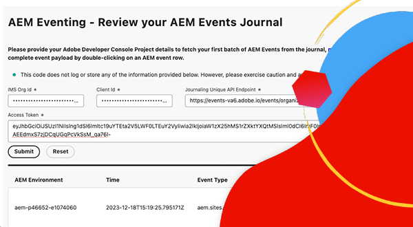

# Evento AEM

Scopri gli eventi di AEM, cosa è, perché e quando utilizzarlo e alcuni esempi.

>[!VIDEO](https://video.tv.adobe.com/v/3426686?quality=12&learn=on)

## Che cos’è

AEM Eventing è un sistema di gestione degli eventi nativo per il cloud che consente di abbonarsi agli eventi AEM per l’elaborazione in sistemi esterni. Un evento AEM è una notifica di modifica dello stato inviata da AEM ogni volta che si verifica un’azione specifica. Ad esempio, può includere eventi quando un frammento di contenuto viene creato, aggiornato o eliminato.

Il diagramma precedente illustra il modo in cui AEM as a Cloud Service produce gli eventi e li invia a Adobe I/O Events, che a sua volta li espone agli abbonati agli eventi.

In sintesi, i componenti principali sono tre:

1. **Provider eventi:** AEM as a Cloud Service.
1. **Adobe I/O Events:** piattaforma per sviluppatori per l&#39;integrazione, l&#39;estensione e la creazione di app ed esperienze basate sui prodotti e le tecnologie Adobe.
1. **Consumatore evento:** Sistemi di proprietà del cliente che si abbonano agli eventi AEM. Ad esempio, CRM (Customer Relationship Management), PIM (Product Information Management), OMS (Order Management System) o un&#39;applicazione personalizzata.

### Qual è la differenza?

L&#39;evento [Apache Sling](https://sling.apache.org/documentation/bundles/apache-sling-eventing-and-job-handling.html), l&#39;evento OSGi e l&#39;osservazione [JCR](https://jackrabbit.apache.org/oak/docs/features/observation.html) offrono tutti i meccanismi per sottoscrivere ed elaborare gli eventi. Tuttavia, questi sono diversi dall’evento AEM descritto in questa documentazione.

Le distinzioni chiave dell’evento AEM includono:

- Il codice consumer dell’evento viene eseguito al di fuori di AEM, non nella stessa JVM di AEM.
- Il codice prodotto di AEM è responsabile della definizione degli eventi e del loro invio a Adobe I/O Events.
- Le informazioni sull’evento sono standardizzate e inviate in formato JSON. Per ulteriori dettagli, consulta [cloudevents](https://cloudevents.io/).
- Per comunicare di nuovo con AEM, il consumatore dell’evento utilizza l’API di AEM as a Cloud Service.

## Perché e quando usarlo

AEM Eventing offre numerosi vantaggi in termini di architettura del sistema ed efficienza operativa. I motivi principali per utilizzare gli eventi di AEM includono:

- **Creare architetture basate su eventi**: facilita la creazione di sistemi liberamente accoppiati che possono essere scalati in modo indipendente e resistenti agli errori.
- **Codice ridotto e costi operativi ridotti**: evita le personalizzazioni in AEM e rende i sistemi più facili da gestire ed estendere, riducendo in tal modo le spese operative.
- **Semplificare la comunicazione tra AEM e i sistemi esterni**: elimina le connessioni point-to-point consentendo a Adobe I/O Events di gestire le comunicazioni, ad esempio determinando quali eventi AEM devono essere consegnati a sistemi o servizi specifici.
- **Maggiore durata degli eventi**: Adobe I/O Events è un sistema altamente disponibile e scalabile, progettato per gestire grandi volumi di eventi e distribuirli in modo affidabile agli abbonati.
- **Elaborazione parallela degli eventi**: consente la consegna di eventi a più abbonati contemporaneamente, consentendo l&#39;elaborazione di eventi distribuiti in vari sistemi.
- **Sviluppo di applicazioni senza server**: supporta la distribuzione del codice consumer di eventi come applicazione senza server, migliorando ulteriormente la flessibilità e la scalabilità del sistema.

### Limitazioni

AEM Eventing, anche se potente, ha alcune limitazioni da considerare:

- **Disponibilità limitata ad AEM as a Cloud Service**: attualmente, l&#39;evento AEM è disponibile esclusivamente per AEM as a Cloud Service.

- **Tipi di evento disponibili**: esaminare l&#39;elenco corrente dei tipi di evento disponibili [qui](https://developer.adobe.com/experience-cloud/experience-manager-apis/guides/events/#available-event-types).

## Come abilitare

Consulta [Abilitare gli eventi AEM nell&#39;ambiente AEM Cloud Service](https://developer.adobe.com/experience-cloud/experience-manager-apis/guides/events/#enable-aem-events-on-your-aem-cloud-service-environment) per i passaggi successivi.

## Iscrizione

Per sottoscrivere eventi AEM, non è necessario scrivere codice in AEM, ma è configurato un progetto [Adobe Developer Console](https://developer.adobe.com/). Adobe Developer Console è un gateway per API, SDK, eventi, runtime e App Builder di Adobe.

In questo caso, un _progetto_ in Adobe Developer Console ti consente di abbonarti agli eventi emessi dall&#39;ambiente AEM as a Cloud Service e di configurare la consegna degli eventi ai sistemi esterni.

Per ulteriori informazioni, vedere [Iscrizione agli eventi AEM in Adobe Developer Console](https://developer.adobe.com/experience-cloud/experience-manager-apis/guides/events/#how-to-subscribe-to-aem-events-in-the-adobe-developer-console).

## Come consumare

Esistono due metodi primari per l&#39;utilizzo degli eventi AEM: il metodo _push_ e il metodo _pull_.

- **Metodo push**: in questo approccio, il consumatore dell&#39;evento riceve una notifica proattiva da Adobe I/O Events quando un evento diventa disponibile. Le opzioni di integrazione includono Webhook, Adobe I/O Runtime e Amazon EventBridge.
- **Metodo pull**: il consumer di eventi esegue il polling attivo di Adobe I/O Events per verificare la presenza di nuovi eventi. L’opzione di integrazione principale per questo metodo è l’API di Adobe Developer Journaling.

Per ulteriori informazioni, vedere [Elaborazione di eventi AEM tramite Adobe I/O Events](https://developer.adobe.com/experience-cloud/experience-manager-apis/guides/events/#aem-events-processing-via-adobe-io).

## Esempi

<table>
  <tr>
    <td>
        
        
<strong><a href="./examples/webhook.md">Ricevi eventi AEM su un webhook</a></strong>

        

          Utilizza il webhook fornito da Adobe per ricevere gli eventi AEM e rivedere i dettagli dell’evento.
        

      </td>
      <td>
        
        
<strong><a href="./examples/journaling.md">Carica giornale di registrazione eventi di AEM</a></strong>

        

          Utilizza l’applicazione web fornita da Adobe per caricare gli eventi AEM dal giornale di registrazione e rivedere i dettagli dell’evento.
        

      </td>
    </tr>
  <tr>
    <td>
        
        
<strong><a href="./examples/runtime-action.md">Ricevi eventi AEM in azione Adobe I/O Runtime</a></strong>

        

          Ricevi gli eventi di AEM e controlla i dettagli dell’evento.
        

      </td>
      <td>
        
        
<strong><a href="./examples/event-processing-using-runtime-action.md">Elaborazione di eventi AEM tramite Adobe I/O Runtime Action</a></strong>

        

          Scopri come elaborare gli eventi AEM ricevuti tramite l’azione Adobe I/O Runtime. L’elaborazione degli eventi include il callback di AEM, la persistenza dei dati dell’evento e la loro visualizzazione nell’applicazione a pagina singola.
        

      </td>
  </tr>
  <tr>
    <td>
        
        
<strong><a href="./examples/assets-pim-integration.md">Eventi AEM Assets per integrazione PIM</a></strong>

        

          Scopri come integrare i sistemi AEM Assets e Product Information Management (PIM) per gli aggiornamenti dei metadati.
        

      </td>
  </tr> 
</table>
