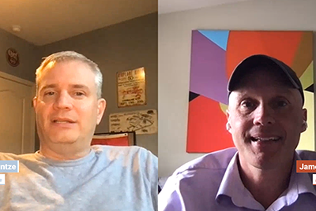

# Cloud 5 stagione 1

## Introduzione

Benvenuto nella serie Cloud 5 di AEM Engineering. Uno dei problemi principali nella fase di implementazione di qualsiasi prodotto è la disponibilità di un numero sufficiente di campioni di codice e/o di dimostrazioni in tempo reale di tali campioni, strumenti o API. L’obiettivo di questa serie è quello di fornire informazioni utili sull’AEM as a Cloud Service in 5 minuti o meno.

Visita il [Casella di suggerimento](https://forms.office.com/r/74P5Xz4UH0) per l&#39;invio di idee argomento.

## Stagione 1

Ogni stagione varia in lunghezza e viene rilasciata su un programma fisso. Gli argomenti della prima stagione sono principalmente dovuti a richieste passate che abbiamo incontrato nei nostri impegni quotidiani con clienti e partner. Visita questa pagina per aggiornamenti settimanali o seguici sul social network di tua scelta.

<table>
  <tr>
   <td>
      
      

         <a href="./cloud5-aem-cdn-part1.md"><strong>Approfondimento sulla rete CDN dell’AEM (parte 1)</strong></a>         
          <em>con Darin Kuntze e James Talbot, Senior Cloud Architects</em>
      

      

         
         La Parte 1 offre una panoramica della rete CDN di AEM as a Cloud Service e di come utilizzarla nella tua implementazione.
      

     </td>   
     <td>
      
      

         <a href="./cloud5-aem-cdn-part2.md"><strong>Approfondimento sulla rete CDN dell’AEM (parte 2)</strong></a>
          <em>con Darin Kuntze e James Talbot, Senior Cloud Architects</em>
      

      

         
         La Parte 2 è una continuazione del nostro sguardo alla rete CDN as a Cloud Service AEM. Rispondiamo ad alcune delle domande e dei miti più comuni sulle funzioni che ottieni con la nuova CDN.
      

   </td>
     <td>
        
      

         <a href="./cloud5-aem-log-files.md"><strong>File di registro e registrazione</strong></a>
          <em>con Darin Kuntze e James Talbot, Senior Cloud Architects</em>
      

      

         
         Questa è una breve descrizione di come accedere ai registri in AEM as a Cloud Service, incluso come accedervi tramite l’interfaccia utente e dalle API.
      

   </td> 
  </tr>
  <tr>
   <td>
        
      

        <a href="./cloud5-getting-login-token-integrations.md"><strong>Integrazione con i token di accesso</strong></a>        
          <em>con Darin Kuntze e James Talbot, Senior Cloud Architects</em>
      

      

         
         Breve panoramica e demo sull’interazione con i token di accesso per il lavoro di integrazione all’interno degli ambienti di servizio cloud.
      

     </td>   
     <td>
        
      

        <a href="./cloud5-aem-dispatcher-cloud.md"><strong>Dispatcher nel cloud</strong></a>
          <em>con Darin Kuntze e James Talbot, Senior Cloud Architects</em>
      

      

         
        Darin e James discutono il Dispatcher nel cloud AEM, incluse alcune best practice e differenze rispetto ad AMS/On-Prem. 
      

   </td>
     <td>
        
      

         <a href="./cloud5-aem-content-migration-part-1.md"><strong>Migrazione (parte 1)</strong></a>
          <em>con Darin Kuntze e James Talbot, Senior Cloud Architects e Dr. Applesmith</em>
      

      

         
         Parte uno (di due) dei nostri suggerimenti e trucchi per la migrazione al cloud. Il nostro obiettivo principale nella prima parte è la best practice e il lavoro preparatorio che ti prepara a migrare.
      

   </td> 
  </tr>
<tr>
   <td>
        
      

        <a href="./cloud5-aem-content-migration-part-2.md"><strong>Migrazione (parte 2)</strong></a>     
          <em>con Darin Kuntze e James Talbot, Senior Cloud Architects</em>
      

      

         
         Parte due (di due) dei nostri suggerimenti e trucchi per migrare al cloud. La seconda parte riguarda principalmente l’utilizzo degli strumenti disponibili per la migrazione.
      

     </td>   
     <td>
        
      

         <a href="./cloud5-aem-dispatcher-validator.md"><strong>Convalida Dispatcher</strong></a>
          <em>con Darin Kuntze e James Talbot, Senior Cloud Architects</em>
      

      

         
         In linea con le precedenti discussioni sulla migrazione, analizziamo la convalida del dispatcher e alcune delle attività che può eseguire.
      

   </td>
     <td>
        
      

         <a href="./cloud5-aem-search-and-indexing.md"><strong>Suggerimenti per indicizzazione e ricerca</strong></a>
          <em>con Darin Kuntze e James Talbot, Senior Cloud Architects</em>
      

      

         
         Per qualcosa di complesso come l’indicizzazione e la ricerca, il team ti mostra alcune semplici vittorie per ottimizzare il tuo tempo di sviluppo e risolvere le cose prima che diventino problemi.
      

   </td> 
  </tr>
    <tr>
        <td>
            
            

                <a href="./cloud5-adobe-app-builder.md"><strong>Generatore di app Adobe</strong></a>         
                <em>con Darin Kuntze e James Talbot, Senior Cloud Architects e Amol Anand</em>
            

            
 
                Vieni a scoprire alcune cose interessanti che puoi fare con Adobe App Builder e scopri qualcosa di nuovo sul futuro delle personalizzazioni nel cloud.
            

        </td>
        <td></td>
        <td></td>
    </tr>
</table>
