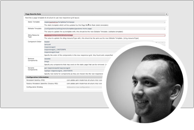

# Serie di esperti AEM as a Cloud Service

Scopri Adobe Experience Manager (AEM) as a Cloud Service dagli esperti ingegneri di Adobe che lo hanno creato e dal team di servizi professionali che lo fornisce. Unisciti agli esperti di Adobe per scoprire cos’è AEM as a Cloud Service, come è uguale e diverso dall’AEM 6 e come passare dall’AEM 6 ad AEM as a Cloud Service.

  
 

## Guida introduttiva ad AEM as a Cloud Service

Scopri i fondamenti dell’AEM come Cloud Service e come si differenzia dall’AEM 6, dagli architetti di cloud computing senior dell’ingegneria Adobe.

<table>
  <tr>
   <td>
      
      

         <a href="../../migration/moving-to-aem-as-a-cloud-service/introduction.md"><strong>Pensiero diverso</strong></a>         
          <em>con Darin Kuntze, Senior Cloud Architect</em>
      

      

         
         Scopri l’architettura di AEM as a Cloud Service e come considerare in modo diverso le implementazioni di AEM as a Cloud Service.
      

     </td>   
     <td>
      
      

         <a href="../../migration/moving-to-aem-as-a-cloud-service/onboarding.md"><strong>Onboarding in AEM as a Cloud Service</strong></a>
          <em>con Damian Langsweirdt, Senior Cloud Architect</em>
      

      

         
         Scopri come effettuare l’onboarding per AEM as a Cloud Service, a partire dalla fase del contratto fino alla configurazione di ambienti self-service con Cloud Manager.
      

   </td>     
   </td>   
     <td>
      
      

         <a href="../../migration/moving-to-aem-as-a-cloud-service/cloud-manager.md"><strong>Cloud Manager per AEM as a Cloud Service</strong></a>
          <em>con Bryan Stopp, Senior Cloud Architect</em>
      

      

         
         Scopri Cloud Manager per AEM as a Cloud Service e le sue differenze con Cloud Manager per AEM su Adobe Manage Services (AMS).
      

   </td> 
  </tr>
</table>

## Passare ad AEM as a Cloud Service?

Intendete passare dall&#39;AEM 6 ad AEM as a Cloud Service? Scopri la metodologia di Adobe per passare ad AEM as a Cloud Service, nonché i vari strumenti e le funzionalità che consentono una transizione fluida.

<table>
  <tr>
   <td>
      
      

         <a href="../../migration/moving-to-aem-as-a-cloud-service/bpa-and-cam.md" target="_aem-experts-series-video"><strong>Metodologia di migrazione</strong></a>
          <em>con Roger Blanton, Adobe Consulting Services Technical Architect</em>
      

      

         
        Scopri la metodologia di migrazione alle best practice per passare da AEM 6 ad AEM as a Cloud Service utilizzando il Best Practice Analyzer (BPA) dell’AEM e Cloud Acceleration Manager (CAM).
      

   </td>   
     <td>
      
      

         <a href="../../migration/moving-to-aem-as-a-cloud-service/aem-modernization-tools.md" target="_aem-experts-series-video"><strong>Modernizzazione del contenuto</strong></a>
          <em>con Bryan Stopp, Senior Cloud Architect</em>
      

      

         
         Scopri come modernizzare automaticamente i contenuti AEM per sfruttare le funzioni AEM as a Cloud Service più recenti.
      

   </td>     
   </td>   
     <td>
      
      

         <a href="../../migration/moving-to-aem-as-a-cloud-service/repository-modernization.md" target="_aem-experts-series-video"><strong>Modernizzazione del progetto AEM Maven</strong></a>
          <em>con Varun Mitra, Cloud Architect</em>
      

      

         
         Scopri come modernizzare automaticamente la struttura e l’organizzazione del progetto Maven dell’applicazione AEM personalizzata per renderla compatibile con AEM as a Cloud Service e allinearla alle best practice di Adobe più recenti.
      

   </td> 
  </tr>
  <tr>
   <td>
      
      

         <a href="../../migration/moving-to-aem-as-a-cloud-service/search-and-indexing.md" target="_aem-experts-series-video"><strong>Modernizzazione degli indici Oak</strong></a>
          <em>con Darin Kuntze, Senior Cloud Architect</em>
      

      

         
        Scopri come convertire automaticamente le definizioni dell’indice Oak AEM 6 affinché siano compatibili con AEM as a Cloud Service, nonché come mantenere in futuro gli indici Oak per AEM as a Cloud Service.
      

   </td>   
     <td>
      
      

         <a href="../../migration/moving-to-aem-as-a-cloud-service/dispatcher.md" target="_aem-experts-series-video"><strong>Modernizzazione della configurazione di Dispatcher</strong></a>
          <em>con Bryan Stopp, Senior Cloud Architect</em>
      

      

         
         Scopri AEM Dispatcher per AEM as a Cloud Service, concentrandoti sulle modifiche di rilievo apportate da Dispatcher per AEM 6, sullo strumento di conversione Dispatcher e su come utilizzare l’SDK degli strumenti Dispatcher.
      

   </td>     
   </td>   
     <td>
      
      

         <a href="../../migration/moving-to-aem-as-a-cloud-service/content-migration/content-transfer-tool.md" target="_aem-experts-series-video"><strong>Trasferimento del contenuto ad AEM as a Cloud Service</strong></a>
          <em>con Kiran Murugulla, Senior Cloud Architect</em>
      

      

         
         Scopri come lo strumento Content Transfer consente di migrare i contenuti ad AEM as a Cloud Service da AEM 6.3+.
      

   </td> 
  </tr>  
</table>

## Funzionalità di Cloud Service dell’AEM

Scopri le funzionalità esclusive di AEM as a Cloud Service dagli esperti Adobe.

<table>
  <tr>
   <td>
      
      

         <a href="../../migration/moving-to-aem-as-a-cloud-service/asset-compute-microservices.md" target="_aem-experts-series-video"><strong>microservizi Asset compute</strong></a>
          <em>con Amol Anand, Principal Cloud Architect</em>
      

      

         
        Scopri i microservizi Asset Compute di AEM Assets, come sostituiscono l’elaborazione delle risorse AEM 6 e come possono essere estesi per generare rappresentazioni personalizzate delle risorse.
      

   </td>   
   <td>
      
      

         <a href="../../migration/moving-to-aem-as-a-cloud-service/content-migration/bulk-import-service.md" target="_aem-experts-series-video"><strong>Importazione di contenuto in blocco</strong></a>
          <em>con Kiran Murugulla, Senior Cloud Architect</em>
      

      

         
        Scopri come importare in modo sicuro ed efficiente i contenuti in blocco in AEM as a Cloud Service utilizzando il Servizio di importazione in blocco e Gestione pacchetti dell’AEM.
      

   </td> 
    <td></td>
  </tr>
</table>

## Hai bisogno di aiuto con i Cloud Service AEM?

Scopri come eseguire il debug di AEM as a Cloud Service e dell’SDK dell’AEM e come risolverli dagli esperti.

<table>
  <tr>
   <td>
      
      

         <a href="../../migration/moving-to-aem-as-a-cloud-service/troubleshooting.md" 
         target="_aem-experts-series-video"><strong>Risoluzione dei problemi di AEM as a Cloud Service</strong></a>
          <em>con Kunwar Saluja, Cloud Architect</em>
      

      

         
        Scopri come risolvere i problemi relativi a vari aspetti di AEM as a Cloud Service, dal debug dell’SDK per AEM e di AEM as a Cloud Service agli errori di build e distribuzione di Cloud Manager.
      

   </td>   
    <td></td>
    <td></td>
  </tr>
</table>
