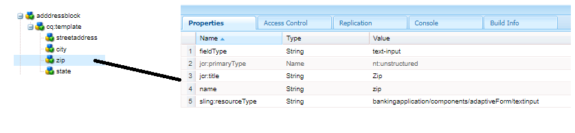

# Crea componente indirizzo

Accedi a CRXDE dell’istanza cloud locale di AEM Forms.

Crea una copia di ``/apps/bankingapplication/components/adaptiveForm/button`` e rinominarlo in addressblock. Seleziona il nodo addressblock e impostane le proprietà come mostrato di seguito.

>[!NOTE]
>
> ``bankingapplication`` è l’appId fornito durante la creazione del progetto Maven. Questo appId potrebbe essere diverso nel tuo ambiente. Potete fare una copia di qualsiasi componente, mi è capitato di fare una copia del componente pulsante

## proprietà nodo cq-template

Seleziona la ``cq-template`` nodo sotto ``addressblock`` e impostarne le proprietà come illustrato di seguito. Il tipo di campo è impostato su panel

## Aggiungi nodi in cq-template

Aggiungi i seguenti nodi di tipo ``nt:unstructured`` in ``cq-template``

* indirizzo stradale
* città
* zip
* stato

Questi nodi rappresentano i campi del componente blocco di indirizzi. I campi streetaddress, city e zip saranno un campo di immissione testo e il campo state sarà un campo a discesa.

## Impostare le proprietà del nodo streetaddress

>[!NOTE]
>
> Il **_applicazione bancaria_** nel percorso si riferisce all’appId del progetto maven. Questo potrebbe essere diverso nell’ambiente

Seleziona la ``streetaddress`` e impostarne le proprietà come illustrato di seguito.

## Imposta le proprietà del nodo della città

Seleziona la ``city`` e impostarne le proprietà come illustrato di seguito.

## Imposta le proprietà del nodo zip

Seleziona la ``zip`` e impostarne le proprietà come illustrato di seguito.

## Impostare le proprietà del nodo di stato

Seleziona la ``state`` e impostarne le proprietà come illustrato di seguito. Osserva il fieldType dello stato: è impostato per essere un menu a discesa

Il componente addressblock finale si presenterà così

## Passaggi successivi

[Distribuire il progetto](./deploy-your-project.md)

