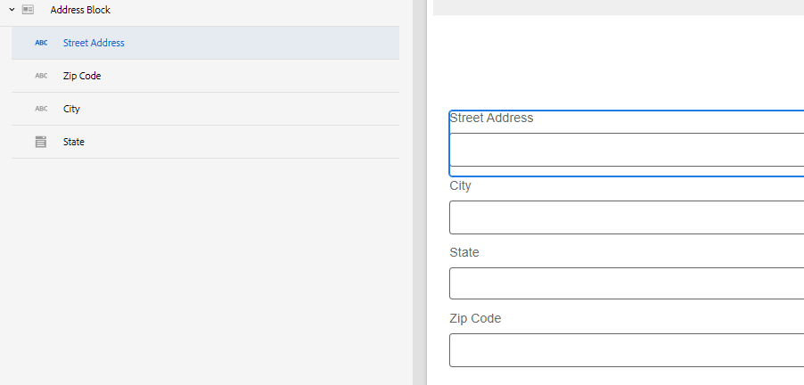

# Creazione di un nuovo componente core in AEM Forms

In Adobe Experience Manager (AEM), i componenti sono i blocchi predefiniti utilizzati per creare pagine e moduli. Forniscono agli autori un modo semplice e potente per creare e gestire i contenuti, fornendo allo stesso tempo agli sviluppatori la flessibilità e l’estensibilità necessarie per creare componenti personalizzati. Questi sono progettati per velocizzare i tempi di sviluppo e ridurre i costi di manutenzione per siti web e moduli, per essere flessibili e possono essere facilmente personalizzati in base alle esigenze specifiche di un sito web e di un modulo.

In questa esercitazione verrà creato un componente blocco di indirizzi. Il componente blocco di indirizzi avrà campi per acquisire l’indirizzo stradale, la città, lo stato e il codice postale.

## Prerequisiti

* Accesso all’istanza di Cloud Service di AEM Forms
* Esperienza nello sviluppo di moduli tramite il modulo AEM Forms
* Esperienza nella configurazione dell’ambiente di sviluppo per AEM/AEM Forms (Git, IntelliJ, ecc.)

## Passaggi successivi

[Configurare l’ambiente di sviluppo](./set-up.md)
