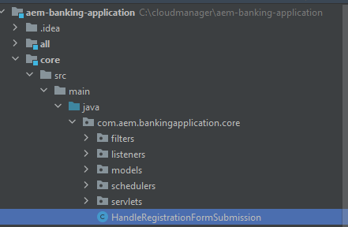

# Creazione di un invio personalizzato

AEM Forms fornisce una serie di opzioni di invio predefinite che soddisfano la maggior parte dei casi d’uso.Oltre a queste azioni di invio predefinite, AEM Forms consente di scrivere un gestore di invio personalizzato per elaborare l’invio del modulo in base alle proprie esigenze.

Per scrivere un servizio di invio personalizzato, sono stati seguiti i seguenti passaggi

## Crea progetto AEM

Se disponi già di un progetto AEM Forms Cloud Service, puoi [passa a scrittura servizio di invio personalizzato](#Write-the-custom-submit-service)

* Creare una cartella denominata cloudmanager sull&#39;unità C.
* Passa a questa cartella appena creata
* Copiare e incollare il contenuto di [questo file di testo](./assets/creating-maven-project.txt) nella finestra del prompt dei comandi.Potrebbe essere necessario modificare DarchetypeVersion=41 a seconda del [ultima versione](https://github.com/adobe/aem-project-archetype/releases). L&#39;ultima versione era 41 al momento della stesura di questo articolo.
* Esegui il comando premendo Invio. Se tutto va correttamente, dovrebbe comparire il messaggio di completamento della generazione.

## Scrivi il servizio di invio personalizzato{#Write-the-custom-submit-service}

Avvia IntelliJ e apri il progetto AEM. Crea una nuova classe Java denominata **HandleRegistrationFormSubmission** come mostrato nella schermata seguente


Il seguente codice è stato scritto per implementare il servizio

```java
package com.aem.bankingapplication.core;
import java.util.HashMap;
import java.util.Map;
import com.google.gson.Gson;
import org.osgi.service.component.annotations.Component;
import com.adobe.aemds.guide.model.FormSubmitInfo;
import com.adobe.aemds.guide.service.FormSubmitActionService;
import com.adobe.aemds.guide.utils.GuideConstants;
import com.google.gson.JsonObject;
import org.slf4j.*;

@Component(
        service=FormSubmitActionService.class,
        immediate = true
)
public class HandleRegistrationFormSubmission implements FormSubmitActionService {
    private static final String serviceName = "Core Custom AF Submit";
    private static Logger logger = LoggerFactory.getLogger(HandleRegistrationFormSubmission.class);


    @Override
    public String getServiceName() {
        return serviceName;
    }

    @Override
    public Map<String, Object> submit(FormSubmitInfo formSubmitInfo) {
        logger.error("in my custom submit service");
        Map<String, Object> result = new HashMap<>();
        logger.error("in my custom submit service");
        String data = formSubmitInfo.getData();
        JsonObject formData = new Gson().fromJson(data,JsonObject.class);
        logger.error("The form data is "+formData);
        JsonObject jsonObject = new JsonObject();
        jsonObject.addProperty("firstName",formData.get("firstName").getAsString());
        jsonObject.addProperty("lastName",formData.get("lastName").getAsString());
        result.put(GuideConstants.FORM_SUBMISSION_COMPLETE, Boolean.TRUE);
        result.put("json",jsonObject.toString());
        return result;
    }

}
```

## Crea un nodo crx in app

Espandi il nodo ui.apps e crea un nuovo pacchetto denominato **HandleRegistrationFormSubmission** sotto il nodo app, come illustrato nella schermata seguente

Crea un file denominato .content.xml sotto **HandleRegistrationFormSubmission**. Copia e incolla il seguente codice nel file .content.xml

```xml
<?xml version="1.0" encoding="UTF-8"?>
<jcr:root xmlns:jcr="http://www.jcp.org/jcr/1.0" xmlns:sling="http://sling.apache.org/jcr/sling/1.0"
    jcr:description="Handle Registration Form Submission"
    jcr:primaryType="sling:Folder"
    guideComponentType="fd/af/components/guidesubmittype"
    guideDataModel="xfa,xsd,basic"
    submitService="Core Custom AF Submit"/>
```

Il valore della proprietà **submitService** elemento deve corrispondere  **serviceName = &quot;Invio AF personalizzato core&quot;** nell’implementazione FormSubmitActionService.

## Distribuire il codice nell’istanza AEM Forms locale

Prima di inviare le modifiche all’archivio di Cloud Manager, si consiglia di distribuire il codice nell’istanza di authoring locale di Cloud Ready per testare il codice. Assicurati che l’istanza di authoring sia in esecuzione.
Per distribuire il codice nell’istanza di authoring predisposta per il cloud, passa alla cartella principale del progetto AEM ed esegui il comando seguente

```
mvn clean install -PautoInstallSinglePackage
```

Il codice verrà distribuito come un singolo pacchetto nell’istanza di authoring

## Invia il codice a Cloud Manager e distribuiscilo

Dopo aver verificato il codice nell’istanza locale, invialo all’istanza cloud.
Invia le modifiche all’archivio Git locale e quindi all’archivio di Cloud Manager. È possibile fare riferimento al  [Configurazione Git](https://experienceleague.adobe.com/docs/experience-manager-learn/cloud-service/forms/developing-for-cloud-service/setup-git.html), [push del progetto AEM nell’archivio di cloud manager](https://experienceleague.adobe.com/docs/experience-manager-learn/cloud-service/forms/developing-for-cloud-service/push-project-to-cloud-manager-git.html) e [distribuzione nell’ambiente di sviluppo](https://experienceleague.adobe.com/docs/experience-manager-learn/cloud-service/forms/developing-for-cloud-service/deploy-to-dev-environment.html) articoli.

Dopo aver eseguito correttamente la pipeline, dovresti essere in grado di associare l’azione di invio del modulo al gestore di invio personalizzato, come illustrato nella schermata seguente


## Passaggi successivi

[Visualizzare la risposta personalizzata nell’app di react](./handle-response-react-app.md)
