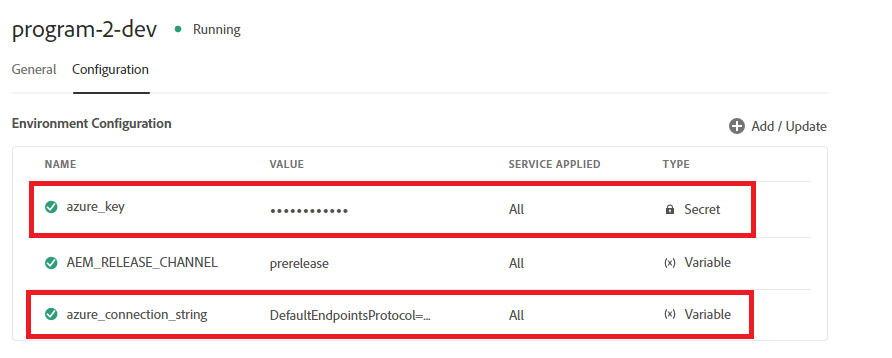

# Configurazioni cloud basate sul contesto

Quando crei la configurazione cloud nell’ambiente locale e in seguito a un test di successo, desideri utilizzare la stessa configurazione cloud negli ambienti a monte ma senza dover modificare l’endpoint, la chiave segreta/password e il nome utente. Per ottenere questo caso d’uso, AEM Forms su Cloud Service ha introdotto la possibilità di definire configurazioni cloud basate sul contesto.
Ad esempio, la configurazione cloud dell’account di archiviazione Azure può essere riutilizzata in ambienti di sviluppo, stage e produzione utilizzando stringhe e chiavi di connessione diverse per.

Per creare la configurazione cloud consapevole del contesto, sono necessari i seguenti passaggi

## Creare variabili di ambiente

Le variabili di ambiente standard possono essere configurate e gestite tramite Cloud Manager. Vengono forniti all’ambiente in fase di esecuzione e possono essere utilizzati nelle configurazioni OSGi. Le variabili dell’ambiente possono essere valori specifici dell’ambiente o segreti dell’ambiente in base alle modifiche apportate.

[Variabili di ambiente](https://experienceleague.adobe.com/docs/experience-manager-cloud-service/content/implementing/using-cloud-manager/environment-variables.html?lang=en)

La seguente schermata mostra le variabili di ambiente azure_key e azure_connection_string definite


Queste variabili di ambiente possono quindi essere specificate nei file di configurazione da utilizzare negli ambienti appropriati. Ad esempio, se desideri che tutte le istanze dell&#39;autore utilizzino queste variabili di ambiente, definirai il file di configurazione nella cartella config.author come specificato di seguito

## Crea file di configurazione

Apri il tuo progetto in IntelliJ. Passa a config.author e crea un file denominato

```java
org.apache.sling.caconfig.impl.override.OsgiConfigurationOverrideProvider-integrationTest.cfg.json
```


Copia il testo seguente nel file creato nel passaggio precedente. Il codice in questo file sovrascrive il valore delle proprietà accountName e accountKey con le variabili di ambiente **azure_connection_string** e **azure_key**.

```json
{
  "enabled":true,
  "description":"dermisITOverrideConfig",
  "overrides":[
   "cloudconfigs/azurestorage/FormsCSAndAzureBlob/accountName=\"$[env:azure_connection_string]\"",
   "cloudconfigs/azurestorage/FormsCSAndAzureBlob/accountKey=\"$[secret:azure_key]\""

  ]
}
```

>[!NOTE]
>
>Questa configurazione verrà applicata a tutti gli ambienti di authoring nell’istanza di cloud service. Per applicare la configurazione agli ambienti di pubblicazione è necessario inserire lo stesso file di configurazione nella cartella config.publish del progetto intelliJ
>[!NOTE]
> Assicurati che la proprietà che viene ignorata sia una proprietà valida della configurazione cloud. Passa alla configurazione cloud per trovare la proprietà che desideri sostituire, come illustrato di seguito.


Per le configurazioni cloud basate su REST con autenticazione di base, in genere si desidera creare variabili di ambiente per le proprietà serviceEndPoint, userName e password.