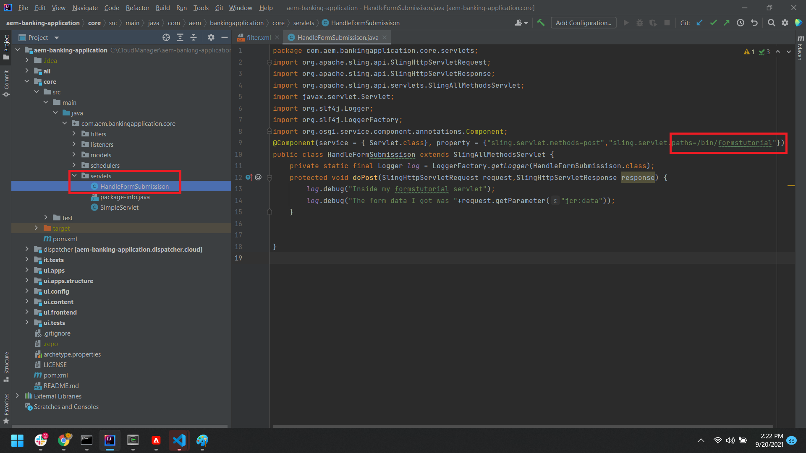

# Creare un servlet per elaborare i dati inviati

Avvia il progetto di aem-banking in IntelliJ.
Crea un semplice servlet per inviare i dati inviati al file di registro. Assicurati che il codice sia nel progetto di base, come illustrato nella schermata seguente


```java
package com.aem.bankingapplication.core.servlets;
import org.apache.sling.api.SlingHttpServletRequest;
import org.apache.sling.api.SlingHttpServletResponse;
import org.apache.sling.api.servlets.SlingAllMethodsServlet;
import javax.servlet.Servlet;
import org.slf4j.Logger;
import org.slf4j.LoggerFactory;
import org.osgi.service.component.annotations.Component;
@Component(service = { Servlet.class}, property = {"sling.servlet.methods=post","sling.servlet.paths=/bin/formstutorial"})
public class HandleFormSubmissison extends SlingAllMethodsServlet {
    private static final Logger log = LoggerFactory.getLogger(HandleFormSubmissison.class);
    protected void doPost(SlingHttpServletRequest request,SlingHttpServletResponse response) {
        log.debug("Inside my formstutorial servlet");
        log.debug("The form data I got was "+request.getParameter("jcr:data"));
    }
}
```

## Crea invio personalizzato

Crea l’invio personalizzato nella cartella app/bankingapplication nello stesso modo in cui crei nella [versioni precedenti di AEM Forms](https://experienceleague.adobe.com/docs/experience-manager-learn/forms/adaptive-forms/custom-submit-aem-forms-article.html?lang=en)
Il codice seguente nel file post.POST.jsp inoltra semplicemente la richiesta al servlet installato in /bin/formstutorial. Questo è lo stesso servlet creato nel passaggio precedente

```java
com.adobe.aemds.guide.utils.GuideSubmitUtils.setForwardPath(slingRequest,"/bin/formstutorial",null,null);
```

## Configurare un modulo adattivo

Ora puoi configurare il modulo adattivo per l’invio a questo gestore di invio personalizzato denominato **Invia a AEM Servlet**


