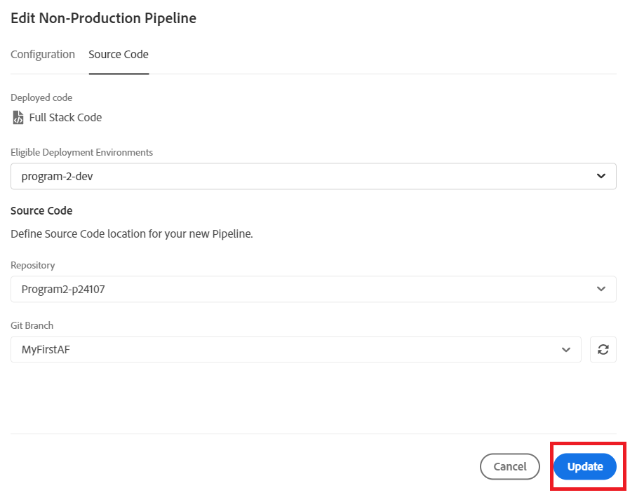

# Implementazione nell’ambiente di sviluppo

Nel passaggio precedente, il ramo principale è stato inviato dall’archivio Git locale al ramo MyFirstAF dell’archivio di Cloud Manager.

Il passaggio successivo consiste nel distribuire il codice nell’ambiente di sviluppo.
Accedi a cloud manager e seleziona il programma

Seleziona la Distribuzione da sviluppare come mostrato di seguito

Seleziona la pipeline di implementazione come mostrato

Seleziona il codice sorgente e il ramo Git appropriato

Assicurati di aggiornare le modifiche

Eseguire la pipeline

Una volta distribuito il codice, dovresti vedere le modifiche nell’istanza del servizio cloud di AEM Forms.

## Passaggi successivi

[Aggiornamento del progetto dell’archetipo Maven](./updating-project-archetype.md)
