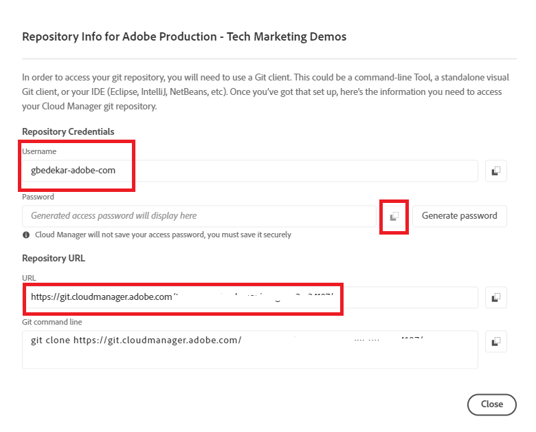

# Installare Git


[Installare Git](https://git-scm.com/downloads). È possibile selezionare le impostazioni predefinite e completare il processo di installazione.
Vai al prompt dei comandi e passa a c:\cloudmanager\aem-banking-app type in git —version. Dovresti visualizzare la versione di GIT installata nel sistema

## Inizializza archivio Git locale

Verifica di trovarti nella cartella c:\cloudmanager\aem-banking-app

```
git init
```

Il comando precedente inizializzerà il progetto come archivio locale Git

```
git add .
```

In questo modo tutti i file di progetto vengono aggiunti all’archivio Git pronto per il commit nell’archivio Git

```
git commit -m "initial commit"
```

In questo modo i file vengono inviati all’archivio Git


## Registrare l’archivio di Cloud Manager con il nostro archivio Git locale

Accedere all’archivio di cloud manager

Ottieni le credenziali dell’archivio di Cloud Manager


Salva il nome utente nel file di configurazione

```java
git config --global credential.username "gbedekar-adobe-com"
```

salva la password nel file di configurazione

```java
git config --global user.password "XXXX"
```

(la password è la password dell’archivio Git di Cloud Manager)

Registra l’archivio Git di Cloud Manager con l’archivio Git locale. Il comando seguente associa **bankingapp** con l’archivio git di cloud manager remoto. Avresti potuto usare un nome qualsiasi al posto di **bankingapp**


```shell
git remote add bankingapp https://git.cloudmanager.adobe.com/<cloud-manager-repo-path>
```

(Assicurati di utilizzare l’URL dell’archivio)

Verifica se l’archivio remoto è registrato

```java
git remote -v
```

## Passaggi successivi

[Sincronizza AEM con progetto AEM in IntelliJ](./intellij-and-aem-sync.md)
