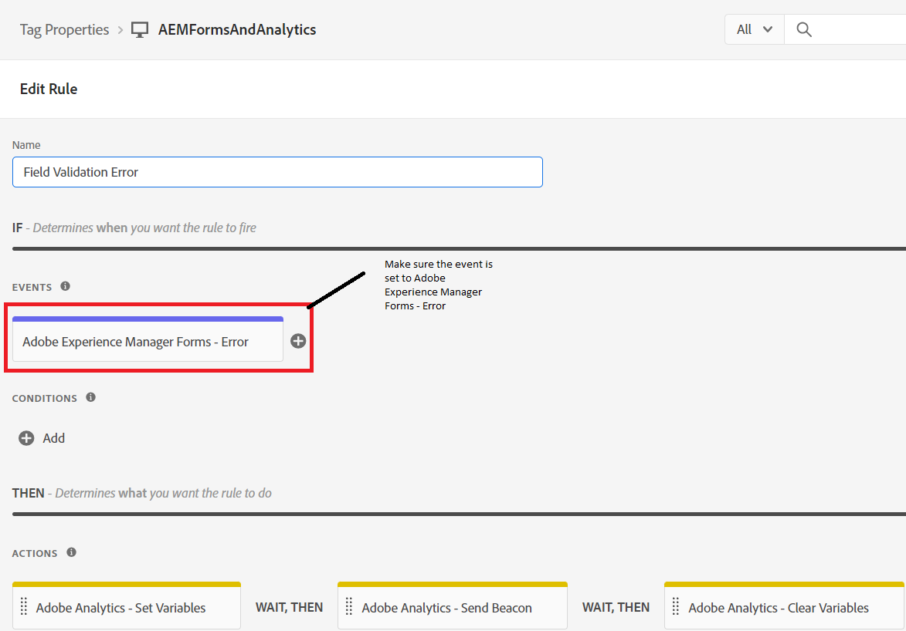

# Definire la regola

Nella proprietà Tags abbiamo creato 2 nuovi [regole](https://experienceleague.adobe.com/docs/platform-learn/implement-in-websites/configure-tags/add-data-elements-rules.html) (**Errore di convalida dei campi e FormSubmit**).

## Errore di convalida del campo

La **Errore di convalida del campo** la regola viene attivata ogni volta che si verifica un errore di convalida nel campo modulo adattivo. Ad esempio, nel modulo se il numero di telefono o l’e-mail non è nel formato previsto, viene visualizzato un messaggio di errore di convalida.

La regola di errore convalida del campo viene configurata impostando l’evento su _**Adobe Experience Manager Forms-Error**_ come mostrato nella schermata

Adobe Analytics - Imposta variabili è configurato come segue

## Regola di invio modulo

La regola di invio del modulo viene attivata ogni volta che un modulo adattivo viene inviato correttamente.

La regola di invio del modulo è configurata utilizzando _**Adobe Experience Manager Forms - Invia**_ event

Nella regola di invio del modulo, il valore dell’elemento dati _**RicorrenteStatoDiResidenza**_ è mappato a prop5 e il valore dell’elemento dati FormTitle è mappato a prop8.

Le variabili Adobe Analytics - Set sono configurate come segue.

Quando sei pronto per testare il codice dei tag,[pubblicare le modifiche apportate ai tag](https://experienceleague.adobe.com/docs/experience-platform/tags/publish/publishing-flow.html) utilizzo del flusso di pubblicazione.
