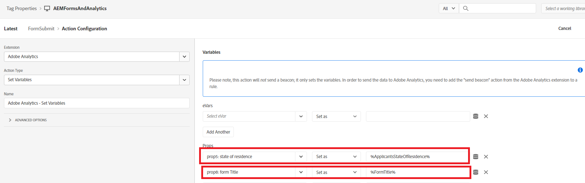

# Definire la regola

Nella proprietà Tags sono state create 2 nuove [regole](https://experienceleague.adobe.com/docs/platform-learn/implement-in-websites/configure-tags/add-data-elements-rules.html) (**Errore di convalida campo e FormSubmit**).

## Errore di convalida campo

La regola **Errore di convalida campo** viene attivata ogni volta che si verifica un errore di convalida nel campo del modulo adattivo. Ad esempio, nel modulo, se il numero di telefono o l’e-mail non sono nel formato previsto, viene visualizzato un messaggio di errore di convalida.

La regola Errore di convalida campo è configurata impostando l&#39;evento su _**Adobe Experience Manager Forms-Error**_ come mostrato nella schermata

Adobe Analytics - Imposta variabili è configurato come segue

## Regola invio modulo

La regola di invio del modulo viene attivata ogni volta che un modulo adattivo viene inviato correttamente.

La regola di invio del modulo è configurata utilizzando l&#39;evento _**Adobe Experience Manager Forms - Submit**_

Nella regola Form Submit, il valore dell&#39;elemento dati _**ApplicantsStateOfResidence**_ è mappato a prop5 e il valore dell&#39;elemento dati FormTitle è mappato a prop8.

Adobe Analytics - Imposta variabili è configurato come segue.

Quando sei pronto a testare il codice dei tag,[pubblica le modifiche apportate ai tag](https://experienceleague.adobe.com/docs/experience-platform/tags/publish/publishing-flow.html) utilizzando il flusso di pubblicazione.

## Passaggi successivi

[Testare la soluzione](./test.md)