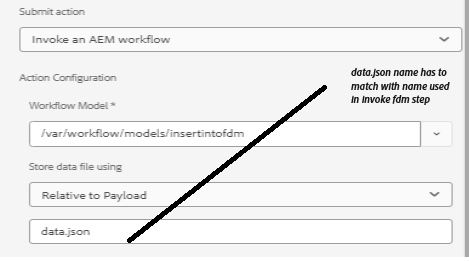

# Inserire dati nell’elenco SharePoint utilizzando il passaggio del flusso di lavoro FDM di richiamo


Questo articolo illustra i passaggi necessari per inserire i dati nell’elenco di SharePoint utilizzando il passaggio FDM di richiamo nel flusso di lavoro AEM.

In questo articolo si presuppone che [il modulo adattivo sia stato configurato correttamente per l&#39;invio di dati all&#39;elenco di SharePoint.](https://experienceleague.adobe.com/docs/experience-manager-cloud-service/content/forms/adaptive-forms-authoring/authoring-adaptive-forms-core-components/create-an-adaptive-form-on-forms-cs/configure-submit-actions-core-components.html?lang=en#connect-af-sharepoint-list)


## Creazione di un modello dati modulo basato sull&#39;origine dati dell&#39;elenco SharePoint

* Crea un nuovo modello dati modulo basato sull&#39;origine dati dell&#39;elenco di SharePoint.
* Aggiungi il modello appropriato e il servizio get del modello dati del modulo.
* Configura il servizio di inserimento per inserire l’oggetto modello di livello principale.
* Testare il servizio di inserimento.


## Crea un flusso di lavoro

* Crea un flusso di lavoro semplice con il passaggio FDM di richiamo.
* Configura la fase FDM di richiamo per utilizzare il modello dati del modulo creato nella fase precedente.
* 

## Modulo adattivo basato su componenti core

Il formato dei dati inviati è il seguente. È necessario estrarre l’oggetto ContactUS utilizzando la notazione del punto nel passaggio del flusso di lavoro richiama Servizio modello dati modulo, come mostrato nella schermata

```json
{
  "ContactUS": {
    "Title": "Mr",
    "Products": "Photoshop",
    "HighNetWorth": "1",
    "SubmitterName": "John Does"
  }
}
```


* 


## Modulo adattivo basato su componenti di base

Il formato dei dati inviati è il seguente. Estrarre l’oggetto JSON ContactUS utilizzando la notazione del punto nel passaggio di flusso di lavoro richiama servizio modello dati modulo

```json
{
    "afData": {
        "afUnboundData": {
            "data": {}
        },
        "afBoundData": {
            "data": {
                "ContactUS": {
                    "Title": "Lord",
                    "HighNetWorth": "true",
                    "SubmitterName": "John Doe",
                    "Products": "Forms"
                }
            }
        },
        "afSubmissionInfo": {
            "lastFocusItem": "guide[0].guide1[0].guideRootPanel[0].afJsonSchemaRoot[0]",
            "stateOverrides": {},
            "signers": {},
            "afPath": "/content/dam/formsanddocuments/foundationform",
            "afSubmissionTime": "20240517100126"
        }
    }
}
```


## Configurare un modulo adattivo per attivare il flusso di lavoro AEM

* Crea un modulo adattivo utilizzando il modello dati modulo creato nel passaggio precedente.
* Trascinare alcuni campi dall&#39;origine dati al modulo.
* Configura l’azione di invio del modulo come illustrato di seguito
* 


## Testare il modulo

Visualizza l&#39;anteprima del modulo creato nel passaggio precedente. Compila il modulo e invia. I dati del modulo devono essere inseriti nell’elenco di SharePoint.
