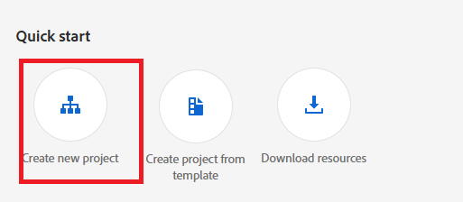

# Configurare le API di comunicazione AEM Forms basate su OpenAPI su AEM Forms as a Cloud Service

## Prerequisiti

* Istanza più recente di AEM Forms as a Cloud Service.
* Tutti i profili di prodotto [ necessari vengono aggiunti all&#39;ambiente.](https://experienceleague.adobe.com/it/docs/experience-manager-learn/cloud-service/aem-apis/invoke-openapi-based-aem-apis)

* Abilita l’accesso API di AEM al profilo di prodotto come mostrato di seguito
  
  

## Crea progetto Adobe Developer Console

Accedi a [Adobe Developer Console](https://developer.adobe.com/console/) utilizzando il tuo Adobe ID.
Crea un nuovo progetto facendo clic sull’icona appropriata

Assegna un nome significativo al progetto e fai clic sull’icona Aggiungi API

Seleziona Experience Cloud

Seleziona AEM Forms Communications API e fai clic su Avanti

Verificare di aver selezionato l&#39;autenticazione server-to-server e fare clic su Avanti

Seleziona i profili e fai clic sul pulsante Salva API configurata per salvare le impostazioni

Fai clic sul server OAuth

Copia l’ID client, il segreto client e gli ambiti

## Configura istanza AEM per abilitare la comunicazione del progetto ADC

Se disponi già di un progetto AEM Forms, [segui queste istruzioni](https://experienceleague.adobe.com/it/docs/experience-manager-learn/cloud-service/aem-apis/invoke-openapi-based-aem-apis) per abilitare l&#39;ID client delle credenziali server-to-server OAuth del progetto Adobe Developer Console per comunicare con l&#39;istanza AEM

Se non disponi di un progetto AEM Forms, crea un progetto AEM Forms [ seguendo questa documentazione.](https://experienceleague.adobe.com/it/docs/experience-manager-learn/cloud-service/forms/developing-for-cloud-service/getting-started) e quindi abilitare l&#39;ID client delle credenziali server-to-server OAuth del progetto Adobe Developer Console per comunicare con l&#39;istanza AEM [utilizzando questa documentazione.](https://experienceleague.adobe.com/it/docs/experience-manager-learn/cloud-service/aem-apis/invoke-openapi-based-aem-apis)

## Passaggi successivi

[Genera token di accesso](./generate-access-token.md)
