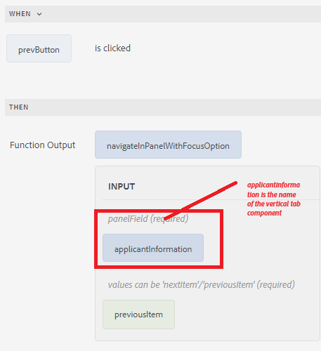

# Navigazione tra le schede

È possibile spostarsi tra le schede facendo clic sulle singole schede o utilizzando i pulsanti precedente e successivo del modulo.
Per spostarsi utilizzando i pulsanti, aggiungere due pulsanti al modulo e denominarli Precedente e Successivo. Associa la seguente funzione personalizzata all’evento click del pulsante per spostarti tra le schede.

Di seguito è riportata la funzione personalizzata che consente di spostarsi tra le schede.


```javascript
/**
 * Navigate in panel with focusOption
 * @name navigateInPanelWithFocusOption
 * @param {object} panelField
 * @param {string} focusOption - values can be 'nextItem'/'previousItem'
 * @param {scope} globals
 */
function navigateInPanelWithFocusOption(panelField, focusOption, globals)
{
    globals.functions.setFocus(panelField, focusOption);
}
```

Di seguito è riportato l’editor di regole per i pulsanti Successivo e Precedente

**Pulsante Avanti**


**Pulsante Precedente**


