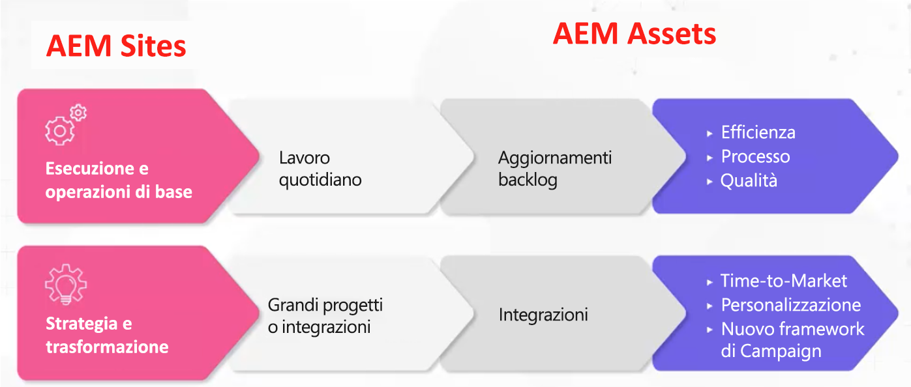

# Adobe Experience Manager (AEM) - Modelli e archetipi per governance e personale

In qualità di leader dell’esperienza del cliente, Adobe comprende quanto sia difficile per te garantire di disporre delle persone e del framework di governance giusti per promuovere l’efficienza operativa. Con i collaudati modelli di gestione del personale e di governance di Adobe, disponi degli strumenti e delle conoscenze necessari per creare una solida base per la gestione dei contenuti e delle risorse. In questo articolo verranno illustrati i modi per rendere operativa la piattaforma Adobe Experience Manager (AEM) e ottenere il massimo valore dai tuoi sforzi.

## Creazione di un framework operativo superiore

Per essere in grado di eseguire e gestire l’AEM, considera i seguenti elementi:

* Esecuzione di milestone strategici: ci saranno molte milestone strategiche (personalizzazione, integrazione multicanale, ecc.) che possono essere eseguite solo se si dispone del modello di assegnazione del personale corretto.
* Creare una base per la trasformazione digitale: l’AEM viene spesso utilizzato come primo passo nel processo di modernizzazione di un’organizzazione. Imposta una base per sfruttare al massimo la capacità dell’AEM.
* Coinvolgimento dell’utente: crea un team per eseguire il lavoro tattico (aggiornamento dei flussi di lavoro, delle autorizzazioni, CSS, ecc.) Più si hanno divari tra ciò che gli utenti vogliono e ciò che viene dato, più questi possono diventare frustrati. È importante che gli utenti continuino a investire nel sistema, che investano nella soluzione e che tu disponga del modello operativo giusto.

Qual è quindi il modello giusto? Qual è la giusta matrice di ruoli da creare?

Non esiste un’unica risposta specifica perché, proprio come le organizzazioni variano notevolmente, anche una configurazione AEM può variare notevolmente, con conseguente necessità di diversi ruoli di supporto. Ogni verticale, ogni settore, ogni struttura di team richiederà un’implementazione diversa. Ma puoi creare una linea di base stabilendo gli archetipi.

## Archetipi

Gli archetipi sono idee di ruolo specifiche di alto livello che si associano ad attributi specifici. Questo a sua volta può essere utilizzato per creare una premessa fondamentale che aiuta a informare quale modello hai veramente bisogno. È importante notare che gli archetipi non sono limitati a una persona per archetipo. Ad esempio, una libreria DAM potrebbe avere un’esperienza tecnica.

### Flussi di operazionalizzazione

Esistono due flussi di operazionalizzazione per [!DNL AEM Sites] e [!DNL AEM Assets]:

1. Esecuzione e funzionamento di base del lavoro quotidiano (aggiornamento dei metadati)

1. Strategia e lavoro di trasformazione, ad esempio grandi progetti tra organizzazioni

### Ruoli risorsa AEM di alto livello

**Intervallo generale:** Questa linea di base supporta modelli centralizzati e decentralizzati. Se avete un modello decentralizzato, l&#39;AEM può essere usato in modo astratto. Il ruolo Proprietario prodotto deve essere utilizzato in modo creativo, ma è anche necessario disporre di un Proprietario prodotto che sia il proprietario dei diversi stili di un tipo di risorsa e di un altro che sovrintenda all’intera organizzazione.

1. Ruoli di esecuzione e funzionamento di base

   * Risorsa tecnica: un utente con esperienza AEM comprende le autorizzazioni e può aggiornare lo schema dei metadati
   * Release Manager
   * Proprietario del prodotto: si tratta di un ruolo allineato alla soluzione. Alcuni proprietari di prodotti possono essere coinvolti nell’analisi.
   * Libreria DAM - Questa persona può aiutare a gestire i processi del framework integrativo. Questo ruolo creativo può sovrapporsi ad altri ruoli. (Nota: questo ruolo è esploso in popolarità negli ultimi cinque anni).
   * Contenuto creativo

1. Strategia e trasformazione

   * Team di sviluppo: il team è necessario quando si ha a che fare con una pietra miliare strategica principale.
   * Architetto aziendale: sviluppa i requisiti per supportare le attività cardine tecniche e le iniziative strategiche; può essere compensato con un altro Proprietario del prodotto
   * Architetto tecnico: un utente che ha una conoscenza di livello Enterprise ed è una presenza costante in tutta l’organizzazione. Questo ruolo funge da centro di verità DAM.

**Scenari di esempio**

1. **Esecuzione e funzionamento:**

Di seguito sono riportati alcuni esempi di ruolo per uno scenario leggero (società di abbigliamento sportivo) e pesante (società di cosmetici):

1. Light - Ruoli dell&#39;azienda di abbigliamento sportivo:

   * 2 sviluppatori part-time - Part time, offshore
   * 1 Proprietario del prodotto - A tempo pieno, onshore
   * 1 Libreria DAM - A tempo pieno, onshore
   * 1 architetto tecnico - Part time, onshore
   * 1 Release Manager - Part time, onshore

1. Pesante - Azienda di cosmetici (Multi-Brand)

   * 3 sviluppatori a tempo pieno - A tempo pieno, offshore
   * 4 Proprietari del prodotto - 3 marchi specifici, 1 primario
   * 1 Libreria DAM - A tempo pieno, onshore
   * 4 principali amministratori PMI per marchio
   * 1 architetto tecnico

### Di alto livello [!DNL AEM Sites] ruoli

1. Funzionamento di base

   **Intervallo generale:** Gli sviluppatori CSS creano nuove interfacce per i componenti. Adobe Sr Business Consultant, Joseph Van Buskirk, consiglia di &quot;Ottenere componenti staccati e sistemi di stile. Questo è il ruolo che permette di risparmiare sui costi. L’80% delle esperienze create deve essere eseguito utilizzando i componenti core o creati in precedenza.&quot; L’obiettivo è quello di riutilizzare i componenti core o personalizzati con nuovi stili utilizzando uno sviluppatore CSS (o un team di sviluppo front-end).

   Esempi di ruoli:

   * Sviluppo CSS: crea artefatti di esperienza riutilizzando i componenti con nuovi stili.
   * Sviluppo back-end: crea nuovi componenti o può estendere un componente core. Se eseguito correttamente, questo ruolo non dovrebbe avere più di una persona, a meno che non sia necessario eseguire attività di animazione di grandi dimensioni.
   * Gestione del rilascio: sovrintende alla distribuzione del codice e funge da team dell’account Adobe corrente.
   * Proprietario del prodotto: collabora con BU per unire visioni tecniche e strategiche; crea attività di manutenzione e miglioramenti e funge da proprietario business della soluzione.
   * Autori amministratori: aggiorna lo skin CSS e fornisce indicazioni agli autori che aggiornano e applicano i contenuti. Questo ruolo funziona sulle configurazioni dei flussi di lavoro e crea la documentazione di guida che gli autori di contenuti possono applicare. NOTA: nell’Adobe della versione 6.5 di si consiglia di utilizzare modelli modificabili.
   * Autori di contenuti: applica i contenuti, ne gestisce la proprietà su più livelli e fornisce problemi e preoccupazioni di comunicazione man mano che si presentano con CSM.

1. Strategia e trasformazione

   Esempi di ruoli:

   * Team di sviluppo: fornisce conoscenze sull’AEM ed esegue nuove tappe di trasformazione con l’architetto tecnico.
   * Architetto tecnico: fornisce conoscenze sull’integrazione, collabora con il proprietario del prodotto per mappare le tappe tecniche e fornisce una conoscenza tecnica approfondita dell’AEM.
   * Architetto aziendale: crea attività per le storie utente e aiuta il proprietario del prodotto a gestire le milestone tecniche e aziendali.

### Scenari di esempio

Di seguito sono riportati alcuni esempi di ruolo per uno scenario client leggero e pesante:

1. Chiaro

   * 2 sviluppatori CSS - onshore
   * 1 Proprietario del prodotto - a tempo pieno, onshore
   * 1 sviluppatore back-end - offshore
   * 1 architetto tecnico - on-shore
   * 1 Release manager - part time, onshore

1. Pesante (incentrato sulla campagna)

   * 4 sviluppatori CSS - a tempo pieno, onshore
   * 2 sviluppatori back-end - a tempo pieno, onshore
   * 1 architetto tecnico - on-shore
   * 1 Proprietario prodotto
   * 2 Architetti aziendali - offshore

### Takeaway chiave

**Comprendere gli archetipi** avvio lento, comprensione e analisi degli archetipi. Sii creativo e flessibile, tenendo presente che non esiste un modello corretto da seguire.

**Comprendere la roadmap** - Alcune organizzazioni devono eseguire molte attività cardine. Preparati ad allocare più risorse tecniche di quante tu possa stimare.

**Utilizzo delle risorse interne** - Le lacune possono presentarsi in modo imprevisto. Potresti essere in grado di compilarli più rapidamente reperendo i membri interni del team, anziché eseguire ricerche all’esterno dell’organizzazione.

Per una discussione più approfondita su modelli e archetipi di governance e gestione del personale, segui questa discussione della durata di un’ora: [Archetipi di ruolo e creazione di un framework operativo per [!DNL AEM Assets] e [!DNL Sites]](https://adobecustomersuccess.adobeconnect.com/p8ml5nmy0758mp4/)

Per ulteriori informazioni su strategia e leadership di pensiero, visita [Customer Success](https://experienceleague.adobe.com/docs/customer-success/customer-success/overview.html) hub.
