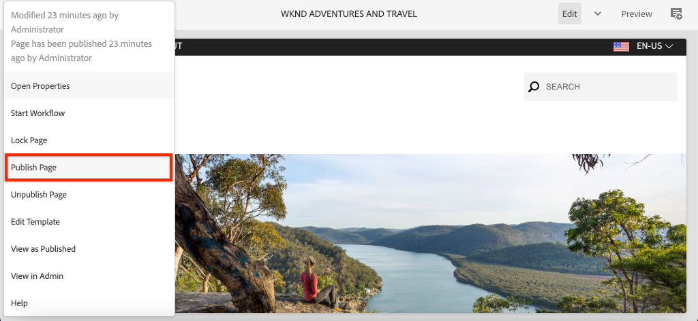

# Configurare l’SDK AEM locale {#set-up-local-aem-sdk}

>[!CONTEXTUALHELP]
>id="aemcloud_localdev_aemruntime"
>title="Runtime AEM locale"
>abstract="Adobe Experience Manager (AEM) può essere eseguito localmente utilizzando il file Quickstart Jar dell’SDK di AEM as a Cloud Service. Consente agli sviluppatori di distribuire e testare il codice, la configurazione e i contenuti personalizzati prima di passare al controllo del codice sorgente e di distribuirli in un ambiente AEM as a Cloud Service."
>additional-url="https://experienceleague.adobe.com/docs/experience-manager-cloud-service/content/implementing/developing/aem-as-a-cloud-service-sdk.html?lang=it" text="SDK di AEM as a Cloud Service"
>additional-url="https://experience.adobe.com/#/downloads/content/software-distribution/it/aemcloud.html" text="Scarica l’SDK di AEM as a Cloud Service"

Adobe Experience Manager (AEM) può essere eseguito localmente utilizzando il file Quickstart Jar dell’SDK di AEM as a Cloud Service. Consente agli sviluppatori di distribuire e testare il codice, la configurazione e i contenuti personalizzati prima di passare al controllo del codice sorgente e di distribuirli in un ambiente AEM as a Cloud Service.

Tieni presente che `~` viene utilizzato come abbreviazione per la directory utente. In Windows, equivale a `%HOMEPATH%`.

## Installare Java™

Experience Manager è un’applicazione Java™ e pertanto richiede Oracle Java™ SDK per supportare gli strumenti di sviluppo.

1. [Scarica e installa la versione più recente di Java™ SDK 11](https://experience.adobe.com/#/downloads/content/software-distribution/en/general.html?1_group.propertyvalues.property=.%2Fjcr%3Acontent%2Fmetadata%2Fdc%3AsoftwareType&amp;1_group.propertyvalues.operation=equals&amp;1_group.propertyvalues.0_values=tipo di software%3Atooling&amp;fulltext=Oracle%7E+JDK%7E+11%7E&amp;orderby=%40jcr%3Acontent%2Fjcr%3AlastModified&amp;orderby.sort=desc&amp;layout=list&amp;p.offset=0&amp;p.limit=14)
1. Verifica che Oracle Java™ 11 SDK sia installato eseguendo il comando:

>[!BEGINTABS]

>[!TAB macOS]

```shell
$ java --version
```

>[!TAB Windows]

```shell
$ java -version
```

>[!TAB Linux®]

```shell
$ java --version
```

>[!ENDTABS]


## Scaricare l’SDK as a Cloud Service dell’AEM

L’SDK per AEM as a Cloud Service, o SDK AEM, contiene il Jar Quickstart utilizzato per eseguire AEM Author e Publish localmente per lo sviluppo, nonché la versione compatibile degli strumenti di Dispatcher.

1. Accedi a [https://experience.adobe.com/#/downloads](https://experience.adobe.com/#/downloads) con il tuo Adobe ID
   + Tieni presente che la tua organizzazione Adobe __deve__ essere predisposto per AEM as a Cloud Service per scaricare l&#39;SDK AEM as a Cloud Service.
1. Accedi a __AEM as a Cloud Service__ scheda
1. Ordina per __Data pubblicazione__ in __Decrescente__ ordine
1. Fai clic sull’ultima __SDK AEM__ riga dei risultati
1. Rivedi e accetta il Contratto di licenza con l’utente finale e tocca il __Scarica__ pulsante

## Estrarre il file JAR Quickstart dallo zip dell’SDK dell’AEM

1. Decomprimi il download `aem-sdk-XXX.zip` file

## Configurare il servizio Autore AEM locale{#set-up-local-aem-author-service}

Il servizio di authoring AEM locale offre agli sviluppatori un’esperienza locale che gli esperti di marketing digitale e gli autori di contenuti condivideranno per creare e gestire i contenuti.  Il servizio di authoring AEM è progettato sia come ambiente di authoring che come ambiente di anteprima, consentendo di eseguire la maggior parte delle convalide dello sviluppo delle funzioni in base a esso, rendendolo un elemento fondamentale del processo di sviluppo locale.

1. Creare la cartella `~/aem-sdk/author`
1. Copia il __JAR Quickstart__ file in  `~/aem-sdk/author` e rinominarlo in `aem-author-p4502.jar`
1. Avvia il servizio di authoring AEM locale eseguendo quanto segue dalla riga di comando:
   + `java -jar aem-author-p4502.jar`
      + Immetti la password amministratore come `admin`. Qualsiasi password amministratore è accettabile, tuttavia si consiglia di utilizzare l’impostazione predefinita per lo sviluppo locale per ridurre la necessità di riconfigurare.

   Tu *non può* avvia AEM come Cloud Service Quickstart Jar [facendo doppio clic](#troubleshooting-double-click).
1. Accedi al servizio di authoring AEM locale all’indirizzo [http://localhost:4502](Http://localhost:4502) in un browser Web

>[!BEGINTABS]

>[!TAB macOS]

```shell
$ mkdir -p ~/aem-sdk/author
$ cp aem-sdk-Quickstart-XXX.jar ~/aem-sdk/author/aem-author-p4502.jar
$ cd ~/aem-sdk/author
$ java -jar aem-author-p4502.jar
```

>[!TAB Windows]

```shell
$ mkdir -p c:\Users\<My User>\aem-sdk\author
$ copy aem-sdk-Quickstart-XXX.jar c:\Users\<My User>\aem-sdk\author\aem-author-p4502.jar
$ cd c:\Users\<My User>\aem-sdk\author
$ java -jar aem-author-p4502.jar
```

>[!TAB Linux®]

```shell
$ mkdir -p ~/aem-sdk/author
$ cp aem-sdk-Quickstart-XXX.jar ~/aem-sdk/author/aem-author-p4502.jar
$ cd ~/aem-sdk/author
$ java -jar aem-author-p4502.jar
```

>[!ENDTABS]


## Configurare il servizio di pubblicazione AEM locale

Il servizio di pubblicazione AEM locale offre agli sviluppatori l’esperienza locale di cui godono gli utenti finali dell’AEM, ad esempio navigando nel sito Web ospitato su AEM. È importante un servizio di pubblicazione AEM locale, in quanto si integra con l’SDK dell’AEM [Strumenti di Dispatcher](./dispatcher-tools.md) e consente agli sviluppatori di testare e mettere a punto l’esperienza finale per l’utente finale.

1. Creare la cartella `~/aem-sdk/publish`
1. Copia il __JAR Quickstart__ file in  `~/aem-sdk/publish` e rinominarlo in `aem-publish-p4503.jar`
1. Avvia il servizio di pubblicazione AEM locale eseguendo quanto segue dalla riga di comando:
   + `java -jar aem-publish-p4503.jar`
      + Immetti la password amministratore come `admin`. Qualsiasi password amministratore è accettabile, tuttavia si consiglia di utilizzare l’impostazione predefinita per lo sviluppo locale per ridurre la necessità di riconfigurare.

   Tu *non può* avvia AEM come Cloud Service Quickstart Jar [facendo doppio clic](#troubleshooting-double-click).
1. Accedi al servizio di pubblicazione AEM locale all’indirizzo [http://localhost:4503](http://localhost:4503) in un browser Web

>[!BEGINTABS]

>[!TAB macOS]

```shell
$ mkdir -p ~/aem-sdk/publish
$ cp aem-sdk-Quickstart-XXX.jar ~/aem-sdk/publish/aem-publish-p4503.jar
$ cd ~/aem-sdk/publish
$ java -jar aem-publish-p4503.jar
```

>[!TAB Windows]

```shell
$ mkdir -p c:\Users\<My User>\aem-sdk\publish
$ copy aem-sdk-Quickstart-XXX.jar c:\Users\<My User>\aem-sdk\publish\aem-publish-p4503.jar
$ cd c:\Users\<My User>\aem-sdk\publish
$ java -jar aem-publish-p4503.jar
```

>[!TAB Linux®]

```shell
$ mkdir -p ~/aem-sdk/publish
$ cp aem-sdk-Quickstart-XXX.jar ~/aem-sdk/publish/aem-publish-p4503.jar
$ cd ~/aem-sdk/publish
$ java -jar aem-publish-p4503.jar
```

>[!ENDTABS]


## Configurare i servizi AEM locali in modalità prerelease

Il runtime AEM locale può essere avviato in [modalità prerelease](https://experienceleague.adobe.com/docs/experience-manager-cloud-service/content/release-notes/prerelease.html?lang=it) consentire a uno sviluppatore di utilizzare le funzioni della versione successiva dell’AEM as a Cloud Service. La versione prerelease è abilitata trasmettendo il `-r prerelease` discussione sul primo avvio del runtime locale dell’AEM. Può essere utilizzato sia con i servizi locali di creazione AEM che con i servizi di pubblicazione AEM.


>[!BEGINTABS]

>[!TAB macOS]

```shell
# For AEM Author service in prerelease mode
$ java -jar aem-author-p4502.jar -r prerelease

# For AEM Publish service in prerelease mode
$ java -jar aem-publish-p4503.jar -r prerelease
```

>[!TAB Windows]

```shell
# For AEM Author service in prerelease mode
$ java -jar aem-author-p4502.jar -r prerelease

# For AEM Publish service in prerelease mode
$ java -jar aem-publish-p4503.jar -r prerelease
```

>[!TAB Linux®]

```shell
# For AEM Author service in prerelease mode
$ java -jar aem-author-p4502.jar -r prerelease

# For AEM Publish service in prerelease mode
$ java -jar aem-publish-p4503.jar -r prerelease
```

>[!ENDTABS]

## Simula distribuzione contenuto {#content-distribution}

In un ambiente di Cloud Service reale, il contenuto viene distribuito dal servizio di authoring al servizio di pubblicazione utilizzando [Distribuzione dei contenuti Sling](https://sling.apache.org/documentation/bundles/content-distribution.html) e la pipeline di Adobe. Il [Pipeline Adobe](https://experienceleague.adobe.com/docs/experience-manager-cloud-service/core-concepts/architecture.html?lang=en#content-distribution) è un microservizio isolato disponibile solo nell’ambiente cloud.

Durante lo sviluppo, può essere opportuno simulare la distribuzione dei contenuti utilizzando il servizio Author e Publish locale. Ciò può essere ottenuto abilitando gli agenti di replica legacy.

>[!NOTE]
>
Gli agenti di replica sono disponibili solo per l’utilizzo nel file JAR Quickstart locale e forniscono solo una simulazione della distribuzione dei contenuti.

1. Accedi a **Autore** assistenza e naviga su [http://localhost:4502/etc/replication/agents.author.html](http://localhost:4502/etc/replication/agents.author.html).
1. Clic **Agente predefinito (pubblicazione)** per aprire l&#39;agente di replica predefinito.
1. Clic **Modifica** per aprire la configurazione dell&#39;agente.
1. Sotto **Impostazioni** , aggiorna i campi seguenti:

   + **Abilitato** - verif.
   + **ID utente agente** - Lascia vuoto questo campo

   

1. Sotto **Trasporto** , aggiorna i campi seguenti:

   + **URI** - `http://localhost:4503/bin/receive?sling:authRequestLogin=1`
   + **Utente** - `admin`
   + **Password** - `admin`

   

1. Clic **Ok** per salvare la configurazione e abilitare **Predefinito** Agente di replica.
1. Ora puoi apportare modifiche ai contenuti nel servizio di authoring e pubblicarli nel servizio di pubblicazione.



## Modalità di avvio di Quickstart Jar

Denominazione del file JAR Quickstart, `aem-<tier>_<environment>-p<port number>.jar` specifica la modalità di avvio. Una volta avviato in un livello specifico, di authoring o pubblicazione, l’AEM non può essere modificato nel livello alternativo. Per eseguire questa operazione, il `crx-Quickstart` La cartella generata durante la prima esecuzione deve essere eliminata e Quickstart Jar deve essere eseguito nuovamente. L’ambiente e le porte possono essere modificati, ma richiedono l’arresto/avvio dell’istanza AEM locale.

Modifica degli ambienti `dev`, `stage` e `prod`, può essere utile per gli sviluppatori per garantire che le configurazioni specifiche dell’ambiente siano definite e risolte correttamente dall’AEM. Si consiglia di eseguire lo sviluppo locale principalmente in base all’impostazione predefinita `dev` modalità di esecuzione dell’ambiente.

Le permutazioni disponibili sono le seguenti:

| Nome file JAR Quickstart | Descrizione modalità |
|------------------------------|-----------------------------------------------------------------------------|
| `aem-author-p4502.jar` | Come Autore in modalità di esecuzione Dev sulla porta 4502 |
| `aem-author_dev-p4502.jar` | Come Autore in modalità di esecuzione Dev sulla porta 4502 (come `aem-author-p4502.jar`) |
| `aem-author_stage-p4502.jar` | Autore in modalità di esecuzione Gestione temporanea sulla porta 4502 |
| `aem-author_prod-p4502.jar` | Come Autore in modalità di esecuzione Produzione sulla porta 4502 |
| `aem-publish-p4503.jar` | Come pubblicare in modalità di esecuzione Dev sulla porta 4503 |
| `aem-publish_dev-p4503.jar` | Come pubblicare in modalità di esecuzione Dev sulla porta 4503 (come `aem-publish-p4503.jar`) |
| `aem-publish_stage-p4503.jar` | Come pubblicare in modalità di esecuzione staging sulla porta 4503 |
| `aem-publish_prod-p4503.jar` | Come pubblicare in modalità di esecuzione Produzione sulla porta 4503 |

Il numero di porta può essere una qualsiasi porta disponibile sul computer di sviluppo locale, tuttavia per convenzione:

+ Porta __4502__ viene utilizzato per __servizio di authoring AEM locale__
+ Porta __4503__ viene utilizzato per __servizio di pubblicazione AEM locale__

Cambiarli potrebbe richiedere modifiche alle configurazioni dell’SDK dell’AEM

## Arresto di un runtime AEM locale

Per arrestare un runtime AEM AEM locale, aprire la finestra della riga di comando utilizzata per avviare il runtime AEM, quindi toccare `Ctrl-C`. Attendere la chiusura dell&#39;AEM. Al termine del processo di arresto, è disponibile il prompt dei comandi.

## Attività di configurazione runtime AEM locali opzionali

+ __Variabili di ambiente di configurazione OSGi e variabili segrete__ sono [appositamente predisposto per il runtime locale dell’AEM](https://experienceleague.adobe.com/docs/experience-manager-cloud-service/implementing/deploying/configuring-osgi.html#local-development), anziché gestirli utilizzando CLI dell&#39;aio.

## Quando aggiornare Quickstart Jar

Aggiorna l’SDK dell’AEM almeno mensilmente l’ultimo giovedì di ogni mese, o poco dopo, cioè la data di rilascio delle &quot;funzioni&quot; as a Cloud Service dell’AEM.

>[!WARNING]
>
L’aggiornamento del file JAR Quickstart a una nuova versione richiede la sostituzione dell’intero ambiente di sviluppo locale, con conseguente perdita di codice, configurazione e contenuto negli archivi AEM locali. Assicurati che qualsiasi codice, configurazione o contenuto che non deve essere eliminato sia salvato in modo sicuro in Git o esportato dall’istanza AEM locale come pacchetti AEM.

### Come evitare la perdita di contenuti durante l’aggiornamento dell’SDK per AEM

L’aggiornamento dell’SDK dell’AEM crea effettivamente un nuovo runtime dell’AEM, incluso un nuovo archivio, il che significa che tutte le modifiche apportate a un precedente archivio dell’SDK dell’AEM vengono perse. Di seguito sono riportate alcune valide strategie per contribuire a mantenere contenuti permanenti tra gli aggiornamenti dell’SDK AEM e possono essere utilizzate in modo discreto o insieme:

1. Crea un pacchetto di contenuti dedicato a contenere contenuti di &quot;esempio&quot; per facilitare lo sviluppo e mantienilo in Git. Tutti i contenuti che devono essere mantenuti tramite gli aggiornamenti dell’SDK AEM verranno mantenuti in questo pacchetto e ridistribuiti dopo l’aggiornamento dell’SDK AEM.
1. Utilizzare [oak-upgrade](https://jackrabbit.apache.org/oak/docs/migration.html) con `includepaths` per copiare il contenuto dal precedente archivio AEM SDK al nuovo archivio AEM SDK.
1. Esegui il backup di qualsiasi contenuto utilizzando Gestione pacchetti AEM e pacchetti di contenuti nell’SDK AEM precedente e reinstallali nel nuovo SDK AEM.

Ricorda che l’utilizzo degli approcci di cui sopra per mantenere il codice tra gli aggiornamenti dell’SDK AEM indica un anti-pattern di sviluppo. Il codice non monouso deve avere origine nell’IDE di sviluppo e fluire nell’SDK dell’AEM tramite le implementazioni.

## Risoluzione dei problemi

### Se si fa doppio clic sul file Jar Quickstart, viene generato un errore{#troubleshooting-double-click}

Quando si fa doppio clic sul file JAR Quickstart per iniziare, viene visualizzato un messaggio di errore modale che impedisce l’avvio dell’AEM a livello locale.


Questo perché Quickstart Jar as a Cloud Service dall’AEM non supporta il doppio clic sul Jar Quickstart per avviare l’AEM a livello locale. È invece necessario eseguire il file Jar da tale riga di comando.

Per avviare il servizio di creazione AEM: `cd` nella directory contenente il file Jar Quickstart ed esegui il comando:

>[!BEGINTABS]

>[!TAB macOS]

```shell
$ java -jar aem-author-p4502.jar
```

>[!TAB Windows]

```shell
$ java -jar aem-author-p4502.jar
```

>[!TAB Linux®]

```shell
$ java -jar aem-author-p4502.jar
```

>[!ENDTABS]

oppure, per avviare il servizio di pubblicazione AEM, `cd` nella directory contenente il file Jar Quickstart ed esegui il comando:

>[!BEGINTABS]

>[!TAB macOS]

```shell
$ java -jar aem-publish-p4503.jar
```

>[!TAB Windows]

```shell
$ java -jar aem-publish-p4503.jar
```

>[!TAB Linux®]

```shell
$ java -jar aem-publish-p4503.jar
```

>[!ENDTABS]

### L’avvio del file JAR Quickstart dalla riga di comando si interrompe immediatamente{#troubleshooting-java-8}

Quando si avvia Quickstart Jar dalla riga di comando, il processo si interrompe immediatamente e il servizio AEM non si avvia, con il seguente errore:

```shell
➜  ~/aem-sdk/author: java -jar aem-author-p4502.jar
Loading quickstart properties: default
Loading quickstart properties: instance
java.lang.Exception: Quickstart requires a Java Specification 11 VM, but your VM (Java HotSpot(TM) 64-Bit Server VM / Oracle Corporation) reports java.specification.version=1.8
  at com.adobe.granite.quickstart.base.impl.Main.checkEnvironment(Main.java:1046)
  at com.adobe.granite.quickstart.base.impl.Main.<init>(Main.java:646)
  at com.adobe.granite.quickstart.base.impl.Main.main(Main.java:981)
Quickstart: aborting
```

Questo perché AEM as a Cloud Service richiede Java™ SDK 11 e stai eseguendo una versione diversa, molto probabilmente Java™ 8. Per risolvere il problema, scaricare e installare [Oracle Java™ SDK 11](https://experience.adobe.com/#/downloads/content/software-distribution/en/general.html?1_group.propertyvalues.property=.%2Fjcr%3Acontent%2Fmetadata%2Fdc%3AsoftwareType&amp;1_group.propertyvalues.operation=equals&amp;1_group.propertyvalues.0_values=tipo di software%3Atooling&amp;fulltext=Oracle%7E+JDK%7E+11%7E&amp;orderby=%40jcr%3Acontent%2Fjcr%3AlastModified&amp;orderby.sort=desc&amp;layout=list&amp;p.offset=0&amp;p.limit=14).

Una volta installato l’SDK Oracle Java™ 11, verifica che si tratti della versione attiva eseguendo il comando dalla riga di comando:

>[!BEGINTABS]

>[!TAB macOS]

```shell
$ java --version
```

>[!TAB Windows]

```shell
$ java -version
```

>[!TAB Linux®]

```shell
$ java --version
```

>[!ENDTABS]

## Risorse aggiuntive

+ [Scaricare l’SDK dell’AEM](https://experience.adobe.com/#/downloads)
+ [Adobe Cloud Manager](https://my.cloudmanager.adobe.com/)
+ [Scarica Docker](https://www.docker.com/)
+ [Documentazione di Experience Manager Dispatcher](https://experienceleague.adobe.com/docs/experience-manager-dispatcher/using/dispatcher.html?lang=it)
