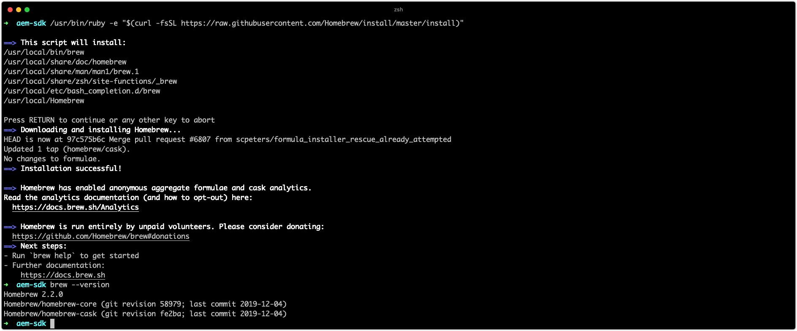

# Configurare gli strumenti di sviluppo {#set-up-development-tools}

>[!CONTEXTUALHELP]
>id="aemcloud_localdev_devtools"
>title="Configurare gli strumenti di sviluppo"
>abstract="Per sviluppare per Adobe Experience Manager (AEM) è necessario installare e configurare un set minimo di strumenti specifici nel computer dello sviluppatore, compresi Java, Maven, Adobe I/O CLI, IDE di sviluppo e altri."
>additional-url="https://experienceleague.adobe.com/docs/experience-manager-cloud-service/implementing/developing/development-guidelines.html?lang=it" text="Linee guida per lo sviluppo"
>additional-url="https://experienceleague.adobe.com/docs/experience-manager-learn/cloud-service/developing/basics/aem-sdk.html?lang=it" text="Nozioni di base sullo sviluppo"

Per sviluppare per Adobe Experience Manager (AEM) è necessario installare e configurare un set minimo di strumenti specifici nel computer dello sviluppatore, Questi strumenti sostengono lo sviluppo e la creazione di progetti AEM.

Tieni presente che `~` viene utilizzato come abbreviazione per la directory utente. In Windows, equivale a `%HOMEPATH%`.

## Installare Java

Experience Manager è un’applicazione Java e pertanto richiede SDK Java per supportare lo sviluppo e l’SDK as a Cloud Service AEM.

1. [Scarica e installa l’SDK Java 11 più recente](https://experience.adobe.com/#/downloads/content/software-distribution/en/general.html?1_group.propertyvalues.property=.%2Fjcr%3Acontent%2Fmetadata%2Fdc%3AsoftwareType&amp;1_group.propertyvalues.operation=equals&amp;1_group.propertyvalues.0_values=tipo di software%3Atooling&amp;fulltext=Oracle%7E+JDK%7E+11%7E&amp;orderby=%40jcr%3Acontent%2Fjcr%3AlastModified&amp;orderby.sort=desc&amp;layout=list&amp;p.offset=0&amp;p.limit=14)
1. Verifica che l’SDK di Java 11 Oracle sia installato eseguendo il comando:

>[!BEGINTABS]

>[!TAB macOS]

```shell
$ java --version
```

>[!TAB Windows]

```shell
$ java -version
```

>[!TAB Linux]

```shell
$ java --version
```

>[!ENDTABS]


## Installa Homebrew

_L&#39;uso di Homebrew è facoltativo, ma consigliato._

Homebrew è un gestore di pacchetti open-source per macOS, Windows e Linux. Tutti gli strumenti di supporto possono essere installati separatamente, Homebrew fornisce un modo conveniente per installare e aggiornare una varietà di strumenti di sviluppo necessari per lo sviluppo Experience Manager.

1. Apri il terminale
1. Verificare se Homebrew è già installato eseguendo il comando: `brew --version`.
1. Se Homebrew non è installato, installarlo

>[!BEGINTABS]

>[!TAB macOS]

[Homebrew su macOS](https://brew.sh/) richiede [Xcode](https://apps.apple.com/us/app/xcode/id497799835) o [Strumenti della riga di comando](https://developer.apple.com/download/more/), installabile tramite il comando:

```shell
$ xcode-select --install
```

>[!TAB Windows]

[Installare Homebrew su Windows 10](https://docs.brew.sh/Installation#linux-or-windows-10-subsystem-for-linux)

>[!TAB Linux]

[Installare Homebrew su Linux](https://docs.brew.sh/Installation#linux-or-windows-10-subsystem-for-linux)

>[!ENDTABS]

1. Verificare che Homebrew sia installato eseguendo il comando: `brew --version`



Se utilizzi Homebrew, segui la __Installa con Homebrew__ nelle sezioni seguenti. Se sei __non__ utilizzando Homebrew, installare gli strumenti utilizzando i collegamenti specifici del sistema operativo.

## Installare Git

[Git](https://git-scm.com/) è il sistema di gestione del controllo del codice sorgente utilizzato da [Adobe Cloud Manager](https://experienceleague.adobe.com/docs/experience-manager-cloud-manager/using/requirements/source-code-repository.html), e pertanto è necessario per lo sviluppo.

>[!BEGINTABS]

>[!TAB Installare Git utilizzando Homebrew]

1. Apri il terminale/prompt dei comandi
1. Esegui il comando: `$ brew install git`
1. Verifica che Git sia installato utilizzando il comando: `$ git --version`

>[!TAB Scaricare e installare Git]

1. [Scaricare e installare Git](https://git-scm.com/downloads)
1. Apri il terminale/prompt dei comandi
1. Verifica che Git sia installato utilizzando il comando: `$ git --version`

>[!ENDTABS]


## Installare Node.js (e npm){#node-js}

[Node.js](https://nodejs.org) è un ambiente runtime JavaScript utilizzato per lavorare con le risorse front-end di un progetto AEM __ui.frontend__ sottoprogetto. Node.js è distribuito con [npm](https://www.npmjs.com/), è il gestore di pacchetti di fatto Node.js, utilizzato per gestire le dipendenze JavaScript.

>[!BEGINTABS]

>[!TAB Installare Node.js utilizzando Homebrew]

1. Apri il terminale/prompt dei comandi
1. Esegui il comando: `$ brew install node`
1. Verifica che Node.js sia installato utilizzando il comando: `$ node -v`
1. Verificare che npm sia installato, utilizzando il comando: `$ npm -v`

>[!TAB Scaricare e installare Node.js]

1. [Scaricare e installare Node.js](https://nodejs.org/it/download/)
2. Apri il terminale/prompt dei comandi
3. Verifica che Node.js sia installato utilizzando il comando: `$ node -v`
4. Verificare che npm sia installato, utilizzando il comando: `$ npm -v`

>[!ENDTABS]


>[!TIP]
>
>[Archetipo progetto AEM](https://github.com/adobe/aem-project-archetype)I progetti AEM basati su installano una versione isolata di Node.js al momento della compilazione. È consigliabile mantenere sincronizzata (o vicina) la versione del sistema di sviluppo locale con le versioni di Node.js e npm specificate nel progetto Reactor pom.xml del progetto AEM Maven.
>
>Vedi questo esempio [Progetto AEM pom.xml](https://github.com/adobe/aem-guides-wknd/blob/9ac94f3f40c978a53ec88fae79fbc17dd2db72f2/pom.xml#L117-L118) per individuare le versioni di Node.js e npm.

## Installare Maven

Apache Maven è lo strumento da riga di comando Java open-source utilizzato per creare progetti AEM generati dall’archetipo Maven del progetto AEM. Tutte le principali IDE ([IDEA IntelliJ](https://www.jetbrains.com/idea/), [Codice di Visual Studio](https://code.visualstudio.com/), [Eclipse](https://www.eclipse.org/), ecc.) dispongono del supporto Maven integrato.


>[!BEGINTABS]

>[!TAB Installare Maven utilizzando Homebrew]

1. Apri il terminale/prompt dei comandi
1. Esegui il comando: `$ brew install maven`
1. Verifica che Maven sia installato, utilizzando il comando: `$ mvn -v`

>[!TAB Scaricare e installare Maven]

1. [Scarica Maven](https://maven.apache.org/download.cgi)
1. [Installare Maven](https://maven.apache.org/install.html)
1. Apri il terminale/prompt dei comandi
1. Verifica che Maven sia installato, utilizzando il comando: `$ mvn -v`

>[!ENDTABS]


## Configurare Adobe I/O CLI{#aio-cli}

Il [CLI ADOBE I/O](https://github.com/adobe/aio-cli), o `aio`, fornisce accesso alla riga di comando a diversi servizi di Adobe, tra cui [Cloud Manager](https://github.com/adobe/aio-cli-plugin-cloudmanager) e [Asset compute](https://github.com/adobe/aio-cli-plugin-asset-compute). Adobe I/O CLI svolge un ruolo fondamentale nello sviluppo su AEM as a Cloud Service in quanto consente agli sviluppatori di:

+ Registri di coda da AEM as a Cloud Service Services
+ Gestire le pipeline di Cloud Manager dalla CLI
+ Distribuisci in [Ambienti di sviluppo rapido AEM](https://experienceleague.adobe.com/docs/experience-manager-learn/cloud-service/developing/rde/overview.html)

### Installare Adobe I/O CLI

1. Assicurare [Node.js è installato](#node-js) poiché Adobe I/O CLI è un modulo npm
   + Esegui `node --version` per confermare
1. Esegui `npm install -g @adobe/aio-cli` per installare `aio` modulo npm a livello globale

### Configurare il plug-in Adobe I/O CLI Cloud Manager{#aio-cloud-manager}

Il plug-in Adobe I/O Cloud Manager consente all’interfaccia della riga di comando aio di interagire con Adobe Cloud Manager tramite `aio cloudmanager` comando.

1. Esegui `aio plugins:install @adobe/aio-cli-plugin-cloudmanager` per installare [Plug-in aio Cloud Manager](https://github.com/adobe/aio-cli-plugin-cloudmanager).

#### Configurare l’autenticazione CLI Adobe I/O

Per consentire all’interfaccia della riga di comando Adobe I/O di comunicare con Cloud Manager, viene [L’integrazione di Cloud Manager deve essere creata in Adobe I/O Console](https://github.com/adobe/aio-cli-plugin-cloudmanager)Per eseguire l&#39;autenticazione, è necessario ottenere le credenziali, e.

1. Accedi a [console.adobe.io](https://console.adobe.io)
1. Assicurati che l’organizzazione che include il prodotto Cloud Manager a cui connettersi sia attiva nello switcher dell’organizzazione Adobe
1. Crea un nuovo elemento o apri un elemento esistente [programma di Adobe I/O](https://www.adobe.io/apis/experienceplatform/console/docs.html#!AdobeDocs/adobeio-console/master/projects.md)
   + I progetti Adobe I/O Console sono semplicemente raggruppamenti organizzativi di integrazioni, creazione o utilizzo di e progetti esistenti in base a come desideri gestire le integrazioni.
   + Se crei un nuovo progetto, seleziona &quot;Progetto vuoto&quot; se richiesto (anziché &quot;Crea da modello&quot;).
   + I programmi della console di Adobe I/O sono concetti diversi rispetto ai programmi di Cloud Manager
1. Creare una nuova integrazione API di Cloud Manager
   + Seleziona il tipo di autenticazione &quot;Service Account (JWT)&quot; obsoleto (OAuth non è al momento supportato per CLI).
   + Crea o carica le chiavi.
   + Seleziona il profilo di prodotto &quot;Sviluppatore - Cloud Service&quot;
1. Per ottenere le credenziali dell’account di servizio (JWT) necessarie per popolare la CLI di Adobe I/O [config.json](https://github.com/adobe/aio-cli-plugin-cloudmanager#authentication)

   ```json
   //config.json 
   {
      "client_id": "Client ID from Service Account (JWT) credential",
      "client_secret": "Client Secret from Service Account (JWT) credential",
      "technical_account_id": "Technical Account ID from Service Account (JWT) credential",
      "ims_org_id": "Organization ID from Service Account (JWT) credential",
      "meta_scopes": [
        "ent_cloudmgr_sdk"
      ]
   }
   ```

1. Carica `config.json` file in Adobe I/O CLI
   + `$ aio config:set ims.contexts.aio-cli-plugin-cloudmanager ./path/to/config.json --file --json`
1. Carica `private.key` file in Adobe I/O CLI
   + `$ aio config:set ims.contexts.aio-cli-plugin-cloudmanager.private_key ./path/to/private.key --file`

Inizio [esecuzione di comandi](https://github.com/adobe/aio-cli-plugin-cloudmanager#commands) per Cloud Manager tramite Adobe I/O CLI.

### Configurare il plug-in AEM Rapid Development Environment{#rde}

Il plug-in AEM Rapid Development Environment consente all&#39;interfaccia CLI dell&#39;aio di interagire con AEM as a Cloud Service [Ambienti di sviluppo rapido](https://experienceleague.adobe.com/docs/experience-manager-learn/cloud-service/developing/rde/overview.html) tramite `aio aem:rde` comando.

1. Esegui `aio plugins:install @adobe/aio-cli-plugin-aem-rde` per installare [Plug-in per ambienti di sviluppo rapido AEM](https://github.com/adobe/aio-cli-plugin-aem-rde).

### Configurare il plug-in di Asset compute CLI Adobe I/O{#aio-asset-compute}

Il plug-in Adobe I/O Cloud Manager consente all&#39;interfaccia CLI dell&#39;aio di generare ed eseguire processi di lavoro Asset compute tramite `aio asset-compute` comando.

1. Esegui `aio plugins:install @adobe/aio-cli-plugin-asset-compute` per installare [plug-in di Asset compute aio](https://github.com/adobe/aio-cli-plugin-asset-compute).

## Configurare l’IDE di sviluppo

Lo sviluppo AEM consiste principalmente nello sviluppo Java e front-end (JavaScript, CSS, ecc.) e nella gestione XML. Di seguito sono riportati gli IDE più popolari per lo sviluppo dell’AEM.

### IDEA IntelliJ

__[IDEA IntelliJ](https://www.jetbrains.com/idea/)__ è un potente IDE per lo sviluppo Java. IntelliJ IDEA è disponibile in due versioni, una versione Community gratuita e una versione Ultimate commerciale (a pagamento). La versione comunitaria gratuita è sufficiente per lo sviluppo dell&#39;AEM, tuttavia [espande il set di funzionalità](https://www.jetbrains.com/idea/download).

>[!VIDEO](https://video.tv.adobe.com/v/26089?quality=12&learn=on)

+ [Scarica IntelliJ IDEA](https://www.jetbrains.com/idea/download)
+ [Scaricare lo strumento Repo](https://github.com/Adobe-Marketing-Cloud/tools/tree/master/repo#installation)

### Codice Microsoft Visual Studio

__[Codice di Visual Studio](https://code.visualstudio.com/)__ (VS Code) è uno strumento gratuito open source per sviluppatori front-end. Visual Studio Code può essere configurato per integrare la sincronizzazione dei contenuti con l&#39;AEM con l&#39;aiuto di uno strumento di Adobe, __[repository](https://github.com/Adobe-Marketing-Cloud/tools/tree/master/repo#integration-into-visual-studio-code)__.

Visual Studio Code è la scelta ideale per gli sviluppatori front-end che creano principalmente codice front-end, JavaScript, CSS e HTML. Mentre VS Code dispone del supporto Java tramite [estensioni](https://code.visualstudio.com/docs/java/java-tutorial), potrebbe non disporre di alcune delle funzioni avanzate fornite da più specifiche per Java.

>[!VIDEO](https://video.tv.adobe.com/v/25907?quality=12&learn=on)

+ [Scarica codice Visual Studio](https://code.visualstudio.com/Download)
+ [Scaricare lo strumento Repo](https://github.com/Adobe-Marketing-Cloud/tools/tree/master/repo#integration-into-visual-studio-code)
+ [Scarica estensione codice VS aemfed](https://aemfed.io/)
+ [Scarica estensione codice VS sincronizzazione AEM](https://marketplace.visualstudio.com/items?itemName=Yinkai15.aemsync)

### Eclipse

__[IDE Eclipse](https://www.eclipse.org/ide/)__ è un popolare IDE per lo sviluppo Java e supporta  __[Strumenti per sviluppatori AEM](https://experienceleague.adobe.com/docs/experience-manager-65/developing/devtools/aem-eclipse.html)__ plug-in fornito da Adobe, che fornisce un’interfaccia grafica in-IDE per l’authoring e la sincronizzazione dei contenuti JCR con un’istanza AEM locale.

>[!VIDEO](https://video.tv.adobe.com/v/25906?quality=12&learn=on)

+ [Scarica Eclipse](https://www.eclipse.org/ide/)
+ [Scarica gli strumenti di sviluppo Eclipse](https://experienceleague.adobe.com/docs/experience-manager-65/developing/devtools/aem-eclipse.html)
