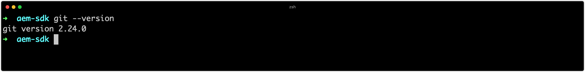

# Configurare gli strumenti di sviluppo

Lo sviluppo Adobe Experience Manager (AEM) richiede l&#39;installazione e la configurazione di un set minimo di strumenti di sviluppo nel computer sviluppatore. Questi strumenti supportano lo sviluppo e la creazione di progetti AEM.

Tenere presente che `~` viene utilizzato come abbreviazione per la directory dell&#39;utente. In Windows, questo è l&#39;equivalente di `%HOMEPATH%`.

## Installare Java

 Experience Manager è un&#39;applicazione Java e richiede quindi Java SDK per supportare lo sviluppo e il AEM come un SDK Cloud Service.

1. [Scaricate e installate la versione più recente dell’SDK Java 11](https://experience.adobe.com/#/downloads/content/software-distribution/en/general.html?1_group.propertyvalues.property=.%2Fjcr%3Acontent%2Fmetadata%2Fdc%3AsoftwareType&amp;1_group.property.operation=equals&amp;1_group.property.values.0_values=software-type%3Atooling&amp;fulltext= Oracle%7E+JDK%7E+11%7E&amp;orderby=%40jcr%3Acontent%2Fjcr jcr%3AlastModified&amp;orderby.sort=desc&amp;layout=list&amp;p.offset=0&amp;p.limit=14)
1. Verifica che Java 11 SDK sia installato eseguendo il comando:
   + Windows: `java -version`
   + macOS / Linux: `java --version`

## Installa ebraico

_L&#39;utilizzo di Hebrew è facoltativo, ma consigliato._

Homebrew è un gestore di pacchetti open-source per macOS, Windows e Linux. Tutti gli strumenti di supporto possono essere installati separatamente, Homebrew fornisce un modo conveniente per installare e aggiornare una varietà di strumenti di sviluppo necessari per  sviluppo Experience Manager.

1. Aprire il terminale
1. Verificare che Homebrew sia già installato eseguendo il comando: `brew --version`.
1. Se Homebrew non è installato, installare Homebrew
   + [Installazione di homebrew in macOS](https://brew.sh/)
      + Per l&#39;homebrew in macOS è necessario [Xcode](https://apps.apple.com/us/app/xcode/id497799835) o [Strumenti della riga di comando](https://developer.apple.com/download/more/), installabili tramite il comando:
         + `xcode-select --install`
   + [Installare Homebrew su Linux](https://docs.brew.sh/Installation#linux-or-windows-10-subsystem-for-linux)
   + [Installare l&#39;ebraico in Windows 10](https://docs.brew.sh/Installation#linux-or-windows-10-subsystem-for-linux)
1. Verificare che la lingua originale sia installata eseguendo il comando: `brew --version`

Se si utilizza l&#39;opzione per l&#39;uso in lingua ebraica, seguire le istruzioni __Install using Homebrew__ riportate di seguito. Se __not__ si utilizza l&#39;interfaccia in lingua originale, installare gli strumenti utilizzando i collegamenti specifici del sistema operativo.

## Installare Git

 Rappresenta il sistema di gestione del controllo del codice sorgente utilizzato da  [ Adobe Cloud Manager](https://docs.adobe.com/content/help/en/experience-manager-cloud-manager/using/requirements/source-code-repository.html), ed è quindi richiesto per lo sviluppo.

+ Installare Git utilizzando l&#39;interfaccia ebraica
   1. Apri il terminale/prompt dei comandi
   1. Esegui il comando: `brew install git`
   1. Verificare che Git sia installato, utilizzando il comando: `git --version`
+ Oppure, scaricate e installate Git (macOS, Linux o Windows)
   1. [Scaricare e installare Git](https://git-scm.com/downloads)
   1. Apri il terminale/prompt dei comandi
   1. Verificare che Git sia installato, utilizzando il comando: `git --version`

## Installazione di Node.js (e npm){#node-js}

[Node.](https://nodejs.org) jsis un ambiente di runtime JavaScript utilizzato per lavorare con le risorse front-end di un progetto  __ui.__ frontendsub di un progetto AEM. Node.js è distribuito con [npm](https://www.npmjs.com/), è il gestore pacchetti Node.js de facto, utilizzato per gestire le dipendenze JavaScript.

+ Installazione di Node.js tramite Homebrew
   1. Apri il terminale/prompt dei comandi
   1. Esegui il comando: `brew install node`
   1. Verifica che Node.js sia installato, utilizzando il comando: `node -v`
   1. Verificare che npm sia installato, utilizzando il comando: `npm -v`
+ Oppure, scaricate e installate Node.js (macOS, Linux o Windows)
   1. [Download e installazione di Node.js](https://nodejs.org/en/download/)
   1. Apri il terminale/prompt dei comandi
   1. Verifica che Node.js sia installato, utilizzando il comando: `node -v`
   1. Verificare che npm sia installato, utilizzando il comando: `npm -v`

>[!TIP]
>
>[AEM Project Archetype](https://github.com/adobe/aem-project-archetype)-based AEM Projects installare una versione isolata di Node.js al momento della creazione. È opportuno mantenere la versione del sistema di sviluppo locale sincronizzata (o vicina) con le versioni Node.js e npm specificate nel reattore pom.xml del progetto AEM Maven.
>
>Vedere questo esempio [AEM Project Reactor pom.xml](https://github.com/adobe/aem-guides-wknd/blob/9ac94f3f40c978a53ec88fae79fbc17dd2db72f2/pom.xml#L117-L118) per individuare le versioni di build Node.js e npm.

## Installazione di Maven

Apache Maven è lo strumento della riga di comando Java open-source utilizzato per creare AEM Progetti generati dall&#39;Archetype AEM Project Maven. Tutti i principali IDE ([IntelliJ IDEA](https://www.jetbrains.com/idea/), [Visual Studio Code](https://code.visualstudio.com/), [Eclipse](https://www.eclipse.org/), ecc.) con supporto Maven integrato.

+ Installazione di Maven con Homebrew
   1. Apri il terminale/prompt dei comandi
   1. Esegui il comando: `brew install maven`
   1. Verifica che Maven sia installato, utilizzando il comando: `mvn -v`
+ Oppure, scaricate e installate Maven (macOS, Linux o Windows)
   1. [Scarica Maven](https://maven.apache.org/download.cgi)
   1. [Installazione di Maven](https://maven.apache.org/install.html)
   1. Apri il terminale/prompt dei comandi
   1. Verifica che Maven sia installato, utilizzando il comando: `mvn -v`

## Configurare  Adobe I/O CLI{#aio-cli}

[ Adobe I/O CLI](https://github.com/adobe/aio-cli), o `aio`, fornisce l&#39;accesso della riga di comando a una serie di servizi  Adobe, inclusi [Cloud Manager](https://github.com/adobe/aio-cli-plugin-cloudmanager) e [ Asset compute](https://github.com/adobe/aio-cli-plugin-asset-compute). La  CLI di Adobe I/O svolge un ruolo fondamentale nello sviluppo in AEM come Cloud Service, in quanto consente agli sviluppatori di:

+ Registri di coda da AEM come servizi di Cloud Services
+ Gestione delle pipeline di Cloud Manager dall&#39;interfaccia CLI

### Installare  Adobe I/O CLI

1. Assicurarsi che [Node.js sia installato](#node-js) in quanto  CLI di Adobe I/O è un modulo npm
   + Eseguire `node --version` per confermare
1. Eseguire `npm install -g @adobe/aio-cli` per installare globalmente il modulo npm `aio`

### Configurare il plug-in  Adobe I/O CLI Cloud Manager{#aio-cloud-manager}

Il plug-in  Adobe I/O Cloud Manager consente all&#39;interfaccia CLI di aio di interagire con  Adobe Cloud Manager tramite il comando `aio cloudmanager`.

1. Esegui `aio plugins:install @adobe/aio-cli-plugin-cloudmanager` per installare il plug-in [aio Cloud Manager](https://github.com/adobe/aio-cli-plugin-cloudmanager).

### Configurare il plug-in  Adobe I/O CLI  Asset compute{#aio-asset-compute}

Il plug-in  Adobe I/O Cloud Manager consente all&#39;interfaccia CLI di aio di generare ed eseguire  Asset compute tramite il comando `aio asset-compute`.

1. Eseguire `aio plugins:install @adobe/aio-cli-plugin-cloudmanager` per installare il plug-in per Asset compute [aio ](https://github.com/adobe/aio-cli-plugin-asset-compute).

### Configurare l&#39;autenticazione  Adobe I/O CLI

Affinché l&#39; CLI di Adobe I/O possa comunicare con Cloud Manager, è necessario creare un&#39;integrazione di Cloud Manager  Adobe I/O Console e ottenere le credenziali per l&#39;autenticazione.

>[!VIDEO](https://video.tv.adobe.com/v/35094?quality=12&learn=on)

1. Accedere a [console.adobe.io](https://console.adobe.io)
1. Assicurati che l&#39;organizzazione a cui è collegato il prodotto Cloud Manager sia attiva nello switcher di organizzazione del Adobe 
1. Creare un nuovo o aprire un programma Adobe I/O [ esistente](https://www.adobe.io/apis/experienceplatform/console/docs.html#!AdobeDocs/adobeio-console/master/projects.md)
   +  programmi di Adobe I/O Console sono semplicemente raggruppamenti organizzativi di integrazioni, creare o utilizzare e programmi esistenti basati su come si desidera gestire le integrazioni
   + Se create un nuovo progetto, selezionate &quot;Progetto vuoto&quot; se richiesto (vs. Crea da modello)
   +  programmi di Adobe I/O Console sono concetti diversi per i programmi di Cloud Manager
1. Creare una nuova integrazione API di Cloud Manager con il profilo &quot;Sviluppatore - Cloud Service&quot;
1. Per ottenere le credenziali dell&#39;account di servizio (JWT) è necessario compilare  [config.json](https://github.com/adobe/aio-cli-plugin-cloudmanager#authentication) di Adobe I/O CLI
1. Caricate il file `config.json` nella  CLI di Adobe I/O
   + `$ aio config:set jwt-auth PATH_TO_CONFIG_JSON_FILE --file --json`
1. Caricate il file `private.key` nella  CLI di Adobe I/O
   + `$ aio config:set jwt-auth.jwt_private_key PATH_TO_PRIVATE_KEY_FILE --file`

Avviare [l&#39;esecuzione di comandi](https://github.com/adobe/aio-cli-plugin-cloudmanager#commands) per Cloud Manager tramite l&#39;interfaccia CLI di Adobe I/O .

## Configurare l&#39;IDE di sviluppo

AEM sviluppo consiste principalmente nello sviluppo Java e Front-end (JavaScript, CSS, ecc.) e nella gestione XML. Di seguito sono riportati gli IDE più popolari per lo sviluppo AEM.

### IDEA IntelliJ

__[IntelliJ ](https://www.jetbrains.com/idea/)__ IDEA è un potente IDE per lo sviluppo Java. IntelliJ IDEA è dotato di due sapori, una versione comunitaria gratuita e una versione finale commerciale (pagata). La versione gratuita Community è sufficiente per AEM sviluppo, tuttavia Ultimate [espande la propria funzionalità impostata](https://www.jetbrains.com/idea/download).

>[!VIDEO](https://video.tv.adobe.com/v/26089/?quality=12&learn=on)

+ [Scarica IntelliJ IDEA](https://www.jetbrains.com/idea/download)
+ [Download dello strumento Repo](https://github.com/Adobe-Marketing-Cloud/tools/tree/master/repo#installation)

### Codice di Microsoft Visual Studio

__[Visual Studio Code](https://code.visualstudio.com/)__ (VS Code) è uno strumento gratuito open-source per gli sviluppatori front-end. È possibile impostare il codice di Visual Studio per integrare la sincronizzazione dei contenuti con AEM con l&#39;aiuto di uno strumento di Adobe , __[repo](https://github.com/Adobe-Marketing-Cloud/tools/tree/master/repo#integration-into-visual-studio-code)__.

Visual Studio Code è la scelta ideale per gli sviluppatori front-end che creano principalmente codice front-end; JavaScript, CSS e HTML. Mentre il codice VS ha il supporto Java tramite [estensioni](https://code.visualstudio.com/docs/java/java-tutorial), potrebbe mancare alcune delle funzioni avanzate fornite da più specifiche Java.

>[!VIDEO](https://video.tv.adobe.com/v/25907?quality=12&learn=on)

+ [Download del codice di Visual Studio](https://code.visualstudio.com/Download)
+ [Download dello strumento Repo](https://github.com/Adobe-Marketing-Cloud/tools/tree/master/repo#integration-into-visual-studio-code)
+ [Scarica l&#39;estensione del codice VS](https://aemfed.io/)
+ [Scarica AEM Sincronizza estensione Codice VS](https://marketplace.visualstudio.com/items?itemName=Yinkai15.aemsync)

### Eclipse

__[Eclipse ](https://www.eclipse.org/ide/)__ IDEs è un popolare IDE per lo sviluppo Java e supporta lo   __[AEM Developer ](https://eclipse.adobe.com/aem/dev-tools/)__ Toolsplug-in fornito da  Adobe, fornendo un&#39;interfaccia utente in-IDE per l&#39;authoring e per sincronizzare il contenuto JCR con un&#39;istanza AEM locale.

>[!VIDEO](https://video.tv.adobe.com/v/25906?quality=12&learn=on)

+ [Scarica Eclipse](https://www.eclipse.org/ide/)
+ [Download di Eclipse Dev Tools](https://eclipse.adobe.com/aem/dev-tools/)
