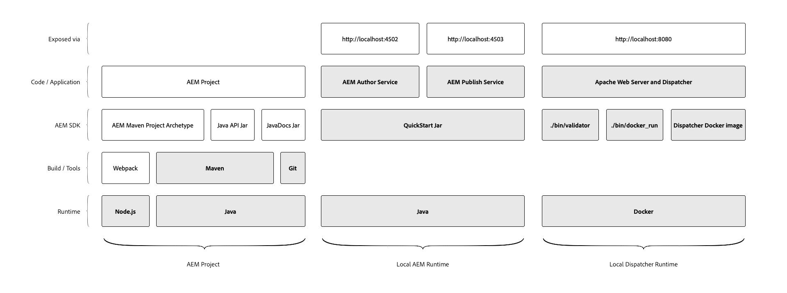

# Configurazione ambiente di sviluppo locale

Questa esercitazione descrive come configurare un ambiente di sviluppo locale per Adobe Experience Manager (AEM) utilizzando l’SDK di AEM as a Cloud Service. Sono inclusi gli strumenti di sviluppo necessari per sviluppare, generare e compilare progetti AEM, nonché i tempi di esecuzione locali, che consentono agli sviluppatori di convalidare rapidamente le nuove funzioni localmente prima di distribuirle in AEM as a Cloud Service tramite Adobe Cloud Manager.

>[!VIDEO](https://video.tv.adobe.com/v/32565/?quality=12&learn=on)

L’ambiente di sviluppo locale per AEM può essere suddiviso in tre gruppi logici:

+ Il __Progetto AEM__ contiene il codice personalizzato, la configurazione e il contenuto dell&#39;applicazione AEM personalizzata.
+ __AEM Runtime locale__ esegue una versione locale dei servizi di authoring e pubblicazione AEM localmente.
+ Il __Runtime del Dispatcher locale__ esegue una versione locale di Apache HTTP Web Server e Dispatcher.

Questa esercitazione spiega come installare e impostare gli elementi evidenziati nel diagramma precedente, fornendo un ambiente di sviluppo locale stabile per lo sviluppo AEM.

## Organizzazione del file system

Questa esercitazione ha stabilito la posizione degli artefatti SDK di AEM as a Cloud Service e il codice del progetto AEM come segue:

+ `~/aem-sdk` è una cartella organizzativa contenente i vari strumenti forniti dall’SDK di AEM as a Cloud Service
+ `~/aem-sdk/author` contiene AEM Author Service
+ `~/aem-sdk/publish` contiene AEM Publish Service
+ `~/aem-sdk/dispatcher` contiene gli strumenti di Dispatcher
+ `~/code/<project name>` contiene il codice sorgente personalizzato di AEM Project

Tenere presente che `~` è abbreviato per la directory dell&#39;utente. In Windows, è l’equivalente di `%HOMEPATH%`;

## Strumenti di sviluppo per progetti AEM

Il progetto AEM è la base di codice personalizzata contenente il codice, la configurazione e il contenuto implementato tramite Cloud Manager in AEM as a Cloud Service. La struttura del progetto di base viene generata tramite [AEM Project Maven Archetype](https://github.com/adobe/aem-project-archetype).

Questa sezione dell’esercitazione mostra come:

+ Installare la versione [!DNL Java]
+ Installa [!DNL Node.js] (e npm)
+ Installare la versione [!DNL Maven]
+ Installare la versione [!DNL Git]

[Impostare strumenti di sviluppo per progetti AEM](./development-tools.md)

## AEM Runtime locale

L’SDK di AEM as a Cloud Service fornisce una [!DNL QuickStart Jar] che esegue una versione locale di AEM. È possibile utilizzare [!DNL QuickStart Jar] per eseguire localmente AEM Author Service o AEM Publish Service. Tieni presente che mentre il [!DNL QuickStart Jar] offre un’esperienza di sviluppo locale, non tutte le funzioni disponibili in AEM as a Cloud Service sono incluse nel [!DNL QuickStart Jar].

Questa sezione dell’esercitazione mostra come:

+ Installare la versione [!DNL Java]
+ Scaricare l’SDK di AEM
+ Esegui il [!DNL AEM Author Service]
+ Esegui il [!DNL AEM Publish Service]

[Configurare il runtime AEM locale](./aem-runtime.md)

## Runtime locale [!DNL Dispatcher]

Gli strumenti Dispatcher dell’SDK di AEM as a Cloud Service forniscono tutto il necessario per configurare il runtime locale [!DNL Dispatcher]. [!DNL Dispatcher] Gli strumenti sono  [!DNL Docker]basati su e forniscono strumenti a riga di comando per trasferire i file di  [!DNL Apache HTTP] Web Server e  [!DNL Dispatcher] di configurazione in formati compatibili e distribuirli in  [!DNL Dispatcher] esecuzione nel  [!DNL Docker] contenitore.

Questa sezione dell’esercitazione mostra come:

+ Scaricare l’SDK di AEM
+ Installare gli strumenti [!DNL Dispatcher]
+ Esegui il runtime locale [!DNL Dispatcher]

[Configurare  [!DNL Dispatcher] LocalRuntime](./dispatcher-tools.md)
