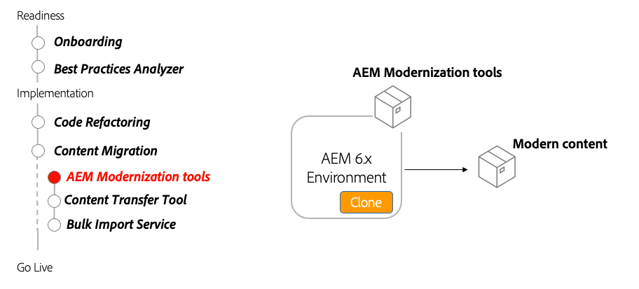

# Strumenti AEM Modernization Tools

Scopri come AEM gli strumenti di modernizzazione vengono utilizzati per aggiornare un contenuto AEM Sites esistente in modo che sia AEM compatibile con l’as a Cloud Service e in linea con le best practice.

## Convertitore all-in-one

>[!VIDEO](https://video.tv.adobe.com/v/338802?quality=12&learn=on)

## Conversione pagina

>[!VIDEO](https://video.tv.adobe.com/v/338799?quality=12&learn=on)

## Conversione dei componenti

>[!VIDEO](https://video.tv.adobe.com/v/338788?quality=12&learn=on)

## Importazione criteri

>[!VIDEO](https://video.tv.adobe.com/v/338797?quality=12&learn=on)

## Utilizzo degli strumenti di modernizzazione AEM

Gli strumenti di modernizzazione AEM convertono automaticamente le pagine AEM esistenti composte da modelli statici, componenti di base e parsys legacy, per utilizzare approcci moderni quali modelli modificabili, componenti AEM WCM core e contenitori di layout.

## Attività chiave

+ Clona la produzione AEM 6.x per eseguire gli strumenti di modernizzazione AEM contro
+ Scarica e installa la [strumenti di modernizzazione AEM più recenti](https://github.com/adobe/aem-modernize-tools/releases/latest) sul clone di produzione AEM 6.x tramite Gestione pacchetti

+ [Convertitore struttura pagina](https://opensource.adobe.com/aem-modernize-tools/pages/structure/about.html) aggiorna il contenuto della pagina esistente da un modello statico a un modello modificabile mappato utilizzando i contenitori layout
   + Definire le regole di conversione utilizzando la configurazione OSGi
   + Esegui Convertitore struttura pagina rispetto alle pagine esistenti

+ [Convertitore componente](https://opensource.adobe.com/aem-modernize-tools/pages/component/about.html) aggiorna il contenuto della pagina esistente da un modello statico a un modello modificabile mappato utilizzando i contenitori layout
   + Definire le regole di conversione tramite le definizioni dei nodi JCR/XML
   + Esegui lo strumento Convertitore componenti rispetto alle pagine esistenti

+ [Importatore di regole](https://opensource.adobe.com/aem-modernize-tools/pages/policy/about.html) crea criteri dalla configurazione di progettazione
   + Definire le regole di conversione utilizzando le definizioni dei nodi JCR/XML
   + Esegui Importazione criteri rispetto alle definizioni di progettazione esistenti
   + Applicare criteri importati a componenti e contenitori AEM

## Esercitazione pratica

Applica la tua conoscenza provando quello che hai imparato con questo esercizio pratico.

Prima di provare l&#39;esercizio pratico, assicurati di aver visto e compreso il video precedente e i seguenti materiali:

+ [Pensare diversamente a AEM as a Cloud Service](./introduction.md)
+ [Modernizzazione dell’archivio](./repository-modernization.md)
+ [Contenuto variabile e immutabile](../../developing/basics/mutable-immutable.md)
+ [AEM struttura del progetto](https://experienceleague.adobe.com/docs/experience-manager-cloud-service/implementing/developing/aem-project-content-package-structure.html?lang=it)

Inoltre, assicurati di aver completato l&#39;esercizio pratico precedente:

+ [Esercitazione pratica BPA e CAM](./bpa-and-cam.md#hands-on-exercise)

<table style="border-width:0">
    <tr>
        <td style="width:150px">
                    
        </td>
        <td style="width:100%;margin-bottom:1rem;">
            
Mani aperte con AEM modernizzazione

            

                Scopri come utilizzare AEM strumenti di modernizzazione per aggiornare un sito WKND legacy in modo che sia conforme alle best practice as a Cloud Service AEM.
            

            <a  rel="noreferrer"
                target="_blank"
                href="https://github.com/adobe/aem-cloud-engineering-video-series-exercises/tree/session2-migration#bootcamp---session-2-migration-methodology" class="spectrum-Button spectrum-Button--primary spectrum-Button--sizeM">
                Prova gli strumenti di modernizzazione AEM
            </a>
        </td>
    </tr>
</table>

## Altre risorse

+ [Download degli strumenti di modernizzazione AEM](https://github.com/adobe/aem-modernize-tools/releases/latest)
+ [Documentazione sugli strumenti di modernizzazione AEM](https://opensource.adobe.com/aem-modernize-tools/)
+ [AEM Gems - Introduzione alla suite di modernizzazione AEM](https://helpx.adobe.com/experience-manager/kt/eseminars/gems/Introducing-the-AEM-Modernization-Suite.html)

1. Distribuisci il nuovo sito wknd-legacy modernizzato sull&#39;SDK AEM locale. AEM RICHIESTA disponibile per il download qui:
   + [Portale di distribuzione di software](https://experience.adobe.com/#/downloads/content/software-distribution/en/general.html).
