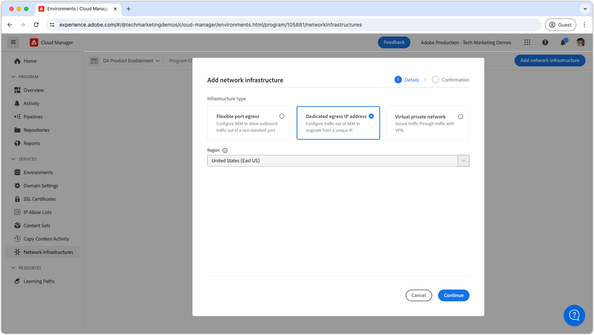

# Indirizzo IP di uscita dedicato

Scopri come impostare e utilizzare l’indirizzo IP in uscita dedicato, che consente alle connessioni in uscita da AEM di provenire da un IP dedicato.

## Cos’è l’indirizzo IP in uscita dedicato?

L’indirizzo IP in uscita dedicato consente alle richieste di AEM as a Cloud Service di utilizzare un indirizzo IP dedicato, consentendo ai servizi esterni di filtrare le richieste in ingresso in base a tale indirizzo IP. Come [porte di uscita flessibili](./flexible-port-egress.md), l&#39;IP di uscita dedicato consente di uscire su porte non standard.

Un programma Cloud Manager può avere solo un tipo di infrastruttura di rete __singolo__. Prima di eseguire i seguenti comandi, assicurati che l&#39;indirizzo IP in uscita dedicato sia il tipo di infrastruttura di rete [&#128279;](./advanced-networking.md) più appropriato per il tuo AEM as a Cloud Service.

>[!MORELIKETHIS]
>
> Per ulteriori dettagli sull&#39;indirizzo IP in uscita dedicato, leggi la [documentazione sulla configurazione di rete avanzata di AEM as a Cloud Service](https://experienceleague.adobe.com/en/docs/experience-manager-cloud-service/content/security/configuring-advanced-networking).

## Prerequisiti

Quando si imposta un indirizzo IP in uscita dedicato utilizzando le API di Cloud Manager, è necessario quanto segue:

+ API Cloud Manager con [autorizzazioni Proprietario business Cloud Manager](https://developer.adobe.com/experience-cloud/cloud-manager/guides/getting-started/permissions/)
+ Accesso a [credenziali di autenticazione API Cloud Manager](https://developer.adobe.com/experience-cloud/cloud-manager/guides/getting-started/create-api-integration/)
   + ID organizzazione (ID organizzazione IMS)
   + ID client (alias chiave API)
   + Token di accesso (token Bearer)
+ ID del programma Cloud Manager
+ ID dell’ambiente Cloud Manager

Per ulteriori dettagli [consulta come impostare, configurare e ottenere le credenziali API di Cloud Manager](https://experienceleague.adobe.com/en/docs/experience-manager-learn/cloud-service/developing/extensibility/app-builder/server-to-server-auth), per utilizzarle per effettuare una chiamata API di Cloud Manager.

Questo tutorial utilizza `curl` per creare le configurazioni API di Cloud Manager. I comandi `curl` forniti assumono una sintassi Linux/macOS. Se si utilizza il prompt dei comandi di Windows, sostituire il carattere di interruzione di riga `\` con `^`.

## Abilita indirizzo IP in uscita dedicato sul programma

Per iniziare, abilita e configura l’indirizzo IP in uscita dedicato su AEM as a Cloud Service.

>[!BEGINTABS]

>[!TAB Cloud Manager]

È possibile abilitare un indirizzo IP in uscita dedicato utilizzando Cloud Manager. I passaggi seguenti descrivono come abilitare l’indirizzo IP in uscita dedicato su AEM as a Cloud Service utilizzando Cloud Manager.

1. Accedi a [Adobe Experience Manager Cloud Manager](https://experience.adobe.com/cloud-manager/) come Proprietario business Cloud Manager.
1. Passa al programma desiderato.
1. Nel menu a sinistra, passare a __Servizi > Infrastruttura di rete__.
1. Selezionare il pulsante __Aggiungi infrastruttura di rete__.

   

1. Nella finestra di dialogo __Aggiungi infrastruttura di rete__, seleziona l&#39;opzione __Indirizzo IP in uscita dedicato__ e la __Area__ per creare l&#39;indirizzo IP in uscita dedicato.

   

1. Seleziona __Salva__ per confermare l&#39;aggiunta dell&#39;indirizzo IP in uscita dedicato.

   

1. Attendere che l&#39;infrastruttura di rete venga creata e contrassegnata come __Pronta__. Questo processo può richiedere fino a 1 ora.

   

Una volta creato l’indirizzo IP in uscita dedicato, puoi configurarlo utilizzando le API di Cloud Manager come descritto di seguito.

>[!TAB API Cloud Manager]

È possibile abilitare un indirizzo IP in uscita dedicato utilizzando le API di Cloud Manager. I passaggi seguenti descrivono come abilitare l’indirizzo IP in uscita dedicato su AEM as a Cloud Service utilizzando l’API Cloud Manager.


1. In primo luogo, determinare l&#39;area in cui è necessaria la rete avanzata utilizzando l&#39;operazione [listRegions](https://developer.adobe.com/experience-cloud/cloud-manager/reference/api/) dell&#39;API Cloud Manager. `region name` è necessario per effettuare chiamate API Cloud Manager successive. In genere, viene utilizzata l’area in cui risiede l’ambiente di produzione.

   Trova l&#39;area geografica dell&#39;ambiente AEM as a Cloud Service in [Cloud Manager](https://my.cloudmanager.adobe.com) nei [dettagli ambiente](https://experienceleague.adobe.com/en/docs/experience-manager-cloud-service/content/implementing/using-cloud-manager/manage-environments). Il nome dell&#39;area visualizzato in Cloud Manager può essere [mappato al codice dell&#39;area](https://developer.adobe.com/experience-cloud/cloud-manager/guides/api-usage/creating-programs-and-environments/#creating-aem-cloud-service-environments.it) utilizzato nell&#39;API Cloud Manager.

   __richiesta HTTP listRegions__

   ```shell
   $ curl -X GET https://cloudmanager.adobe.io/api/program/{programId}/regions \
       -H 'x-gw-ims-org-id: <ORGANIZATION_ID>' \
       -H 'x-api-key: <CLIENT_ID>' \
       -H 'Authorization: Bearer <ACCESS_TOKEN>' \
       -H 'Content-Type: application/json' 
   ```

2. Abilitare l&#39;indirizzo IP in uscita dedicato per un programma Cloud Manager utilizzando l&#39;operazione API Cloud Manager [createNetworkInfrastructure](https://developer.adobe.com/experience-cloud/cloud-manager/reference/api/). Utilizza il codice `region` appropriato ottenuto dall&#39;operazione `listRegions` dell&#39;API Cloud Manager.

   __createNetworkInfrastructure richiesta HTTP__

   ```shell
   $ curl -X POST https://cloudmanager.adobe.io/api/program/{programId}/networkInfrastructures \
       -H 'x-gw-ims-org-id: <ORGANIZATION_ID>' \
       -H 'x-api-key: <CLIENT_ID>' \
       -H 'Authorization: Bearer <ACCESS_TOKEN>' \
       -H 'Content-Type: application/json' \
       -d '{ "kind": "dedicatedEgressIp", "region": "va7" }'
   ```

   Attendere 15 minuti affinché il programma Cloud Manager esegua il provisioning dell&#39;infrastruttura di rete.

3. Verificare che il programma abbia completato la configurazione di __indirizzo IP in uscita dedicato__ tramite l&#39;operazione [getNetworkInfrastructure](https://developer.adobe.com/experience-cloud/cloud-manager/reference/api/#operation/getNetworkInfrastructure) dell&#39;API Cloud Manager, utilizzando `id` restituito dalla richiesta HTTP `createNetworkInfrastructure` nel passaggio precedente.

   __richiesta HTTP getNetworkInfrastructure__

   ```shell
   $ curl -X GET https://cloudmanager.adobe.io/api/program/{programId}/networkInfrastructure/{networkInfrastructureId} \
       -H 'x-gw-ims-org-id: <ORGANIZATION_ID>' \
       -H 'x-api-key: <CLIENT_ID>' \
       -H 'Authorization: Bearer <ACCESS_TOKEN>' \
       -H 'Content-Type: application/json'
   ```

   Verificare che la risposta HTTP contenga un __stato__ di __pronto__. Se non è ancora pronto, ricontrolla lo stato ogni pochi minuti.

Una volta creato l’indirizzo IP in uscita dedicato, puoi configurarlo utilizzando le API di Cloud Manager come descritto di seguito.

>[!ENDTABS]


## Configurare proxy di indirizzi IP in uscita dedicati per ambiente

1. Configura la configurazione dell&#39;__indirizzo IP in uscita dedicato__ in ogni ambiente AEM as a Cloud Service utilizzando l&#39;operazione [enableEnvironmentAdvancedNetworkingConfiguration](https://developer.adobe.com/experience-cloud/cloud-manager/reference/api/) dell&#39;API Cloud Manager.

   __enableEnvironmentAdvancedNetworkingConfiguration richiesta HTTP__

   ```shell
   $ curl -X PUT https://cloudmanager.adobe.io/api/program/{programId}/environment/{environmentId}/advancedNetworking \
       -H 'x-gw-ims-org-id: <ORGANIZATION_ID>' \
       -H 'x-api-key: <CLIENT_ID>' \
       -H 'Authorization: Bearer <ACCESS_TOKEN>' \
       -H 'Content-Type: application/json' \
       -d @./dedicated-egress-ip-address.json
   ```

   Definisci i parametri JSON in un `dedicated-egress-ip-address.json` e forniti per curl tramite `... -d @./dedicated-egress-ip-address.json`.

   [Scarica l&#39;esempio di indirizzo-ip-in-uscita.json](./assets/dedicated-egress-ip-address.json). Questo file è solo un esempio. Configura il file come richiesto in base ai campi facoltativi/obbligatori documentati in [enableEnvironmentAdvancedNetworkingConfiguration](https://developer.adobe.com/experience-cloud/cloud-manager/reference/api/).

   ```json
   {
       "nonProxyHosts": [
           "example.net",
           "*.example.org",
       ],
       "portForwards": [
           {
               "name": "mysql.example.com",
               "portDest": 3306,
               "portOrig": 30001
           },
           {
               "name": "smtp.sendgrid.net",
               "portDest": 465,
               "portOrig": 30002
           }
       ]
   }
   ```

   La firma HTTP della configurazione dell&#39;indirizzo IP in uscita dedicato differisce solo dalla [porta di uscita flessibile](./flexible-port-egress.md#enable-dedicated-egress-ip-address-per-environment) in quanto supporta anche la configurazione opzionale `nonProxyHosts`.

   `nonProxyHosts` dichiara un set di host per i quali la porta 80 o 443 deve essere instradata attraverso gli intervalli di indirizzi IP condivisi predefiniti anziché attraverso l&#39;IP in uscita dedicato. `nonProxyHosts` può essere utile in quanto il traffico in uscita attraverso gli IP condivisi viene ottimizzato automaticamente da Adobe.

   Per ogni mappatura `portForwards`, la rete avanzata definisce la seguente regola di inoltro:

   | Host proxy | Porta proxy |  | Host esterno | Porta esterna |
   |---------------------------------|----------|----------------|------------------|----------|
   | `AEM_PROXY_HOST` | `portForwards.portOrig` | → | `portForwards.name` | `portForwards.portDest` |

1. Per ogni ambiente, verifica che le regole di uscita siano attive utilizzando l&#39;operazione API [getEnvironmentAdvancedNetworkingConfiguration](https://developer.adobe.com/experience-cloud/cloud-manager/reference/api/) di Cloud Manager.

   __getEnvironmentAdvancedNetworkingConfiguration richiesta HTTP__

   ```shell
   $ curl -X GET https://cloudmanager.adobe.io/api/program/{programId}/environment/{environmentId}/advancedNetworking \
       -H 'x-gw-ims-org-id: <ORGANIZATION_ID>' \
       -H 'x-api-key: <CLIENT_ID>' \
       -H 'Authorization: <YOUR_TOKEN>' \
       -H 'Content-Type: application/json'
   ```

1. Le configurazioni degli indirizzi IP in uscita dedicati possono essere aggiornate utilizzando l&#39;operazione API [enableEnvironmentAdvancedNetworkingConfiguration](https://developer.adobe.com/experience-cloud/cloud-manager/reference/api/) di Cloud Manager. Ricorda che `enableEnvironmentAdvancedNetworkingConfiguration` è un&#39;operazione `PUT`, pertanto tutte le regole devono essere fornite con ogni chiamata di questa operazione.

1. Ottenere l&#39;__indirizzo IP in uscita dedicato__ utilizzando un sistema di risoluzione DNS (ad esempio [DNSChecker.org](https://dnschecker.org/)) nell&#39;host `p{programId}.external.adobeaemcloud.com` oppure eseguendo `dig` dalla riga di comando.

   ```shell
   $ dig +short p{programId}.external.adobeaemcloud.com
   ```

   Il nome host non può essere `pinged`, poiché è in uscita e _non_ e in ingresso.

   L’indirizzo IP in uscita dedicato è condiviso da tutti gli ambienti AEM as a Cloud Service del programma.

1. Ora puoi utilizzare l’indirizzo IP in uscita dedicato nel codice e nella configurazione personalizzati di AEM. Spesso, quando si utilizza un indirizzo IP in uscita dedicato, i servizi esterni a cui AEM as a Cloud Service si connette sono configurati per consentire solo il traffico da questo indirizzo IP dedicato.

## Connessione a servizi esterni tramite indirizzo IP in uscita dedicato

Con l’indirizzo IP in uscita dedicato abilitato, il codice e la configurazione di AEM possono utilizzare l’IP in uscita dedicato per effettuare chiamate a servizi esterni. Esistono due tipi di chiamate esterne che AEM tratta in modo diverso:

1. Chiamate HTTP/HTTPS a servizi esterni
   + Include le chiamate HTTP/HTTPS effettuate a servizi in esecuzione su porte diverse dalle porte standard 80 o 443.
1. chiamate non HTTP/HTTPS a servizi esterni
   + Include tutte le chiamate non HTTP, ad esempio le connessioni con i server di posta, i database SQL o i servizi eseguiti su altri protocolli non HTTP/HTTPS.

Per impostazione predefinita, le richieste HTTP/HTTPS provenienti da AEM su porte standard (80/443) sono consentite, ma non utilizzano l’indirizzo IP in uscita dedicato se non sono configurate in modo appropriato come descritto di seguito.

>[!TIP]
>
> Consulta la documentazione dedicata sugli indirizzi IP in uscita di AEM as a Cloud Service per [l&#39;intero set di regole di routing](https://experienceleague.adobe.com/en/docs/experience-manager-cloud-service/content/security/configuring-advanced-networking).


### HTTP/HTTPS

Durante la creazione di connessioni HTTP/HTTPS da AEM, quando si utilizza un indirizzo IP in uscita dedicato, le connessioni HTTP/HTTPS vengono automaticamente escluse da AEM utilizzando l’indirizzo IP in uscita dedicato. Per supportare le connessioni HTTP/HTTPS non è necessario alcun codice o configurazione aggiuntivo, ad eccezione della configurazione della rete avanzata dell’indirizzo IP in uscita dedicato.

#### Esempi di codice

<table>
<tr>
<td>
    <a  href="./examples/http-dedicated-egress-ip-vpn.md"></a>
    <div><strong><a href="./examples/http-dedicated-egress-ip-vpn.md">HTTP/HTTPS</a></strong></div>
    <p>
        Esempio di codice Java™ per stabilire una connessione HTTP/HTTPS da AEM as a Cloud Service a un servizio esterno utilizzando il protocollo HTTP/HTTPS.
    </p>
</td>   
<td></td>   
<td></td>   
</tr>
</table>

### Connessioni non HTTP/HTTPS a servizi esterni

Durante la creazione di connessioni non HTTP/HTTPS (ad es. SQL, SMTP e così via) da AEM, la connessione deve essere effettuata tramite uno speciale nome host fornito da AEM.

| Nome variabile | Utilizzare | Codice Java™ | Configurazione OSGi |
| - |  - | - | - |
| `AEM_PROXY_HOST` | Host proxy per connessioni non HTTP/HTTPS | `System.getenv("AEM_PROXY_HOST")` | `$[env:AEM_PROXY_HOST]` |


Le connessioni ai servizi esterni vengono quindi chiamate tramite `AEM_PROXY_HOST` e la porta mappata (`portForwards.portOrig`), che AEM indirizza quindi al nome host esterno mappato (`portForwards.name`) e alla porta (`portForwards.portDest`).

| Host proxy | Porta proxy |  | Host esterno | Porta esterna |
|---------------------------------|----------|----------------|------------------|----------|
| `AEM_PROXY_HOST` | `portForwards.portOrig` | → | `portForwards.name` | `portForwards.portDest` |

#### Esempi di codice

<table><tr>
   <td>
      <a  href="./examples/sql-datasourcepool.md"></a>
      <div><strong><a href="./examples/sql-datasourcepool.md">Connessione SQL tramite DataSourcePool JDBC</a></strong></div>
      <p>
            Esempio di codice Java™ di connessione a database SQL esterni tramite la configurazione del pool di origini dati JDBC di AEM.
      </p>
    </td>   
   <td>
      <a  href="./examples/sql-java-apis.md"></a>
      <div><strong><a href="./examples/sql-java-apis.md">Connessione SQL tramite API Java™</a></strong></div>
      <p>
            Esempio di codice Java™ per la connessione a database SQL esterni tramite le API SQL di Java™.
      </p>
    </td>   
   <td>
      <a  href="./examples/email-service.md"></a>
      <div><strong><a href="./examples/email-service.md">Servizio di posta elettronica</a></strong></div>
      <p>
        Esempio di configurazione OSGi con AEM per la connessione a servizi di posta elettronica esterni.
      </p>
    </td>   
</tr></table>
