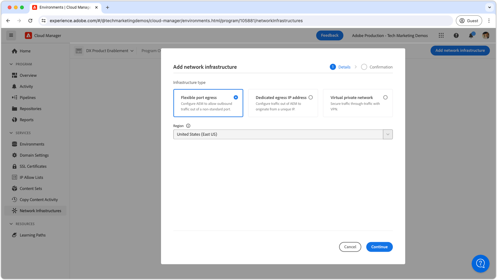

# Uscita da porta flessibile

Scopri come impostare e utilizzare l’uscita flessibile della porta per supportare connessioni esterne da AEM as a Cloud Service a servizi esterni.

## Cos’è l’uscita con porta flessibile?

L’uscita di porta flessibile consente di collegare ad AEM as a Cloud Service regole specifiche e personalizzate per l’inoltro delle porte, consentendo di effettuare connessioni dall’AEM a servizi esterni.

Un programma Cloud Manager può avere solo un tipo di infrastruttura di rete __singolo__. Prima di eseguire i seguenti comandi, assicurati che l&#39;uscita da porta flessibile sia il tipo di infrastruttura di rete ](./advanced-networking.md) più [appropriato per il tuo AEM as a Cloud Service.

>[!MORELIKETHIS]
>
> Per ulteriori informazioni sull&#39;uscita dalla porta flessibile, consulta la [documentazione sulla configurazione di rete avanzata di AEM as a Cloud Service](https://experienceleague.adobe.com/en/docs/experience-manager-cloud-service/content/security/configuring-advanced-networking).


## Prerequisiti

Quando si imposta o si configura l’uscita di porta flessibile con le API di Cloud Manager, è necessario quanto segue:

+ Progetto Adobe Developer Console con API Cloud Manager abilitata e [autorizzazioni Proprietario business Cloud Manager](https://developer.adobe.com/experience-cloud/cloud-manager/guides/getting-started/permissions/)
+ Accedi alle credenziali di autenticazione dell&#39;API Cloud Manager [](https://developer.adobe.com/experience-cloud/cloud-manager/guides/getting-started/create-api-integration/)
   + ID organizzazione (ID organizzazione IMS)
   + ID client (alias chiave API)
   + Token di accesso (token Bearer)
+ ID del programma Cloud Manager
+ ID dell’ambiente Cloud Manager

Per ulteriori dettagli [consulta come impostare, configurare e ottenere le credenziali API di Cloud Manager](https://experienceleague.adobe.com/en/docs/experience-manager-learn/cloud-service/developing/extensibility/app-builder/server-to-server-auth), per utilizzarle per effettuare una chiamata API di Cloud Manager.

Questo tutorial utilizza `curl` per creare le configurazioni API di Cloud Manager. I comandi `curl` forniti assumono una sintassi Linux/macOS. Se si utilizza il prompt dei comandi di Windows, sostituire il carattere di interruzione di riga `\` con `^`.


## Abilita uscita porta flessibile per programma

Per iniziare, abilita l’uscita della porta flessibile su AEM as a Cloud Service.

>[!BEGINTABS]

>[!TAB Cloud Manager]

L’uscita dalla porta flessibile può essere abilitata utilizzando Cloud Manager. I passaggi seguenti descrivono come abilitare l’uscita con porta flessibile su AEM as a Cloud Service utilizzando Cloud Manager.

1. Accedi a [Adobe Experience Manager Cloud Manager](https://experience.adobe.com/cloud-manager/) come Proprietario business Cloud Manager.
1. Passa al programma desiderato.
1. Nel menu a sinistra, passare a __Servizi > Infrastruttura di rete__.
1. Selezionare il pulsante __Aggiungi infrastruttura di rete__.

   

1. Nella finestra di dialogo __Aggiungi infrastruttura di rete__, seleziona l&#39;opzione __Uscita porta flessibile__ e la __Area__ per creare l&#39;indirizzo IP in uscita dedicato.

   

1. Seleziona __Salva__ per confermare l&#39;aggiunta dell&#39;uscita della porta flessibile.

   

1. Attendere che l&#39;infrastruttura di rete venga creata e contrassegnata come __Pronta__. Questo processo può richiedere fino a 1 ora.

   

Con l’uscita della porta flessibile creata, ora puoi configurare le regole di inoltro della porta utilizzando le API di Cloud Manager come descritto di seguito.

>[!TAB API Cloud Manager]

L’uscita dalla porta flessibile può essere abilitata utilizzando le API di Cloud Manager. I passaggi seguenti descrivono come abilitare l’uscita con porta flessibile su AEM as a Cloud Service utilizzando l’API Cloud Manager.

1. Innanzitutto, determina l&#39;area in cui è impostata la rete avanzata utilizzando l&#39;operazione [listRegions](https://developer.adobe.com/experience-cloud/cloud-manager/reference/api/) dell&#39;API Cloud Manager. `region name` è necessario per effettuare chiamate API Cloud Manager successive. In genere, viene utilizzata l’area in cui risiede l’ambiente di produzione.

   Trova l&#39;area geografica dell&#39;ambiente AEM as a Cloud Service in [Cloud Manager](https://my.cloudmanager.adobe.com) nei [dettagli ambiente](https://experienceleague.adobe.com/en/docs/experience-manager-cloud-service/content/implementing/using-cloud-manager/manage-environments). Il nome dell&#39;area visualizzato in Cloud Manager può essere [mappato al codice dell&#39;area](https://developer.adobe.com/experience-cloud/cloud-manager/guides/api-usage/creating-programs-and-environments/#creating-aem-cloud-service-environments.it) utilizzato nell&#39;API Cloud Manager.

   __richiesta HTTP listRegions__

   ```shell
   $ curl -X GET https://cloudmanager.adobe.io/api/program/{programId}/regions \
       -H 'x-gw-ims-org-id: <ORGANIZATION_ID>' \
       -H 'x-api-key: <CLIENT_ID>' \
       -H 'Authorization: Bearer <ACCESS_TOKEN>' \
       -H 'Content-Type: application/json' 
   ```

2. Abilita l&#39;uscita con porta flessibile per un programma Cloud Manager utilizzando l&#39;operazione [createNetworkInfrastructure](https://developer.adobe.com/experience-cloud/cloud-manager/reference/api/) dell&#39;API Cloud Manager. Utilizza il codice `region` appropriato ottenuto dall&#39;operazione `listRegions` dell&#39;API Cloud Manager.

   __createNetworkInfrastructure richiesta HTTP__

   ```shell
   $ curl -X POST https://cloudmanager.adobe.io/api/program/{programId}/networkInfrastructures \
       -H 'x-gw-ims-org-id: <ORGANIZATION_ID>' \
       -H 'x-api-key: <CLIENT_ID>' \ 
       -H 'Authorization: Bearer <ACCESS_TOKEN>' \
       -H 'Content-Type: application/json' \
       -d '{ "kind": "flexiblePortEgress", "region": "va7" }'
   ```

   Attendere 15 minuti affinché il programma Cloud Manager esegua il provisioning dell&#39;infrastruttura di rete.

3. Verificare che l&#39;ambiente abbia completato la configurazione di __uscita porta flessibile__ tramite l&#39;operazione [getNetworkInfrastructure](https://developer.adobe.com/experience-cloud/cloud-manager/reference/api/#operation/getNetworkInfrastructure) dell&#39;API Cloud Manager, utilizzando `id` restituito dalla richiesta HTTP `createNetworkInfrastructure` nel passaggio precedente.

   __richiesta HTTP getNetworkInfrastructure__

   ```shell
   $ curl -X GET https://cloudmanager.adobe.io/api/program/{programId}/networkInfrastructure/{networkInfrastructureId} \
       -H 'x-gw-ims-org-id: <ORGANIZATION_ID>' \
       -H 'x-api-key: <CLIENT_ID>' \ 
       -H 'Authorization: Bearer <ACCESS_TOKEN>' \
       -H 'Content-Type: application/json'
   ```

   Verificare che la risposta HTTP contenga un __stato__ di __pronto__. Se non è ancora pronto, ricontrolla lo stato ogni pochi minuti.

Con l’uscita della porta flessibile creata, ora puoi configurare le regole di inoltro della porta utilizzando le API di Cloud Manager come descritto di seguito.

>[!ENDTABS]

## Configurare proxy di uscita di porta flessibili per ambiente

1. Abilita e configura la configurazione dell&#39;__uscita porta flessibile__ in ogni ambiente AEM as a Cloud Service utilizzando l&#39;operazione [enableEnvironmentAdvancedNetworkingConfiguration](https://developer.adobe.com/experience-cloud/cloud-manager/reference/api/) dell&#39;API Cloud Manager.

   __enableEnvironmentAdvancedNetworkingConfiguration richiesta HTTP__

   ```shell
   $ curl -X PUT https://cloudmanager.adobe.io/api/program/{programId}/environment/{environmentId}/advancedNetworking \
       -H 'x-gw-ims-org-id: <ORGANIZATION_ID>' \
       -H 'x-api-key: <CLIENT_ID>' \ 
       -H 'Authorization: Bearer <ACCESS_TOKEN>' \
       -H 'Content-Type: application/json' \
       -d @./flexible-port-egress.json
   ```

   Definisci i parametri JSON in un `flexible-port-egress.json` e forniti per curl tramite `... -d @./flexible-port-egress.json`.

   [Scarica l&#39;esempio di flexport-egress.json](./assets/flexible-port-egress.json). Questo file è solo un esempio. Configura il file come richiesto in base ai campi facoltativi/obbligatori documentati in [enableEnvironmentAdvancedNetworkingConfiguration](https://developer.adobe.com/experience-cloud/cloud-manager/reference/api/).

   ```json
   {
       "portForwards": [
           {
               "name": "mysql.example.com",
               "portDest": 3306,
               "portOrig": 30001
           },
           {
               "name": "smtp.sendgrid.com",
               "portDest": 465,
               "portOrig": 30002
           }
       ]
   }
   ```

   Per ogni mappatura `portForwards`, la rete avanzata definisce la seguente regola di inoltro:

   | Host proxy | Porta proxy |  | Host esterno | Porta esterna |
   |---------------------------------|----------|----------------|------------------|----------|
   | `AEM_PROXY_HOST` | `portForwards.portOrig` | → | `portForwards.name` | `portForwards.portDest` |

   Se la distribuzione AEM __only__ richiede connessioni HTTP/HTTPS (porta 80/443) al servizio esterno, lasciare vuoto l&#39;array `portForwards`, in quanto queste regole sono necessarie solo per le richieste non HTTP/HTTPS.

1. Per ogni ambiente, verifica che le regole di uscita siano attive utilizzando l&#39;operazione API [getEnvironmentAdvancedNetworkingConfiguration](https://developer.adobe.com/experience-cloud/cloud-manager/reference/api/) di Cloud Manager.

   __getEnvironmentAdvancedNetworkingConfiguration richiesta HTTP__

   ```shell
   $ curl -X GET https://cloudmanager.adobe.io/api/program/{programId}/environment/{environmentId}/advancedNetworking \
       -H 'x-gw-ims-org-id: <ORGANIZATION_ID>' \
       -H 'Authorization: Bearer <ACCESS_TOKEN>' \
       -H 'x-api-key: <CLIENT_ID>' \ 
       -H 'Content-Type: application/json'
   ```

1. Le configurazioni di uscita della porta flessibile possono essere aggiornate utilizzando l&#39;operazione API [enableEnvironmentAdvancedNetworkingConfiguration](https://developer.adobe.com/experience-cloud/cloud-manager/reference/api/) di Cloud Manager. Ricorda che `enableEnvironmentAdvancedNetworkingConfiguration` è un&#39;operazione `PUT`, pertanto tutte le regole devono essere fornite con ogni chiamata di questa operazione.

1. Ora puoi utilizzare la configurazione dell’uscita della porta flessibile nel codice AEM e nella configurazione personalizzati.


## Connessione a servizi esterni tramite uscita porta flessibile

Con il proxy di uscita con porta flessibile abilitato, il codice e la configurazione AEM possono utilizzarli per effettuare chiamate a servizi esterni. Esistono due tipi di chiamate esterne che l’AEM tratta in modo diverso:

1. Chiamate HTTP/HTTPS a servizi esterni su porte non standard
   + Include le chiamate HTTP/HTTPS effettuate a servizi in esecuzione su porte diverse dalle porte standard 80 o 443.
1. chiamate non HTTP/HTTPS a servizi esterni
   + Include tutte le chiamate non HTTP, ad esempio le connessioni con i server di posta, i database SQL o i servizi eseguiti su altri protocolli non HTTP/HTTPS.

Le richieste HTTP/HTTPS da AEM sulle porte standard (80/443) sono consentite per impostazione predefinita e non richiedono configurazioni o considerazioni aggiuntive.


### HTTP/HTTPS su porte non standard

Quando si creano connessioni HTTP/HTTPS a porte non standard (non-80/443) dall’AEM, le connessioni devono essere effettuate tramite host e porte speciali, forniti tramite segnaposto.

L&#39;AEM fornisce due set di variabili speciali di sistema Java™ mappate ai proxy HTTP/HTTPS dell&#39;AEM.

| Nome variabile | Utilizzare | Codice Java™ | Configurazione OSGi |
| - |  - | - | - |
| `AEM_PROXY_HOST` | Host proxy per entrambe le connessioni HTTP/HTTPS | `System.getenv().getOrDefault("AEM_PROXY_HOST", "proxy.tunnel")` | `$[env:AEM_PROXY_HOST;default=proxy.tunnel]` |
| `AEM_HTTP_PROXY_PORT` | Porta proxy per connessioni HTTPS (fallback impostato su `3128`) | `System.getenv().getOrDefault("AEM_HTTP_PROXY_PORT", 3128)` | `$[env:AEM_HTTP_PROXY_PORT;default=3128]` |
| `AEM_HTTPS_PROXY_PORT` | Porta proxy per connessioni HTTPS (fallback impostato su `3128`) | `System.getenv().getOrDefault("AEM_HTTPS_PROXY_PORT", 3128)` | `$[env:AEM_HTTPS_PROXY_PORT;default=3128]` |

Quando si eseguono chiamate HTTP/HTTPS a servizi esterni su porte non standard, non è necessario definire `portForwards` corrispondenti utilizzando l&#39;operazione API `enableEnvironmentAdvancedNetworkingConfiguration` di Cloud Manager, in quanto le &quot;regole&quot; di inoltro delle porte sono definite &quot;nel codice&quot;.

>[!TIP]
>
> Consulta la documentazione di AEM as a Cloud Service sull&#39;uscita della porta flessibile per [l&#39;intero set di regole di routing](https://experienceleague.adobe.com/en/docs/experience-manager-cloud-service/content/security/configuring-advanced-networking).

#### Esempi di codice

<table>
<tr>
<td>
    <a  href="./examples/http-on-non-standard-ports-flexible-port-egress.md"></a>
    <div><strong><a href="./examples/http-on-non-standard-ports-flexible-port-egress.md">HTTP/HTTPS su porte non standard</a></strong></div>
    <p>
        Esempio di codice Java™ per stabilire una connessione HTTP/HTTPS da AEM as a Cloud Service a un servizio esterno su porte HTTP/HTTPS non standard.
    </p>
</td>   
<td></td>   
<td></td>   
</tr>
</table>

### Connessioni non HTTP/HTTPS a servizi esterni

Durante la creazione di connessioni non HTTP/HTTPS (ad es. SQL, SMTP e così via) dall’AEM, la connessione deve essere effettuata attraverso uno speciale nome host fornito dall’AEM.

| Nome variabile | Utilizzare | Codice Java™ | Configurazione OSGi |
| - |  - | - | - |
| `AEM_PROXY_HOST` | Host proxy per connessioni non HTTP/HTTPS | `System.getenv().getOrDefault("AEM_PROXY_HOST", "proxy.tunnel")` | `$[env:AEM_PROXY_HOST;default=proxy.tunnel]` |


Le connessioni ai servizi esterni vengono quindi chiamate tramite `AEM_PROXY_HOST` e la porta mappata (`portForwards.portOrig`), che AEM indirizza quindi al nome host esterno mappato (`portForwards.name`) e alla porta (`portForwards.portDest`).

| Host proxy | Porta proxy |  | Host esterno | Porta esterna |
|---------------------------------|----------|----------------|------------------|----------|
| `AEM_PROXY_HOST` | `portForwards.portOrig` | → | `portForwards.name` | `portForwards.portDest` |

#### Esempi di codice

<table><tr>
   <td>
      <a  href="./examples/sql-datasourcepool.md"></a>
      <div><strong><a href="./examples/sql-datasourcepool.md">Connessione SQL tramite DataSourcePool JDBC</a></strong></div>
      <p>
            Esempio di codice Java™ connessione a database SQL esterni tramite la configurazione del pool di origini dati JDBC dell'AEM.
      </p>
    </td>   
   <td>
      <a  href="./examples/sql-java-apis.md"></a>
      <div><strong><a href="./examples/sql-java-apis.md">Connessione SQL tramite API Java™</a></strong></div>
      <p>
            Esempio di codice Java™ per la connessione a database SQL esterni tramite le API SQL di Java™.
      </p>
    </td>   
   <td>
      <a  href="./examples/email-service.md"></a>
      <div><strong><a href="./examples/email-service.md">Servizio di posta elettronica</a></strong></div>
      <p>
        Esempio di configurazione OSGi con AEM per la connessione a servizi di posta elettronica esterni.
      </p>
    </td>   
</tr></table>
