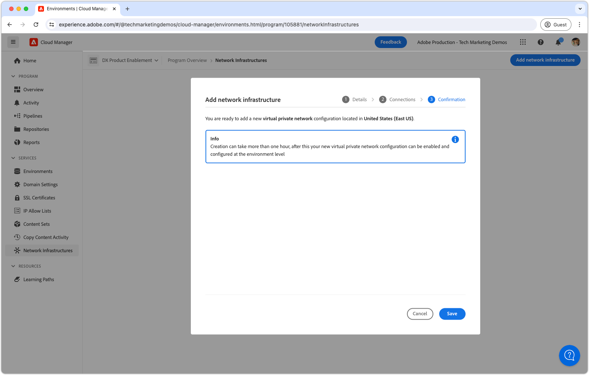

# Virtual Private Network (VPN)

Scopri come collegare AEM as a Cloud Service alla tua VPN per creare canali di comunicazione sicuri tra AEM e i servizi interni.

>[!IMPORTANT]
>
>Puoi configurare le VPN e l’inoltro delle porte tramite l’interfaccia utente di Cloud Manager o utilizzando le chiamate API. Questa esercitazione si concentra sul metodo API.
>
>Se preferisci utilizzare l&#39;interfaccia utente, consulta [Configurare reti avanzate per AEM as a Cloud Service](https://experienceleague.adobe.com/en/docs/experience-manager-cloud-service/content/security/configuring-advanced-networking).

## Che cos&#39;è una rete privata virtuale?

Virtual Private Network (VPN) consente a un cliente AEM as a Cloud Service di connettere **gli ambienti AEM** all&#39;interno di un programma Cloud Manager a una VPN esistente [supportata](https://experienceleague.adobe.com/en/docs/experience-manager-cloud-service/content/security/configuring-advanced-networking). La VPN consente connessioni sicure e controllate tra AEM as a Cloud Service e i servizi all’interno della rete del cliente.

Un programma Cloud Manager può avere solo un tipo di infrastruttura di rete __singolo__. Prima di eseguire i seguenti comandi, verificare che Virtual Private Network sia il tipo di infrastruttura di rete [ più ](https://experienceleague.adobe.com/en/docs/experience-manager-cloud-service/content/security/configuring-advanced-networking)appropriato per il proprio AEM as a Cloud Service.

>[!NOTE]
>
>La connessione dell’ambiente di build da Cloud Manager a una VPN non è supportata. Se devi accedere ad artefatti binari da un archivio privato, devi impostare un archivio protetto da password e protetto da password con un URL disponibile su Internet [come descritto qui](https://experienceleague.adobe.com/en/docs/experience-manager-cloud-service/content/implementing/using-cloud-manager/create-application-project/setting-up-project).

>[!MORELIKETHIS]
>
> Per ulteriori informazioni su Virtual Private Network, consulta la [documentazione sulla configurazione di rete avanzata](https://experienceleague.adobe.com/en/docs/experience-manager-cloud-service/content/security/configuring-advanced-networking) di AEM as a Cloud Service.

## Prerequisiti

Quando si configura una rete privata virtuale utilizzando le API di Cloud Manager, è necessario quanto segue:

+ Account Adobe con [autorizzazioni Proprietario business Cloud Manager](https://developer.adobe.com/experience-cloud/cloud-manager/guides/getting-started/permissions/)
+ Accedi alle credenziali di autenticazione dell&#39;API Cloud Manager [](https://developer.adobe.com/experience-cloud/cloud-manager/guides/getting-started/create-api-integration/)
   + ID organizzazione (ID organizzazione IMS)
   + ID client (alias chiave API)
   + Token di accesso (token Bearer)
+ ID del programma Cloud Manager
+ ID dell’ambiente Cloud Manager
+ Una rete privata virtuale **basata su route**, con accesso a tutti i parametri di connessione necessari.

Per ulteriori dettagli [consulta come impostare, configurare e ottenere le credenziali API di Cloud Manager](https://experienceleague.adobe.com/en/docs/experience-manager-learn/cloud-service/developing/extensibility/app-builder/server-to-server-auth), per utilizzarle per effettuare una chiamata API di Cloud Manager.

>[!IMPORTANT]
>
>Questo tutorial utilizza `curl` per creare le configurazioni dell&#39;API Cloud Manager:*se preferisci un approccio programmatico*. I comandi `curl` forniti assumono una sintassi Linux® o macOS. Se si utilizza il prompt dei comandi di Windows, sostituire il carattere di interruzione di riga `\` con `^`.
>
>In alternativa, puoi completare la stessa attività tramite l’interfaccia utente di Cloud Manager. *Se preferisci l&#39;approccio dell&#39;interfaccia utente*, consulta [Configurare reti avanzate per AEM as a Cloud Service](https://experienceleague.adobe.com/en/docs/experience-manager-cloud-service/content/security/configuring-advanced-networking).

## Abilita rete privata virtuale per programma

Per iniziare, abilita la rete privata virtuale su AEM as a Cloud Service.


>[!BEGINTABS]

>[!TAB Cloud Manager]

L’uscita dalla porta flessibile può essere abilitata utilizzando Cloud Manager. I passaggi seguenti descrivono come abilitare l’uscita con porta flessibile su AEM as a Cloud Service utilizzando Cloud Manager.

1. Accedi a [Adobe Experience Manager Cloud Manager](https://experience.adobe.com/cloud-manager/) come Proprietario business Cloud Manager.
1. Passa al programma desiderato.
1. Nel menu a sinistra, passare a __Servizi > Infrastruttura di rete__.
1. Selezionare il pulsante __Aggiungi infrastruttura di rete__.

   

1. Nella finestra di dialogo __Aggiungi infrastruttura di rete__ selezionare l&#39;opzione __Rete privata virtuale__. Compila i campi e seleziona __Continua__. Rivolgiti all’amministratore di rete della tua organizzazione per ottenere i valori corretti.

   

1. Crea almeno una connessione VPN. Assegna alla connessione un nome significativo e seleziona il pulsante __Aggiungi connessione__.

   

1. Configura la connessione VPN. Rivolgiti all’amministratore di rete della tua organizzazione per ottenere i valori corretti. Seleziona __Salva__ per confermare l&#39;aggiunta della connessione.

   

1. Se sono necessarie più connessioni VPN, il numero di connessioni necessarie sarà maggiore. Dopo aver aggiunto tutte le connessioni VPN, selezionare __Continua__.

   

1. Seleziona __Salva__ per confermare l&#39;aggiunta della VPN e di tutte le connessioni configurate.

   

1. Attendere che l&#39;infrastruttura di rete venga creata e contrassegnata come __Pronta__. Questo processo può richiedere fino a 1 ora.

   

Una volta creata la VPN, ora puoi configurarla utilizzando le API di Cloud Manager come descritto di seguito.

>[!TAB API Cloud Manager]

È possibile abilitare la rete privata virtuale utilizzando le API di Cloud Manager. I passaggi seguenti descrivono come abilitare la VPN su AEM as a Cloud Service utilizzando l’API Cloud Manager.

1. In primo luogo, determinare l&#39;area in cui è necessaria la rete avanzata utilizzando l&#39;operazione [listRegions](https://developer.adobe.com/experience-cloud/cloud-manager/reference/api/) dell&#39;API Cloud Manager. `region name` è necessario per effettuare chiamate API Cloud Manager successive. In genere, viene utilizzata l’area in cui risiede l’ambiente di produzione.

   Trova l&#39;area geografica dell&#39;ambiente AEM as a Cloud Service in [Cloud Manager](https://my.cloudmanager.adobe.com) nei [dettagli ambiente](https://experienceleague.adobe.com/en/docs/experience-manager-cloud-service/content/implementing/using-cloud-manager/manage-environments). Il nome dell&#39;area visualizzato in Cloud Manager può essere [mappato al codice dell&#39;area](https://developer.adobe.com/experience-cloud/cloud-manager/guides/api-usage/creating-programs-and-environments/#creating-aem-cloud-service-environments.it) utilizzato nell&#39;API Cloud Manager.

   __richiesta HTTP listRegions__

   ```shell
   $ curl -X GET https://cloudmanager.adobe.io/api/program/{programId}/regions \
       -H 'x-gw-ims-org-id: <ORGANIZATION_ID>' \
       -H 'x-api-key: <CLIENT_ID>' \
       -H 'Authorization: Bearer <ACCESS_TOKEN>' \
       -H 'Content-Type: application/json'
   ```

1. Abilitare Virtual Private Network per un programma Cloud Manager utilizzando l&#39;operazione [createNetworkInfrastructure](https://developer.adobe.com/experience-cloud/cloud-manager/reference/api/) delle API Cloud Manager. Utilizza il codice `region` appropriato ottenuto dall&#39;operazione `listRegions` dell&#39;API Cloud Manager.

   __createNetworkInfrastructure richiesta HTTP__

   ```shell
   $ curl -X POST https://cloudmanager.adobe.io/api/program/{programId}/networkInfrastructures \
       -H 'x-gw-ims-org-id: <ORGANIZATION_ID>' \
       -H 'x-api-key: <CLIENT_ID>' \
       -H 'Authorization: Bearer <ACCESS_TOKEN>' \
       -H 'Content-Type: application/json'
       -d @./vpn-create.json
   ```

   Definisci i parametri JSON in un `vpn-create.json` e forniti a curl tramite `... -d @./vpn-create.json`.

   [Scarica l&#39;esempio vpn-create.json](./assets/vpn-create.json).  Questo file è solo un esempio. Configura il file come richiesto in base ai campi facoltativi/obbligatori documentati in [enableEnvironmentAdvancedNetworkingConfiguration](https://developer.adobe.com/experience-cloud/cloud-manager/reference/api/).

   ```json
   {
       "kind": "vpn",
       "region": "va7",
       "addressSpace": [
           "10.104.182.64/26"
       ],
       "dns": {
           "resolvers": [
               "10.151.201.22",
               "10.151.202.22",
               "10.154.155.22"
           ],
           "domains": [
               "wknd.site",
               "wknd.com"
           ]
       },
       "connections": [{
           "name": "connection-1",
           "gateway": {
               "address": "195.231.212.78",
               "addressSpace": [
                   "10.151.0.0/16",
                   "10.152.0.0/16",
                   "10.153.0.0/16",
                   "10.154.0.0/16",
                   "10.142.0.0/16",
                   "10.143.0.0/16",
                   "10.124.128.0/17"
               ]
           },
           "sharedKey": "<secret_shared_key>",
           "ipsecPolicy": {
               "dhGroup": "ECP256",
               "ikeEncryption": "AES256",
               "ikeIntegrity": "SHA256",
               "ipsecEncryption": "AES256",
               "ipsecIntegrity": "SHA256",
               "pfsGroup": "ECP256",
               "saDatasize": 102400000,
               "saLifetime": 3600
           }
       }]
   }
   ```

   Attendere 45-60 minuti affinché il programma Cloud Manager esegua il provisioning dell&#39;infrastruttura di rete.

1. Verificare che l&#39;ambiente abbia completato la configurazione di __Virtual Private Network__ tramite l&#39;operazione [getNetworkInfrastructure](https://developer.adobe.com/experience-cloud/cloud-manager/reference/api/#operation/getNetworkInfrastructure) dell&#39;API Cloud Manager, utilizzando `id` restituito dalla richiesta HTTP `createNetworkInfrastructure` nel passaggio precedente.

   __richiesta HTTP getNetworkInfrastructure__

   ```shell
   $ curl -X GET https://cloudmanager.adobe.io/api/program/{programId}/networkInfrastructure/{networkInfrastructureId} \
       -H 'x-gw-ims-org-id: <ORGANIZATION_ID>' \
       -H 'x-api-key: <CLIENT_ID>' \
       -H 'Authorization: <YOUR_BEARER_TOKEN>' \
       -H 'Content-Type: application/json'
   ```

   Verificare che la risposta HTTP contenga un __stato__ di __pronto__. Se non è ancora pronto, ricontrolla lo stato ogni pochi minuti.


Una volta creata la VPN, ora puoi configurarla utilizzando le API di Cloud Manager come descritto di seguito.

>[!ENDTABS]

## Configurare proxy di rete privata virtuale per ambiente

1. Abilita e configura la configurazione della __rete privata virtuale__ in ogni ambiente AEM as a Cloud Service utilizzando l&#39;operazione [enableEnvironmentAdvancedNetworkingConfiguration](https://developer.adobe.com/experience-cloud/cloud-manager/reference/api/) dell&#39;API Cloud Manager.

   __enableEnvironmentAdvancedNetworkingConfiguration richiesta HTTP__

   ```shell
   $ curl -X PUT https://cloudmanager.adobe.io/api/program/{programId}/environment/{environmentId}/advancedNetworking \
       -H 'x-gw-ims-org-id: <ORGANIZATION_ID>' \
       -H 'x-api-key: <CLIENT_ID>' \
       -H 'Authorization: Bearer <ACCESS_TOKEN>' \
       -H 'Content-Type: application/json' \
       -d @./vpn-configure.json
   ```

   Definisci i parametri JSON in un `vpn-configure.json` e forniti a curl tramite `... -d @./vpn-configure.json`.

[Scarica l’esempio vpn-configure.json](./assets/vpn-configure.json)

   ```json
   {
       "nonProxyHosts": [
           "example.net",
           "*.example.org"
       ],
       "portForwards": [
           {
               "name": "mysql.example.com",
               "portDest": 3306,
               "portOrig": 30001
           },
           {
               "name": "smtp.sendgrid.com",
               "portDest": 465,
               "portOrig": 30002
           }
       ]
   }
   ```

   `nonProxyHosts` dichiara un set di host per i quali la porta 80 o 443 deve essere instradata attraverso gli intervalli di indirizzi IP condivisi predefiniti anziché attraverso l&#39;IP in uscita dedicato. `nonProxyHosts` può essere utile come traffico in uscita attraverso gli IP condivisi che Adobe ottimizza automaticamente.

   Per ogni mappatura `portForwards`, la rete avanzata definisce la seguente regola di inoltro:

   | Host proxy | Porta proxy |  | Host esterno | Porta esterna |
   |---------------------------------|----------|----------------|------------------|----------|
   | `AEM_PROXY_HOST` | `portForwards.portOrig` | → | `portForwards.name` | `portForwards.portDest` |

   Se la distribuzione AEM __only__ richiede connessioni HTTP/HTTPS al servizio esterno, lasciare vuoto l&#39;array `portForwards`, in quanto queste regole sono necessarie solo per le richieste non HTTP/HTTPS.


2. Per ogni ambiente, verificare che le regole di routing VPN siano attive utilizzando l&#39;operazione [getEnvironmentAdvancedNetworkingConfiguration](https://developer.adobe.com/experience-cloud/cloud-manager/reference/api/) dell&#39;API Cloud Manager.

   __getEnvironmentAdvancedNetworkingConfiguration richiesta HTTP__

   ```shell
   $ curl -X GET https://cloudmanager.adobe.io/api/program/{programId}/environment/{environmentId}/advancedNetworking \
       -H 'x-gw-ims-org-id: <ORGANIZATION_ID>' \
       -H 'x-api-key: <CLIENT_ID>' \
       -H 'Authorization: Bearer <ACCESS_TOKEN>' \
       -H 'Content-Type: application/json'
   ```

3. È possibile aggiornare le configurazioni proxy di rete privata virtuale utilizzando l&#39;operazione [enableEnvironmentAdvancedNetworkingConfiguration](https://developer.adobe.com/experience-cloud/cloud-manager/reference/api/) dell&#39;API Cloud Manager. Ricorda che `enableEnvironmentAdvancedNetworkingConfiguration` è un&#39;operazione `PUT`, pertanto tutte le regole devono essere fornite con ogni chiamata di questa operazione.

4. Ora puoi utilizzare la configurazione di uscita Virtual Private Network nel codice e nella configurazione personalizzati di AEM.

## Connessione a servizi esterni tramite la rete privata virtuale

Con la rete privata virtuale abilitata, il codice e la configurazione di AEM possono utilizzarli per effettuare chiamate a servizi esterni tramite la VPN. Esistono due tipi di chiamate esterne che AEM tratta in modo diverso:

1. Chiamate HTTP/HTTPS a servizi esterni
   + Questi servizi esterni includono le chiamate HTTP/HTTPS effettuate a servizi in esecuzione su porte diverse dalle porte standard 80 o 443.
1. Chiamate non HTTP/HTTPS a servizi esterni
   + Questi servizi esterni includono qualsiasi chiamata non HTTP, ad esempio connessioni a server di posta, database SQL o servizi che utilizzano protocolli diversi da HTTP/HTTPS.

Le richieste HTTP/HTTPS provenienti da AEM su porte standard (80/443) sono consentite per impostazione predefinita, ma non utilizzano la connessione VPN se non configurate in modo appropriato come descritto di seguito.

### HTTP/HTTPS

Durante la creazione di connessioni HTTP/HTTPS da AEM, quando si utilizza la VPN, le connessioni HTTP/HTTPS vengono automaticamente escluse da AEM. Per supportare le connessioni HTTP/HTTPS non è necessario alcun codice o configurazione aggiuntivi.

>[!TIP]
>
> Consulta la documentazione di AEM as a Cloud Service Virtual Private Network per [l&#39;insieme completo di regole di routing](https://experienceleague.adobe.com/en/docs/experience-manager-cloud-service/content/security/configuring-advanced-networking).

#### Esempi di codice

<table>
<tr>
<td>
    <a  href="./examples/http-dedicated-egress-ip-vpn.md"></a>
    <div><strong><a href="./examples/http-dedicated-egress-ip-vpn.md">HTTP/HTTPS</a></strong></div>
    <p>
        Esempio di codice Java™ per stabilire una connessione HTTP/HTTPS da AEM as a Cloud Service a un servizio esterno utilizzando il protocollo HTTP/HTTPS.
    </p>
</td>
<td></td>
<td></td>
</tr>
</table>

### Esempi di codice di connessioni non HTTP/HTTPS

Durante la creazione di connessioni non HTTP/HTTPS (ad es. SQL, SMTP e così via) da AEM, la connessione deve essere effettuata tramite uno speciale nome host fornito da AEM.

| Nome variabile | Utilizzare | Codice Java™ | Configurazione OSGi |
| - |  - | - | - |
| `AEM_PROXY_HOST` | Host proxy per connessioni non HTTP/HTTPS | `System.getenv("AEM_PROXY_HOST")` | `$[env:AEM_PROXY_HOST]` |


Le connessioni ai servizi esterni vengono quindi chiamate tramite `AEM_PROXY_HOST` e la porta mappata (`portForwards.portOrig`), che AEM indirizza quindi al nome host esterno mappato (`portForwards.name`) e alla porta (`portForwards.portDest`).

| Host proxy | Porta proxy |  | Host esterno | Porta esterna |
|---------------------------------|----------|----------------|------------------|----------|
| `AEM_PROXY_HOST` | `portForwards.portOrig` | → | `portForwards.name` | `portForwards.portDest` |


#### Esempi di codice

<table><tr>
   <td>
      <a  href="./examples/sql-datasourcepool.md"></a>
      <div><strong><a href="./examples/sql-datasourcepool.md">Connessione SQL tramite DataSourcePool JDBC</a></strong></div>
      <p>
            Esempio di codice Java™ di connessione a database SQL esterni tramite la configurazione del pool di origini dati JDBC di AEM.
      </p>
    </td>
   <td>
      <a  href="./examples/sql-java-apis.md"></a>
      <div><strong><a href="./examples/sql-java-apis.md">Connessione SQL tramite API Java™</a></strong></div>
      <p>
            Esempio di codice Java™ per la connessione a database SQL esterni tramite le API SQL di Java™.
      </p>
    </td>
   <td>
      <a  href="./examples/email-service.md"></a>
      <div><strong><a href="./examples/email-service.md">Servizio di posta elettronica</a></strong></div>
      <p>
        Esempio di configurazione OSGi con AEM per la connessione a servizi di posta elettronica esterni.
      </p>
    </td>
</tr></table>

### Limitare l’accesso ad AEM as a Cloud Service tramite VPN

La configurazione di Virtual Private Network limita l’accesso agli ambienti AEM as a Cloud Service a una VPN.

#### Esempi di configurazione

<table><tr>
   <td>
      <a href="https://experienceleague.adobe.com/en/docs/experience-manager-cloud-service/content/implementing/using-cloud-manager/ip-allow-lists/apply-allow-list"></a>
      <div><strong><a href="https://experienceleague.adobe.com/en/docs/experience-manager-cloud-service/content/implementing/using-cloud-manager/ip-allow-lists/apply-allow-list">Applicazione di un inserisco nell'elenco Consentiti di</a></strong></div>
      <p>
            Inserire nell'elenco Consentiti Configura un IP in modo che solo il traffico VPN possa accedere ad AEM.
      </p>
    </td>
    </td>
   <td></td>
</tr></table>
