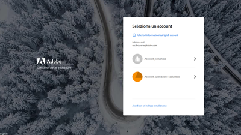

# Video ed esercitazioni as a Cloud Service sull’AEM {#overview}

{{edge-delivery-services}}

Adobe Experience Manager (AEM) è ora disponibile in versione as a Cloud Service. AEM as a Cloud Service introduce la nuova generazione della linea di prodotti di Experience Manager, sulla base degli investimenti e delle innovazioni precedenti, preservando ed estendendo tutti i casi d’uso e le funzionalità.

>[!VIDEO](https://video.tv.adobe.com/v/31085?quality=12&learn=on)

## Scelte del personale

<table>
   <td>
      
      

         <a href="./accessing/overview.md">
         <strong>Tutorial sulla configurazione dell’accesso all’AEM</strong>
         </a>
      

      

         <em>Configura gli utenti IMS in Adobe Admin Console per accedere all’AEM.</em>
      

   </td>   
   <td>
      
      

         <a href="./local-development-environment/overview.md">
         <strong>Tutorial di configurazione dell’ambiente di sviluppo locale</strong>
         </a>
      

      

         <em>Prepara il tuo computer di sviluppo locale per lo sviluppo as a Cloud Service AEM!</em>
      

   </td>   
   <td>
      
      

         <a href="./debugging/aem-sdk-local-quickstart/overview.md">
         <strong>Debug dell’SDK per AEM</strong>
         </a>
      

      

         <em>Esplora gli strumenti utilizzati per eseguire il debug dell’applicazione nell’avvio rapido locale dell’SDK dell’AEM as a Cloud Service.</em>
      

   </td>
</table>

## Risorse aggiuntive

* [Documentazione di Adobe Experience Manager as a Cloud Service](https://experienceleague.adobe.com/docs/experience-manager-cloud-service/landing/home.html?lang=it)
