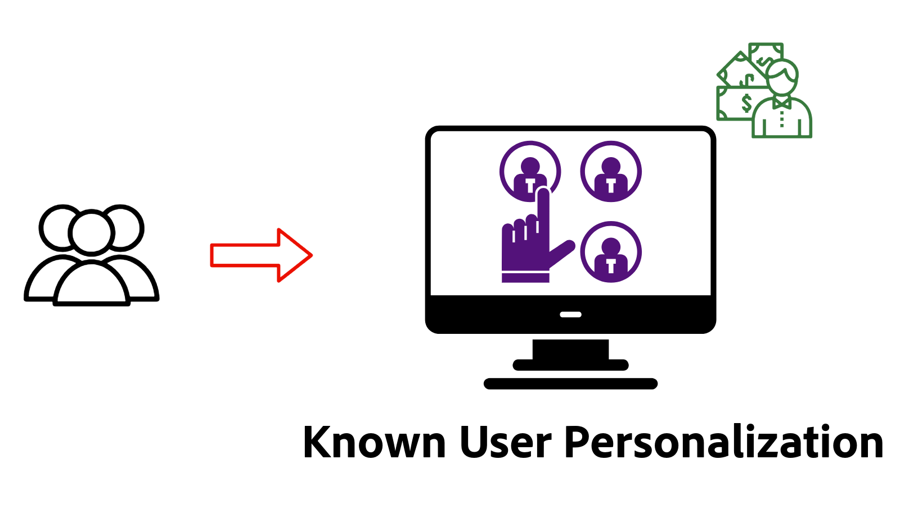

# Panoramica sulla personalizzazione

Scopri come AEM as a Cloud Service (AEMCS) si integra con Adobe Target e Adobe Experience Platform (AEP) per fornire esperienze personalizzate. Utilizzando Frammenti di esperienza come contenuti personalizzati, scopri come eseguire test A/B, eseguire il targeting degli utenti in base a comportamenti in tempo reale o personalizzare i contenuti utilizzando profili cliente unificati creati da dati su più sistemi.

## Prerequisiti

Per illustrare vari scenari di personalizzazione, questo tutorial utilizza il progetto [AEM WKND](https://github.com/adobe/aem-guides-wknd/) di esempio. Per seguire, è necessario:

- Un’organizzazione Adobe con accesso a:
   - **Ambiente AEM as a Cloud Service**: per creare e gestire i contenuti
   - **Adobe Target** - per comporre e distribuire esperienze personalizzate
   - **Applicazioni Adobe Experience Platform**: per gestire profili cliente e pubblico
   - **Tag (precedentemente Launch) in AEP**: per distribuire il Web SDK e il JavaScript personalizzato per la raccolta e la personalizzazione dei dati

- Conoscenza di base dei componenti e dei frammenti esperienza di AEM

- Il progetto [AEM WKND](https://github.com/adobe/aem-guides-wknd/) distribuito nel tuo ambiente AEM as a Cloud Service.

## Demo live dei casi di utilizzo di Personalization

Personalizzazione dell&#39;esperienza in azione nel [sito Web di abilitazione WKND](https://wknd.enablementadobe.com/us/en.html){target="wknd"}. Il sito demo illustra tre tipi di personalizzazione: test A/B, targeting comportamentale e personalizzazione per utenti noti.

>[!TIP]
>
> Esplorare la demo live per prima cosa ti aiuta a comprendere il valore e le funzionalità di ogni tecnica di personalizzazione prima di investire tempo nella configurazione e nell’implementazione.

<!-- CARDS
{target = _self}

* ./live-demo.md
  {title = Live Demo of Personalization Use Cases}
  {description = Experience personalization in action on the [WKND Enablement website](https://wknd.enablementadobe.com/us/en.html). The demo site demonstrates three types of personalization: A/B testing, behavioral targeting, and known-user personalization.}
  {image = ./assets/live-demo/live-demo.png}
  {cta = Live Demo}
-->
<!-- START CARDS HTML - DO NOT MODIFY BY HAND -->

    

        

            

                <figure class="image x-is-16by9">
                    
                </figure>
            

            

                

                    

                        <a href="./live-demo.md" target="_self" rel="referrer" title="Demo live dei casi di utilizzo di Personalization">Demo live dei casi di utilizzo di Personalization</a>
                    

                    
Personalizzazione dell’esperienza in azione sul sito web WKND Enablement. Il sito demo illustra tre tipi di personalizzazione: test A/B, targeting comportamentale e personalizzazione per utenti noti.

                

                <a href="./live-demo.md" target="_self" rel="referrer" class="spectrum-Button spectrum-Button--outline spectrum-Button--primary spectrum-Button--sizeM" style="align-self: flex-start; margin-top: 1rem;">
                    Demo live
                </a>
            

        

    

<!-- END CARDS HTML - DO NOT MODIFY BY HAND -->

## Introduzione

Prima di esplorare casi d’uso specifici, configura AEM as a Cloud Service per la personalizzazione. Inizia integrando Adobe Target e i tag per abilitare la personalizzazione lato client tramite Web SDK. Questi passaggi fondamentali consentono alle pagine AEM di supportare la sperimentazione, il targeting del pubblico e la personalizzazione in tempo reale.

<!-- CARDS
{target = _self}

* ./setup/integrate-adobe-target.md
  {title = Integrate Adobe Target}
  {description = Integrate AEMCS with Adobe Target to activate personalized content, such as Experience Fragments, as offers.}
  {image = ./assets/setup/integrate-target.png}
  {cta = Integrate Target}

* ./setup/integrate-adobe-tags.md
  {title = Integrate Tags}
  {description = Integrate AEMCS with Tags to inject the Web SDK and custom JavaScript for data collection and personalization.}
  {image = ./assets/setup/integrate-tags.png}
  {cta = Integrate Tags}
  
-->
<!-- START CARDS HTML - DO NOT MODIFY BY HAND -->

    

        

            

                <figure class="image x-is-16by9">
                    
                </figure>
            

            

                

                    

                        <a href="./setup/integrate-adobe-target.md" target="_self" rel="referrer" title="Integrare Adobe Target">Integrare Adobe Target</a>
                    

                    
Integra AEMCS con Adobe Target per attivare contenuti personalizzati, come i frammenti di esperienza, come le offerte.

                

                <a href="./setup/integrate-adobe-target.md" target="_self" rel="referrer" class="spectrum-Button spectrum-Button--outline spectrum-Button--primary spectrum-Button--sizeM" style="align-self: flex-start; margin-top: 1rem;">
                    Integrare Target
                </a>
            

        

    

    

        

            

                <figure class="image x-is-16by9">
                    
                </figure>
            

            

                

                    

                        <a href="./setup/integrate-adobe-tags.md" target="_self" rel="referrer" title="Integrare i tag">Integrare Tag</a>
                    

                    
Integra AEMCS con i tag per inserire il Web SDK e il JavaScript personalizzato per la raccolta e la personalizzazione dei dati.

                

                <a href="./setup/integrate-adobe-tags.md" target="_self" rel="referrer" class="spectrum-Button spectrum-Button--outline spectrum-Button--primary spectrum-Button--sizeM" style="align-self: flex-start; margin-top: 1rem;">
                    Integrare Tag
                </a>
            

        

    

<!-- END CARDS HTML - DO NOT MODIFY BY HAND -->

## Casi d’uso

Esplora i seguenti casi d’uso comuni per la personalizzazione supportati da AEMCS, Adobe Target e Adobe Experience Platform.

<!-- CARDS
{target = _self}

* ./use-cases/experimentation.md
    {title = Experimentation (A/B Testing)}
    {description = Learn how to test different content variations on an AEMCS website using Adobe Target for A/B testing.}
    {image = ./assets/use-cases/experiment/experimentation.png}
    {cta = Learn Experimentation}

* ./use-cases/behavioral-targeting.md
    {title = Behavioral Targeting}
    {description = Learn how to personalize content based on user behavior using Adobe Experience Platform and Adobe Target.}
    {image = ./assets/use-cases/behavioral-targeting/behavioral-targeting.png}
    {cta = Learn Behavioral Targeting}

* ./use-cases/known-user-personalization.md
    {title = Known-user personalization}
    {description = Learn how to personalize content based on known user data by stitching information from multiple systems into a complete customer profile.}
    {image = ./assets/use-cases/known-user-personalization/known-user-personalization.png}
    {cta = Learn Known-user personalization}
-->
<!-- START CARDS HTML - DO NOT MODIFY BY HAND -->

    

        

            

                <figure class="image x-is-16by9">
                    
                </figure>
            

            

                

                    

                        <a href="./use-cases/experimentation.md" target="_self" rel="referrer" title="Sperimentazione (test A/B)">Sperimentazione (Test A/B)</a>
                    

                    
Scopri come testare diverse varianti di contenuto su un sito web AEMCS utilizzando Adobe Target per il test A/B.

                

                <a href="./use-cases/experimentation.md" target="_self" rel="referrer" class="spectrum-Button spectrum-Button--outline spectrum-Button--primary spectrum-Button--sizeM" style="align-self: flex-start; margin-top: 1rem;">
                    Scopri la sperimentazione
                </a>
            

        

    

    

        

            

                <figure class="image x-is-16by9">
                    
                </figure>
            

            

                

                    

                        <a href="./use-cases/behavioral-targeting.md" target="_self" rel="referrer" title="Targeting comportamentale">Targeting comportamentale</a>
                    

                    
Scopri come personalizzare i contenuti in base al comportamento degli utenti utilizzando Adobe Experience Platform e Adobe Target.

                

                <a href="./use-cases/behavioral-targeting.md" target="_self" rel="referrer" class="spectrum-Button spectrum-Button--outline spectrum-Button--primary spectrum-Button--sizeM" style="align-self: flex-start; margin-top: 1rem;">
                    Scopri il targeting comportamentale
                </a>
            

        

    

    

        

            

                <figure class="image x-is-16by9">
                    
                </figure>
            

            

                

                    

                        <a href="./use-cases/known-user-personalization.md" target="_self" rel="referrer" title="Personalizzazione dell’utente noto">Personalizzazione utente noto</a>
                    

                    
Scopri come personalizzare i contenuti in base ai dati utente noti unendo informazioni provenienti da più sistemi in un profilo cliente completo.

                

                <a href="./use-cases/known-user-personalization.md" target="_self" rel="referrer" class="spectrum-Button spectrum-Button--outline spectrum-Button--primary spectrum-Button--sizeM" style="align-self: flex-start; margin-top: 1rem;">
                    Scopri la personalizzazione utente noto
                </a>
            

        

    

<!-- END CARDS HTML - DO NOT MODIFY BY HAND -->
