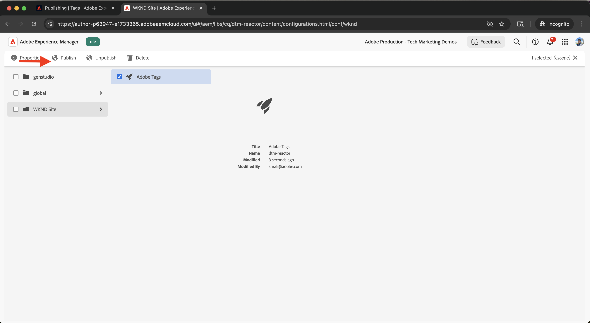
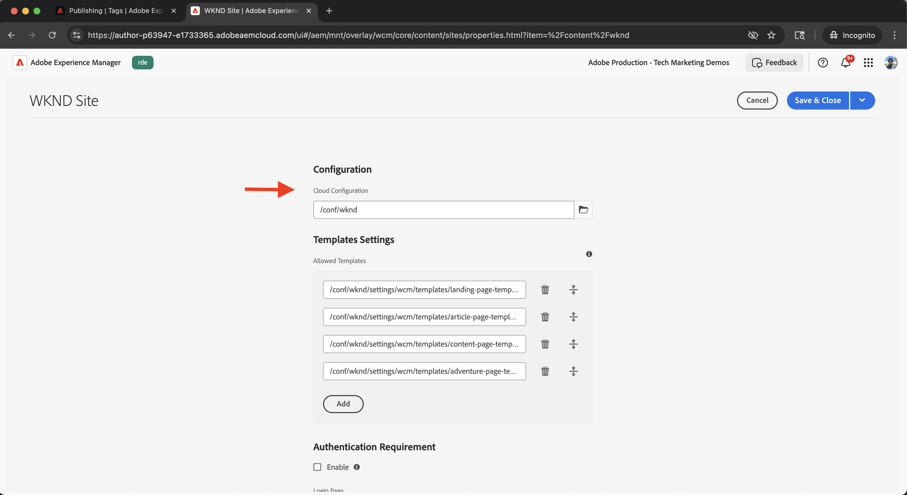

# Integrare i tag in Adobe Experience Platform

Scopri come integrare AEM as a Cloud Service (AEMCS) con i tag in Adobe Experience Platform. L’integrazione Tag (o Launch) consente di distribuire Adobe Web SDK e di inserire JavaScript personalizzati per la raccolta e la personalizzazione dei dati nelle pagine AEM.

L’integrazione consente al team di marketing o sviluppo di gestire e implementare JavaScript per la personalizzazione e la raccolta dati, senza dover ridistribuire il codice AEM.

## Passaggi di alto livello

Il processo di integrazione prevede quattro passaggi principali che stabiliscono la connessione tra AEM e i tag:

1. **Creare, configurare e pubblicare una proprietà Tags in Adobe Experience Platform**
2. **Verifica una configurazione Adobe IMS per i tag in AEM**
3. **Creare una configurazione di tag in AEM**
4. **Applica la configurazione dei tag alle tue pagine AEM**

## Creare, configurare e pubblicare una proprietà Tags in Adobe Experience Platform

Inizia creando una proprietà Tag in Adobe Experience Platform. Questa proprietà consente di gestire la distribuzione di Adobe Web SDK e di qualsiasi JavaScript personalizzato necessario per la personalizzazione e la raccolta dei dati.

1. Vai a [Adobe Experience Platform](https://experience.adobe.com/platform), accedi con il tuo Adobe ID e passa a **Tag** dal menu a sinistra.\
   

2. Fare clic su **Nuova proprietà** per creare una nuova proprietà Tag.\
   

3. Nella finestra di dialogo **Crea proprietà**, immetti quanto segue:
   - **Nome proprietà**: un nome per la proprietà Tags
   - **Tipo di proprietà**: selezionare **Web**
   - **Dominio**: il dominio in cui si distribuisce la proprietà (ad esempio, `.adobeaemcloud.com`)

   Fai clic su **Salva**.

   

4. Apri la nuova proprietà. L&#39;estensione **Core** deve essere già inclusa. In seguito, aggiungerai l&#39;estensione **Web SDK** durante la configurazione del caso d&#39;uso Sperimentazione, in quanto richiede una configurazione aggiuntiva, ad esempio **ID Datastream**.\
   

5. Pubblicare la proprietà Tags andando su **Flusso di pubblicazione** e facendo clic su **Aggiungi libreria** per creare una libreria di distribuzione.
   

6. Nella finestra di dialogo **Crea libreria**, fornisci:
   - **Nome**: un nome per la libreria
   - **Ambiente**: Seleziona **Sviluppo**
   - **Modifiche alle risorse**: Scegli **Aggiungi tutte le risorse modificate**

   Fai clic su **Salva e genera in sviluppo**.

   

7. Per pubblicare la libreria in produzione, fai clic su **Approva e pubblica in produzione**. Una volta completata la pubblicazione, la proprietà è pronta per essere utilizzata in AEM.\
   

## Verificare una configurazione Adobe IMS per i tag in AEM

Quando viene eseguito il provisioning di un ambiente AEMCS, questo include automaticamente una configurazione Adobe IMS per i tag, insieme a un progetto Adobe Developer Console corrispondente. Questa configurazione garantisce una comunicazione API sicura tra AEM e i tag.

1. In AEM, passa a **Strumenti** > **Sicurezza** > **Configurazioni Adobe IMS**.\
   

2. Individua la configurazione di **Adobe Launch**. Se disponibile, selezionarlo e fare clic su **Verifica stato** per verificare la connessione. Dovresti trovare una risposta di successo.\
   

## Creare una configurazione di tag in AEM

Crea una configurazione di Tag in AEM per specificare le proprietà e le impostazioni necessarie per le pagine del sito.

1. In AEM, vai a **Strumenti** > **Servizi cloud** > **Configurazioni di Adobe Launch**.\
   

2. Seleziona la cartella principale del sito (ad esempio, Sito WKND) e fai clic su **Crea**.\
   

3. Nella finestra di dialogo, immetti quanto segue:
   - **Titolo**: ad esempio, &quot;Tag Adobe&quot;
   - **Configurazione IMS**: selezionare la configurazione IMS **Adobe Launch** verificata
   - **Società**: seleziona la società collegata alla proprietà Tag
   - **Proprietà**: scegliere la proprietà Tag creata in precedenza

   Fai clic su **Avanti**.

   

4. A scopo dimostrativo, mantieni i valori predefiniti per gli ambienti **Staging** e **Produzione**. Fai clic su **Crea**.\
   

5. Seleziona la configurazione appena creata e fai clic su **Pubblica** per renderla disponibile nelle pagine del tuo sito.\
   

## Applicare la configurazione dei tag al sito AEM

Applica la configurazione dei tag per inserire il Web SDK e la logica di personalizzazione nelle pagine del sito.

1. In AEM, vai a **Sites**, seleziona la cartella del sito principale (ad esempio, Sito WKND) e fai clic su **Proprietà**.\
   

2. Nella finestra di dialogo **Proprietà sito** aprire la scheda **Avanzate**. In **Configurazioni**, assicurati che `/conf/wknd` sia selezionato per **Configurazione cloud**.\
   

## Verificare l’integrazione

Per verificare che la configurazione dei tag funzioni correttamente, puoi effettuare le seguenti operazioni:

1. Controlla l’origine di visualizzazione di una pagina AEM Publish o esaminala utilizzando gli strumenti di sviluppo del browser
2. Utilizza [Adobe Experience Platform Debugger](https://chromewebstore.google.com/detail/adobe-experience-platform/bfnnokhpnncpkdmbokanobigaccjkpob) per convalidare Web SDK e l&#39;iniezione JavaScript

## Risorse aggiuntive

- [Panoramica di Adobe Experience Platform Debugger](https://experienceleague.adobe.com/it/docs/experience-platform/debugger/home)
- [Panoramica sui tag](https://experienceleague.adobe.com/it/docs/experience-platform/tags/home)
