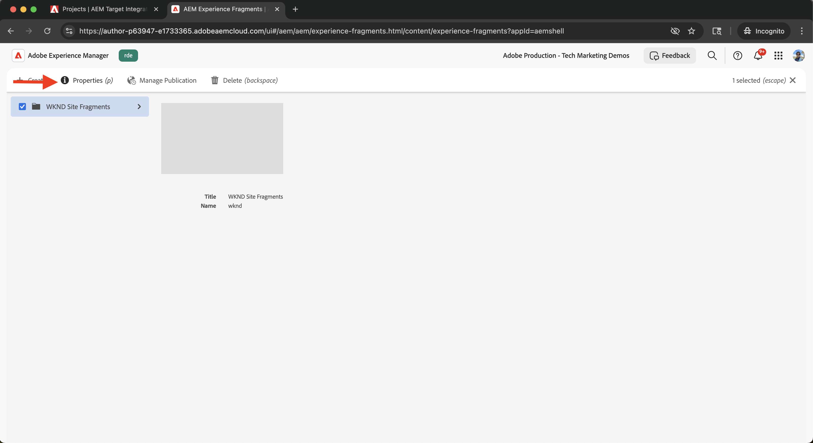

# Integrare Adobe Target

Scopri come integrare AEM as a Cloud Service (AEMCS) con Adobe Target per attivare contenuti personalizzati, come Frammenti di esperienza, come le offerte in Adobe Target.

L’integrazione consente al team di marketing di creare e gestire contenuti personalizzati a livello centrale in AEM. Questi contenuti possono quindi essere attivati direttamente come offerte in Adobe Target.

>[!IMPORTANT]
>
>Il passaggio di integrazione è facoltativo se il team preferisce gestire le offerte interamente in Adobe Target, senza utilizzare AEM come archivio di contenuti centralizzato.

## Passaggi di alto livello

Il processo di integrazione prevede quattro passaggi principali che stabiliscono la connessione tra AEM e Adobe Target:

1. **Crea e configura un progetto Adobe Developer Console**
2. **Creare una configurazione Adobe IMS per Target in AEM**
3. **Creare una configurazione legacy di Adobe Target in AEM**
4. **Applicare la configurazione di Adobe Target ai frammenti esperienza**

## Creare e configurare un progetto Adobe Developer Console

Per consentire ad AEM di comunicare in modo sicuro con Adobe Target, devi configurare un progetto Adobe Developer Console utilizzando l’autenticazione server-to-server OAuth. Puoi utilizzare un progetto esistente o crearne uno nuovo.

1. Vai a [Adobe Developer Console](https://developer.adobe.com/console) e accedi con il tuo Adobe ID.

2. Crea un nuovo progetto o selezionane uno esistente.\
   

3. Fare clic su **Aggiungi API**. Nella finestra di dialogo **Aggiungi API**, filtra per **Experience Cloud**, seleziona **Adobe Target** e fai clic su **Avanti**.\
   

4. Nella finestra di dialogo **Configura API**, seleziona il metodo di autenticazione **OAuth Server-to-Server** e fai clic su **Avanti**.\
   

5. Nel passaggio **Seleziona profili di prodotto**, seleziona il **Workspace predefinito** e fai clic su **Salva API configurata**.\
   

6. Nel menu di navigazione a sinistra, seleziona **OAuth Server-to-Server** e controlla i dettagli della configurazione. Nota l’ID client e il segreto client: questi valori sono necessari per configurare l’integrazione IMS in AEM.
   

## Creare una configurazione Adobe IMS per Target in AEM

In AEM, crea una configurazione Adobe IMS per Target utilizzando le credenziali di Adobe Developer Console. Questa configurazione consente ad AEM di eseguire l’autenticazione con le API di Adobe Target.

1. In AEM, passa a **Strumenti** > **Sicurezza** e seleziona **Configurazioni Adobe IMS**.\
   

2. Fai clic su **Crea**.\
   

3. Nella pagina **Configurazione account tecnico Adobe IMS**, immetti quanto segue:
   - **Soluzione cloud**: Adobe Target
   - **Titolo**: etichetta per la configurazione, ad esempio &quot;Adobe Target&quot;
   - **Server autorizzazioni**: `https://ims-na1.adobelogin.com`
   - **ID client**: da Adobe Developer Console
   - **Segreto client**: da Adobe Developer Console
   - **Ambito**: da Adobe Developer Console
   - **ID organizzazione**: da Adobe Developer Console

   Quindi fare clic su **Crea**.

   

4. Selezionare la configurazione e fare clic su **Verifica stato** per verificare la connessione. Un messaggio di successo conferma che AEM può connettersi ad Adobe Target.\
   

## Creare una configurazione legacy di Adobe Target in AEM

Per esportare i frammenti di esperienza come offerte in Adobe Target, crea una configurazione legacy di Adobe Target in AEM.

1. In AEM, passa a **Strumenti** > **Servizi cloud** e seleziona **Servizi cloud precedenti**.\
   

2. Nella sezione **Adobe Target**, fai clic su **Configura ora**.\
   

3. Nella finestra di dialogo **Crea configurazione**, immetti un nome come &quot;Adobe Target Legacy&quot; e fai clic su **Crea**.\
   

4. Nella pagina **Configurazione legacy di Adobe Target**, fornisci quanto segue:
   - **Autenticazione**: IMS
   - **Codice client**: il codice client Adobe Target (trovato in Adobe Target in **Amministrazione** > **Implementazione**)
   - **Configurazione IMS**: configurazione IMS creata in precedenza

   Fai clic su **Connetti ad Adobe Target** per convalidare la connessione.

   

## Applicare la configurazione Adobe Target ai frammenti esperienza

Associa la configurazione di Adobe Target ai frammenti di esperienza in modo che possano essere esportati e utilizzati come offerte in Target.

1. In AEM, vai a **Frammenti esperienza**.\
   

2. Selezionare la cartella principale che contiene i frammenti esperienza (ad esempio, `WKND Site Fragments`) e fare clic su **Proprietà**.\
   

3. Nella pagina **Proprietà**, apri la scheda **Servizi cloud**. Nella sezione **Configurazioni Cloud Service**, seleziona la configurazione Adobe Target.\
   

4. Nella sezione **Adobe Target** visualizzata, completa quanto segue:
   - **Formato di esportazione Adobe Target**: HTML
   - **Adobe Target Workspace**: selezionare l&#39;area di lavoro da utilizzare (ad esempio, &quot;Default Workspace&quot;)
   - **Domini esternalizzatori**: immettere i domini per la generazione di URL esterni

   

5. Fai clic su **Salva e chiudi** per applicare la configurazione.

## Verificare l’integrazione

Per verificare il corretto funzionamento dell’integrazione, verifica la funzionalità di esportazione:

1. In AEM, crea un nuovo frammento di esperienza o aprirne uno esistente. Fare clic su **Esporta in Adobe Target** nella barra degli strumenti.\
   

2. In Adobe Target, vai alla sezione **Offerte** e verifica che il frammento di esperienza sia visualizzato come offerta.\
   

## Risorse aggiuntive

- [Panoramica API di Target](https://experienceleague.adobe.com/en/docs/target-dev/developer/api/target-api-overview)
- [Offerta Target](https://experienceleague.adobe.com/en/docs/target/using/experiences/offers/manage-content)
- [Adobe Developer Console](https://developer.adobe.com/developer-console/docs/guides/)
- [Frammenti esperienza in AEM](https://experienceleague.adobe.com/en/docs/experience-manager-learn/sites/experience-fragments/experience-fragments-feature-video-use)