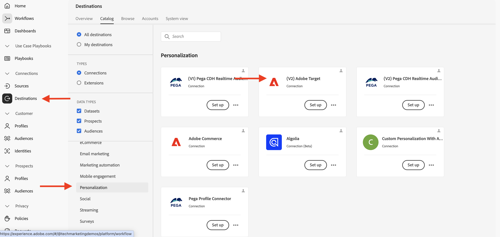
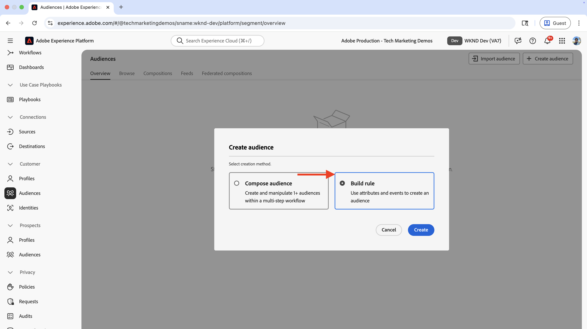
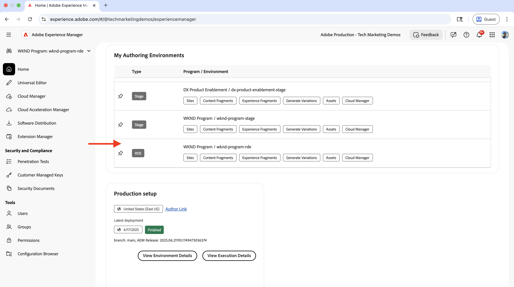
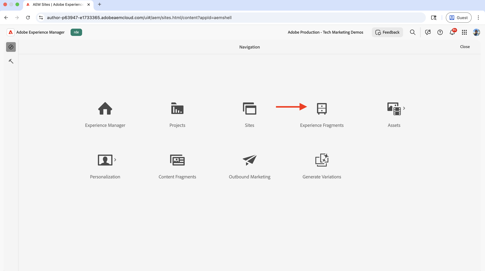
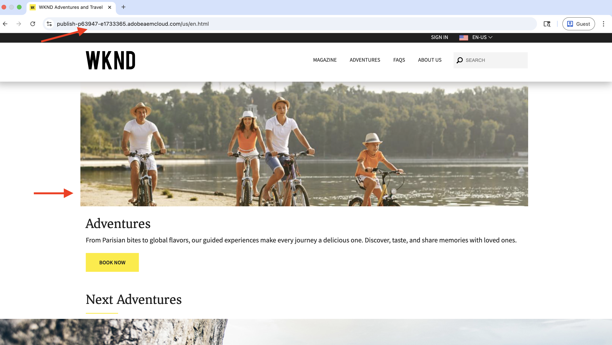

# Targeting comportamentale

Scopri come personalizzare i contenuti in base al comportamento degli utenti utilizzando Adobe Experience Platform (AEP) e Adobe Target.

Il targeting comportamentale ti aiuta a fornire la personalizzazione della pagina successiva in base al comportamento degli utenti, ad esempio le pagine visitate, i prodotti o le categorie visualizzate. Gli scenari comuni includono:

- **Sezione protagonista Personalization**: visualizza contenuto protagonista personalizzato nella pagina successiva in base all&#39;attività di esplorazione dell&#39;utente
- **Personalizzazione elemento contenuto**: modifica titoli, immagini o pulsanti call-to-action in base all&#39;attività di esplorazione dell&#39;utente
- **Adattamento contenuto pagina**: modifica l&#39;intero contenuto della pagina in base all&#39;attività di esplorazione dell&#39;utente

## Caso di utilizzo demo

In questo tutorial, il processo dimostra come **utenti anonimi** che hanno visitato le _pagine di avventura Bali Surf Camp_, _Riverside Camping_ o _Tahoe Skiing_ vedano un eroe personalizzato visualizzato sopra la sezione **Successive avventure** nella home page WKND.


A scopo dimostrativo, gli utenti con questo comportamento di navigazione sono classificati come il pubblico **Family Traveller**.

### Demo live

Visita il [sito Web WKND Enablement](https://wknd.enablementadobe.com/us/en.html) per visualizzare il targeting comportamentale in azione. Il sito offre tre diverse esperienze di targeting comportamentale:

- **Home Page**: quando gli utenti visitano la home page dopo aver navigato nelle _pagine di avventura del Campo da surf di Bali_, _del Campeggio Riverside_ o _dello sci di Tahoe_, sono classificati come pubblico di **viaggiatori per famiglie** e visualizzano una sezione protagonista personalizzata sopra la sezione _Successive avventure_.

- **Pagina Avventura**: quando gli utenti visualizzano le _Pagine Avventura di Bali Surf Camp_ o _Campo Surf In Costa Rica_, sono classificati come pubblico di **Interesse per il Surf** e visualizzano una sezione protagonista personalizzata nella pagina dell&#39;avventura.

- **Pagina rivista**: quando gli utenti leggono _tre o più_ articoli, vengono classificati come **lettori rivista** e visualizzano una sezione protagonista personalizzata nella pagina della rivista.

>[!VIDEO](https://video.tv.adobe.com/v/3474001/?learn=on&enablevpops)

>[!TIP]
>
>Il primo pubblico utilizza la valutazione **Edge** per la personalizzazione in tempo reale, mentre il secondo e il terzo pubblico utilizzano la valutazione **Batch** per la personalizzazione, che è ideale per i visitatori di ritorno.

## Prerequisiti

Prima di procedere con il caso di utilizzo del targeting comportamentale, assicurati di aver completato quanto segue:

- [Integrare Adobe Target](../setup/integrate-adobe-target.md): consente ai team di creare e gestire contenuti personalizzati centralmente in AEM e attivarli come offerte in Adobe Target.
- [Integrare i tag in Adobe Experience Platform](../setup/integrate-adobe-tags.md): consente ai team di gestire e distribuire JavaScript per la personalizzazione e la raccolta dati senza dover ridistribuire il codice AEM.

Conoscere inoltre i concetti di [Adobe Experience Cloud Identity Service (ECID)](https://experienceleague.adobe.com/it/docs/id-service/using/home) e [Adobe Experience Platform](https://experienceleague.adobe.com/it/docs/experience-platform/landing/home), ad esempio schema, flusso di dati, tipi di pubblico, identità e profili.

Sebbene sia possibile creare tipi di pubblico semplici in Adobe Target, Adobe Experience Platform (AEP) offre l’approccio moderno per creare e gestire tipi di pubblico e creare profili cliente completi utilizzando varie origini dati, come dati comportamentali e transazionali.

## Passaggi di alto livello

Il processo di configurazione del targeting comportamentale prevede diversi passaggi tra Adobe Experience Platform, AEM e Adobe Target.

1. **In Adobe Experience Platform:**
   1. Creare e configurare uno schema
   2. Creare e configurare un set di dati
   3. Creare e configurare uno stream di dati
   4. Creare e configurare una proprietà Tag
   5. Configurare i criteri di unione per il profilo
   6. Configurazione destinazione Adobe Target (V2)
   7. Creare e configurare un pubblico

2. **In AEM:**
   1. Creare offerte personalizzate tramite Frammento di esperienza
   2. Integrare e inserire la proprietà Tags nelle pagine AEM
   3. Integrare Adobe Target ed esportare offerte personalizzate in Adobe Target

3. **In Adobe Target:**
   1. Verificare il pubblico e le offerte
   2. Creare e configurare un’attività

4. **Verifica l&#39;implementazione del targeting comportamentale nelle tue pagine AEM**

Le varie soluzioni di AEP vengono utilizzate per raccogliere, gestire e raccogliere dati comportamentali per creare tipi di pubblico. Questi tipi di pubblico vengono quindi attivati in Adobe Target. Utilizzando le attività in Adobe Target, le esperienze personalizzate vengono distribuite agli utenti che corrispondono ai criteri di pubblico.

## Passaggi di Adobe Experience Platform

Per creare tipi di pubblico basati su dati comportamentali, è necessario raccogliere e memorizzare dati quando gli utenti visitano il tuo sito web o interagiscono con esso. In questo esempio, per categorizzare un utente come pubblico di **utenti che viaggiano per famiglie**, è necessario raccogliere i dati di visualizzazione della pagina. Il processo inizia in Adobe Experience Platform per configurare i componenti necessari per la raccolta dei dati.

Accedi a [Adobe Experience Cloud](https://experience.adobe.com/) e passa a **Experience Platform** dalla sezione Cambio app o Accesso rapido.


### Creare e configurare uno schema

Uno schema definisce la struttura e il formato dei dati raccolti in Adobe Experience Platform. Garantisce la coerenza dei dati e consente di creare tipi di pubblico significativi in base a campi dati standardizzati. Per il targeting comportamentale, è necessario uno schema che possa acquisire gli eventi di visualizzazione della pagina e le interazioni degli utenti.

Crea uno schema per raccogliere i dati di visualizzazione della pagina per il targeting comportamentale.

- Nella home page di **Adobe Experience Platform**, fai clic su **Schemi** nel menu di navigazione a sinistra e quindi su **Crea schema**.

  

- Nella procedura guidata **Crea schema**, per il passaggio **Dettagli schema**, seleziona l&#39;opzione **Evento esperienza** e fai clic su **Avanti**.

  

- Per il passaggio **Nome e revisione**, immetti quanto segue:
   - **Nome visualizzato schema**: WKND-RDE-Behavioral-Targeting
   - **Classe selezionata**: XDM ExperienceEvent

  

- Aggiorna lo schema come segue:
   - **Aggiungi gruppo di campi**: AEP Web SDK ExperienceEvent
   - **Profilo**: Abilita

  

- Fai clic su **Salva** per creare lo schema.

### Creare e configurare un set di dati

Un set di dati è un contenitore per i dati che seguono uno schema specifico. Funge da posizione di archiviazione in cui vengono raccolti e organizzati i dati comportamentali. Per consentire la creazione e la personalizzazione del pubblico, il set di dati deve essere abilitato per Profilo.

Creiamo un set di dati per memorizzare i dati di visualizzazione della pagina.

- In **Adobe Experience Platform**, fai clic su **Set di dati** nell&#39;area di navigazione a sinistra e quindi su **Crea set di dati**.
  

- Nel passaggio **Crea set di dati**, seleziona **Crea set di dati dallo schema** e fai clic su **Avanti**.
  

- Nella procedura guidata **Crea set di dati dallo schema**, per il passaggio **Seleziona schema**, seleziona lo schema **WKND-RDE-Behavioral-Targeting** e fai clic su **Avanti**.
  

- Per il passaggio **Configura set di dati**, immetti quanto segue:
   - **Nome**: WKND-RDE-Behavioral-Targeting
   - **Descrizione**: set di dati per l&#39;archiviazione dei dati di visualizzazione della pagina

  

  Fai clic su **Fine** per creare il set di dati.

- Aggiorna il set di dati come segue:
   - **Profilo**: Abilita

  

### Creare e configurare uno stream di dati

Un flusso di dati è una configurazione che definisce il modo in cui i dati fluiscono dal sito web a Adobe Experience Platform tramite il Web SDK. Funge da ponte tra il sito web e la piattaforma, garantendo che i dati siano formattati correttamente e instradati ai set di dati corretti. Per il targeting comportamentale, dobbiamo abilitare servizi specifici come Segmentazione di Edge e Destinazioni di Personalization.

Creiamo un flusso di dati per inviare i dati di visualizzazione della pagina ad Experience Platform tramite Web SDK.

- In **Adobe Experience Platform**, fai clic su **Datastreams** nel menu di navigazione a sinistra, quindi fai clic su **Create datastream**.

- Nel passaggio **Nuovo flusso di dati**, immetti quanto segue:
   - **Nome**: WKND-RDE-Behavioral-Targeting
   - **Descrizione**: flusso di dati per inviare i dati di visualizzazione della pagina ad Experience Platform
   - **Schema di mappatura**: WKND-RDE-Behavioral-Targeting
Fai clic su **Salva** per creare lo stream di dati.

  

- Una volta creato lo stream di dati, fare clic su **Aggiungi servizio**.

  

- Nel passaggio **Aggiungi servizio**, seleziona **Adobe Experience Platform** dal menu a discesa e immetti quanto segue:
   - **Set di dati evento**: WKND-RDE-Behavioral-Targeting
   - **Set di dati profilo**: WKND-RDE-Behavioral-Targeting
   - **Offer Decisioning**: Abilita
   - **Segmentazione Edge**: Abilita
   - **Destinazioni Personalization**: Abilita

  Fai clic su **Salva** per aggiungere il servizio.

  

- Nel passaggio **Aggiungi servizio**, seleziona **Adobe Target** dal menu a discesa e immetti l&#39;**ID ambiente di destinazione**. Puoi trovare l&#39;ID ambiente di destinazione in Adobe Target in **Amministrazione** > **Ambienti**. Fai clic su **Salva** per aggiungere il servizio.
  

### Creare e configurare una proprietà tag

Una proprietà Tags è un contenitore per il codice JavaScript che raccoglie i dati dal sito Web e li invia a Adobe Experience Platform. Agisce come livello di raccolta dei dati che acquisisce le interazioni degli utenti e le visualizzazioni di pagina. Per il targeting comportamentale, raccogliamo dettagli di pagina specifici come il nome della pagina, l’URL, la sezione del sito e il nome host per creare un pubblico significativo.

Creiamo una proprietà Tags che acquisisce i dati di visualizzazione della pagina quando gli utenti visitano il tuo sito web.

Per questo caso d’uso, vengono raccolti dettagli della pagina come il nome della pagina, l’URL, la sezione del sito e il nome host. Questi dettagli vengono utilizzati per creare tipi di pubblico comportamentali.

Puoi aggiornare la proprietà Tags creata nel passaggio [Integrare tag Adobe](../setup/integrate-adobe-tags.md). Tuttavia, per semplificarla, viene creata una nuova proprietà Tags.

#### Crea proprietà tag

La procedura seguente illustra come creare una proprietà Tags:

- In **Adobe Experience Platform**, fai clic su **Tag** nel menu di navigazione a sinistra e quindi sul pulsante **Nuova proprietà**.
  

- Nella finestra di dialogo **Crea proprietà**, immetti quanto segue:
   - **Nome proprietà**: WKND-RDE-Behavioral-Targeting
   - **Tipo di proprietà**: selezionare **Web**
   - **Dominio**: il dominio in cui si distribuisce la proprietà (ad esempio, `.adobeaemcloud.com`)

  Fai clic su **Salva** per creare la proprietà.

  

- Apri la nuova proprietà e fai clic su **Estensioni** nel menu di navigazione a sinistra, quindi fai clic sulla scheda **Catalogo**. Cerca **Web SDK** e fai clic sul pulsante **Installa**.
  

- Nella finestra di dialogo **Installa estensione**, seleziona lo **stream di dati** creato in precedenza e fai clic su **Salva**.
  

#### Aggiungi elementi dei dati

Gli elementi dati sono variabili che acquisiscono punti dati specifici dal sito web e li rendono disponibili per l’utilizzo in regole e altre configurazioni di tag. Agiscono da blocchi predefiniti per la raccolta dei dati, consentendo di estrarre informazioni significative dalle interazioni degli utenti e dalle visualizzazioni di pagina. Per il targeting comportamentale, è necessario acquisire i dettagli della pagina come nome host, sezione del sito e nome della pagina per creare segmenti di pubblico.

Crea i seguenti elementi dati per acquisire i dettagli importanti della pagina.

- Fare clic su **Elementi dati** nel menu di navigazione a sinistra e quindi sul pulsante **Crea nuovo elemento dati**.
  

- Nella finestra di dialogo **Crea nuovo elemento dati**, immetti quanto segue:
   - **Nome**: Nome host
   - **Estensione**: Seleziona **Core**
   - **Tipo Elemento Dati**: Seleziona **Codice Personalizzato**
   - **Apri il pulsante Editor** e immetti il seguente frammento di codice:

     ```javascript
     if(window && window.location && window.location.hostname) {
         return window.location.hostname;
     }
     ```

  

- Allo stesso modo, crea i seguenti elementi di dati:

   - **Nome**: sezione del sito
   - **Estensione**: Seleziona **Core**
   - **Tipo Elemento Dati**: Seleziona **Codice Personalizzato**
   - **Apri il pulsante Editor** e immetti il seguente frammento di codice:

     ```javascript
     if(event && event.component && event.component.hasOwnProperty('repo:path')) {
         let pagePath = event.component['repo:path'];
     
         let siteSection = '';
     
         //Check for html String in URL.
         if (pagePath.indexOf('.html') > -1) { 
         siteSection = pagePath.substring(0, pagePath.lastIndexOf('.html'));
     
         //replace slash with colon
         siteSection = siteSection.replaceAll('/', ':');
     
         //remove `:content`
         siteSection = siteSection.replaceAll(':content:','');
         }
     
         return siteSection 
     }        
     ```

   - **Nome**: Nome Pagina
   - **Estensione**: Seleziona **Core**
   - **Tipo Elemento Dati**: Seleziona **Codice Personalizzato**
   - **Apri il pulsante Editor** e immetti il seguente frammento di codice:

     ```javascript
     if(event && event.component && event.component.hasOwnProperty('dc:title')) {
         // return value of 'dc:title' from the data layer Page object, which is propagated via 'cmp:show' event
         return event.component['dc:title'];
     }        
     ```

- Quindi, creare un elemento dati di tipo **Variabile**. Questo elemento dati viene compilato con i dettagli della pagina prima di inviarlo all’Experience Platform.

   - **Nome**: XDM-Variable Pageview
   - **Estensione**: Seleziona **Adobe Experience Platform Web SDK**
   - **Tipo Di Elemento Dati**: Seleziona **Variabile**

  Nel pannello a destra,

   - **Sandbox**: seleziona la sandbox
   - **Schema**: selezionare lo schema **WKND-RDE-Behavioral-Targeting**

  Fai clic su **Salva** per creare l&#39;elemento dati.

  

- Nell&#39;elenco **Elementi dati** dovrebbero essere presenti quattro elementi dati:

  

#### Aggiungi regole

Le regole definiscono quando e come i dati vengono raccolti e inviati a Adobe Experience Platform. Fungono da livello logico che determina cosa accade quando si verificano eventi specifici sul sito web. Per il targeting comportamentale, vengono create regole che acquisiscono gli eventi di visualizzazione della pagina e popolano gli elementi dati con le informazioni raccolte prima di inviarle alla piattaforma.

Creare una regola per popolare l&#39;elemento dati **Pageview** della variabile XDM utilizzando gli altri elementi dati prima di inviarlo ad Experience Platform. La regola viene attivata quando un utente esplora il sito web WKND.

- Fai clic su **Regole** nella barra di navigazione a sinistra, quindi fai clic sul pulsante **Crea nuova regola**.
  

- Nella finestra di dialogo **Crea nuova regola**, immetti quanto segue:

   - **Nome**: tutte le pagine - al caricamento

   - Per la sezione **Eventi**, fare clic su **Aggiungi** per aprire la procedura guidata **Configurazione evento**.
      - **Estensione**: Seleziona **Core**
      - **Tipo evento**: selezionare **Codice personalizzato**
      - **Apri il pulsante Editor** e immetti il seguente frammento di codice:

        ```javascript
        var pageShownEventHandler = function(evt) {
            // defensive coding to avoid a null pointer exception
            if(evt.hasOwnProperty("eventInfo") && evt.eventInfo.hasOwnProperty("path")) {
                //trigger Launch Rule and pass event
                console.debug("cmp:show event: " + evt.eventInfo.path);
                var event = {
                    //include the path of the component that triggered the event
                    path: evt.eventInfo.path,
                    //get the state of the component that triggered the event
                    component: window.adobeDataLayer.getState(evt.eventInfo.path)
                };
        
                //Trigger the Launch Rule, passing in the new 'event' object
                // the 'event' obj can now be referenced by the reserved name 'event' by other Launch data elements
                // i.e 'event.component['someKey']'
                trigger(event);
            }
        }
        
        //set the namespace to avoid a potential race condition
        window.adobeDataLayer = window.adobeDataLayer || [];
        
        //push the event listener for cmp:show into the data layer
        window.adobeDataLayer.push(function (dl) {
            //add event listener for 'cmp:show' and callback to the 'pageShownEventHandler' function
            dl.addEventListener("cmp:show", pageShownEventHandler);
        });
        ```

   - Per la sezione **Conditions**, fare clic su **Add** per aprire la procedura guidata **Condition Configuration**.
      - **Tipo di logica**: Seleziona **Normale**
      - **Estensione**: Seleziona **Core**
      - **Tipo Condizione**: Seleziona **Codice Personalizzato**
      - **Apri il pulsante Editor** e immetti il seguente frammento di codice:

        ```javascript
        if(event && event.component && event.component.hasOwnProperty('@type') && event.component.hasOwnProperty('xdm:template')) {
            console.log('The cmp:show event is from PAGE HANDLE IT');
            return true;
        }else{
            console.log('The cmp:show event is NOT from PAGE IGNORE IT');
            return false;
        }            
        ```

   - Per la sezione **Azioni**, fare clic su **Aggiungi** per aprire la procedura guidata **Configurazione azione**.
      - **Estensione**: Seleziona **Adobe Experience Platform Web SDK**
      - **Tipo azione**: Seleziona **Aggiorna variabile**
      - Mappa **web** > **webPageDetails** > **name** all&#39;elemento dati **Page Name**

        

      - Analogamente, mappare il **server** all&#39;elemento dati **Nome host** e **sezioneSito** all&#39;elemento dati **Sezione sito**. Per **pageView** > **value** immettere `1`, per indicare un evento di visualizzazione della pagina.

      - Fai clic su **Mantieni modifiche** per salvare la configurazione dell&#39;azione.

   - Di nuovo, fai clic su **Aggiungi** per aggiungere un&#39;altra azione e aprire la procedura guidata **Configurazione azione**.
      - **Estensione**: Seleziona **Adobe Experience Platform Web SDK**
      - **Tipo azione**: Seleziona **Invia evento**
      - Nella sezione **Dati** del pannello di destra, mappa l&#39;elemento dati **Pageview** variabile XDM con il tipo **Visualizzazioni pagina Web Webpagedetails**.

     

      - Inoltre, nella sezione **Personalization** del pannello di destra, seleziona l&#39;opzione **Rendering delle decisioni di personalizzazione visiva**.  Quindi, fai clic su **Mantieni modifiche** per salvare l&#39;azione.

     

   - Fai clic su **Mantieni modifiche** per salvare la regola.

- La regola deve essere simile alla seguente:

  

I passaggi di creazione delle regole di cui sopra presentano un numero considerevole di dettagli, quindi fai attenzione durante la creazione della regola. Potrebbe sembrare complesso, ma tieni presente che questi passaggi di configurazione lo rendono plug and play senza dover aggiornare il codice AEM e ridistribuire l’applicazione.

#### Aggiungi libreria e pubblicala

Una libreria è una raccolta di tutte le configurazioni di tag (elementi di dati, regole, estensioni) che viene generata e distribuita sul sito web. Raccoglie tutti gli elementi in modo che la raccolta dei dati funzioni correttamente. Per il targeting comportamentale, la libreria viene pubblicata per rendere attive le regole di raccolta dati sul sito web.

- Fare clic su **Flusso di pubblicazione** nel menu di navigazione a sinistra e fare clic sul pulsante **Aggiungi libreria**.
  

- Nella finestra di dialogo **Aggiungi libreria**, immetti quanto segue:
   - **Nome**: 1,0
   - **Ambiente**: Seleziona **Sviluppo**
   - Fare clic su **Aggiungi tutte le risorse modificate** per selezionare tutte le risorse.

  Fai clic su **Salva e genera in sviluppo** per creare la libreria.

  

- Una volta creata la libreria per la corsia di nuoto **Sviluppo**, fai clic sui tre puntini di sospensione e seleziona l&#39;opzione **Approva e pubblica in produzione**.
  

Congratulazioni. Hai creato la proprietà Tag con la regola per raccogliere i dettagli della pagina e inviarli ad Experience Platform. Questo è il passaggio fondamentale per creare tipi di pubblico comportamentali.

### Configurare i criteri di unione per il profilo

Un criterio di unione definisce il modo in cui i dati del cliente provenienti da più origini vengono unificati in un unico profilo. Determina quali dati hanno la precedenza in caso di conflitti, garantendo una visualizzazione completa e coerente di ciascun cliente per il targeting comportamentale.

Ai fini di questo caso d’uso, viene creato o aggiornato un criterio di unione che è:

- **Criterio di unione predefinito**: abilita
- **Criterio Di Unione Attivo Su Edge**: Abilita

La procedura seguente illustra come creare un criterio di unione:

- In **Adobe Experience Platform**, fai clic su **Profili** nel menu di navigazione a sinistra e quindi sulla scheda **Criteri di unione**.

  

- È possibile utilizzare un criterio di unione esistente, ma per questa esercitazione viene creato un nuovo criterio di unione con la seguente configurazione:

  

- Assicurati di abilitare entrambe le opzioni **Criterio di unione predefinito** e **Criterio di unione attivo su Edge**. Queste impostazioni garantiscono che i dati comportamentali siano correttamente unificati e disponibili per la valutazione del pubblico in tempo reale.

### Configurazione destinazione Adobe Target (V2)

La Destinazione di Adobe Target (V2) consente di attivare i tipi di pubblico comportamentali creati in Experience Platform direttamente in Adobe Target. Questa connessione consente di utilizzare i tipi di pubblico comportamentali per attività di personalizzazione in Adobe Target.

- In **Adobe Experience Platform**, fai clic su **Destinazioni** nel menu di navigazione a sinistra, quindi fai clic sulla scheda **Catalogo** e filtra per **Personalization**, quindi seleziona la destinazione **(v2) Adobe Target**.

  

- Nel passaggio **Attiva destinazioni**, specifica un nome per la destinazione e fai clic sul pulsante **Connetti alla destinazione**.
  

- Nella sezione **Dettagli destinazione**, immetti quanto segue:
   - **Nome**: WKND-RDE-Behavioral-Targeting-Destination
   - **Descrizione**: destinazione per i tipi di pubblico di targeting comportamentale
   - **Datastream**: seleziona lo **Datastream** creato in precedenza
   - **Workspace**: seleziona la tua area di lavoro Adobe Target

  

- Fai clic su **Avanti** e completa la configurazione di destinazione.

Una volta configurata, questa destinazione ti consente di attivare i tipi di pubblico comportamentali da Experience Platform ad Adobe Target da utilizzare nelle attività di personalizzazione.

### Creare e configurare un pubblico

Un pubblico definisce un gruppo specifico di utenti in base ai loro modelli e caratteristiche comportamentali. In questo passaggio, viene creato un pubblico di &quot;viaggiatori per famiglie&quot; utilizzando le regole dei dati comportamentali.

La procedura seguente illustra come creare un pubblico:

- In **Adobe Experience Platform**, fai clic su **Tipi di pubblico** nella barra di navigazione a sinistra, quindi fai clic sul pulsante **Crea pubblico**.
  

- Nella finestra di dialogo **Crea pubblico**, seleziona l&#39;opzione **Genera-regola** e fai clic sul pulsante **Crea**.
  

- Nel passaggio **Crea**, immetti quanto segue:
   - **Nome**: Familiari
   - **Descrizione**: utenti che hanno visitato pagine di avventura a misura di famiglia
   - **Metodo di valutazione**: selezionare **Edge** (per la valutazione del pubblico in tempo reale)

  

- Quindi, fai clic sulla scheda **Eventi** e passa al **Web** > **Dettagli pagina Web**, quindi trascina e rilascia il campo **URL** nella sezione **Regole evento**. Trascina il campo **URL** altre due volte nella sezione **Regole evento**. Immetti i seguenti valori:
   - **URL**: seleziona l&#39;opzione **contains** e immetti `riverside-camping-australia`
   - **URL**: seleziona l&#39;opzione **contains** e immetti `bali-surf-camp`
   - **URL**: seleziona l&#39;opzione **contains** e immetti `gastronomic-marais-tour`

  

- Nella sezione **Eventi** selezionare l&#39;opzione **Oggi**. Il pubblico deve essere simile al seguente:

  

- Rivedi il pubblico e fai clic sul pulsante **Attiva nella destinazione**.

  

- Nella finestra di dialogo **Attiva nella destinazione**, seleziona la destinazione Adobe Target creata in precedenza e segui i passaggi per attivare il pubblico.

  

- Non sono ancora presenti dati in AEP, quindi il conteggio del pubblico è 0. Una volta che gli utenti iniziano a visitare il sito web, i dati vengono raccolti e il conteggio del pubblico aumenta.

  

Congratulazioni. Hai creato il pubblico e l’hai attivato nella destinazione Adobe Target.

Questo completa i passaggi di Adobe Experience Platform ed è pronto per creare l’esperienza personalizzata in AEM e utilizzarla in Adobe Target.

## Passaggi di AEM

In AEM, la proprietà Tags è integrata per raccogliere i dati di visualizzazione della pagina e inviarli ad Experience Platform. Adobe Target è anche integrato e vengono create offerte personalizzate per il pubblico **Family Traveller**. Questi passaggi consentono ad AEM di lavorare con la configurazione del targeting comportamentale creata in Experience Platform.

Per iniziare, accedi al servizio Author di AEM per creare e configurare i contenuti personalizzati.

- Accedi a [Adobe Experience Cloud](https://experience.adobe.com/) e passa a **Experience Manager** dalla sezione Cambio app o Accesso rapido.

  

- Passa all&#39;ambiente di authoring di AEM e fai clic sul pulsante **Sites**.
  

### Integrare e inserire la proprietà Tag nelle pagine AEM

Questo passaggio integra la proprietà Tags creata in precedenza nelle pagine AEM, abilitando la raccolta dati per il targeting comportamentale. La proprietà Tags acquisisce automaticamente i dati di visualizzazione della pagina e li invia ad Experience Platform quando gli utenti visitano il tuo sito web.

Per integrare la proprietà Tags nelle pagine di AEM, seguire la procedura descritta in [Integrare i tag in Adobe Experience Platform](../setup/integrate-adobe-tags.md).

Assicurati di utilizzare la proprietà **WKND-RDE-Behavioral-Targeting** Tags creata in precedenza, non una proprietà diversa.


Una volta integrata, la proprietà Tags inizia a raccogliere dati comportamentali dalle pagine AEM e a inviarli ad Experience Platform per la creazione di un pubblico.

### Integrare Adobe Target ed esportare offerte personalizzate in Adobe Target

Questo passaggio integra Adobe Target con AEM e consente l’esportazione di contenuti personalizzati (frammenti di esperienza) in Adobe Target. Questa connessione consente ad Adobe Target di utilizzare i contenuti creati in AEM per attività di personalizzazione con i tipi di pubblico comportamentali creati in Experience Platform.

Per integrare Adobe Target ed esportare le offerte del pubblico **Family Traveller** in Adobe Target, segui i passaggi da [Integrare Adobe Target in Adobe Experience Platform](../setup/integrate-adobe-target.md).

Assicurati che la configurazione di Target sia applicata ai frammenti di esperienza in modo che possano essere esportati in Adobe Target per l’utilizzo in attività di personalizzazione.


Una volta integrati, puoi esportare Frammenti di esperienza da AEM ad Adobe Target, dove vengono utilizzati come offerte personalizzate per i tipi di pubblico comportamentali.

### Creare offerte personalizzate per il pubblico di destinazione

I frammenti di esperienza sono componenti di contenuto riutilizzabili che possono essere esportati in Adobe Target come offerte personalizzate. Per il targeting comportamentale, il contenuto viene creato appositamente progettato per il pubblico **Family Traveller** che viene visualizzato quando gli utenti corrispondono ai criteri comportamentali.

Crea un nuovo frammento di esperienza con contenuti personalizzati per il pubblico di viaggiatori per famiglie.

- In AEM, fai clic su **Frammenti esperienza**

  

- Passa alla cartella **Frammenti di sito WKND**, quindi passa alla sottocartella **In primo piano** e fai clic sul pulsante **Crea**.

  

- Nella finestra di dialogo **Crea frammento esperienza**, seleziona Modello variante Web e fai clic su **Avanti**.

  

- Crea il frammento di esperienza appena creato aggiungendo un componente Teaser e personalizzalo con contenuti rilevanti per i viaggiatori familiari. Aggiungi un titolo, una descrizione e un call-to-action convincenti per le famiglie interessate ai viaggi di avventura.

  

- Seleziona il frammento di esperienza creato e fai clic sul pulsante **Esporta in Adobe Target**.

  

Congratulazioni. Hai creato ed esportato le offerte del pubblico **Family Travelers** in Adobe Target. Il frammento di esperienza è ora disponibile in Adobe Target come offerta personalizzata che può essere utilizzata nelle attività di personalizzazione.

## Passaggi di Adobe Target

In Adobe Target, i tipi di pubblico comportamentali creati in Experience Platform e le offerte personalizzate esportate da AEM sono verificati come correttamente disponibili. Quindi, viene creata un’attività che combina il targeting del pubblico con il contenuto personalizzato per fornire l’esperienza di targeting comportamentale.

- Accedi a [Adobe Experience Cloud](https://experience.adobe.com/) e passa a **Adobe Target** dalla sezione Cambio app o Accesso rapido.

  

### Verificare i tipi di pubblico e le offerte

Prima di creare l’attività di personalizzazione, si verifica che i tipi di pubblico comportamentali di Experience Platform e le offerte personalizzate di AEM siano correttamente disponibili in Adobe Target. In questo modo tutti i componenti necessari per il targeting comportamentale sono presenti.

- In Adobe Target, fai clic su **Tipi di pubblico** e verifica che sia stato creato il pubblico di Family Traveller.

  

- Facendo clic sul pubblico, puoi visualizzare i dettagli del pubblico e verificare che sia configurato correttamente.

  

- Quindi, fai clic su **Offerte** e verifica che esista l&#39;offerta esportata da AEM. Nel mio caso, l&#39;offerta (o frammento di esperienza) si chiama **Un gusto di avventura per tutta la famiglia**.

  

### Creare e configurare un’attività

Un’attività in Adobe Target è una campagna di personalizzazione che definisce quando e come i contenuti personalizzati vengono consegnati a tipi di pubblico specifici. Per il targeting comportamentale, viene creata un’attività che mostra l’offerta personalizzata agli utenti che corrispondono ai criteri di pubblico di Family Traveller.

Ora viene creata un&#39;attività per fornire l&#39;esperienza personalizzata alla home page per il pubblico **Family Traveller**.

- In Adobe Target, fai clic su **Attività**, fai clic sul pulsante **Crea attività** e seleziona il tipo di attività **Targeting esperienza**.
  

- Nella finestra di dialogo **Crea attività di targeting esperienza**, seleziona il tipo **Web** e l&#39;opzione del compositore **Visual**, quindi immetti l&#39;URL della home page del sito WKND. Fai clic sul pulsante **Crea** per creare l&#39;attività.

  

- Nell&#39;editor, seleziona il pubblico **Family Travelers** e aggiungi **A Taste of Adventure per l&#39;offerta Whole Family** prima della sezione **Next Adventure**. Per maggiori informazioni, consulta la schermata seguente.

  

- Fai clic su **Avanti** e configura la sezione **Obiettivi e impostazioni** con obiettivi e metriche appropriate, quindi attivala per inviare le modifiche in tempo reale.

  

Congratulazioni. Hai creato e avviato l&#39;attività per fornire l&#39;esperienza personalizzata al pubblico **Family Traveller** nella home page del sito WKND. L’attività è ora live e mostra contenuti personalizzati agli utenti che corrispondono ai criteri comportamentali.

## Verificare l’implementazione del targeting comportamentale nelle pagine di AEM

Ora che il flusso di targeting comportamentale completo è stato impostato, viene verificato che tutto funzioni correttamente. Questo processo di verifica assicura che la raccolta dei dati, la valutazione del pubblico e la personalizzazione funzionino tutte come previsto.

Verifica l’implementazione del targeting comportamentale sulle pagine di AEM.

- Visita il sito pubblicato (ad esempio, il [sito Web WKND Enablement](https://wknd.enablementadobe.com/us/en.html)) e sfoglia _Bali Surf Camp_ o _Riverside Camping_ o _Tahoe Skiing_ pagine di avventura. Assicurati di trascorrere almeno 30 secondi sulla pagina per attivare l’evento di visualizzazione della pagina e consentire la raccolta dei dati.

- Quindi, visita nuovamente la home page e dovresti visualizzare l&#39;esperienza personalizzata per il pubblico **Family Travelers** prima della sezione **Next Adventure**.

  

- Apri gli strumenti di sviluppo del browser e controlla la scheda **Rete**. Filtra per `interact` per trovare la richiesta Web SDK. La richiesta deve mostrare i dettagli dell’evento Web SDK.

  

- La risposta deve includere le decisioni di personalizzazione prese da Adobe Target, che indicano che sei nel pubblico **Family Traveller**.

  

Congratulazioni. Hai verificato l’implementazione del targeting comportamentale sulle tue pagine AEM. Il flusso completo dalla raccolta dati alla valutazione del pubblico e alla personalizzazione ora funziona correttamente.

## Demo live

Per visualizzare il targeting comportamentale in azione, visita il [sito Web WKND Enablement](https://wknd.enablementadobe.com/us/en.html). Esistono tre diverse esperienze di targeting comportamentale:

- **Home page**: per il pubblico di viaggiatori per famiglie, un&#39;offerta protagonista personalizzata viene visualizzata sopra la sezione _Prossime avventure_. Quando un utente visita la home page e ha visitato il _Bali Surf Camp_ o le _Riverside Camping_ o le _Tahoe Skiing_ pagine di avventura, è classificato come pubblico di tipo **Family Travelers**. Il tipo di pubblico è **Edge**, quindi la valutazione avviene in tempo reale.

- **Pagina avventura**: per gli appassionati di surf, la pagina dell&#39;avventura viene visualizzata con una sezione protagonista personalizzata. Quando un utente visualizza _Bali Surf Camp_ o _Surf Camp In Costa Rica_ pagine di avventura, è classificato come pubblico **Interesse per la navigazione**. Il tipo di pubblico è **Batch**, pertanto la valutazione non viene eseguita in tempo reale, ma in un periodo di tempo simile a un giorno. È utile per i visitatori di ritorno.

  

- **Pagina rivista**: per i lettori di riviste, la pagina della rivista viene visualizzata con una sezione protagonista personalizzata. Quando un utente legge _tre o più_ articoli, viene classificato come pubblico di **lettori di riviste**. Il tipo di pubblico è **Batch**, pertanto la valutazione non viene eseguita in tempo reale, ma in un periodo di tempo simile a un giorno. È utile per i visitatori di ritorno.

  

Il primo pubblico utilizza la valutazione **Edge** per la personalizzazione in tempo reale, mentre il secondo e il terzo pubblico utilizzano la valutazione **Batch** per la personalizzazione, che è ideale per i visitatori di ritorno.


## Risorse aggiuntive

- [Adobe Experience Platform Web SDK](https://experienceleague.adobe.com/it/docs/experience-platform/web-sdk/home)
- [Panoramica sugli stream di dati](https://experienceleague.adobe.com/it/docs/experience-platform/datastreams/overview)
- [Compositore esperienza visivo](https://experienceleague.adobe.com/it/docs/target/using/experiences/vec/visual-experience-composer)
- [Segmentazione di Edge](https://experienceleague.adobe.com/it/docs/experience-platform/segmentation/methods/edge-segmentation)
- [Tipi di pubblico](https://experienceleague.adobe.com/it/docs/experience-platform/segmentation/types/overview)
- [Connessione Adobe Target](https://experienceleague.adobe.com/it/docs/experience-platform/destinations/catalog/personalization/adobe-target-connection)
