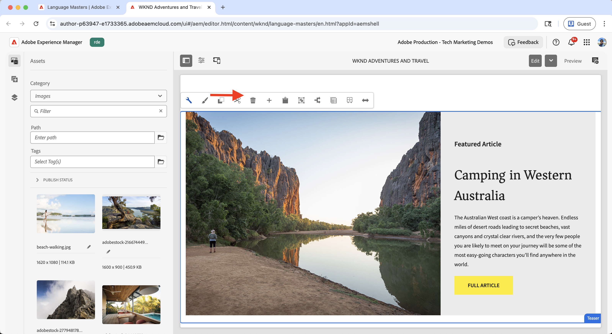

# Sperimentazione (test A/B)

Scopri come testare diverse varianti di contenuto su un sito web AEM as a Cloud Service (AEMCS) utilizzando Adobe Target.

Il test A/B consente di confrontare diverse versioni di contenuto per determinare quale funziona meglio nel raggiungimento degli obiettivi aziendali. Gli scenari comuni includono:

- Verifica delle varianti di titoli, immagini o pulsanti call-to-action in una pagina di destinazione
- Confronto di layout o progettazioni diversi per una pagina dei dettagli di un prodotto
- Valutazione delle offerte promozionali o delle strategie di sconto

## Caso di utilizzo demo

In questo tutorial, puoi configurare i test A/B per il **campeggio in Australia occidentale** frammento di esperienza (XF) sul sito Web WKND. Puoi creare tre varianti XF e gestire il test A/B tramite Adobe Target.

Le varianti vengono visualizzate nella home page di WKND, consentendoti di misurare le prestazioni e determinare quale versione favorisce un coinvolgimento e conversioni migliori.

### Demo live

Visita il [sito Web WKND Enablement](https://wknd.enablementadobe.com/us/en.html) per visualizzare il test A/B in azione. Nel video seguente trovi tutte e tre le varianti di **Campeggio in Western Australia** visualizzate nella home page tramite browser diversi.

>[!VIDEO](https://video.tv.adobe.com/v/3473005/?learn=on&enablevpops)

## Prerequisiti

Prima di procedere con il caso di utilizzo della sperimentazione, assicurati di aver completato quanto segue:

- [Integrare Adobe Target](../setup/integrate-adobe-target.md): consente al team di creare e gestire contenuti personalizzati centralmente in AEM e attivarli come offerte in Adobe Target.
- [Integrare i tag in Adobe Experience Platform](../setup/integrate-adobe-tags.md): consente al team di gestire e distribuire JavaScript per la personalizzazione e la raccolta dati senza dover ridistribuire il codice AEM.

## Passaggi di alto livello

Il processo di configurazione del test A/B prevede sei passaggi principali per creare e configurare l’esperimento:

1. **Creare varianti di contenuto in AEM**
2. **Esporta le varianti come offerte in Adobe Target**
3. **Creare un&#39;attività di test A/B in Adobe Target**
4. **Creare e configurare uno stream di dati in Adobe Experience Platform**
5. **Aggiorna la proprietà Tags con l&#39;estensione Web SDK**
6. **Verifica l&#39;implementazione del test A/B nelle pagine AEM**

## Creare varianti di contenuto in AEM

In questo esempio, utilizzi il **Campeggio in Australia occidentale** Frammento di esperienza (XF) del progetto AEM WKND per creare tre varianti, che verranno utilizzate nella home page del sito Web WKND per i test A/B.

1. In AEM, fai clic sulla scheda **Frammenti esperienza**, passa a **Campeggio nell&#39;Australia occidentale** e fai clic su **Modifica**.
   

1. Nell&#39;editor, nella sezione **Varianti**, fare clic su **Crea** e selezionare **Variante**.\
   

1. Nella finestra di dialogo **Crea variante**:
   - **Modello**: Modello di variante Web frammento esperienza
   - **Titolo**: ad esempio, &quot;Fuori dalla griglia&quot;

   Fai clic su **Fine**.

   

1. Crea la variante copiando il componente **Teaser** dalla variante principale, quindi personalizza il contenuto (ad esempio, aggiorna il titolo e l&#39;immagine).\
   

   >[!TIP]
   >Puoi utilizzare [Genera varianti](https://experience.adobe.com/aem/generate-variations/) per creare rapidamente nuove varianti dall&#39;XF principale.

1. Ripeti i passaggi per creare un’altra variante (ad esempio, &quot;Wandering the Wild&quot;).\
   

   Ora disponi di tre varianti di Frammento esperienza per il test A/B.

1. Prima di visualizzare le varianti utilizzando Adobe Target, è necessario rimuovere il teaser statico esistente dalla home page. Evita contenuti duplicati, in quanto le varianti di Frammento esperienza vengono inserite dinamicamente tramite Target.

   - Passa alla home page **Inglese** `/content/wknd/language-masters/en`
   - Nell&#39;editor, elimina il componente teaser **Camping in Australia occidentale**.\
     

1. Eseguire il rollout delle modifiche alla home page di **Stati Uniti > Inglese** (`/content/wknd/us/en`) per propagare gli aggiornamenti.\
   

1. Pubblica la home page **Stati Uniti > Inglese** per rendere attivi gli aggiornamenti.\
   

## Esportare le varianti come offerte in Adobe Target

Esporta le varianti di Frammento esperienza in modo che possano essere utilizzate come offerte in Adobe Target per il test A/B.

1. In AEM, passa a **Campeggio nell&#39;Australia occidentale**, seleziona le tre varianti e fai clic su **Esporta in Adobe Target**.\
   

2. In Adobe Target, vai a **Offerte** e conferma che le varianti sono state importate.\
   

## Creare un’attività di test A/B in Adobe Target

Ora crea un’attività di test A/B per eseguire l’esperimento sulla pagina home.

1. Installa l&#39;estensione per Chrome [Adobe Experience Cloud Visual Editing Helper](https://chromewebstore.google.com/detail/adobe-experience-cloud-vi/kgmjjkfjacffaebgpkpcllakjifppnca).

1. In Adobe Target, passa a **Attività** e fai clic su **Crea attività**.\
   

1. Nella finestra di dialogo **Crea attività test A/B**, immetti quanto segue:
   - **Tipo**: Web
   - **Compositore**: visivo
   - **URL attività**: ad esempio, `https://wknd.enablementadobe.com/us/en.html`

   Fai clic su **Crea**.

   

1. Rinomina l’attività con un nome significativo (ad esempio, &quot;WKND Homepage A/B Test&quot;).\
   

1. In **Esperienza A**, aggiungi il componente **Frammento esperienza** sopra la sezione **Articoli recenti**.\
   

1. Nella finestra di dialogo del componente, fai clic su **Seleziona un&#39;offerta**.\
   

1. Scegli la variante **Camping in Western Australia** e fai clic su **Aggiungi**.\
   

1. Ripeti per **Esperienza B** e **C**, selezionando rispettivamente **Off the Grid** e **Wandering the Wild**.\
   

1. Nella sezione **Targeting**, conferma che il traffico sia suddiviso in modo uniforme tra tutte le esperienze.\
   

1. In **Obiettivi e impostazioni**, definisci la metrica di successo (ad esempio, CTA fa clic sul frammento di esperienza).\
   

1. Fai clic su **Attiva** nell&#39;angolo in alto a destra per avviare il test.\
   

## Creare e configurare uno stream di dati in Adobe Experience Platform

Per collegare Adobe Web SDK ad Adobe Target, crea uno stream di dati in Adobe Experience Platform. Lo stream di dati funge da livello di routing tra Web SDK e Adobe Target.

1. In Adobe Experience Platform, passa a **Datastreams** e fai clic su **Create Datastream**.\
   

1. Nella finestra di dialogo **Crea flusso di dati**, immetti un **Nome** per il flusso di dati e fai clic su **Salva**.\
   

1. Una volta creato lo stream di dati, fare clic su **Aggiungi servizio**.\
   

1. Nel passaggio **Aggiungi servizio**, seleziona **Adobe Target** dal menu a discesa e immetti l&#39;**ID ambiente di destinazione**. Puoi trovare l&#39;ID ambiente di destinazione in Adobe Target in **Amministrazione** > **Ambienti**. Fai clic su **Salva** per aggiungere il servizio.\
   

1. Controlla i dettagli dello stream di dati per verificare che il servizio Adobe Target sia elencato e configurato correttamente.\
   

## Aggiornare la proprietà Tags con l’estensione Web SDK

Per inviare eventi di personalizzazione e raccolta dati dalle pagine di AEM, aggiungi l’estensione Web SDK alla proprietà Tags e configura una regola che attiva al caricamento della pagina.

1. In Adobe Experience Platform, passa a **Tag** e apri la proprietà creata nel passaggio [Integrare i tag di Adobe](../setup/integrate-adobe-tags.md).
   

1. Dal menu a sinistra, fare clic su **Estensioni**, passare alla scheda **Catalogo** e cercare **Web SDK**. Fai clic su **Installa** nel pannello a destra.\
   

1. Nella finestra di dialogo **Installa estensione**, seleziona lo **stream di dati** creato in precedenza e fai clic su **Salva**.\
   

1. Dopo l&#39;installazione, verificare che entrambe le estensioni **Adobe Experience Platform Web SDK** e **Core** siano visualizzate nella scheda **Installed**.\
   

1. Quindi, configura una regola per inviare l&#39;evento Web SDK al caricamento della libreria. Passa a **Regole** dal menu a sinistra e fai clic su **Crea nuova regola**.

   

   >[!TIP]
   >
   >Una regola consente di definire quando e come i tag si attivano in base alle interazioni dell’utente o agli eventi del browser.

1. Nella schermata **Crea regola**, immetti un nome di regola (ad esempio, `All Pages - Library Loaded - Send Event`) e fai clic su **+ Aggiungi** nella sezione **Eventi**.
   

1. Nella finestra di dialogo **Configurazione evento**:
   - **Estensione**: Seleziona **Core**
   - **Tipo evento**: seleziona **Libreria caricata (parte superiore della pagina)**
   - **Nome**: Immettere `Core - Library Loaded (Page Top)`

   Fai clic su **Mantieni modifiche** per salvare l&#39;evento.

   

1. Nella sezione **Azioni**, fai clic su **+ Aggiungi** per definire l&#39;azione che si verifica quando l&#39;evento viene generato.

1. Nella finestra di dialogo **Configurazione azione**:
   - **Estensione**: Seleziona **Adobe Experience Platform Web SDK**
   - **Tipo azione**: Seleziona **Invia Evento**
   - **Nome**: Seleziona **AEP Web SDK - Invia evento**

   

1. Nella sezione **Personalization** del pannello di destra, seleziona l&#39;opzione **Rendering delle decisioni di personalizzazione visiva**. Quindi, fai clic su **Mantieni modifiche** per salvare l&#39;azione.\
   

   >[!TIP]
   >
   >   Questa azione invia un evento AEP Web SDK al caricamento della pagina, consentendo ad Adobe Target di distribuire contenuti personalizzati.

1. Rivedi la regola completata e fai clic su **Salva**.
   

1. Per applicare le modifiche, vai a **Flusso di pubblicazione**, aggiungi la regola aggiornata a una **Libreria**.\
   

1. Infine, promuovi la libreria in **Produzione**.
   

## Verificare l’implementazione del test A/B nelle pagine di AEM

Una volta che l’attività è live e la libreria Tag è stata pubblicata in produzione, puoi verificare il test A/B sulle pagine AEM.

1. Visita il sito pubblicato (ad esempio, [sito Web di abilitazione WKND](https://wknd.enablementadobe.com/us/en.html)) e osserva quale variante viene visualizzata. Prova ad accedervi da un browser diverso o da un dispositivo mobile per visualizzare varianti alternative.
   

1. Apri gli strumenti di sviluppo del browser e controlla la scheda **Rete**. Filtra per `interact` per trovare la richiesta Web SDK. La richiesta deve contenere i dettagli dell’evento Web SDK.

   

La risposta deve includere le decisioni di personalizzazione prese da Adobe Target, indicando la variante servita.\

1. In alternativa, è possibile utilizzare l&#39;estensione [Adobe Experience Platform Debugger](https://chromewebstore.google.com/detail/adobe-experience-platform/bfnnokhpnncpkdmbokanobigaccjkpob) Chrome per controllare gli eventi Web SDK.
   

## Demo live

Per visualizzare il test A/B in azione, visita il [sito Web WKND Enablement](https://wknd.enablementadobe.com/us/en.html) e osserva come vengono visualizzate diverse varianti del frammento di esperienza nella home page.

## Risorse aggiuntive

- [Panoramica test A/B](https://experienceleague.adobe.com/it/docs/target/using/activities/abtest/test-ab)
- [Adobe Experience Platform Web SDK](https://experienceleague.adobe.com/it/docs/experience-platform/web-sdk/home)
- [Panoramica sugli stream di dati](https://experienceleague.adobe.com/it/docs/experience-platform/datastreams/overview)
- [Compositore esperienza visivo](https://experienceleague.adobe.com/it/docs/target/using/experiences/vec/visual-experience-composer)
