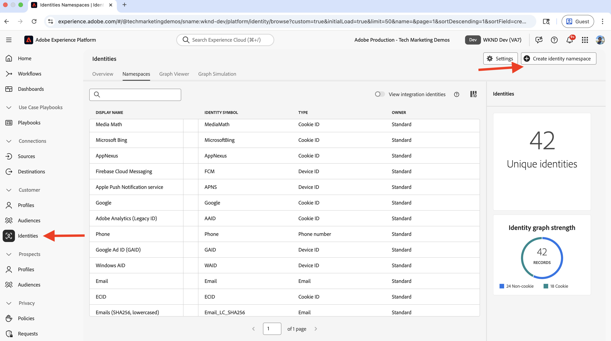
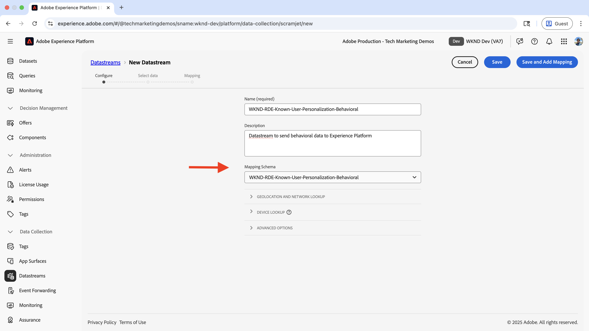
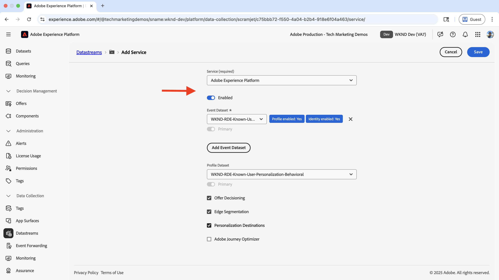
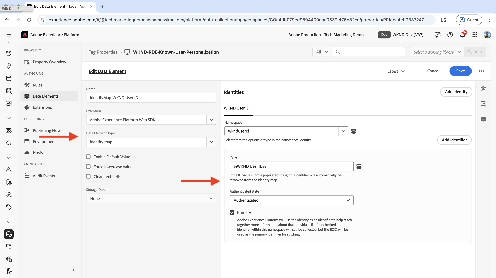
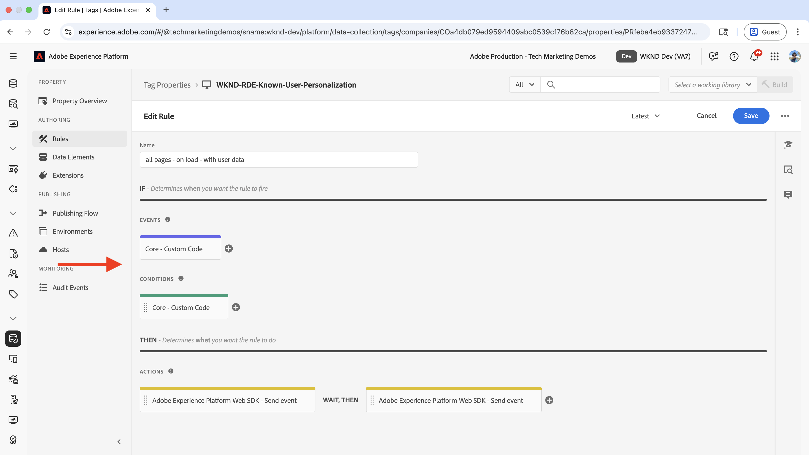
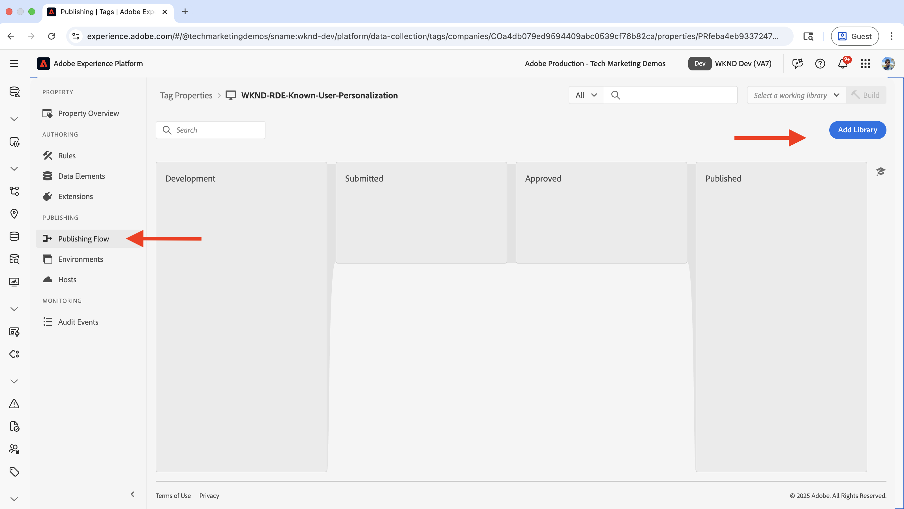
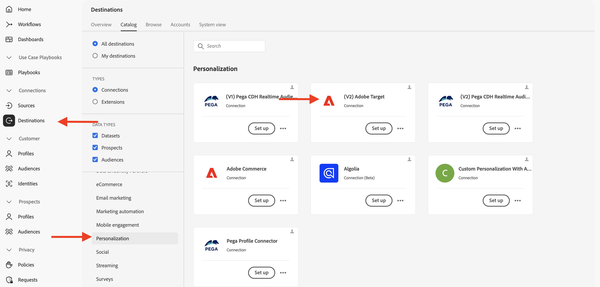
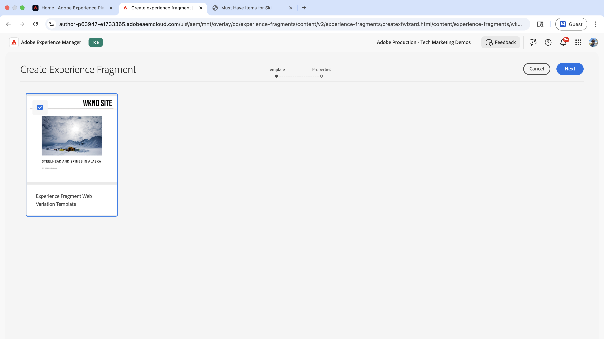

# Personalizzazione dell’utente noto

Scopri come personalizzare il contenuto in base ai dati noti dell’utente, ad esempio la cronologia degli acquisti, i dati di gestione delle relazioni con i clienti o altri dati raccolti sull’utente.

La personalizzazione degli utenti conosciuti ti aiuta a fornire esperienze personalizzate agli utenti in base ai dati che hai raccolto su di loro. I dati dell&#39;utente _potrebbero essere stati raccolti tramite diversi sistemi_ o canali come sito Web, app mobile, call center e così via. Questi _dati vengono quindi uniti per creare un profilo utente completo_ e utilizzati per personalizzare le esperienze.

Gli scenari comuni includono:

- **Personalizzazione dei contenuti**: visualizza esperienze personalizzate in base ai dati del profilo dell&#39;utente. Ad esempio, puoi visualizzare un protagonista personalizzato nella home page in base alla cronologia degli acquisti dell’utente.
- **Upselling e cross-selling**: visualizza consigli personalizzati di upselling e cross-selling in base alla cronologia degli acquisti dell&#39;utente. Ad esempio, visualizza un consiglio di upselling personalizzato per la cronologia degli acquisti dell’utente.
- **Programma fedeltà**: visualizza i benefici del programma fedeltà personalizzati in base alla cronologia degli acquisti dell&#39;utente. Ad esempio, mostra un beneficio del programma fedeltà personalizzato per la cronologia acquisti dell’utente.

La tua organizzazione potrebbe avere casi d’uso diversi per la personalizzazione degli utenti noti. I precedenti sono solo alcuni esempi.

## Caso d’uso di esempio

>[!VIDEO](https://video.tv.adobe.com/v/3476105/?learn=on&enablevpops)

In questa esercitazione, utilizzando il [sito WKND di esempio](https://github.com/adobe/aem-guides-wknd), il processo dimostra come **gli utenti che hanno effettuato l&#39;accesso** che hanno acquistato un&#39;avventura **Ski** vedano un protagonista personalizzato nella **home page WKND**.

L&#39;esperienza protagonista tenta di _vendere in upselling_ l&#39;attrezzatura da sci essenziale agli utenti che hanno acquistato qualsiasi avventura **Ski**. Gli utenti che non hanno acquistato alcuna avventura **Ski** visualizzano il contenuto hero predefinito. Pertanto, l’esperienza principale è personalizzata per gli utenti in base alla cronologia degli acquisti e allo stato di accesso. Per abilitare questa personalizzazione, i dati di diversi sistemi vengono uniti per creare un profilo cliente completo e utilizzati per le attività di personalizzazione.


### Gestione dei dati utente tra i sistemi

A scopo dimostrativo, supponiamo che i dati utente WKND si trovino nei seguenti sistemi. Ogni sistema memorizza diversi tipi di dati che possono essere classificati in due categorie:

- **Dati comportamentali**: acquisisce le interazioni e le attività degli utenti sui canali digitali (visualizzazioni di pagina, clic, navigazione del sito, stato di accesso, modelli di navigazione)
- **Dati transazionali**: registra le transazioni aziendali completate e le informazioni sul profilo cliente (acquisti, cronologia ordini, dettagli profilo, preferenze)

| Sistema | Scopo | Quali dati vengono memorizzati? | Tipo di dati |
|------|------|------|------|
| AEM | Sistema di gestione dei contenuti (CMS), inserzioni e prenotazioni di prodotti Adventure e funzionalità di accesso | Interazioni utente: visualizzazioni di pagina, stato di accesso, navigazione del sito. Identificatori utente minimi come ID utente, nome, e-mail. | Dati comportamentali |
| Altri sistemi | Record di profilo utente e transazioni di acquisto come sistema completo di record. | Profili cliente completi: ID utente, nome, indirizzo, numero di telefono, cronologia acquisti, dettagli ordine, preferenze. | Dati transazionali |

L&#39;altro sistema potrebbe essere un sistema Order Management (OMS), un sistema CRM (Customer Relationship Management), un sistema MDM (Master Data Management) o qualsiasi altro sistema che memorizza i dati transazionali.

Si presume inoltre che il sito WKND disponga di un&#39;interfaccia utente che consente agli utenti di acquistare/prenotare le **avventure**. L’AEM è integrato con l’altro sistema per memorizzare i dati di acquisto dell’avventura. Inoltre, prima o durante l’acquisto, l’utente ha creato un account sul sito WKND.

Il diagramma logico mostra l’interazione dell’utente con il sito WKND e il modo in cui i dati comportamentali e transazionali vengono raccolti e inseriti in Experience Platform.


Questa è una versione eccessivamente semplificata per dimostrare il concetto di personalizzazione dell’utente noto. In uno scenario reale, potresti avere più sistemi in cui vengono raccolti e memorizzati i dati comportamentali e transazionali.

### Elementi principali da ricordare

- **Archiviazione dati distribuita**: i dati utente vengono memorizzati in più sistemi; AEM memorizza dati utente minimi (ID utente, nome, e-mail) per la funzionalità di accesso, mentre altri sistemi (OMS, CRM, MDM) mantengono un profilo utente completo e dati transazionali come la cronologia degli acquisti.
- **Unione identità**: i sistemi sono collegati utilizzando un identificatore comune (ID utente WKND - `wkndUserId`) che identifica in modo univoco gli utenti tra piattaforme e canali diversi.
- **Creazione completa del profilo**: l&#39;obiettivo è quello di unire i dati utente di questi sistemi distribuiti per creare un profilo cliente unificato, che viene quindi utilizzato per fornire esperienze personalizzate.

Il tuo caso d’uso potrebbe avere sistemi e archiviazione dati diversi. La chiave consiste nell’identificare un identificatore comune che identifica in modo univoco gli utenti tra piattaforme e canali diversi.

## Prerequisiti

Prima di procedere con il caso di utilizzo di personalizzazione utente noto, assicurati di aver completato quanto segue:

- [Integrare Adobe Target](../setup/integrate-adobe-target.md): consente ai team di creare e gestire contenuti personalizzati centralmente in AEM e attivarli come offerte in Adobe Target.
- [Integrare i tag in Adobe Experience Platform](../setup/integrate-adobe-tags.md): consente ai team di gestire e distribuire JavaScript per la personalizzazione e la raccolta dati senza dover ridistribuire il codice AEM.

Conoscere anche i concetti di [Adobe Experience Cloud Identity Service (ECID)](https://experienceleague.adobe.com/it/docs/id-service/using/home) e [Adobe Experience Platform](https://experienceleague.adobe.com/it/docs/experience-platform/landing/home), ad esempio schema, set di dati, flusso di dati, tipi di pubblico, identità e profili.

In questo tutorial, scopri l’unione di identità e la creazione di un profilo cliente in Adobe Experience Platform. Pertanto, combinando i dati comportamentali con i dati transazionali per creare un profilo cliente completo.

## Passaggi di alto livello

Il processo di configurazione della personalizzazione per utente noto prevede diversi passaggi tra Adobe Experience Platform, AEM e Adobe Target.

1. **In Adobe Experience Platform:**
   1. Crea _Spazio dei nomi identità_ per l&#39;ID utente WKND (`wkndUserId`)
   1. Crea e configura due schemi XDM (Experience Data Model), strutture di dati standardizzate che definiscono il modo in cui i dati vengono organizzati e convalidati, uno per i dati comportamentali e uno per i dati transazionali
   1. Crea e configura due set di dati, uno per i dati comportamentali e uno per i dati transazionali
   1. Creare e configurare uno stream di dati
   1. Creare e configurare una proprietà Tag
   1. Configurare i criteri di unione per il profilo
   1. Configurazione destinazione Adobe Target (V2)

2. **In AEM:**
   1. Migliora la funzionalità di accesso al sito WKND per memorizzare l’ID utente nell’archiviazione della sessione del browser.
   1. Integrare e inserire la proprietà Tags nelle pagine AEM
   1. Verificare la raccolta dati sulle pagine di AEM
   1. Integrare Adobe Target
   1. Creare offerte personalizzate

3. **In Adobe Experience Platform:**
   1. Verificare i dati comportamentali e la creazione del profilo
   1. Acquisire i dati transazionali
   1. Verificare l’unione dei dati comportamentali e transazionali
   1. Creare e configurare un pubblico
   1. Attivare il pubblico in Adobe Target

4. **In Adobe Target:**
   1. Verificare il pubblico e le offerte
   1. Creare e configurare un’attività

5. **Verifica l&#39;implementazione della personalizzazione dell&#39;utente noto nelle tue pagine AEM**

Le varie soluzioni Adobe Experience Platform (AEP) vengono utilizzate per raccogliere, gestire, identificare e unire i dati utente tra i sistemi. Utilizzando i dati utente uniti, i tipi di pubblico vengono creati e attivati in Adobe Target. Utilizzando le attività in Adobe Target, le esperienze personalizzate vengono distribuite agli utenti che corrispondono ai criteri di pubblico.

## Configurazione Adobe Experience Platform

Per creare un profilo cliente completo, è necessario raccogliere e memorizzare i dati comportamentali (dati di visualizzazione della pagina) e transazionali (acquisti WKND Adventure). I dati comportamentali vengono raccolti utilizzando la proprietà Tags e i dati transazionali tramite il sistema di acquisto WKND Adventure.

I dati transazionali vengono quindi acquisiti in Experience Platform e uniti ai dati comportamentali per creare un profilo cliente completo.

In questo esempio, per categorizzare un utente che ha acquistato un&#39;avventura **Ski**, sono necessari i dati di visualizzazione pagina e i dati di acquisto dell&#39;avventura. I dati vengono uniti utilizzando l&#39;ID utente WKND (`wkndUserId`), che è un identificatore comune tra i sistemi.

Iniziamo registrandoci in Adobe Experience Platform per configurare i componenti necessari per la raccolta e l’unione dei dati.

Accedi a [Adobe Experience Cloud](https://experience.adobe.com/) e passa a **Experience Platform** dalla sezione App Switcher o Accesso rapido.


### Crea spazio dei nomi identità

Uno spazio dei nomi delle identità è un contenitore logico che fornisce contesto alle identità, aiutando Experience Platform a capire quale sistema ID viene utilizzato (ad esempio e-mail, ID CRM o ID fedeltà). Per correlare due o più parti discrete di dati di profilo, viene utilizzato uno spazio dei nomi di identità. Quando entrambe queste parti discrete di dati di profilo hanno lo stesso valore per un attributo e condividono lo stesso spazio dei nomi, vengono unite. Per qualificare un attributo come attributo di unione delle identità, deve trattarsi dello stesso spazio dei nomi.

In questo esempio, l&#39;ID utente WKND (`wkndUserId`) è l&#39;identificatore comune tra i dati comportamentali e transazionali. Utilizzando questo identificatore comune, i dati vengono uniti per creare un profilo cliente completo.

Creiamo uno spazio dei nomi di identità per l&#39;ID utente WKND (`wkndUserId`).

- In **Adobe Experience Platform**, fai clic su **Identità** nell&#39;area di navigazione a sinistra. Fai clic sul pulsante **Crea spazio dei nomi dell&#39;identità** in alto a destra.

  

- Nella finestra di dialogo **Crea spazio dei nomi identità**, immetti quanto segue:
   - **Nome visualizzato**: ID utente WKND
   - **Descrizione**: ID utente o nome utente dell&#39;utente WKND connesso
   - **Seleziona un tipo**: ID individuale multi-dispositivo

  Fai clic su **Crea** per creare lo spazio dei nomi delle identità.

  

### Creare schemi

Uno schema definisce la struttura e il formato dei dati raccolti in Adobe Experience Platform. Garantisce la coerenza dei dati e consente di creare tipi di pubblico significativi in base a campi dati standardizzati. Per la personalizzazione tra utenti noti, sono necessari due schemi, uno per i dati comportamentali e uno per i dati transazionali.

#### Schema dati comportamentali

Innanzitutto, crea uno schema per raccogliere i dati comportamentali, come gli eventi di visualizzazione della pagina e le interazioni degli utenti.

- In **Adobe Experience Platform**, fai clic su **Schemi** nel menu di navigazione a sinistra, quindi fai clic sul pulsante **Crea schema** in alto a destra. Selezionare quindi l&#39;opzione **Manuale** e fare clic sul pulsante **Seleziona**.

  

- Nella procedura guidata **Crea schema**, per il passaggio **Dettagli schema**, seleziona l&#39;opzione **Evento esperienza** (per dati di serie temporali come visualizzazioni di pagina, clic e interazioni utente) e fai clic su **Avanti**.

  

- Per il passaggio **Nome e revisione**, immetti quanto segue:
   - **Nome visualizzato schema**: WKND-RDE-Known-User-Personalization-Behavioral
   - **Classe selezionata**: XDM ExperienceEvent

  

- Aggiorna lo schema come segue:
   - **Aggiungi gruppo di campi**: AEP Web SDK ExperienceEvent
   - **Profilo**: Abilita

  Fai clic su **Salva** per creare lo schema.

  

- Per sapere se l’utente ha effettuato l’accesso (autenticato) o è anonimo, aggiungi un campo personalizzato allo schema. In questo caso d&#39;uso, l&#39;obiettivo è quello di personalizzare il contenuto per gli utenti noti che hanno acquistato un&#39;avventura **Ski**. Pertanto, è importante identificare se l’utente ha effettuato l’accesso (autenticato) o è anonimo.


   - Fare clic sul pulsante **+** accanto al nome dello schema.
   - Nella sezione **Proprietà campo** immettere quanto segue:
      - **Nome campo**: wkndLoginStatus
      - **Nome visualizzato**: stato accesso WKND
      - **Tipo**: Stringa
      - **Assegna a**: gruppo di campi > `wknd-user-details`

     Scorri verso il basso e fai clic sul pulsante **Applica**.

     

- Lo schema finale dei dati comportamentali deve essere simile al seguente:

  

#### Schema dati transazionali

Quindi, crea uno schema per raccogliere i dati transazionali come gli acquisti WKND Adventure.

- Nella procedura guidata **Crea schema**, per il passaggio **Dettagli schema**, seleziona l&#39;opzione **Profilo individuale** (per dati basati su record come attributi del cliente, preferenze e cronologia acquisti) e fai clic su **Avanti**.

  

- Per il passaggio **Nome e revisione**, immetti quanto segue:
   - **Nome visualizzato schema**: WKND-RDE-Known-User-Personalization-Transactional
   - **Classe selezionata**: profilo individuale XDM

  

- Per memorizzare i dettagli di acquisto WKND Adventure di un utente, aggiungiamo prima un campo personalizzato che funge da identificatore per l’acquisto. L&#39;ID utente WKND (`wkndUserId`) è l&#39;identificatore comune tra i sistemi.
   - Fare clic sul pulsante **+** accanto al nome dello schema.
   - Nella sezione **Proprietà campo** immettere quanto segue:
      - **Nome campo**: wkndUserId
      - **Nome visualizzato**: ID utente WKND
      - **Tipo**: Stringa
      - **Assegna a**: gruppo di campi > `wknd-user-purchase-details`

  

   - Scorri verso il basso, controlla **Identità**, controlla **Identità primaria** (l&#39;identificatore principale utilizzato per unire dati da origini diverse in un profilo unificato) e nel menu a discesa **Spazio dei nomi identità** seleziona **ID utente WKND**. Fare clic sul pulsante **Applica**.

  

- Dopo l’aggiunta del campo dell’identità primaria personalizzata, lo schema deve essere simile al seguente:

  

- Allo stesso modo, aggiungi i seguenti campi per memorizzare ulteriori dettagli di acquisto di utenti e avventura:

  | Nome campo | Nome visualizzato | Tipo | Assegna a |
  |----------|------------|----|---------|
  | adventurePurchased | Avventura acquistata | Stringa | Gruppo di campi > `wknd-user-purchase-details` |
  | adventurePurchaseAmount | Importo acquisto avventura | Doppio | Gruppo di campi > `wknd-user-purchase-details` |
  | adventurePurchaseQuantity | Quantità acquisto avventura | Numero intero | Gruppo di campi > `wknd-user-purchase-details` |
  | adventurePurchaseDate | Data acquisto avventura | Data | Gruppo di campi > `wknd-user-purchase-details` |
  | adventureStartDate | Data di inizio dell’avventura | Data | Gruppo di campi > `wknd-user-purchase-details` |
  | adventureEndDate | Data di fine dell’avventura | Data | Gruppo di campi > `wknd-user-purchase-details` |
  | firstName | Nome | Stringa | Gruppo di campi > `wknd-user-purchase-details` |
  | lastName | Cognome | Stringa | Gruppo di campi > `wknd-user-purchase-details` |
  | email | E-mail | Indirizzo e-mail | Gruppo di campi > `wknd-user-purchase-details` |
  | phone | Telefono | Oggetto | Gruppo di campi > `wknd-user-purchase-details` |
  | genere | Genere | Stringa | Gruppo di campi > `wknd-user-purchase-details` |
  | età | Età | Numero intero | Gruppo di campi > `wknd-user-purchase-details` |
  | indirizzo | Indirizzo | Stringa | Gruppo di campi > `wknd-user-purchase-details` |
  | città | Città | Stringa | Gruppo di campi > `wknd-user-purchase-details` |
  | stato | Stato | Stringa | Gruppo di campi > `wknd-user-purchase-details` |
  | paese | Paese | Stringa | Gruppo di campi > `wknd-user-purchase-details` |
  | zipCode | Codice postale | Stringa | Gruppo di campi > `wknd-user-purchase-details` |

  

- Abilita Profilo per lo schema.

  

Ora hai creato entrambi gli schemi per i dati comportamentali e transazionali.

### Creare e configurare i set di dati

Un set di dati è un contenitore per i dati che seguono uno schema specifico. In questo esempio, crea due set di dati, uno per i dati comportamentali e uno per i dati transazionali.

#### Set di dati comportamentali

- In **Adobe Experience Platform**, fai clic su **Set di dati** nel menu di navigazione a sinistra, quindi fai clic sul pulsante **Crea set di dati** in alto a destra. Seleziona quindi l&#39;opzione **Basata su schema** e fai clic su **Avanti**.

  

- Per il passaggio **Seleziona schema**, seleziona lo schema **WKND-RDE-Known-User-Personalization-Behavioral** e fai clic su **Avanti**.

  

- Per il passaggio **Configura set di dati**, immetti quanto segue:
   - **Nome**: WKND-RDE-Known-User-Personalization-Behavioral
   - **Descrizione**: set di dati per i dati comportamentali, ad esempio le visualizzazioni di pagina con stato di accesso utente.

  

  Fai clic su **Fine** per creare il set di dati.

- Attiva l&#39;opzione **Profilo** per abilitare il set di dati per il profilo.

  

#### Set di dati transazionali

- Ripeti gli stessi passaggi per il set di dati sulle transazioni. L’unica differenza è il nome dello schema e del set di dati.

   - **Schema**: WKND-RDE-Known-User-Personalization-Transactional
   - **Set di dati**: WKND-RDE-Known-User-Personalization-Transactional
   - **Descrizione**: set di dati per i dati transazionali, ad esempio acquisti WKND Adventure.
   - **Profilo**: Abilita

  Il set di dati finale sui dati transazionali deve essere simile al seguente:

  

Con entrambi i set di dati attivi, ora puoi creare un flusso di dati per abilitare il flusso di dati dal sito web ad Experience Platform.

### Creare e configurare uno stream di dati

Un flusso di dati è una configurazione che definisce il modo in cui i dati fluiscono dal sito web a Adobe Experience Platform tramite il Web SDK. Funge da Bridge tra il sito web e la piattaforma, garantendo che i dati siano formattati correttamente e instradati ai set di dati corretti. Per la personalizzazione degli utenti noti, abilita servizi come Segmentazione di Edge e Destinazioni di Personalization.

Creiamo un flusso di dati per inviare i dati _comportamentali_ (e non transazionali) ad Experience Platform tramite Web SDK.

- In **Adobe Experience Platform**, fai clic su **Datastreams** nel menu di navigazione a sinistra, quindi fai clic su **Create datastream**.

  

- Nel passaggio **Nuovo flusso di dati**, immetti quanto segue:

   - **Nome**: WKND-RDE-Known-User-Personalization-Behavioral
   - **Descrizione**: stream di dati per inviare dati comportamentali ad Experience Platform
   - **Schema di mappatura**: WKND-RDE-Known-User-Personalization-Behavioral

  

  Fai clic su **Salva** per creare lo stream di dati.

- Una volta creato lo stream di dati, fare clic su **Aggiungi servizio**.

  

- Nel passaggio **Aggiungi servizio**, seleziona **Adobe Experience Platform** dal menu a discesa e immetti quanto segue:
   - **Set di dati evento**: WKND-RDE-Known-User-Personalization-Behavioral
   - **Set di dati profilo**: WKND-RDE-Known-User-Personalization-Behavioral
   - **Offer Decisioning**: abilita (consente ad Adobe Target di richiedere e consegnare offerte personalizzate in tempo reale)
   - **Segmentazione di Edge**: abilita (valuta i tipi di pubblico in tempo reale nella rete Edge per la personalizzazione immediata)
   - **Destinazioni Personalization**: abilita (consente la condivisione del pubblico con strumenti di personalizzazione come Adobe Target)

  Fai clic su **Salva** per aggiungere il servizio.

  

- Nel passaggio **Aggiungi servizio**, seleziona **Adobe Target** dal menu a discesa e immetti l&#39;**ID ambiente di destinazione**. Puoi trovare l&#39;ID ambiente di destinazione in Adobe Target in **Amministrazione** > **Ambienti**. Fai clic su **Salva** per aggiungere il servizio.
  

- Lo stream di dati finale sarà simile al seguente:

  

Il flusso di dati è ora configurato per inviare dati comportamentali ad Experience Platform tramite Web SDK.

Tieni presente che i dati _transazionali_ vengono acquisiti in Experience Platform utilizzando l&#39;acquisizione batch (un metodo per caricare set di dati di grandi dimensioni a intervalli pianificati anziché in tempo reale). I dati di acquisto di WKND Adventure vengono raccolti utilizzando il sito WKND e memorizzati nell’altro sistema (ad esempio, OMS, CRM o MDM). I dati vengono quindi acquisiti in Experience Platform utilizzando l’acquisizione batch.

È inoltre possibile acquisire tali dati direttamente dal sito Web ad Experience Platform, operazione non inclusa in questa esercitazione. Il caso d’uso vuole evidenziare il processo di unione dei dati utente tra sistemi e creazione di un profilo cliente completo.

## Creare e configurare una proprietà Tags

Una proprietà Tags è un contenitore per il codice JavaScript che raccoglie i dati dal sito Web e li invia a Adobe Experience Platform. Agisce come livello di raccolta dei dati che acquisisce le interazioni degli utenti e le visualizzazioni di pagina. Per la personalizzazione degli utenti noti, insieme ai dati di visualizzazione della pagina (ad esempio nome della pagina, URL, sezione del sito e nome host), vengono raccolti anche lo stato di accesso degli utenti e l’ID utente WKND. L&#39;ID utente WKND (`wkndUserId`) viene inviato come parte dell&#39;oggetto Identity Map.

Creiamo una proprietà Tags che acquisisce i dati di visualizzazione della pagina e lo stato di accesso dell’utente + ID utente (se connesso) quando gli utenti visitano il sito WKND.

Puoi aggiornare la proprietà Tags creata nel passaggio [Integrare tag Adobe](../setup/integrate-adobe-tags.md). Tuttavia, per semplificarla, viene creata una nuova proprietà Tags.

### Crea proprietà tag

- In **Adobe Experience Platform**, fai clic su **Tag** nel menu di navigazione a sinistra e quindi sul pulsante **Nuova proprietà**.

  

- Nella finestra di dialogo **Crea proprietà**, immetti quanto segue:
   - **Nome proprietà**: WKND-RDE-Known-User-Personalization
   - **Tipo di proprietà**: selezionare **Web**
   - **Dominio**: il dominio in cui si distribuisce la proprietà (ad esempio, `adobeaemcloud.com`)

  Fai clic su **Salva** per creare la proprietà.

  

- Apri la nuova proprietà e fai clic su **Estensioni** nel menu di navigazione a sinistra, quindi fai clic sulla scheda **Catalogo**. Cerca **Web SDK** e fai clic sul pulsante **Installa**.
  

- Nella finestra di dialogo **Installa estensione**, seleziona lo **stream di dati** creato in precedenza e fai clic su **Salva**.
  

#### Aggiungi elementi dei dati

Gli elementi dati sono variabili che acquisiscono punti dati specifici dal sito web e li rendono disponibili per l’utilizzo in regole e altre configurazioni di tag. Agiscono da blocchi predefiniti per la raccolta dei dati, consentendo di estrarre informazioni significative dalle interazioni degli utenti e dalle visualizzazioni di pagina. Per la personalizzazione degli utenti noti, è necessario acquisire dettagli di pagina come il nome host, la sezione del sito e il nome della pagina per creare segmenti di pubblico. Inoltre, è necessario acquisire lo stato di accesso dell’utente e l’ID utente WKND (se connesso).

Crea i seguenti elementi dati per acquisire i dettagli importanti della pagina.

- Fare clic su **Elementi dati** nel menu di navigazione a sinistra e quindi sul pulsante **Crea nuovo elemento dati**.
  

- Nella finestra di dialogo **Crea nuovo elemento dati**, immetti quanto segue:
   - **Nome**: Nome host
   - **Estensione**: Seleziona **Core**
   - **Tipo Elemento Dati**: Seleziona **Codice Personalizzato**
   - **Apri il pulsante Editor** e immetti il seguente frammento di codice:

     ```javascript
     if(window && window.location && window.location.hostname) {
         return window.location.hostname;
     }        
     ```

  

- Allo stesso modo, crea i seguenti elementi di dati:

   - **Nome**: sezione del sito
   - **Estensione**: Seleziona **Core**
   - **Tipo Elemento Dati**: Seleziona **Codice Personalizzato**
   - **Apri il pulsante Editor** e immetti il seguente frammento di codice:

     ```javascript
     if(event && event.component && event.component.hasOwnProperty('repo:path')) {
         let pagePath = event.component['repo:path'];
     
         let siteSection = '';
     
         //Check of html String in URL.
         if (pagePath.indexOf('.html') > -1) { 
         siteSection = pagePath.substring(0, pagePath.lastIndexOf('.html'));
     
         //replace slash with colon
         siteSection = siteSection.replaceAll('/', ':');
     
         //remove `:content`
         siteSection = siteSection.replaceAll(':content:','');
         }
     
         return siteSection 
     }        
     ```

  

   - **Nome**: Nome Pagina
   - **Estensione**: Seleziona **Core**
   - **Tipo Elemento Dati**: Seleziona **Codice Personalizzato**
   - **Apri il pulsante Editor** e immetti il seguente frammento di codice:

     ```javascript
     if(event && event.component && event.component.hasOwnProperty('dc:title')) {
         // return value of 'dc:title' from the data layer Page object, which is propogated via 'cmp:show' event
         return event.component['dc:title'];
     }
     ```

  


   - **Nome**: ID utente WKND
   - **Estensione**: Seleziona **Core**
   - **Tipo Elemento Dati**: Seleziona **Codice Personalizzato**
   - **Apri il pulsante Editor** e immetti il seguente frammento di codice:

     ```javascript
     // Data element for WKND User ID
     if(event && event.user && event.user.userId) {
         console.log('UserID:', event.user.userId);
         return event.user.userId;
     } else {
         console.log('UserID:');
         return "";
     }        
     ```

  


   - **Nome**: stato utente WKND
   - **Estensione**: Seleziona **Core**
   - **Tipo Elemento Dati**: Seleziona **Codice Personalizzato**
   - **Apri il pulsante Editor** e immetti il seguente frammento di codice:

     ```javascript
     // Data element for user login status
     if(event && event.user && event.user.status) {
         console.log('User status:', event.user.status);
         return event.user.status;
     } else {
         console.log('User status:anonymous');
         return 'anonymous';
     }        
     ```

  

- Quindi, crea un elemento dati di tipo **Identity Map**. Identity Map è una struttura XDM standard che memorizza più identificatori utente e li collega tra loro, consentendo l’unione delle identità tra i sistemi. Questo elemento dati viene utilizzato per memorizzare l’ID utente WKND (se connesso) come parte dell’oggetto Identity Map.

   - **Nome**: ID utente IdentityMap-WKND
   - **Estensione**: Seleziona **Adobe Experience Platform Web SDK**
   - **Tipo di elemento dati**: selezionare **Mappa identità**

  Nel pannello a destra,
   - **Spazio dei nomi**: selezionare **wkndUserId**
   - **ID**: Seleziona **ID utente WKND** elemento dati
   - **Stato autenticazione**: selezionare **Autenticato**
   - **Principale**: Seleziona **true**


  Fai clic su **Salva** per creare l&#39;elemento dati.

  

- Quindi, creare un elemento dati di tipo **Variabile**. Questo elemento dati viene compilato con i dettagli della pagina prima di inviarlo all’Experience Platform.

   - **Nome**: XDM-Variable Pageview
   - **Estensione**: Seleziona **Adobe Experience Platform Web SDK**
   - **Tipo Di Elemento Dati**: Seleziona **Variabile**

  Nel pannello a destra,
   - **Sandbox**: seleziona la sandbox
   - **Schema**: selezionare lo schema **WKND-RDE-Known-User-Personalization**

  Fai clic su **Salva** per creare l&#39;elemento dati.

  

   - Gli elementi dati finali dovrebbero essere simili al seguente:

     

#### Aggiungi regole

Le regole definiscono quando e come i dati vengono raccolti e inviati a Adobe Experience Platform. Fungono da livello logico che determina cosa accade quando si verificano eventi specifici sul sito web. Per la personalizzazione degli utenti noti, crea regole per acquisire i dati di visualizzazione della pagina e lo stato di accesso dell’utente + ID utente (se connesso) quando gli utenti visitano il sito WKND.

Creare una regola per popolare l&#39;elemento dati **Pageview** della variabile XDM utilizzando gli altri elementi dati prima di inviarlo ad Experience Platform. La regola viene attivata quando un utente esplora il sito web WKND.

- Fai clic su **Regole** nella barra di navigazione a sinistra, quindi fai clic sul pulsante **Crea nuova regola**.
  

- Nella finestra di dialogo **Crea nuova regola**, immetti quanto segue:
   - **Nome**: tutte le pagine - al caricamento - con dati utente

   - Per la sezione **Eventi**, fare clic su **Aggiungi** per aprire la procedura guidata **Configurazione evento**.
      - **Estensione**: Seleziona **Core**
      - **Tipo evento**: selezionare **Codice personalizzato**
      - **Apri il pulsante Editor** e immetti il seguente frammento di codice:

     ```javascript
     var pageShownEventHandler = function(evt) {
         // defensive coding to avoid a null pointer exception
         if(evt.hasOwnProperty("eventInfo") && evt.eventInfo.hasOwnProperty("path")) {
             //trigger Launch Rule and pass event
             console.debug("cmp:show event: " + evt.eventInfo.path);
     
             // Get user data from session storage
             var userData = getUserDataFromSession();
     
             var event = {
                 //include the path of the component that triggered the event
                 path: evt.eventInfo.path,
                 //get the state of the component that triggered the event
                 component: window.adobeDataLayer.getState(evt.eventInfo.path),
                 //include user data in the event
                 user: userData
             };
     
             //Trigger the Launch Rule, passing in the new 'event' object
             trigger(event);
         }
     }
     
     /**
      * Get user data from session storage
     */
     function getUserDataFromSession() {
         var userData = {
             userId: null,
             status: 'anonymous'
         };
     
         try {
             var cachedUserState = sessionStorage.getItem('wknd_user_state');
     
             if (cachedUserState) {
                 var userState = JSON.parse(cachedUserState);
                 var userInfo = userState.data;
     
                 // Validate user data structure before transformation
                 if (userInfo && typeof userInfo === 'object' && userInfo.hasOwnProperty('authorizableId')) {
                     // Transform AEM user data to minimal AEP format
                     userData = {
                         userId: userInfo.authorizableId !== 'anonymous' ? userInfo.authorizableId : null,
                         status: userInfo.authorizableId === 'anonymous' ? 'anonymous' : 'authenticated',
                     };
     
                     //console.log('User details from session storage:', userData.username || 'Anonymous');
                 } else {
                     console.warn('Invalid user data structure in session storage');
                     console.log('Using anonymous user data');
                 }
             } else {
                 console.log('No user data in session storage, using anonymous');
             }
         } catch (e) {
             console.warn('Failed to read user data from session storage:', e);
             console.log('Using anonymous user data');
         }
     
         return userData;
     }
     
     //set the namespace to avoid a potential race condition
     window.adobeDataLayer = window.adobeDataLayer || [];
     
     //push the event listener for cmp:show into the data layer
     window.adobeDataLayer.push(function (dl) {
         //add event listener for 'cmp:show' and callback to the 'pageShownEventHandler' function
         dl.addEventListener("cmp:show", pageShownEventHandler);
     });
     ```

     Si noti che la funzione `getUserDataFromSession` viene utilizzata per ottenere lo stato di accesso dell&#39;utente e l&#39;ID utente WKND (se connesso) dall&#39;archiviazione della sessione. Il codice AEM è responsabile del popolamento dell’archiviazione della sessione con lo stato di accesso dell’utente e l’ID utente WKND. Nel passaggio specifico di AEM, hai migliorato la funzionalità di accesso al sito WKND per memorizzare l’ID utente nell’archiviazione della sessione del browser.

   - Per la sezione **Conditions**, fare clic su **Add** per aprire la procedura guidata **Condition Configuration**.
      - **Tipo di logica**: Seleziona **Normale**
      - **Estensione**: Seleziona **Core**
      - **Tipo Condizione**: Seleziona **Codice Personalizzato**
      - **Apri il pulsante Editor** e immetti il seguente frammento di codice:

     ```javascript
     if(event && event.component && event.component.hasOwnProperty('@type') && event.component.hasOwnProperty('xdm:template')) {
         console.log('The cmp:show event is from PAGE HANDLE IT');
         return true;
     } else {
         console.log('The event is NOT from PAGE - IGNORE IT');
         return false;
     }
     ```

   - Per la sezione **Azioni**, fare clic su **Aggiungi** per aprire la procedura guidata **Configurazione azione**.
      - **Estensione**: Seleziona **Adobe Experience Platform Web SDK**
      - **Tipo azione**: Seleziona **Aggiorna variabile**

      - Mappa i campi XDM sugli elementi di dati:

        | Campo XDM | Elemento dati |
        |----------|------------|
        | web.webPageDetails.name | Nome pagina |
        | web.webPageDetails.server | Nome host |
        | web.webPageDetails.siteSection | Sezione del sito |
        | web.webPageDetails.value | 1 |
        | identityMap | ID utente IdentityMap-WKND |
        | _$YOUR_NAMESPACE$.wkndLoginStatus | Stato utente WKND |

     

      - Fai clic su **Mantieni modifiche** per salvare la configurazione dell&#39;azione.

   - Di nuovo, fai clic su Aggiungi per aggiungere un’altra azione e aprire la Configurazione guidata azioni.

      - **Estensione**: Seleziona **Adobe Experience Platform Web SDK**
      - **Tipo azione**: Seleziona **Invia evento**
      - Nella sezione **Dati** del pannello di destra, mappa l&#39;elemento dati **Pageview** variabile XDM con il tipo **Visualizzazioni pagina Web Webpagedetails**.

     

   - Inoltre, nella sezione **Personalization** del pannello di destra, seleziona l&#39;opzione **Rendering delle decisioni di personalizzazione visiva**. Quindi fai clic su **Mantieni modifiche** per salvare l&#39;azione.

     

- La regola deve essere simile alla seguente:

  

La regola ora è configurata per inviare ad Experience Platform i dati di visualizzazione della pagina e lo stato di accesso dell’utente + ID utente (se connesso).

I passaggi di creazione delle regole di cui sopra presentano un numero considerevole di dettagli, quindi fai attenzione durante la creazione della regola. Potrebbe sembrare complesso, ma tieni presente che questi passaggi di configurazione lo rendono plug and play senza dover aggiornare il codice AEM e ridistribuire l’applicazione.

#### Aggiungi e pubblica libreria di tag

Una libreria è una raccolta di tutte le configurazioni di tag (elementi di dati, regole, estensioni) che viene generata e distribuita sul sito web. Raccoglie tutti gli elementi in modo che la raccolta dei dati funzioni correttamente. Per la personalizzazione da parte degli utenti noti, la libreria viene pubblicata per rendere attive le regole di raccolta dati nel sito web.

- Fare clic su **Flusso di pubblicazione** nel menu di navigazione a sinistra e fare clic sul pulsante **Aggiungi libreria**.
  

- Nella finestra di dialogo **Aggiungi libreria**, immetti quanto segue:
   - **Nome**: 1,0
   - **Ambiente**: Seleziona **Sviluppo**
   - Fare clic su **Aggiungi tutte le risorse modificate** per selezionare tutte le risorse.

  Fai clic su **Salva e genera in sviluppo** per creare la libreria.

  

- Per pubblicare la libreria in produzione, fai clic su **Approva e pubblica in produzione**. Una volta completata la pubblicazione, la proprietà è pronta per essere utilizzata in AEM.
  

La libreria è ora pubblicata ed è pronta per raccogliere dati dalle pagine AEM.

### Configurare i criteri di unione per il profilo

Un criterio di unione definisce il modo in cui i dati del cliente provenienti da più origini vengono unificati in un unico profilo. Determina quali dati hanno la precedenza in caso di conflitti, assicurandoti di avere una visione completa e coerente di ciascun cliente per la personalizzazione degli utenti noti.

- In **Adobe Experience Platform**, fai clic su **Profili** nel menu di navigazione a sinistra e quindi sulla scheda **Criteri di unione**.

  

Ai fini di questo caso d’uso, viene creato un criterio di unione. È tuttavia possibile utilizzare un criterio di unione esistente, se disponibile. Assicurati di abilitare entrambe le opzioni **Criterio di unione predefinito** e **Criterio di unione attivo su Edge** (che consente ai dati del profilo di essere disponibili nella rete Edge per le decisioni di personalizzazione in tempo reale).

Queste impostazioni garantiscono che i dati comportamentali e transazionali siano correttamente unificati e disponibili per la valutazione del pubblico in tempo reale.


### Configurazione destinazione Adobe Target (V2)

La destinazione di Adobe Target (V2) consente di attivare i tipi di pubblico creati in Experience Platform direttamente in Adobe Target. Questa connessione consente di utilizzare i tipi di pubblico per attività di personalizzazione in Adobe Target.

- In **Adobe Experience Platform**, fai clic su **Destinazioni** nel menu di navigazione a sinistra e quindi sulla scheda **Catalogo**. Cerca **Personalization** e seleziona la destinazione **(v2) Adobe Target**.

  

- Nel passaggio **Attiva destinazioni**, specifica un nome per la destinazione e fai clic sul pulsante **Connetti alla destinazione**.
  

- Nella sezione **Dettagli destinazione**, immetti quanto segue:
   - **Nome**: WKND-RDE-Known-User-Personalization-Destination
   - **Descrizione**: destinazione della personalizzazione utente noto
   - **Datastream**: seleziona lo **Datastream** creato in precedenza
   - **Workspace**: seleziona la tua area di lavoro Adobe Target

  

- Fai clic su **Avanti** e completa la configurazione di destinazione.

  

Una volta configurata, questa destinazione ti consente di attivare su Adobe Target i tipi di pubblico creati in Experience Platform da utilizzare nelle attività di personalizzazione.

## Configurazione di AEM

Nei passaggi seguenti, migliora la funzionalità di accesso al sito WKND per memorizzare l’ID utente nell’archiviazione della sessione del browser e integrare e inserire la proprietà Tag nelle pagine di AEM.

La proprietà tags viene inserita nelle pagine di AEM per raccogliere i dati di visualizzazione della pagina e lo stato di accesso dell’utente + ID utente (se connesso) quando gli utenti visitano il sito WKND. L’integrazione di Adobe Target consente di esportare le offerte personalizzate in Adobe Target.

### Migliorare la funzionalità di accesso al sito WKND

Per migliorare la funzionalità di accesso al sito WKND, clona il [progetto del sito WKND](https://github.com/adobe/aem-guides-wknd) da GitHub, crea un nuovo ramo di funzionalità e aprilo nell&#39;IDE preferito.

```shell
$ mkdir -p ~/Code
$ git clone git@github.com:adobe/aem-guides-wknd.git
$ cd aem-guides-wknd
$ git checkout -b feature/known-user-personalization
```

- Passare al modulo `ui.frontend` e aprire il file `ui.frontend/src/main/webpack/components/form/sign-in-buttons/sign-in-buttons.js`. Rivedi il codice: dopo aver eseguito una chiamata AJAX a `currentuser.json`, viene visualizzato il pulsante Accedi o Disconnetti in base allo stato di accesso dell&#39;utente.

- Aggiorna il codice per memorizzare l&#39;ID utente nell&#39;archiviazione della sessione del browser e ottimizza il codice per evitare di effettuare più chiamate AJAX a `currentuser.json`.

  ```javascript
  import jQuery from "jquery";
  
  jQuery(function($) {
      "use strict";
  
      (function() {
          const currentUserUrl = $('.wknd-sign-in-buttons').data('current-user-url'),
              signIn = $('[href="#sign-in"]'),
              signOut = $('[href="#sign-out"]'),
              greetingLabel = $('#wkndGreetingLabel'),
              greetingText = greetingLabel.text(),
              body = $('body');
  
          // Cache configuration
          const CACHE_KEY = 'wknd_user_state';
          const CACHE_DURATION = 5 * 60 * 1000; // 5 minutes in milliseconds
  
          /**
           * Get cached user state from session storage
           */
          function getCachedUserState() {
              try {
                  const cached = sessionStorage.getItem(CACHE_KEY);
                  if (cached) {
                      const userState = JSON.parse(cached);
                      const now = Date.now();
  
                      // Check if cache is still valid
                      if (userState.timestamp && (now - userState.timestamp) < CACHE_DURATION) {
                          return userState.data;
                      } else {
                          // Cache expired, remove it
                          sessionStorage.removeItem(CACHE_KEY);
                      }
                  }
              } catch (e) {
                  console.warn('Failed to read cached user state:', e);
                  sessionStorage.removeItem(CACHE_KEY);
              }
              return null;
          }
  
          /**
           * Cache user state in session storage
           */
          function cacheUserState(userData) {
              try {
                  const userState = {
                      data: userData,
                      timestamp: Date.now()
                  };
                  sessionStorage.setItem(CACHE_KEY, JSON.stringify(userState));
              } catch (e) {
                  console.warn('Failed to cache user state:', e);
              }
          }
  
          /**
           * Clear cached user state
           */
          function clearCachedUserState() {
              try {
                  sessionStorage.removeItem(CACHE_KEY);
              } catch (e) {
                  console.warn('Failed to clear cached user state:', e);
              }
          }
  
          /**
           * Update UI based on user state
           */
          function updateUI(userData) {
              const isAnonymous = 'anonymous' === userData.authorizableId;
  
              if(isAnonymous) {
                  signIn.show();
                  signOut.hide();
                  greetingLabel.hide();
                  body.addClass('anonymous');
              } else {
                  signIn.hide();
                  signOut.show();
                  greetingLabel.text(greetingText + ", " + userData.name);
                  greetingLabel.show();
                  body.removeClass('anonymous');
              }
          }
  
          /**
           * Fetch user data from AEM endpoint
           */
          function fetchUserData() {
              return $.getJSON(currentUserUrl + "?nocache=" + new Date().getTime())
                  .fail(function(xhr, status, error) {
                      console.error('Failed to fetch user data:', error);
                      updateUI({ authorizableId: 'anonymous' });
                  });
          }
  
          /**
           * Initialize user state (check cache first, then fetch if needed)
           */
          function initializeUserState() {
              const cachedUserState = getCachedUserState();
  
              if (cachedUserState) {
                  updateUI(cachedUserState);
              } else {
                  fetchUserData().done(function(currentUser) {
                      updateUI(currentUser);
                      cacheUserState(currentUser);
                  });
              }
          }
  
          // Initialize user state
          initializeUserState();
  
          // Clear cache on sign-in/sign-out clicks
          $(document).on('click', '[href="#sign-in"], [href="#sign-out"]', function() {
              clearCachedUserState();
          });
  
          // Clear cache when modal is shown
          $('body').on('wknd-modal-show', function() {
              clearCachedUserState();
          });
  
          // Clear cache when on dedicated sign-in page
          if (window.location.pathname.includes('/sign-in') || window.location.pathname.includes('/errors/sign-in')) {
              clearCachedUserState();
          }
  
          // Clear cache when sign-in form is submitted
          $(document).on('submit', 'form[id*="sign-in"], form[action*="login"]', function() {
              clearCachedUserState();
          });
  
          // Clear cache on successful login redirect
          const urlParams = new URLSearchParams(window.location.search);
          if (urlParams.has('login') || urlParams.has('success') || window.location.hash === '#login-success') {
              clearCachedUserState();
          }
  
          // Debug function for testing
          window.debugUserState = function() {
              console.log('Cache:', sessionStorage.getItem('wknd_user_state'));
              clearCachedUserState();
              initializeUserState();
          };
  
      })();
  });
  ```

  La regola della proprietà Tags si basa sull&#39;ID utente memorizzato nell&#39;archivio della sessione del browser. La chiave `wknd_user_state` è un contratto comune tra il codice AEM e la regola della proprietà Tags per l&#39;archiviazione e il recupero dell&#39;ID utente.

- Verifica le modifiche localmente generando il progetto ed eseguendolo localmente.

  ```shell
  $ mvn clean install -PautoInstallSinglePackage
  ```

  Accedi utilizzando le credenziali `asmith/asmith` (o qualsiasi altro utente creato), sono [inclusi](https://github.com/adobe/aem-guides-wknd/blob/main/ui.content.sample/src/main/content/jcr_root/home/users/wknd/l28HasMYWAMHAaGkv-Lj/.content.xml) nel progetto `aem-guides-wknd`.

  

  Nel mio caso, ho creato un nuovo utente con l&#39;ID `teddy` per il test.

- Dopo aver confermato che l’ID utente è memorizzato nell’archivio della sessione del browser (utilizzando gli strumenti per sviluppatori del browser), conferma e invia le modifiche all’archivio remoto Adobe Cloud Manager.

  ```shell
  $ git add .
  $ git commit -m "Enhance the WKND site Login functionality to store the user ID in browser's session storage"
  $ git push adobe-origin feature/known-user-personalization
  ```

- Distribuisci le modifiche nell’ambiente AEM as a Cloud Service utilizzando le pipeline Cloud Manager o il comando AEM RDE.

### Integrare e inserire la proprietà Tags nelle pagine AEM

Questo passaggio integra la proprietà Tags creata in precedenza nelle pagine AEM, abilitando la raccolta dati per la personalizzazione degli utenti noti. La proprietà Tags acquisisce automaticamente i dati di visualizzazione della pagina e lo stato di accesso dell’utente + ID utente (se connesso) quando gli utenti visitano il sito WKND.

Per integrare la proprietà Tags nelle pagine di AEM, seguire la procedura descritta in [Integrare i tag in Adobe Experience Platform](../setup/integrate-adobe-tags.md).

Utilizzare la proprietà **WKND-RDE-Known-User-Personalization** Tags creata in precedenza, non una proprietà diversa.


Una volta integrata, la proprietà Tags inizia a raccogliere i dati di personalizzazione degli utenti noti dalle pagine AEM e a inviarli ad Experience Platform per la creazione di un pubblico.

### Verificare la raccolta dati sulle pagine di AEM

Per verificare la raccolta dati dalle pagine di AEM, puoi utilizzare gli strumenti di sviluppo del browser per esaminare le richieste di rete e visualizzare i dati inviati ad Experience Platform. È inoltre possibile utilizzare [Experience Platform Debugger](https://chromewebstore.google.com/detail/adobe-experience-platform/bfnnokhpnncpkdmbokanobigaccjkpob) per verificare la raccolta dati.

- Nel browser, accedi al sito WKND distribuito nell’ambiente AEM as a Cloud Service. Dato che sei anonimo, dovresti vedere richieste di raccolta dati simili.

  

- Accedi utilizzando le credenziali `asmith/asmith`. Dovresti vedere richieste di raccolta dati simili.

  

Le variabili `identityMap` e `_YOUR_NAMESPACE.wkndLoginStatus` sono impostate rispettivamente sull&#39;ID utente e sullo stato di accesso.

### Integrare Adobe Target

Questo passaggio integra Adobe Target con AEM e consente l’esportazione di contenuti personalizzati (frammenti di esperienza) in Adobe Target. Questa connessione consente ad Adobe Target di utilizzare i contenuti creati in AEM per attività di personalizzazione con il pubblico noto creato in Experience Platform.

Per integrare Adobe Target ed esportare le offerte di pubblico **WKND-RDE-Known-User-Personalization** in Adobe Target, segui la procedura descritta in [Integrare Adobe Target in Adobe Experience Platform](../setup/integrate-adobe-target.md).

Assicurati che la configurazione di Target sia applicata ai frammenti di esperienza in modo che possano essere esportati in Adobe Target per l’utilizzo in attività di personalizzazione.


Una volta integrati, puoi esportare i frammenti di esperienza da AEM ad Adobe Target, dove vengono utilizzati come offerte personalizzate per il pubblico di utenti noti.

### Creare offerte personalizzate

I frammenti di esperienza sono componenti di contenuto riutilizzabili che possono essere esportati in Adobe Target come offerte personalizzate. Per la personalizzazione da utente noto, _vendere_ l&#39;attrezzatura da sci creando un nuovo frammento di esperienza.

- In AEM, fai clic su **Frammenti esperienza** e passa alla cartella **Frammenti sito WKND**. Crea un nuovo frammento di esperienza nella posizione desiderata.

  

- Crea il frammento di esperienza aggiungendo un componente Teaser e personalizzalo con contenuti rilevanti per la vendita upselling dell’attrezzatura da sci.

  

- Esporta il frammento di esperienza in Adobe Target.

  

L’offerta personalizzata è ora disponibile in Adobe Target per l’utilizzo in attività.

## Configurazione Adobe Experience Platform

Rivedi Adobe Experience Platform per verificare che i dati comportamentali vengano raccolti e che vengano creati i profili correlati. Quindi acquisisci i dati transazionali, verifica l’unione dei dati comportamentali e transazionali, crea e configura un pubblico e attiva il pubblico in Adobe Target.

### Verificare i dati comportamentali e la creazione del profilo

Verifichiamo che i dati comportamentali vengano raccolti e che vengano creati i profili correlati.

- In Adobe Experience Platform, fai clic su **Set di dati** e apri il set di dati **WKND-RDE-Known-User-Personalization-Behavioral**. Assicurati che le statistiche dei dati acquisiti siano valide.

  

- Per verificare che i profili siano stati creati, fare clic su **Profili** nell&#39;area di navigazione a sinistra. Passare quindi alla scheda **Sfoglia** e filtrare in base ai criteri seguenti:
   - **Criterio di unione**: $YOUR_MERGE_POLICY_NAME
   - **Spazio dei nomi identità**: ECID (Experience Cloud ID, un identificatore univoco assegnato automaticamente da Adobe al browser di ogni visitatore)
   - **Valore identità**: trova utilizzando gli strumenti di sviluppo del browser o Experience Platform Debugger. Si tratta del valore del cookie AMCV_$NAMESPACE$ senza il prefisso `MCMID|`.

  

- Fare clic sul pulsante, **Visualizza**.
  

- Fai clic sul profilo per visualizzarne i dettagli.
  

  Nel mio caso, ho effettuato l&#39;accesso al mio sito WKND da due browser diversi, quindi ho due ECID associati all&#39;utente `teddy`. I dati di entrambi gli ECID sono uniti per creare il profilo. Hai iniziato a comprendere la potenza dell’unione di identità e come viene utilizzata per creare un profilo cliente completo. Presto i dati transazionali vengono uniti ai dati comportamentali per creare un profilo cliente completo.

- Fai clic sulla scheda **Eventi** per visualizzare gli eventi relativi al profilo.
  

### Acquisire i dati transazionali

Successivamente, puoi acquisire i dati transazionali fittizi in Experience Platform. In questo esempio, i dati transazionali vengono memorizzati nell’altro sistema (ad esempio, OMS, CRM o MDM) e acquisiti in Experience Platform utilizzando l’acquisizione batch. I dati transazionali contengono l’ID utente WKND, utilizzato per unire i dati comportamentali e transazionali.

- In Adobe Experience Platform, fai clic su **Set di dati** e apri il set di dati **WKND-RDE-Known-User-Personalization-Transactional**.

  

- Nel pannello a destra, cerca la sezione **AGGIUNGI DATI** e trascina il file [ski-adventure-purchase-data.json](../assets/use-cases/known-user-personalization/ski-adventure-purchase-data.json). Questo file contiene i dati transazionali fittizi per gli acquisti WKND Adventure. In uno scenario reale, questi dati vengono acquisiti dall’altro sistema (ad esempio, OMS, CRM o MDM) utilizzando l’acquisizione in batch o in streaming.

  

- Attendi il completamento dell’elaborazione dei dati.

  

- Al termine dell’elaborazione dei dati, aggiorna la pagina del set di dati.

  

### Verificare l’unione dei dati comportamentali e transazionali

Successivamente, verifichi l’unione di dati comportamentali e transazionali, la parte più importante del caso di utilizzo della personalizzazione tra utenti noti. Ricorda che l’ID utente del sito WKND è l’identificatore comune tra i sistemi e viene utilizzato per unire i dati. In questo esempio, l&#39;ID utente `teddy` viene utilizzato per unire i dati.

- Fare clic su **Profili** nell&#39;area di navigazione a sinistra. Passare quindi alla scheda **Sfoglia** e filtrare in base ai criteri seguenti:
   - **Criterio di unione**: $YOUR_MERGE_POLICY_NAME
   - **Spazio dei nomi identità**: ECID
   - **Valore identità**: utilizza lo stesso valore ECID utilizzato per filtrare i dati comportamentali e il profilo associato.

  

- Fai clic sul profilo per visualizzarne i dettagli. I dati transazionali vengono uniti ai dati comportamentali per creare il profilo cliente completo.

  

- Fai clic sulla scheda **Attributi** per visualizzare i dettagli dei dati transazionali e comportamentali associati al profilo.
  

- Fai clic sul collegamento **Visualizza grafo identità** per visualizzare il grafo identità del profilo.
  

Congratulazioni. Hai unito i dati comportamentali e transazionali per creare un profilo cliente completo.

L’unione delle identità è una funzionalità potente che crea un profilo cliente completo combinando dati provenienti da più sistemi. A scopo dimostrativo, vengono utilizzati solo due sistemi per unire i dati. In uno scenario reale, potresti avere più sistemi come app mobile, call center, chatbot, punti vendita, ecc. che raccolgono i dati e li memorizzano nei rispettivi sistemi. Utilizzando l’identificatore comune, i dati vengono uniti per creare un profilo cliente completo e utilizzati per le attività di personalizzazione. Questo approccio modernizza l’esperienza del cliente offrendo agli utenti esperienze personalizzate, sostituendo contenuti statici e unici con esperienze personalizzate basate sui profili dei singoli clienti.

#### Ricerca profilo tramite ID utente WKND

È possibile cercare il profilo utilizzando l’ID utente WKND (non ECID) in Experience Platform.

- Fare clic su **Profili** nell&#39;area di navigazione a sinistra. Passare quindi alla scheda **Sfoglia** e filtrare in base ai criteri seguenti:
   - **Criterio di unione**: $YOUR_MERGE_POLICY_NAME
   - **Spazio dei nomi identità**: ID utente WKND
   - **Valore identità**: `teddy` o `asmith` o qualsiasi altro ID utente utilizzato.

  

- Fai clic sul profilo per visualizzare gli stessi dettagli del profilo visualizzati nel passaggio precedente.
  

### Creare e configurare un pubblico

Un pubblico definisce un gruppo specifico di utenti in base ai loro dati comportamentali e transazionali. In questo esempio, viene creato un pubblico che qualifica gli utenti che hanno acquistato un&#39;avventura **Ski** e hanno effettuato l&#39;accesso al sito WKND.

La procedura seguente illustra come creare un pubblico:

- In Adobe Experience Platform, fai clic su **Tipi di pubblico** nell&#39;area di navigazione a sinistra, quindi fai clic sul pulsante **Crea pubblico**. Selezionare quindi l&#39;opzione **Build-rule** e fare clic sul pulsante **Crea**.
  

- Nel passaggio **Crea**, immetti quanto segue:
   - **Nome**: UpSell-Ski-Equipment-To-Authenticated
   - **Descrizione**: utenti che hanno effettuato l&#39;accesso e hanno acquistato un&#39;avventura sciistica
   - **Metodo di valutazione**: seleziona **Edge** (valuta l&#39;appartenenza al pubblico in tempo reale durante la navigazione degli utenti, abilitando la personalizzazione immediata)

  

- Fai clic sulla scheda **Attributi** e passa al gruppo di campi **Techmarketingdemos** (o $NAMESPACE$). Trascina e rilascia il campo **Avventura acquistata** nella sezione **Inizia generazione**. Immetti i seguenti dettagli:

  **Avventura acquistata**: seleziona **Contiene** e immetti il valore **ski**.

  

- Quindi, passa alla scheda **Eventi** e passa al gruppo di campi **techmarketingdemos** (o $NAMESPACE$). Trascina e rilascia il campo **Stato di accesso WKND** nella sezione **Eventi**. Immetti i seguenti dettagli:

  **Stato accesso WKND**: selezionare **È uguale a** e immettere il valore **autenticato**.

  Selezionare inoltre l&#39;opzione **Oggi**.

  

- Rivedi il pubblico e fai clic sul pulsante **Attiva nella destinazione**.

  

- Nella finestra di dialogo **Attiva nella destinazione**, seleziona la destinazione Adobe Target creata in precedenza e segui i passaggi per attivare il pubblico. Fai clic su **Avanti** e completa la configurazione di destinazione.

  

Congratulazioni. Hai creato il pubblico e l’hai attivato nella destinazione Adobe Target.

## Configurazione di Adobe Target

In Adobe Target, il pubblico creato in Experience Platform e le offerte personalizzate esportate da AEM sono verificate per essere disponibili correttamente. Quindi, viene creata un’attività che combina il targeting del pubblico con il contenuto personalizzato per fornire l’esperienza di personalizzazione dell’utente noto.

- Accedi a Adobe Experience Cloud e passa a **Adobe Target** dalla sezione Cambio app o Accesso rapido.

  

### Verificare tipi di pubblico e offerte

Verifica che i tipi di pubblico e le offerte siano correttamente disponibili in Adobe Target.

- In Adobe Target, fai clic su **Tipi di pubblico** e verifica che sia stato creato il pubblico **UpSell-Equipment-To-Authenticated**.

  

- Facendo clic sul pubblico, puoi visualizzare i dettagli del pubblico e verificare che sia configurato correttamente.

  

- Fai clic su **Offerte** e verifica che esista l&#39;offerta esportata da AEM. Nel mio caso, l&#39;offerta (o frammento di esperienza) è denominata **Deve avere elementi per Ski**.

  

  In questo modo vengono convalidate le azioni di integrazione in Adobe Experience Platform, AEM e Adobe Target.

### Creare e configurare un’attività

Un’attività in Adobe Target è una campagna di personalizzazione che definisce quando e come i contenuti personalizzati vengono consegnati a tipi di pubblico specifici. Per la personalizzazione degli utenti conosciuti, viene creata un’attività che mostra l’offerta di upselling di attrezzatura da sci agli utenti che hanno effettuato l’accesso e hanno acquistato qualsiasi avventura sciistica.

- In Adobe Target, fai clic su **Attività**, fai clic sul pulsante **Crea attività** e seleziona il tipo di attività **Targeting esperienza**.
  

- Nella finestra di dialogo **Crea attività di targeting esperienza**, seleziona il tipo **Web** e l&#39;opzione del compositore **Visual** (un editor di WYSIWYG che consente di creare e testare esperienze personalizzate direttamente sul sito Web), quindi immetti l&#39;URL della home page del sito WKND. Fai clic sul pulsante **Crea** per creare l&#39;attività.

  

- Nell&#39;editor, seleziona il pubblico **UpSell-Ski-Equipment-To-Authenticated** e aggiungi **Must Have Items for Ski** al posto del contenuto principale. Per maggiori informazioni, consulta la schermata seguente.

  

- Fai clic su **Avanti** e configura la sezione **Obiettivi e impostazioni** con obiettivi e metriche appropriate, quindi attivala per inviare le modifiche in tempo reale.

  

Congratulazioni. Tutto è pronto per fornire l’esperienza di personalizzazione dell’utente noto agli utenti che hanno effettuato l’accesso e hanno acquistato qualsiasi avventura sciistica.

## Verificare l’implementazione della personalizzazione dell’utente noto

È ora di verificare l’implementazione della personalizzazione utente noto sul tuo sito WKND.

- Visita la home page del sito WKND; se non hai effettuato l’accesso, dovresti visualizzare il contenuto hero predefinito.

  

- Accedi utilizzando le credenziali `teddy/teddy` (o `asmith/asmith`) per visualizzare il contenuto principale personalizzato.

  

- Apri gli strumenti di sviluppo del browser e controlla la scheda **Rete**. Filtra per `interact` per trovare la richiesta Web SDK. La richiesta/risposta deve mostrare i dettagli dell’evento SDK web e della decisione Adobe Target.

  L’output della richiesta deve essere simile al seguente:
  

  L’output di risposta dovrebbe essere simile al seguente:

  

Congratulazioni. Sei un esperto nella creazione di un profilo cliente completo utilizzando i dati uniti tra i sistemi per fornire l’esperienza di personalizzazione dell’utente noto.

## Risorse aggiuntive

- [Adobe Experience Platform Web SDK](https://experienceleague.adobe.com/it/docs/experience-platform/web-sdk/home)
- [Panoramica sugli stream di dati](https://experienceleague.adobe.com/it/docs/experience-platform/datastreams/overview)
- [Compositore esperienza visivo](https://experienceleague.adobe.com/it/docs/target/using/experiences/vec/visual-experience-composer)
- [Segmentazione di Edge](https://experienceleague.adobe.com/it/docs/experience-platform/segmentation/methods/edge-segmentation)
- [Tipi di pubblico](https://experienceleague.adobe.com/it/docs/experience-platform/segmentation/types/overview)
- [Connessione Adobe Target](https://experienceleague.adobe.com/it/docs/experience-platform/destinations/catalog/personalization/adobe-target-connection)
