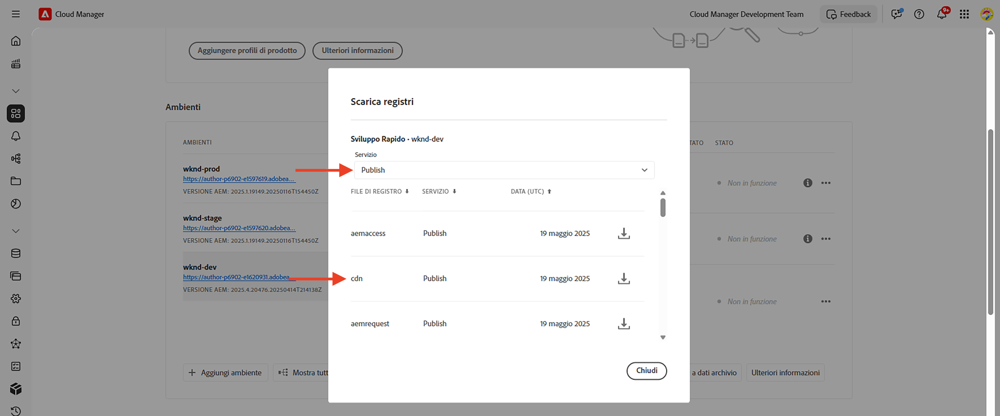
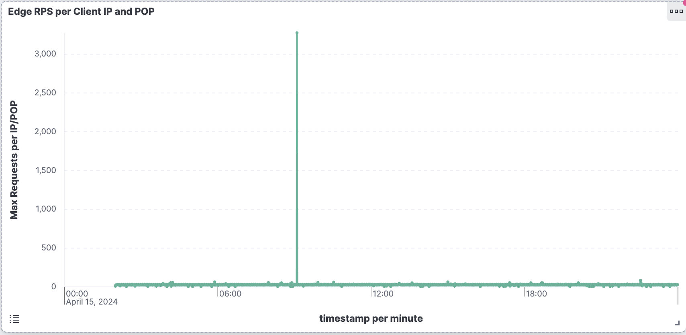
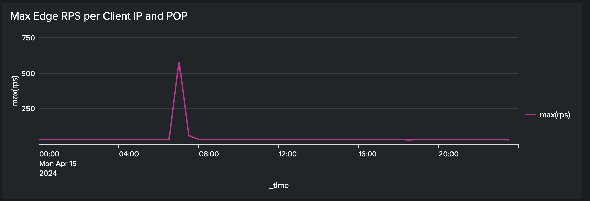

# Bloccare gli attacchi DoS e DDoS utilizzando le regole di filtro del traffico

Scopri come bloccare gli attacchi Denial of Service (DoS) e Distributed Denial of Service (DDoS) utilizzando **filtro traffico limite di velocità** regole e altre strategie nella rete CDN gestita dall’AEM as a Cloud Service (AEMCS). Questi attacchi causano picchi di traffico sulla rete CDN e potenzialmente sul servizio di pubblicazione AEM (ovvero origine) e possono influire sui tempi di risposta e sulla disponibilità del sito.

Questo tutorial funge da guida per _come analizzare i pattern di traffico e configurare il limite di velocità [regole filtro traffico](https://experienceleague.adobe.com/en/docs/experience-manager-cloud-service/content/security/traffic-filter-rules-including-waf)_ per mitigare tali attacchi. Il tutorial descrive anche come [configurare gli avvisi](https://experienceleague.adobe.com/en/docs/experience-manager-cloud-service/content/security/traffic-filter-rules-including-waf#traffic-filter-rules-alerts) in modo da essere avvisati quando si sospetta un attacco.

## Informazioni sulla protezione

Comprendiamo le protezioni DDoS predefinite per il tuo sito web AEM:

- **Memorizzazione in cache:** Con criteri di caching validi, l’impatto di un attacco DDoS è più limitato perché la rete CDN impedisce alla maggior parte delle richieste di andare all’origine e causare il deterioramento delle prestazioni.
- **Scalabilità automatica:** I servizi di authoring e pubblicazione dell’AEM sono in grado di gestire automaticamente i picchi di traffico, anche se possono ancora essere influenzati da improvvisi e massicci aumenti del traffico.
- **Blocco:** La rete CDN di Adobe blocca il traffico verso l’origine se supera un tasso definito dall’Adobe da un particolare indirizzo IP, per PoP (punto di presenza) della rete CDN.
- **Avvisi:** Il Centro azioni invia una notifica di avviso di picco di traffico all’origine quando il traffico supera una determinata velocità. Questo avviso viene attivato quando il traffico verso una determinata PoP CDN supera un valore _definito dall&#39;Adobe_ frequenza di richieste per indirizzo IP. Consulta [Avvisi sulle regole del filtro traffico](https://experienceleague.adobe.com/en/docs/experience-manager-cloud-service/content/security/traffic-filter-rules-including-waf#traffic-filter-rules-alerts) per ulteriori dettagli.

Queste protezioni integrate devono essere considerate una base per la capacità di un&#39;organizzazione di ridurre al minimo l&#39;impatto sulle prestazioni di un attacco DDoS. Poiché ogni sito web ha caratteristiche di prestazioni diverse e può notare un deterioramento delle prestazioni prima che venga raggiunto il limite di velocità definito dall’Adobe, si consiglia di estendere le protezioni predefinite tramite _configurazione del cliente_.

Vediamo alcune misure aggiuntive consigliate che i clienti possono adottare per proteggere i propri siti web dagli attacchi DDoS:

- Dichiara **regole filtro traffico limite di frequenza** per bloccare il traffico che supera una determinata velocità da un singolo indirizzo IP, per PoP. Si tratta in genere di una soglia inferiore rispetto al limite di velocità definito dall’Adobe.
- Configura **avvisi** sulle regole del filtro del traffico del limite di velocità tramite un’&quot;azione di avviso&quot;, in modo che, quando la regola viene attivata, venga inviata una notifica al Centro operativo.
- Aumentare la copertura della cache dichiarando **richiedere trasformazioni** per ignorare i parametri di query.

>[!NOTE]
>
>Il [avvisi regole filtro traffico](https://experienceleague.adobe.com/en/docs/experience-manager-cloud-service/content/security/traffic-filter-rules-including-waf#traffic-filter-rules-alerts) La funzionalità non è ancora stata rilasciata. Per ottenere l’accesso tramite il programma di adozione anticipata, invia un’e-mail a **<aemcs-waf-adopter@adobe.com>**.

### Variazioni delle regole di traffico per limite di tariffa {#rate-limit-variations}

Esistono due varianti delle regole di traffico dei limiti di velocità:

1. Edge: blocca le richieste in base alla frequenza di tutto il traffico (incluso quello che può essere gestito dalla cache CDN), per un determinato IP, per PoP.
1. Origin - blocca le richieste in base al tasso di traffico destinato all&#39;origine, per un determinato IP, per PoP.

## Percorso di clienti

I passaggi seguenti riflettono il probabile processo attraverso il quale i clienti dovrebbero proteggere i loro siti web.

1. Riconosci la necessità di una regola per il filtro del traffico del limite di velocità. Questo potrebbe essere il risultato della ricezione di un avviso di picco di traffico preconfigurato da Adobe all’origine, oppure potrebbe essere una decisione proattiva di prendere precauzioni per ridurre il rischio di un DDoS di successo.
1. Analizza i pattern di traffico utilizzando una dashboard, se il tuo sito è già attivo, per determinare le soglie ottimali per le regole del filtro del traffico del limite di velocità. Se il sito non è ancora attivo, scegli i valori in base alle aspettative di traffico.
1. Utilizzando i valori del passaggio precedente, configura le regole del filtro del traffico del limite di velocità. Assicurati di abilitare gli avvisi corrispondenti in modo da ricevere notifiche ogni volta che la soglia viene raggiunta.
1. Ricevi avvisi sulle regole del filtro del traffico ogni volta che si verificano picchi di traffico, per ottenere informazioni utili su come la tua organizzazione potrebbe essere bersaglio di attacchi da parte di attori dannosi.
1. Agisci sulla segnalazione, se necessario. Analizza il traffico per determinare se il picco riflette richieste legittime anziché un attacco. Aumenta le soglie se il traffico è legittimo, o abbassale in caso contrario.

Il resto di questa esercitazione ti guida attraverso questo processo.

## Riconoscere la necessità di configurare le regole {#recognize-the-need}

Come accennato in precedenza, per impostazione predefinita, Adobe blocca il traffico sulla rete CDN che supera una determinata velocità. Tuttavia, alcuni siti web potrebbero riscontrare un calo delle prestazioni al di sotto di tale soglia. Pertanto, è necessario configurare le regole del filtro del traffico del limite di velocità.

Idealmente, puoi configurare le regole prima di andare in produzione dal vivo. In pratica, molte organizzazioni dichiarano le regole in modo reattivo solo una volta avvisate di un picco di traffico che indica un probabile attacco.

L’Adobe invia un avviso di picco di traffico all’origine come [Notifica Centro Azioni](https://experienceleague.adobe.com/en/docs/experience-manager-cloud-service/content/operations/actions-center) quando viene superata una soglia predefinita di traffico da un singolo indirizzo IP, per una determinata POP. Se hai ricevuto un avviso di questo tipo, ti consigliamo di configurare una regola per il filtro del traffico del limite di frequenza. Questo avviso predefinito è diverso dagli avvisi che devono essere abilitati esplicitamente dai clienti quando si definiscono le regole del filtro del traffico, e che verranno trattati in una sezione futura.


## Analisi dei pattern di traffico {#analyze-traffic}

Se il sito è già attivo, puoi analizzare i pattern di traffico utilizzando i registri CDN e i dashboard forniti con gli Adobi.

- **Dashboard traffico CDN**: fornisce informazioni sul traffico tramite CDN e il tasso di richieste Origin, i tassi di errore 4xx e 5xx e le richieste non memorizzate in cache. Fornisce inoltre il numero massimo di richieste CND e Origin al secondo per indirizzo IP del client e ulteriori informazioni per ottimizzare le configurazioni CDN.

- **Percentuale riscontri cache CDN**: fornisce informazioni sul rapporto di hit della cache totale e sul conteggio totale delle richieste per stato HIT, PASS e MISS. Fornisce anche gli URL principali HIT, PASS e MISS.

Configurare gli strumenti del dashboard utilizzando _una delle opzioni seguenti_:

### ELK - configurazione degli strumenti del dashboard

Il **Elasticsearch, Logstash e Kibana (ELK)** gli strumenti del dashboard forniti da Adobe possono essere utilizzati per analizzare i registri CDN. Questo strumento include una dashboard che visualizza i pattern di traffico e semplifica la determinazione delle soglie ottimali per le regole del filtro del traffico del limite di frequenza.

- Clona il [AEMCS-CDN-Log-Analysis-Tooling](https://github.com/adobe/AEMCS-CDN-Log-Analysis-Tooling) Archivio GitHub.
- Impostare gli utensili seguendo la [Come impostare il contenitore ELK Docker](https://github.com/adobe/AEMCS-CDN-Log-Analysis-Tooling/blob/main/ELK/README.md#how-to-set-up-the-elk-docker-containerhow-to-setup-the-elk-docker-container) passaggi.
- Come parte della configurazione, importa `traffic-filter-rules-analysis-dashboard.ndjson` per visualizzare i dati. Il _Traffico CDN_ Il dashboard include visualizzazioni che mostrano il numero massimo di richieste per IP/POP al server Edge e all’origine della rete CDN.
- Dalla sezione [Cloud Manager](https://my.cloudmanager.adobe.com/)di _Ambienti_ , scarica i registri CDN del servizio di pubblicazione AEMCS.

  

  >[!TIP]
  >
  > La visualizzazione delle nuove richieste nei registri CDN potrebbe richiedere fino a 5 minuti.

### Splunk: configurazione degli strumenti del dashboard

Clienti che hanno [Inoltro registro Splunk abilitato](https://experienceleague.adobe.com/en/docs/experience-manager-cloud-service/content/implementing/developing/logging#splunk-logs) può creare nuovi dashboard per analizzare i pattern di traffico.

Per creare dashboard in Splunk, segui [Dashboard Splunk per l’analisi del registro CDN di AEMCS](https://github.com/adobe/AEMCS-CDN-Log-Analysis-Tooling/blob/main/Splunk/README.md#splunk-dashboards-for-aemcs-cdn-log-analysis) passaggi.

### Visualizzazione dei dati

Nelle dashboard ELK e Splunk sono disponibili le seguenti visualizzazioni:

- **RPS perimetrale per IP e POP client**: questa visualizzazione mostra il numero massimo di richieste per IP/POP **sul server Edge CDN**. Il picco nella visualizzazione indica il numero massimo di richieste.

  **Dashboard ELK**:
  

  **Dashboard Splunk**:\
  

- **RPS di origine per IP e POP client**: questa visualizzazione mostra il numero massimo di richieste per IP/POP **all&#39;origine**. Il picco nella visualizzazione indica il numero massimo di richieste.

  **Dashboard ELK**:
  

  **Dashboard Splunk**:
  

## Scelta dei valori di soglia

I valori di soglia per le regole del filtro del traffico del limite di velocità devono essere basati sull’analisi precedente e assicurarsi che il traffico legittimo non sia bloccato. Per istruzioni su come scegliere i valori di soglia, consulta la tabella seguente:

| Variante | Valore |
| :--------- | :------- |
| Origine | Considera il valore massimo delle richieste di origine per IP/POP in **normale** condizioni di traffico (non la tariffa al momento di un DoS) e aumentarla di un multiplo |
| Bordo | Considera il valore massimo delle richieste Edge per IP/POP in **normale** condizioni di traffico (non la tariffa al momento di un DoS) e aumentarla di un multiplo |

Il multiplo da utilizzare dipende dalle aspettative di picchi normali di traffico dovuti a traffico organico, campagne e altri eventi. Un multiplo tra 5 e 10 può essere ragionevole.

Se il sito non è ancora attivo, non vi sono dati da analizzare e devi effettuare una stima ragionata dei valori appropriati da impostare per le regole del filtro del traffico del limite di velocità. Ad esempio:

| Variante | Valore |
|------------------------------ |:-----------:|
| Bordo | 500 |
| Origine | 100 |

## Configurazione delle regole {#configure-rules}

Configurare **filtro traffico limite di velocità** regole del progetto AEM `/config/cdn.yaml` file, con valori basati sulla discussione precedente. Se necessario, rivolgiti al team di sicurezza web per assicurarti che i valori limite di frequenza siano appropriati e non bloccino il traffico legittimo.

Fai riferimento a [Creare regole nel progetto AEM](https://experienceleague.adobe.com/en/docs/experience-manager-learn/cloud-service/security/traffic-filter-and-waf-rules/how-to-setup#create-rules-in-your-aem-project) per ulteriori dettagli.

```yaml
kind: CDN
version: '1'
metadata:
  envTypes:
    - dev
    - stage
    - prod
data:
  trafficFilters:
    rules:
    ...
    #  Prevent attack at edge by blocking client for 5 minutes if they make more than 500 requests per second on average
      - name: prevent-dos-attacks-edge
        when:
          reqProperty: tier
          in: ["author","publish"]
        rateLimit:
          limit: 500 # replace with the appropriate value
          window: 10 # compute the average over 10s
          penalty: 300 # block IP for 5 minutes
          count: all # count all requests
          groupBy:
            - reqProperty: clientIp
        action: 
          type: log
          experimental_alert: true
    #  Prevent attack at origin by blocking client for 5 minutes if they make more than 100 requests per second on average            
      - name: prevent-dos-attacks-origin
        when:
          reqProperty: tier
          in: ["author","publish"]
        rateLimit:
          limit: 100 # replace with the appropriate value
          window: 10 # compute the average over 10s
          penalty: 300 # block IP for 5 minutes
          count: fetches # count only fetches
          groupBy:
            - reqProperty: clientIp
        action: 
          type: log
          experimental_alert: true   
          
```

Tieni presente che vengono dichiarate sia le regole di origine che quelle di edge e che la proprietà alert è impostata su `true` in modo da poter ricevere avvisi ogni volta che la soglia viene raggiunta, probabilmente a indicare un attacco.

>[!NOTE]
>
>Il _sperimentale_ prefix_ davanti a experiment_alert verrà rimosso quando la funzione di avviso viene rilasciata. Per partecipare al programma di adozione anticipata, invia un’e-mail a **<aemcs-waf-adopter@adobe.com>**.

Si consiglia di impostare il tipo di azione per la registrazione iniziale, in modo da poter monitorare il traffico per alcune ore o giorni, garantendo che il traffico legittimo non superi queste tariffe. Dopo alcuni giorni, passa alla modalità blocco.

Per distribuire le modifiche all’ambiente AEMCS, effettua le seguenti operazioni:

- Apporta le modifiche precedenti all’archivio Git di Cloud Manager.
- Distribuisci le modifiche nell’ambiente AEMCS utilizzando la pipeline di configurazione di Cloud Manager. Fai riferimento a [Distribuire le regole tramite Cloud Manager](https://experienceleague.adobe.com/en/docs/experience-manager-learn/cloud-service/security/traffic-filter-and-waf-rules/how-to-setup#deploy-rules-through-cloud-manager) per ulteriori dettagli.
- Per verificare **regola filtro traffico limite di frequenza** funziona come previsto, puoi simulare un attacco come descritto in [Simulazione di attacco](#attack-simulation) sezione. Limita il numero di richieste a un valore superiore al valore del limite di velocità impostato nella regola.

### Configurazione delle regole di trasformazione delle richieste {#configure-request-transform-rules}

Oltre alle regole del filtro del traffico del limite di frequenza, si consiglia di utilizzare [richiedere trasformazioni](https://experienceleague.adobe.com/en/docs/experience-manager-cloud-service/content/implementing/content-delivery/cdn-configuring-traffic#request-transformations) per annullare l’impostazione dei parametri di query non necessari all’applicazione al fine di ridurre al minimo i modi per aggirare la cache tramite tecniche di busting della cache. Ad esempio, se desideri consentire solo `search` e `campaignId` parametri di query, è possibile dichiarare la seguente regola:

```yaml
kind: "CDN"
version: "1"
metadata:
  envTypes: 
    - dev
    - stage
    - prod  
data:  
  experimental_requestTransformations:
    rules:            
      - name: unset-all-query-params-except-those-needed
        when:
          reqProperty: tier
          in: ["publish"]
        actions:
          - type: unset
            queryParamMatch: ^(?!search$|campaignId$).*$
```

## Ricezione degli avvisi sulle regole del filtro del traffico {#receiving-alerts}

Come indicato sopra, se la regola del filtro del traffico include *experiment_alert: true*, viene ricevuto un avviso quando la regola viene soddisfatta.

## Intervenire sugli avvisi {#acting-on-alerts}

A volte, l’avviso è informativo, fornendo un senso della frequenza degli attacchi. Vale la pena analizzare i dati CDN utilizzando il dashboard descritto in precedenza, per verificare che il picco di traffico sia dovuto a un attacco e non solo a un aumento del volume di traffico legittimo. In quest’ultimo caso, puoi aumentare la soglia.

## Simulazione di attacco{#attack-simulation}

Questa sezione descrive i metodi per simulare un attacco DoS, che può essere utilizzato per generare dati per le dashboard utilizzate in questa esercitazione e per verificare che eventuali regole configurate blocchino correttamente gli attacchi.

>[!CAUTION]
>
> Non eseguire questi passaggi in un ambiente di produzione. I seguenti passaggi sono solo a scopo di simulazione.
> 
>Se hai ricevuto un avviso che indica un picco di traffico, procedi alla [Analisi dei pattern di traffico](#analyzing-traffic-patterns) sezione.

Per simulare un attacco, strumenti come [Benchmark Apache](https://httpd.apache.org/docs/2.4/programs/ab.html), [Apache JMeter](https://jmeter.apache.org/), [Vegeta](https://github.com/tsenart/vegeta), e altri possono essere utilizzati.

### Richieste Edge

Utilizzando quanto segue [Vegeta](https://github.com/tsenart/vegeta) comando puoi effettuare molte richieste al tuo sito web:

```shell
$ echo "GET https://<YOUR-WEBSITE-DOMAIN>" | vegeta attack -rate=120 -duration=5s | vegeta report
```

Il comando precedente effettua 120 richieste per 5 secondi ed restituisce un rapporto. Supponendo che il sito web non sia soggetto a limitazioni di frequenza, questo può causare un picco nel traffico.

### Richieste di origine

Per ignorare la cache CDN e effettuare richieste all’origine (servizio di pubblicazione AEM), puoi aggiungere all’URL un parametro di query univoco. Fai riferimento allo script Apache JMeter di esempio dal [Simulare un attacco DoS utilizzando lo script JMeter](https://experienceleague.adobe.com/en/docs/experience-manager-learn/foundation/security/modsecurity-crs-dos-attack-protection#simulate-dos-attack-using-jmeter-script)

