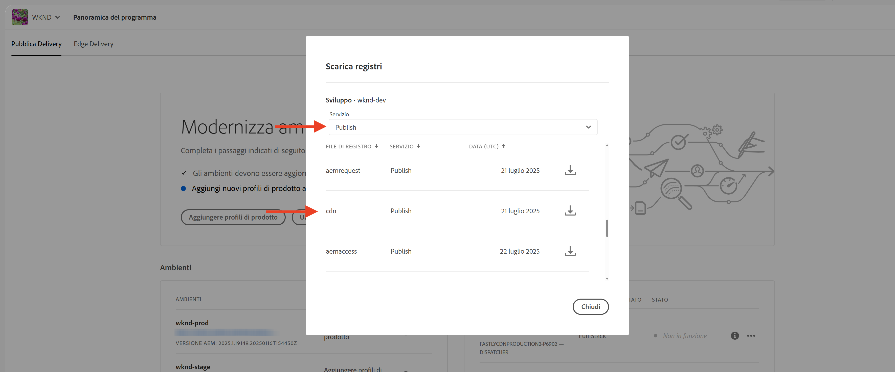

# Monitoraggio delle richieste sensibili

Scopri come monitorare le richieste sensibili registrandole utilizzando le regole per il filtro del traffico in AEM as a Cloud Service.

La registrazione consente di osservare i pattern di traffico senza influire sugli utenti o sui servizi finali, rappresentando un primo passaggio fondamentale prima di implementare le regole di blocco.

Questo tutorial illustra come **registrare le richieste dei percorsi di accesso e disconnessione di WKND** per il servizio AEM Publish.

## Perché e quando registrare le richieste

La registrazione di richieste specifiche è una pratica a basso rischio e di alto valore per comprendere il modo in cui gli utenti, e potenzialmente gli attori malevoli, interagiscono con l’applicazione AEM. È particolarmente utile prima di applicare le regole di blocco, consentendoti di perfezionare il livello di sicurezza senza interrompere il traffico legittimo.

Gli scenari comuni per la registrazione includono:

- Convalida dell’impatto e della portata di una regola prima di promuoverla in modalità `block`.
- Monitoraggio dei percorsi di accesso/disconnessione e degli endpoint di autenticazione per individuare pattern insoliti o tentativi di forzatura bruta.
- Tracciamento dell’accesso ad alta frequenza agli endpoint API per potenziali abusi o attività DoS.
- Stabilire linee di base per il comportamento dei bot prima di applicare controlli più rigorosi.
- In caso di incidenti di sicurezza, fornire dati forensi per comprendere la natura dell’attacco e le risorse che ne sono state interessate.

## Prerequisiti

Prima di procedere, assicurati di aver completato la configurazione richiesta come descritto nel tutorial [Come configurare il filtro del traffico e le regole di WAF](../setup.md). Inoltre, devi avere clonato e distribuito il [progetto WKND di AEM Sites](https://github.com/adobe/aem-guides-wknd) nel tuo ambiente AEM.

## Esempio: registrare le richieste di accesso e disconnessione WKND

In questo esempio, puoi creare una regola di filtro del traffico per registrare le richieste effettuate ai percorsi di accesso e disconnessione WKND nel servizio AEM Publish. Consente di monitorare i tentativi di autenticazione e identificare potenziali problemi di sicurezza.

- Aggiungi la regola seguente al file `/config/cdn.yaml` del progetto WKND.

```yaml
kind: "CDN"
version: "1"
metadata:
  envTypes: ["dev", "stage", "prod"]
data:
  trafficFilters:
    rules:
    # On AEM Publish service log WKND Login and Logout requests
    - name: publish-auth-requests
      when:
        allOf:
          - reqProperty: tier
            matches: publish
          - reqProperty: path
            in:
              - /system/sling/login/j_security_check
              - /system/sling/logout
      action: log   
```

- Conferma e invia le modifiche all’archivio Git di Cloud Manager.

- Implementa le modifiche nell’ambiente AEM utilizzando la pipeline di configurazione di Cloud Manager [creata in precedenza](../setup.md#deploy-rules-using-adobe-cloud-manager).

- Testa la regola effettuando l’accesso e la disconnessione dal sito WKND del programma (ad esempio, `https://publish-pXXXX-eYYYY.adobeaemcloud.com/us/en.html`). È possibile utilizzare `asmith/asmith` come nome utente e password.

  

## Analisi

Di seguito vengono analizzati i risultati della regola `publish-auth-requests` scaricando i registri CDN di AEMCS da Cloud Manager e utilizzando lo [strumento di analisi dei registri CDN di AEMCS](../setup.md#setup-the-elastic-dashboard-tool).

- Dalla scheda **Ambienti** di [Cloud Manager](https://my.cloudmanager.adobe.com/), scarica i registri CDN del servizio **Publish** di AEMCS.

  

  >[!TIP]
  >
  > Le nuove richieste compariranno nei registri CDN entro 5 minuti.

- Copia il file di registro scaricato (ad esempio, `publish_cdn_2023-10-24.log` nella schermata seguente) nella cartella `logs/dev` del progetto dello strumento della dashboard Elastic.

  

- Aggiorna la pagina dello strumento della dashboard Elastic.
   - Nella sezione **Filtro globale**, in alto, modifica il filtro `aem_env_name.keyword` e seleziona il valore dell’ambiente `dev`.

     

   - Per modificare l’intervallo di tempo, fai clic sull’icona del calendario in alto a destra e seleziona l’intervallo di tempo desiderato.

     

- Rivedi i pannelli della dashboard aggiornati per le **richieste analizzate**, le **richieste contrassegnate** e i **dettagli delle richieste contrassegnate**. Per le voci di registro CDN corrispondenti, la dashboard dovrebbe mostrare i valori dell’IP client (cli_ip), dell’host, dell’URL, dell’azione (waf_action) e del nome della regola (waf_match) di ciascuna voce.

  

