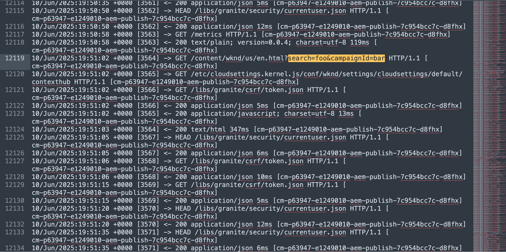

# Panoramica - Protezione dei siti web di AEM

Scopri come proteggere i siti web di AEM da Denial of Service (DoS), Distributed Denial of Service (DDoS), traffico dannoso e attacchi sofisticati utilizzando **regole del filtro del traffico**, inclusa la sottocategoria di **regole del firewall dell’applicazione web (WAF)** in AEM as a Cloud Service.

Scopri anche le differenze tra il filtro del traffico standard e le regole del filtro del traffico di WAF, quando utilizzarle e come iniziare a utilizzare le regole consigliate da Adobe.

>[!IMPORTANT]
>
> Le regole del filtro del traffico WAF richiedono un&#39;ulteriore licenza **Protezione WAF-DDoS** o **Protezione avanzata**. Le regole del filtro del traffico standard sono disponibili per impostazione predefinita per i clienti Sites e Forms.

## Introduzione alla sicurezza del traffico in AEM as a Cloud Service

AEM as a Cloud Service sfrutta un livello CDN integrato per proteggere e ottimizzare la distribuzione del sito web. Uno dei componenti più critici del livello CDN è la capacità di definire e applicare le regole del traffico. Queste regole fungono da scudo protettivo per proteggere il sito da abusi, abusi e attacchi, senza compromettere le prestazioni.

La sicurezza del traffico è essenziale per mantenere i tempi di attività, proteggere i dati sensibili e garantire un’esperienza fluida per gli utenti legittimi. AEM fornisce due categorie di regole di sicurezza:

- **Regole filtro traffico standard**
- **Regole filtro del traffico di Firewall applicazione Web (WAF)**

I set di regole consentono ai clienti di prevenire minacce web comuni e sofisticate, ridurre il rumore causato da client malintenzionati o che si comportano in modo errato e migliorare l’osservabilità tramite la registrazione delle richieste, il blocco e il rilevamento dei pattern.

## Differenza tra le regole del filtro del traffico standard e WAF

| Funzione | Regole filtro traffico standard | Regole filtro traffico WAF |
|--------------------------|--------------------------------------------------|---------------------------------------------------------|
| Scopo | Previeni gli abusi come DoS, DoS, scraping o attività bot | Rileva e reagisce a modelli di attacco sofisticati (ad esempio, OWASP Top 10), che proteggono anche dai bot |
| Esempi | Limitazione di frequenza, blocco geografico, filtro dell’agente utente | SQL injection, XSS, IP di attacco noti |
| Flessibilità | Altamente configurabile tramite YAML | Altamente configurabile tramite YAML, con flag WAF predefiniti |
| Modalità consigliata | Iniziare con la modalità `log`, quindi passare alla modalità `block` | Inizia con la modalità `block` per il flag WAF `ATTACK-FROM-BAD-IP` e la modalità `log` per il flag WAF `ATTACK`, quindi passa alla modalità `block` per entrambi |
| Distribuzione | Definito in YAML e distribuito tramite Pipeline di configurazione Cloud Manager | Definito in YAML con `wafFlags` e distribuito tramite pipeline di configurazione Cloud Manager |
| Licenze | Incluso con le licenze Sites e Forms | **Richiede la licenza Protezione WAF DDoS o Protezione avanzata** |

Le regole standard per il filtro del traffico sono utili per applicare criteri specifici per l’azienda, ad esempio limiti di velocità o blocchi di aree specifiche, nonché per bloccare il traffico in base alle proprietà e alle intestazioni della richiesta, ad esempio indirizzo IP, percorso o agente utente.
Le regole del filtro del traffico di WAF, d&#39;altra parte, forniscono una protezione proattiva completa per attacchi web e vettori di attacco noti e dispongono di informazioni avanzate per limitare i falsi positivi (ovvero, il blocco del traffico legittimo).
Per definire entrambi i tipi di regole, si utilizza la sintassi YAML. Per ulteriori dettagli, vedere [Sintassi delle regole del filtro del traffico](https://experienceleague.adobe.com/en/docs/experience-manager-cloud-service/content/security/traffic-filter-rules-including-waf#rules-syntax).

## Quando e perché utilizzarli

**Utilizza le regole del filtro del traffico standard** quando:

- Desideri applicare limiti specifici dell’organizzazione, ad esempio la limitazione della velocità IP.
- Conosci pattern specifici (ad esempio indirizzi IP dannosi, aree geografiche, intestazioni) che devono essere filtrati.

**Utilizza le regole del filtro del traffico di WAF** quando:

- Desideri una **protezione proattiva** completa da pattern di attacco noti diffusi (ad esempio, iniezione, abuso di protocollo), nonché da IP dannosi noti, raccolti da origini dati esperte.
- Desideri negare le richieste dannose e al tempo stesso limitare la possibilità di bloccare il traffico legittimo.
- Desideri limitare il lavoro di difesa da minacce comuni e sofisticate, applicando semplici regole di configurazione.

Insieme, queste regole forniscono una strategia di difesa approfondita che consente ai clienti di AEM as a Cloud Service di adottare misure proattive e reattive per proteggere le loro proprietà digitali.

## Regole consigliate da Adobe

Adobe fornisce regole consigliate per il filtro del traffico standard e per le regole del filtro del traffico WAF per aiutarti a proteggere rapidamente i siti AEM.

- **Regole del filtro del traffico standard** (disponibile per impostazione predefinita): consente di risolvere gli scenari di abuso più comuni, ad esempio attacchi DoS, DDoS e bot, contro **l&#39;edge della rete CDN**, **l&#39;origine** o il traffico proveniente da paesi sanzionati.\
  Alcuni esempi:
   - Limitazione di frequenza degli IP che effettuano più di 500 richieste al secondo _al perimetro della rete CDN_
   - Limitazione di frequenza degli IP che effettuano più di 100 richieste al secondo _all&#39;origine_
   - Blocco del traffico proveniente dai paesi elencati dall&#39;Office of Foreign Assets Control (OFAC)

- **Regole filtro del traffico WAF** (richiede una licenza aggiuntiva): fornisce una protezione aggiuntiva contro minacce sofisticate, tra cui [OWASP Top Ten](https://owasp.org/www-project-top-ten/) minacce come SQL injection, cross-site scripting (XSS) e altri attacchi alle applicazioni Web.
Alcuni esempi:
   - Blocco delle richieste da indirizzi IP danneggiati noti
   - Registrazione o blocco di richieste sospette contrassegnate come attacchi

>[!TIP]
>
> Inizia applicando le **regole consigliate da Adobe** per sfruttare l&#39;esperienza di Adobe in materia di sicurezza e gli aggiornamenti continui. Se la tua azienda presenta rischi specifici o casi limite, oppure nota falsi positivi (blocco del traffico legittimo), puoi definire **regole personalizzate** o estendere il set predefinito in base alle tue esigenze.

## Introduzione

Scopri come definire, distribuire, testare e analizzare le regole del filtro del traffico, incluse le regole di WAF, in AEM as a Cloud Service seguendo la guida alla configurazione e i casi d’uso riportati di seguito. In questo modo puoi acquisire le conoscenze di base necessarie per applicare in un secondo momento le regole consigliate da Adobe.

<!-- CARDS
{target = _self}

* ./setup.md
  {title = How to set up traffic filter rules including WAF rules}
  {description = Learn how to set up to create, deploy, test, and analyze the results of traffic filter rules including WAF rules.}
  {image = ./assets/setup/rules-setup.png}
  {cta = Start Now}
-->
<!-- START CARDS HTML - DO NOT MODIFY BY HAND -->

    

        

            

                <figure class="image x-is-16by9">
                    
                </figure>
            

            

                

                    

                        <a href="./setup.md" target="_self" rel="referrer" title="Come impostare le regole del filtro del traffico, incluse le regole di WAF">Impostare le regole del filtro del traffico, incluse le regole di WAF</a>
                    

                    
Scopri come configurare per creare, distribuire, testare e analizzare i risultati delle regole del filtro del traffico, incluse le regole di WAF.

                

                <a href="./setup.md" target="_self" rel="referrer" class="spectrum-Button spectrum-Button--outline spectrum-Button--primary spectrum-Button--sizeM" style="align-self: flex-start; margin-top: 1rem;">
                    Inizia ora
                </a>
            

        

    

<!-- END CARDS HTML - DO NOT MODIFY BY HAND -->

## Guida alla configurazione delle regole consigliate da Adobe

Questa guida fornisce istruzioni dettagliate per impostare e distribuire regole standard per il filtro del traffico e per il filtro del traffico WAF consigliate da Adobe nell’ambiente AEM as a Cloud Service.

<!-- CARDS
{target = _self}

* ./use-cases/using-traffic-filter-rules.md
  {title = Protecting AEM websites using standard traffic filter rules}
  {description = Learn how to protect AEM websites from DoS, DDoS and bot abuse using Adobe-recommended standard traffic filter rules in AEM as a Cloud Service.}
  {image = ./assets/use-cases/using-traffic-filter-rules.png}
  {cta = Apply Rules}

* ./use-cases/using-waf-rules.md
  {title = Protecting AEM websites using WAF rules}
  {description = Learn how to protect AEM websites from sophisticated threats including DoS, DDoS, and bot abuse using Adobe-recommended Web Application Firewall (WAF) traffic filter rules in AEM as a Cloud Service.}
  {image = ./assets/use-cases/using-waf-rules.png}
  {cta = Activate WAF}
-->
<!-- START CARDS HTML - DO NOT MODIFY BY HAND -->

    

        

            

                <figure class="image x-is-16by9">
                    
                </figure>
            

            

                

                    

                        <a href="./use-cases/using-traffic-filter-rules.md" target="_self" rel="referrer" title="Protezione dei siti web di AEM tramite le regole standard per il filtro del traffico">Protezione dei siti Web di AEM tramite le regole del filtro del traffico standard</a>
                    

                    
Scopri come proteggere i siti web di AEM dall’abuso di DoS, DDoS e bot utilizzando le regole standard consigliate da Adobe per il filtro del traffico in AEM as a Cloud Service.

                

                <a href="./use-cases/using-traffic-filter-rules.md" target="_self" rel="referrer" class="spectrum-Button spectrum-Button--outline spectrum-Button--primary spectrum-Button--sizeM" style="align-self: flex-start; margin-top: 1rem;">
                    Applica regole
                </a>
            

        

    

    

        

            

                <figure class="image x-is-16by9">
                    
                </figure>
            

            

                

                    

                        <a href="./use-cases/using-waf-rules.md" target="_self" rel="referrer" title="Protezione dei siti web di AEM tramite le regole di WAF">Protezione dei siti Web di AEM tramite le regole di WAF</a>
                    

                    
Scopri come proteggere i siti web di AEM da minacce sofisticate, inclusi attacchi DoS, DDoS e abusi di bot, utilizzando le regole del filtro del traffico di WAF (Web Application Firewall) consigliate da Adobe in AEM as a Cloud Service.

                

                <a href="./use-cases/using-waf-rules.md" target="_self" rel="referrer" class="spectrum-Button spectrum-Button--outline spectrum-Button--primary spectrum-Button--sizeM" style="align-self: flex-start; margin-top: 1rem;">
                    Attiva WAF
                </a>
            

        

    

<!-- END CARDS HTML - DO NOT MODIFY BY HAND -->

## Casi d’uso avanzati

Per scenari più avanzati, puoi esplorare i seguenti casi d’uso che mostrano come implementare regole di filtro del traffico personalizzate in base a requisiti di business specifici:

<!-- CARDS
{target = _self}

* ./how-to/request-logging.md

* ./how-to/request-blocking.md

* ./how-to/request-transformation.md
-->
<!-- START CARDS HTML - DO NOT MODIFY BY HAND -->

    

        

            

                <figure class="image x-is-16by9">
                    
                </figure>
            

            

                

                    

                        <a href="./how-to/request-logging.md" target="_self" rel="referrer" title="Monitoraggio delle richieste sensibili">Monitoraggio delle richieste sensibili</a>
                    

                    
Scopri come monitorare le richieste sensibili registrandole utilizzando le regole del filtro del traffico in AEM as a Cloud Service.

                

                <a href="./how-to/request-logging.md" target="_self" rel="referrer" class="spectrum-Button spectrum-Button--outline spectrum-Button--primary spectrum-Button--sizeM" style="align-self: flex-start; margin-top: 1rem;">
                    Ulteriori informazioni
                </a>
            

        

    

    

        

            

                <figure class="image x-is-16by9">
                    
                </figure>
            

            

                

                    

                        <a href="./how-to/request-blocking.md" target="_self" rel="referrer" title="Limitazione dell’accesso">Limitazione dell'accesso</a>
                    

                    
Scopri come limitare l’accesso bloccando richieste specifiche utilizzando le regole del filtro del traffico in AEM as a Cloud Service.

                

                <a href="./how-to/request-blocking.md" target="_self" rel="referrer" class="spectrum-Button spectrum-Button--outline spectrum-Button--primary spectrum-Button--sizeM" style="align-self: flex-start; margin-top: 1rem;">
                    Ulteriori informazioni
                </a>
            

        

    

    

        

            

                <figure class="image x-is-16by9">
                    
                </figure>
            

            

                

                    

                        <a href="./how-to/request-transformation.md" target="_self" rel="referrer" title="Normalizzazione delle richieste">Normalizzazione delle richieste</a>
                    

                    
Scopri come normalizzare le richieste trasformandole utilizzando le regole del filtro del traffico in AEM as a Cloud Service.

                

                <a href="./how-to/request-transformation.md" target="_self" rel="referrer" class="spectrum-Button spectrum-Button--outline spectrum-Button--primary spectrum-Button--sizeM" style="align-self: flex-start; margin-top: 1rem;">
                    Ulteriori informazioni
                </a>
            

        

    

<!-- END CARDS HTML - DO NOT MODIFY BY HAND -->

## Risorse aggiuntive

- [Regole filtro del traffico, incluse le regole di WAF](https://experienceleague.adobe.com/it/docs/experience-manager-cloud-service/content/security/traffic-filter-rules-including-waf)
