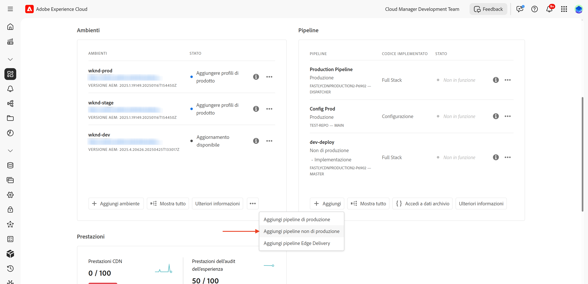
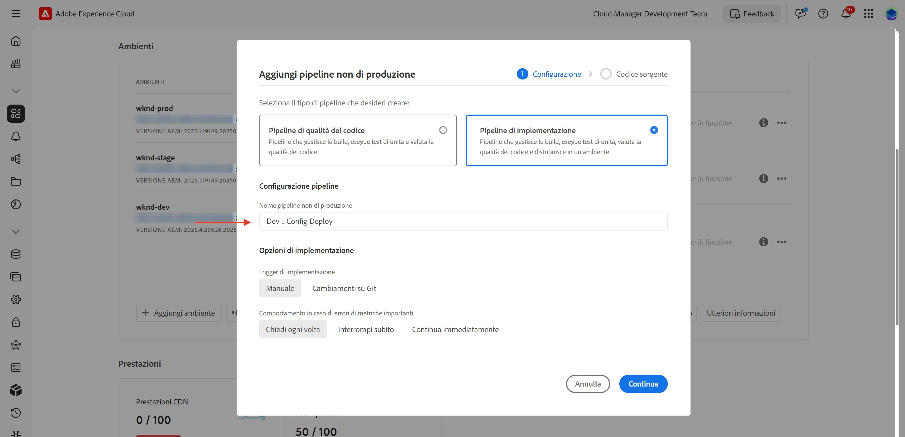
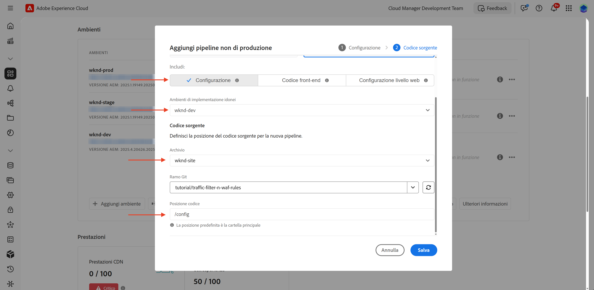
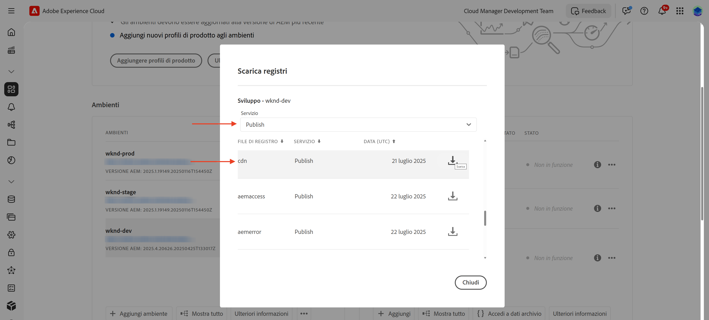

# Come configurare le regole di filtro del traffico incluse le regole WAF

Scopri **come configurare** le regole per il filtro del traffico, incluse le regole del firewall per l’applicazione web (WAF). In questo tutorial, abbiamo predisposto le basi per i tutorial successivi, in cui configurerai e distribuirai le regole, seguite da test e analisi dei risultati.

Per dimostrare il processo di installazione, il tutorial utilizza il [progetto WKND di AEM Sites](https://github.com/adobe/aem-guides-wknd).

>[!VIDEO](https://video.tv.adobe.com/v/3469395/?quality=12&learn=on)

## Panoramica di configurazione

La preparazione per i tutorial successivi implicano i seguenti passaggi:

- _Creazione di regole_ nel progetto AEM nella cartella `config`
- _Distribuzione delle regole_ tramite la pipeline di configurazione di Adobe Cloud Manager.
- _Test delle regole_ con strumenti come Curl, Vegeta e Nikto
- _Analisi dei risultati_ con lo strumento di analisi del registro CDN di AEMCS

## Creare regole nel progetto AEM

Per definire le regole per il filtro del traffico **standard** e **WAF** all’interno del progetto AEM, segui questi passaggi:

1. Al livello principale del progetto AEM, crea una cartella denominata `config`.

2. Nella cartella `config`, crea un file denominato `cdn.yaml`.

3. Utilizza la seguente struttura di metadati in `cdn.yaml`:

```yaml
kind: "CDN"
version: "1"
metadata:
  envTypes: ["dev", "stage", "prod"]
data:
  trafficFilters:
    rules:
```


Nel [tutorial successivo](#next-steps), scopri come aggiungere al file sopra riportato **le regole consigliate per il filtro del traffico standard e WAF** di Adobe come base solida per la tua implementazione.

## Distribuire le regole con Adobe Cloud Manager

Per preparare la distribuzione delle regole, segui questi passaggi:

1. Accedi a [my.cloudmanager.adobe.com](https://my.cloudmanager.adobe.com/) e seleziona il tuo programma.

2. Dalla pagina **Panoramica del programma**, passa alla scheda **Pipeline** e fai clic su **+Aggiungi** per creare una nuova pipeline.

   

3. Nella procedura guidata della pipeline:

   - **Tipo**: Pipeline di implementazione
   - **Nome pipeline**: Dev-Config

   

4. Configurazione per il codice sorgente:

   - **Codice da implementare**: Distribuzione mirata
   - **Includi**: Config
   - **Ambiente di distribuzione**: ad esempio, `wknd-program-dev`
   - **Archivio**: archivio Git (ad esempio, `wknd-site`)
   - **Ramo Git**: ramo di lavoro
   - **Posizione codice**: `/config`

   

5. Rivedi la configurazione della pipeline e fai clic su **Salva**.

Nel [tutorial successivo](#next-steps), scopri come distribuire la pipeline nell’ambiente AEM.

## Test delle regole tramite strumenti

Per testare l’efficacia del filtro del traffico standard e delle regole di WAF, puoi utilizzare vari strumenti per simulare le richieste e analizzare la risposta alle regole.

Verifica che nel computer locale siano installati i seguenti strumenti o segui le istruzioni per installarli:

- [Curl](https://curl.se/): flusso di richieste/risposte di test.
- [Vegeta](https://github.com/tsenart/vegeta): simula un carico elevato di richieste (test DoS).
- [Nikto](https://github.com/sullo/nikto/wiki): ricerca vulnerabilità.

È possibile verificare l’installazione utilizzando i seguenti comandi:

```shell
# Curl version check
$ curl --version

# Vegeta version check
$ vegeta -version

# Nikto version check
$ cd <PATH-OF-CLONED-REPO>/program
$ ./nikto.pl -Version
```

Nel [tutorial successivo](#next-steps), scopri come utilizzare questi strumenti per simulare carichi di richieste elevati e richieste dannose per testare l’efficacia del filtro del traffico e delle regole di WAF.

## Analizzare i risultati

Per prepararsi all’analisi dei risultati, segui questi passaggi:

1. Installa lo **strumento di analisi del registro CDN di AEMCS** per visualizzare e analizzare i pattern utilizzando dashboard predefinite.

2. Esegui l’**acquisizione di registri CDN** scaricando i registri dall’interfaccia utente di Cloud Manager. In alternativa, puoi inoltrare i registri direttamente a una destinazione di registrazione in hosting supportata, ad esempio Splunk o Elasticsearch.

### Strumento di analisi del registro CDN di AEMCS

Per analizzare i risultati del filtro del traffico e delle regole di WAF, puoi utilizzare lo **strumento di analisi del registro CDN di AEMCS**. Questo strumento fornisce dashboard predefinite per visualizzare il traffico CDN e l’attività WAF sfruttando i registri raccolti dalla rete CDN di AEMCS.

Lo strumento di analisi del registro CDN di AEMCS supporta due piattaforme di osservabilità, **ELK** (Elasticsearch, Logstash, Kibana) e **Splunk**.

È possibile utilizzare la funzione di inoltro dei registri per inviarli in streaming a un servizio di registrazione ELK o Splunk in hosting, dove puoi installare una dashboard per visualizzare e analizzare il filtro per il traffico standard e le regole per il filtro del traffico WAF. Tuttavia, per questo tutorial, la dashboard verrà configurata in un’istanza ELK locale installata nel computer.

1. Clona l’archivio [AEMCS-CDN-Log-Analysis-Tooling](https://github.com/adobe/AEMCS-CDN-Log-Analysis-Tooling).

2. Segui la [guida alla configurazione del contenitore ELK su Docker](https://github.com/adobe/AEMCS-CDN-Log-Analysis-Tooling/blob/main/ELK/README.md) per installare e configurare localmente lo stack ELK.

3. Utilizzando le dashboard ELK, puoi esplorare metriche quali richieste IP, traffico bloccato, pattern URI e avvisi di sicurezza.

   

>[!NOTE]
> 
> Se i registri non vengono ancora acquisiti dalla CDN di AEMCS, le dashboard vengono visualizzate vuote.

### Acquisizione dei registri CDN

Per acquisire i registri CDN nello stack ELK, segui questi passaggi:

- Dalla scheda **Ambienti** di [Cloud Manager](https://my.cloudmanager.adobe.com/), scarica i registri CDN del servizio **Publish** di AEMCS.

  

  >[!TIP]
  >
  > Le nuove richieste compariranno nei registri CDN entro 5 minuti.

- Copia il file di registro scaricato (ad esempio, `publish_cdn_2025-06-06.log` nella schermata seguente) nella cartella `logs/dev` del progetto dello strumento della dashboard Elastic.

  {width="800" zoomable="yes"}

- Aggiorna la pagina dello strumento della dashboard Elastic.
   - Nella sezione **Filtro globale**, in alto, modifica il filtro `aem_env_name.keyword` e seleziona il valore dell’ambiente `dev`.

     

   - Per modificare l’intervallo di tempo, fai clic sull’icona del calendario in alto a destra e seleziona l’intervallo di tempo desiderato.

- Nel [tutorial successivo](#next-steps), scopri come analizzare i risultati del filtro del traffico standard e delle regole per il filtro del traffico WAF utilizzando le dashboard predefinite nello stack ELK.

  

## Riepilogo

Hai configurato correttamente le basi per l’implementazione delle regole per il filtro del traffico che includono le regole WAF, in AEM as a Cloud Service. Sono stati creati una struttura del file di configurazione, una pipeline per la distribuzione e strumenti preparati per il test e l’analisi dei risultati.

## Passaggi successivi

Scopri come implementare le regole consigliate da Adobe tramite i seguenti tutorial:

<!-- CARDS
{target = _self}

* ./use-cases/using-traffic-filter-rules.md
  {title = Protecting AEM websites using standard traffic filter rules}
  {description = Learn how to protect AEM websites from DoS, DDoS and bot abuse using Adobe-recommended standard traffic filter rules in AEM as a Cloud Service.}
  {image = ./assets/use-cases/using-traffic-filter-rules.png}
  {cta = Apply Rules}

* ./use-cases/using-waf-rules.md
  {title = Protecting AEM websites using WAF traffic filter rules}
  {description = Learn how to protect AEM websites from sophisticated threats including DoS, DDoS, and bot abuse using Adobe-recommended Web Application Firewall (WAF) traffic filter rules in AEM as a Cloud Service.}
  {image = ./assets/use-cases/using-waf-rules.png}
  {cta = Activate WAF}
-->
<!-- START CARDS HTML - DO NOT MODIFY BY HAND -->
<div class="columns">
    <div class="column is-half-tablet is-half-desktop is-one-third-widescreen" aria-label="Protecting AEM websites using standard traffic filter rules">
        <div class="card" style="height: 100%; display: flex; flex-direction: column; height: 100%;">
            <div class="card-image">
                <figure class="image x-is-16by9">
                    <a href="./use-cases/using-traffic-filter-rules.md" title="Protezione dei siti web di AEM tramite le regole standard per il filtro del traffico" target="_self" rel="referrer">
                        
                    </a>
                </figure>
            </div>
            <div class="card-content is-padded-small" style="display: flex; flex-direction: column; flex-grow: 1; justify-content: space-between;">
                <div class="top-card-content">
                    <p class="headline is-size-6 has-text-weight-bold">
                        <a href="./use-cases/using-traffic-filter-rules.md" target="_self" rel="referrer" title="Protezione dei siti web di AEM tramite le regole standard per il filtro del traffico">Protezione dei siti Web di AEM tramite le regole standard per il filtro del traffico</a>
                    </p>
                    <p class="is-size-6">Scopri come proteggere i siti web di AEM dall’abuso di DoS, DDoS e bot utilizzando le regole standard per il filtro del traffico consigliate da Adobe in AEM as a Cloud Service.</p>
                </div>
                <a href="./use-cases/using-traffic-filter-rules.md" target="_self" rel="referrer" class="spectrum-Button spectrum-Button--outline spectrum-Button--primary spectrum-Button--sizeM" style="align-self: flex-start; margin-top: 1rem;">
                    <span class="spectrum-Button-label has-no-wrap has-text-weight-bold">Applica le regole</span>
                </a>
            </div>
        </div>
    </div>
    <div class="column is-half-tablet is-half-desktop is-one-third-widescreen" aria-label="Protecting AEM websites using WAF traffic filter rules">
        <div class="card" style="height: 100%; display: flex; flex-direction: column; height: 100%;">
            <div class="card-image">
                <figure class="image x-is-16by9">
                    <a href="./use-cases/using-waf-rules.md" title="Protezione dei siti web di AEM tramite le regole per il filtro del traffico WAF" target="_self" rel="referrer">
                        
                    </a>
                </figure>
            </div>
            <div class="card-content is-padded-small" style="display: flex; flex-direction: column; flex-grow: 1; justify-content: space-between;">
                <div class="top-card-content">
                    <p class="headline is-size-6 has-text-weight-bold">
                        <a href="./use-cases/using-waf-rules.md" target="_self" rel="referrer" title="Protezione dei siti web di AEM tramite le regole per il filtro del traffico WAF">Protezione dei siti web di AEM tramite le regole per il filtro del traffico WAF</a>
                    </p>
                    <p class="is-size-6">Scopri come proteggere i siti web di AEM da minacce sofisticate, tra cui DoS, DDoS e abusi di bot, utilizzando le regole per il filtro del traffico del firewall per l’applicazione web (WAF) consigliate da Adobe in AEM as a Cloud Service.</p>
                </div>
                <a href="./use-cases/using-waf-rules.md" target="_self" rel="referrer" class="spectrum-Button spectrum-Button--outline spectrum-Button--primary spectrum-Button--sizeM" style="align-self: flex-start; margin-top: 1rem;">
                    <span class="spectrum-Button-label has-no-wrap has-text-weight-bold">Attiva WAF</span>
                </a>
            </div>
        </div>
    </div>
</div>
<!-- END CARDS HTML - DO NOT MODIFY BY HAND -->

## Casi d’uso avanzati

Oltre al filtro del traffico standard consigliato da Adobe e alle regole di WAF, puoi implementare scenari avanzati per soddisfare requisiti di business specifici. Alcune di questi scenari sono:

<!-- CARDS
{target = _self}

* ./how-to/request-logging.md

* ./how-to/request-blocking.md

* ./how-to/request-transformation.md
-->
<!-- START CARDS HTML - DO NOT MODIFY BY HAND -->
<div class="columns">
    <div class="column is-half-tablet is-half-desktop is-one-third-widescreen" aria-label="Monitoring sensitive requests">
        <div class="card" style="height: 100%; display: flex; flex-direction: column; height: 100%;">
            <div class="card-image">
                <figure class="image x-is-16by9">
                    <a href="./how-to/request-logging.md" title="Monitoraggio delle richieste sensibili" target="_self" rel="referrer">
                        
                    </a>
                </figure>
            </div>
            <div class="card-content is-padded-small" style="display: flex; flex-direction: column; flex-grow: 1; justify-content: space-between;">
                <div class="top-card-content">
                    <p class="headline is-size-6 has-text-weight-bold">
                        <a href="./how-to/request-logging.md" target="_self" rel="referrer" title="Monitoraggio delle richieste sensibili">Monitoraggio delle richieste sensibili</a>
                    </p>
                    <p class="is-size-6">Scopri come monitorare le richieste sensibili registrandole utilizzando le regole per il filtro del traffico in AEM as a Cloud Service.</p>
                </div>
                <a href="./how-to/request-logging.md" target="_self" rel="referrer" class="spectrum-Button spectrum-Button--outline spectrum-Button--primary spectrum-Button--sizeM" style="align-self: flex-start; margin-top: 1rem;">
                    <span class="spectrum-Button-label has-no-wrap has-text-weight-bold">Ulteriori informazioni</span>
                </a>
            </div>
        </div>
    </div>
    <div class="column is-half-tablet is-half-desktop is-one-third-widescreen" aria-label="Restricting access">
        <div class="card" style="height: 100%; display: flex; flex-direction: column; height: 100%;">
            <div class="card-image">
                <figure class="image x-is-16by9">
                    <a href="./how-to/request-blocking.md" title="Limitazione dell’accesso" target="_self" rel="referrer">
                        
                    </a>
                </figure>
            </div>
            <div class="card-content is-padded-small" style="display: flex; flex-direction: column; flex-grow: 1; justify-content: space-between;">
                <div class="top-card-content">
                    <p class="headline is-size-6 has-text-weight-bold">
                        <a href="./how-to/request-blocking.md" target="_self" rel="referrer" title="Limitazione dell’accesso">Limitazione dell’accesso</a>
                    </p>
                    <p class="is-size-6">Scopri come limitare l’accesso bloccando richieste specifiche tramite le regole per il filtro del traffico in AEM as a Cloud Service.</p>
                </div>
                <a href="./how-to/request-blocking.md" target="_self" rel="referrer" class="spectrum-Button spectrum-Button--outline spectrum-Button--primary spectrum-Button--sizeM" style="align-self: flex-start; margin-top: 1rem;">
                    <span class="spectrum-Button-label has-no-wrap has-text-weight-bold">Ulteriori informazioni</span>
                </a>
            </div>
        </div>
    </div>
    <div class="column is-half-tablet is-half-desktop is-one-third-widescreen" aria-label="Normalizing requests">
        <div class="card" style="height: 100%; display: flex; flex-direction: column; height: 100%;">
            <div class="card-image">
                <figure class="image x-is-16by9">
                    <a href="./how-to/request-transformation.md" title="Normalizzare le richieste" target="_self" rel="referrer">
                        
                    </a>
                </figure>
            </div>
            <div class="card-content is-padded-small" style="display: flex; flex-direction: column; flex-grow: 1; justify-content: space-between;">
                <div class="top-card-content">
                    <p class="headline is-size-6 has-text-weight-bold">
                        <a href="./how-to/request-transformation.md" target="_self" rel="referrer" title="Normalizzare le richieste">Normalizzare le richieste</a>
                    </p>
                    <p class="is-size-6">Scopri come normalizzare le richieste trasformandole utilizzando le regole per il filtro del traffico in AEM as a Cloud Service.</p>
                </div>
                <a href="./how-to/request-transformation.md" target="_self" rel="referrer" class="spectrum-Button spectrum-Button--outline spectrum-Button--primary spectrum-Button--sizeM" style="align-self: flex-start; margin-top: 1rem;">
                    <span class="spectrum-Button-label has-no-wrap has-text-weight-bold">Ulteriori informazioni</span>
                </a>
            </div>
        </div>
    </div>
</div>
<!-- END CARDS HTML - DO NOT MODIFY BY HAND -->

## Risorse aggiuntive

- [Regole per il filtro del traffico che includono le regole WAF](https://experienceleague.adobe.com/it/docs/experience-manager-cloud-service/content/security/traffic-filter-rules-including-waf)
