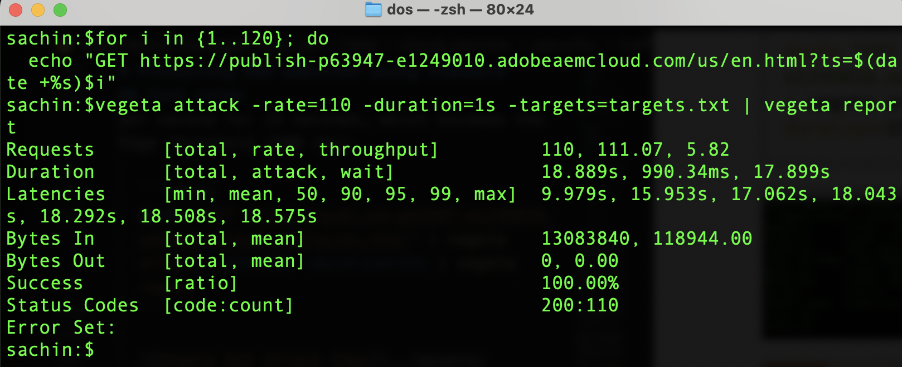
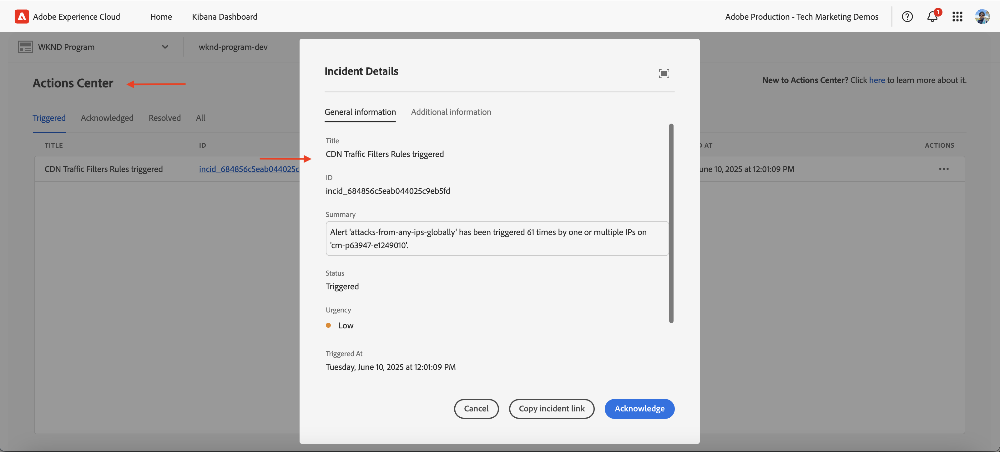
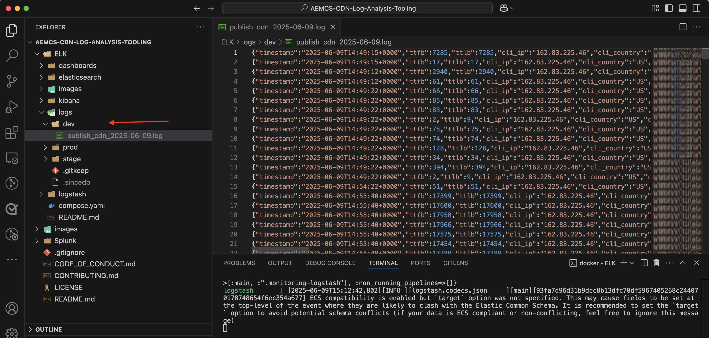

# Protezione dei siti web di AEM tramite le regole standard per il filtro del traffico

Scopri come proteggere i siti web di AEM da Denial of Service (DoS), Distributed Denial of Service (DDoS) e dall’abuso di bot utilizzando _le regole del filtro del traffico standard_ consigliate da Adobe **in AEM as a Cloud Service.**


>[!VIDEO](https://video.tv.adobe.com/v/3469396/?quality=12&learn=on)

## Obiettivi di apprendimento

- Esamina le regole del filtro del traffico standard consigliato da Adobe.
- Definisci, distribuisci, verifica e analizza i risultati delle regole.
- Scopri quando e come perfezionare le regole in base ai pattern di traffico.
- Scopri come utilizzare il Centro azioni di AEM per rivedere gli avvisi generati dalle regole.

### Panoramica sull’implementazione

I passaggi di implementazione includono:

- Aggiunta delle regole del filtro del traffico standard al file `/config/cdn.yaml` del progetto WKND di AEM.
- Esecuzione del commit e push delle modifiche nell’archivio Git di Cloud Manager.
- Distribuzione delle modifiche all’ambiente AEM utilizzando la pipeline di configurazione di Cloud Manager.
- Verifica delle regole simulando un attacco DoS con [Vegeta](https://github.com/tsenart/vegeta)
- Analisi dei risultati mediante i registri CDN di AEMCS e lo strumento dashboard ELK.

## Prerequisiti

Prima di procedere, assicurati di aver completato il lavoro di base richiesto come descritto nell&#39;esercitazione [Come impostare il filtro del traffico e le regole di WAF](../setup.md). Inoltre, hai clonato e distribuito il [progetto AEM WKND Sites](https://github.com/adobe/aem-guides-wknd) nel tuo ambiente AEM.

## Azioni chiave delle regole

Prima di approfondire i dettagli delle regole del filtro del traffico standard, cerchiamo di comprendere le azioni chiave eseguite da tali regole. L&#39;attributo `action` in ogni regola definisce la risposta del filtro del traffico quando le condizioni vengono soddisfatte. Le azioni includono:

- **Registro**: le regole registrano gli eventi per il monitoraggio e l&#39;analisi, consentendo di esaminare i modelli di traffico e modificare le soglie in base alle esigenze. È specificato dall&#39;attributo `type: log`.

- **Avviso**: le regole attivano gli avvisi quando vengono soddisfatte le condizioni, consentendo di identificare potenziali problemi. È specificato dall&#39;attributo `alert: true`.

- **Blocco**: le regole bloccano il traffico quando vengono soddisfatte le condizioni, impedendo l&#39;accesso al sito AEM. È specificato dall&#39;attributo `action: block`.

## Rivedere e definire le regole

Le regole di filtro del traffico standard consigliate da Adobe fungono da livello fondamentale per identificare modelli di traffico potenzialmente dannosi registrando eventi come il superamento dei limiti di velocità basati su IP e bloccando il traffico da paesi specifici. Questi registri aiutano i team a convalidare le soglie e a prendere decisioni informate per **passare in ultima analisi alle regole in modalità blocco** senza interrompere il traffico legittimo.

Esaminiamo le tre regole standard del filtro del traffico da aggiungere al file `/config/cdn.yaml` del progetto AEM WKND:

- **Impedisci attacchi DoS in Edge**: questa regola rileva potenziali attacchi Denial of Service (DoS) nel perimetro della rete CDN monitorando le richieste al secondo (RPS) dagli IP client.
- **Impedisci attacchi DoS all&#39;origine**: questa regola rileva potenziali attacchi Denial of Service (DoS) all&#39;origine monitorando le richieste di recupero dagli IP client.
- **Blocca paesi OFAC**: questa regola blocca l&#39;accesso da specifici paesi che rientrano nelle restrizioni OFAC (Office of Foreign Assets Control).

### &#x200B;1. Impedire i DoS in Edge

Questa regola **invia un avviso** quando rileva un potenziale attacco Denial of Service (DoS) alla rete CDN. I criteri per l&#39;attivazione di questa regola si verificano quando un client supera le **500 richieste al secondo** (media su 10 secondi) per POP CDN (punto di presenza) alla rete Edge.

Conta **tutte** le richieste e le raggruppa per IP client.

```yaml
kind: "CDN"
version: "1"
metadata:
  envTypes: ["dev", "stage", "prod"]
data:
  trafficFilters:
    rules:
    - name: prevent-dos-attacks-edge
      when:
        reqProperty: tier
        equals: 'publish'
      rateLimit:
        limit: 500
        window: 10
        penalty: 300
        count: all
        groupBy:
          - reqProperty: clientIp
      action:
        type: log
        alert: true
```

L&#39;attributo `action` specifica che la regola deve registrare gli eventi e attivare un avviso quando vengono soddisfatte le condizioni. In questo modo è possibile monitorare i potenziali attacchi DoS senza bloccare il traffico legittimo. Tuttavia, l’obiettivo è quello di passare alla modalità blocco di questa regola dopo aver convalidato i pattern di traffico e regolato le soglie.

### &#x200B;2. Impedisci DoS all&#39;origine

Questa regola **invia un avviso** quando rileva un potenziale attacco Denial of Service (DoS) all&#39;origine. I criteri per l&#39;attivazione di questa regola si verificano quando un client supera le **100 richieste al secondo** (media su 10 secondi) per IP client all&#39;origine.

Conta **recuperi** (richieste che ignorano la cache) e le raggruppa per IP client.

```yaml
...
    - name: prevent-dos-attacks-origin
      when:
        reqProperty: tier
        equals: 'publish'
      rateLimit:
        limit: 100
        window: 10
        penalty: 300
        count: fetches
        groupBy:
          - reqProperty: clientIp
      action:
        type: log
        alert: true
```

L&#39;attributo `action` specifica che la regola deve registrare gli eventi e attivare un avviso quando vengono soddisfatte le condizioni. In questo modo è possibile monitorare i potenziali attacchi DoS senza bloccare il traffico legittimo. Tuttavia, l’obiettivo è quello di passare alla modalità blocco di questa regola dopo aver convalidato i pattern di traffico e regolato le soglie.

### &#x200B;3. Blocca paesi OFAC

Questa regola blocca l&#39;accesso da specifici paesi che rientrano nelle restrizioni [OFAC](https://ofac.treasury.gov/sanctions-programs-and-country-information).
È possibile rivedere e modificare l&#39;elenco dei paesi in base alle esigenze.

```yaml
...
    - name: block-ofac-countries
      when:
        allOf:
          - { reqProperty: tier, in: ["author", "publish"] }
          - reqProperty: clientCountry
            in:
              - SY
              - BY
              - MM
              - KP
              - IQ
              - CD
              - SD
              - IR
              - LR
              - ZW
              - CU
              - CI
      action: block
```

L&#39;attributo `action` specifica che la regola deve bloccare l&#39;accesso dai paesi specificati. In questo modo è possibile evitare l’accesso al sito AEM da aree che potrebbero comportare rischi per la sicurezza.

Il file `cdn.yaml` completo con le regole di cui sopra si presenta così:


## Distribuire le regole

Per distribuire le regole di cui sopra, effettua le seguenti operazioni:

- Conferma e invia le modifiche all’archivio Git di Cloud Manager.

- Distribuisci le modifiche all&#39;ambiente AEM utilizzando la pipeline di configurazione di Cloud Manager [creata in precedenza](../setup.md#deploy-rules-using-adobe-cloud-manager).

  

## Regole di test

Per verificare l&#39;efficacia delle regole del filtro del traffico standard, sia in Edge **che in** Origin **della rete CDN, simulare un traffico di richiesta elevato utilizzando** Vegeta[, uno strumento versatile per il test del carico HTTP.](https://github.com/tsenart/vegeta)

- Verifica la regola DoS in Edge (limite di 500 rps). Il comando seguente simula 200 richieste al secondo per 15 secondi, un valore superiore alla soglia di Edge (500 rps).

  ```shell
  $echo "GET https://publish-p63947-e1249010.adobeaemcloud.com/us/en.html" | vegeta attack -rate=200 -duration=15s | vegeta report
  ```

  

  >[!IMPORTANT]
  >
  >  Osserva i codici di stato *100%* e _200_ nel rapporto precedente. Poiché le regole sono impostate su `log` e `alert`, le richieste sono _non bloccate_, ma vengono registrate a scopo di monitoraggio, analisi e avvisi.

- Regola DoS test all&#39;origine (limite di 100 rps). Il comando seguente simula 110 richieste di recupero al secondo per 1 secondo, che supera la soglia di origine (100 rps). Per simulare richieste di esclusione della cache, il file `targets.txt` viene creato con parametri di query univoci per garantire che ogni richiesta venga trattata come una richiesta di recupero.

  ```shell
  # Create targets.txt with unique query parameters
  $for i in {1..110}; do
    echo "GET https://publish-p63947-e1249010.adobeaemcloud.com/us/en.html?ts=$(date +%s)$i"
  done > targets.txt
  
  # Use the targets.txt file to simulate fetch requests
  $vegeta attack -rate=110 -duration=1s -targets=targets.txt | vegeta report
  ```

  

  >[!IMPORTANT]
  >
  >  Osserva i codici di stato *100%* e _200_ nel rapporto precedente. Poiché le regole sono impostate su `log` e `alert`, le richieste sono _non bloccate_, ma vengono registrate a scopo di monitoraggio, analisi e avvisi.

- A scopo di semplicità, la regola OFAC non viene testata qui.

## Rivedi avvisi

Gli avvisi vengono generati quando vengono attivate le regole del filtro del traffico. È possibile esaminare questi avvisi nel [Centro azioni AEM](https://experience.adobe.com/aem/actions-center).



## Analizzare i risultati

Per analizzare i risultati delle regole del filtro del traffico, puoi utilizzare i registri CDN di AEMCS e lo strumento dashboard ELK. Segui le istruzioni riportate nella sezione di configurazione dei [registri CDN](../setup.md#ingest-cdn-logs) per acquisire i registri CDN nello stack ELK.

Nella schermata seguente puoi vedere i registri CDN dell’ambiente di sviluppo AEM acquisiti nello stack ELK.



All&#39;interno dell&#39;applicazione ELK, il **dashboard traffico CDN** deve mostrare il picco in corrispondenza di **Edge** e **Origin** durante gli attacchi DoS simulati.

I due pannelli, _Edge RPS per IP client e POP_ e _Origin RPS per IP client e POP_, visualizzano le richieste al secondo (RPS) rispettivamente al limite e all&#39;origine, raggruppate per IP client e punto di presenza (POP).


Puoi inoltre utilizzare altri pannelli nel dashboard Traffico CDN per analizzare i pattern di traffico, ad esempio _Primi IP client_, _Primi paesi_ e _Primi agenti utente_. Questi pannelli consentono di identificare potenziali minacce e regolare di conseguenza le regole del filtro del traffico.

### Integrazione Splunk

La clientela che dispone dell’[inoltro del registro Splunk abilitato](https://experienceleague.adobe.com/it/docs/experience-manager-cloud-service/content/implementing/developing/logging#splunk-logs) può creare nuove dashboard per analizzare i modelli di traffico.

Per creare dashboard in Splunk, segui i passaggi in [Dashboard Splunk per l’analisi del registro CDN di AEMCS](https://github.com/adobe/AEMCS-CDN-Log-Analysis-Tooling/blob/main/Splunk/README.md#splunk-dashboards-for-aemcs-cdn-log-analysis).

La schermata seguente mostra un esempio di dashboard Splunk che visualizza il numero massimo di richieste di origine e edge per IP, che può aiutarti a identificare potenziali attacchi DoS.


## Quando e come perfezionare le regole

L’obiettivo è quello di evitare il blocco del traffico legittimo, proteggendo al contempo il sito AEM da potenziali minacce. Le regole standard del filtro del traffico sono progettate per allertare e registrare (e infine bloccare quando la modalità viene cambiata) le minacce senza bloccare il traffico legittimo.

Per perfezionare le regole, considera i seguenti passaggi:

- **Monitoraggio dei pattern di traffico**: utilizza i registri CDN e il dashboard ELK per monitorare i pattern di traffico e identificare eventuali anomalie o picchi di traffico.
- **Regola soglie**: in base ai pattern di traffico, regola le soglie (aumenta o diminuisci i limiti di velocità) nelle regole per soddisfare meglio le tue esigenze specifiche. Ad esempio, se noti che il traffico legittimo ha attivato gli avvisi, puoi aumentare i limiti di tariffa o regolare i raggruppamenti.
La tabella seguente fornisce indicazioni su come scegliere i valori di soglia:

  | Variante | Valore |
  | :--------- | :------- |
  | Origine | Considera il valore più alto del numero massimo di richieste di origine per IP/POP in condizioni di traffico **normali** (ovvero non la frequenza al momento di un DDoS) e aumentalo di un multiplo |
  | Edge | Considera il valore più alto del numero massimo di richieste Edge per IP/POP in condizioni di traffico **normali** (ovvero non la frequenza al momento di un DDoS) e aumentalo di un multiplo |

  Vedi anche la sezione [Scelta dei valori di soglia](../../blocking-dos-attack-using-traffic-filter-rules.md#choosing-threshold-values) per ulteriori dettagli.

- **Passa alle regole di blocco**: dopo aver convalidato i pattern di traffico e regolato le soglie, è necessario passare alle regole in modalità blocco.

## Riepilogo

In questo tutorial, hai imparato a proteggere i siti web di AEM da Denial of Service (DoS), Distributed Denial of Service (DDoS) e dall’abuso di bot utilizzando le regole standard consigliate da Adobe per il filtro del traffico in AEM as a Cloud Service.

## Regole WAF consigliate

Scopri come implementare le regole di WAF consigliate da Adobe per proteggere i siti web AEM da minacce sofisticate che utilizzano tecniche avanzate per bypassare le misure di sicurezza tradizionali.

<!-- CARDS
{target = _self}

* ./using-waf-rules.md
  {title = Protecting AEM websites using WAF traffic filter rules}
  {description = Learn how to protect AEM websites from sophisticated threats including DoS, DDoS, and bot abuse using Adobe-recommended Web Application Firewall (WAF) traffic filter rules in AEM as a Cloud Service.}
  {image = ../assets/use-cases/using-waf-rules.png}
  {cta = Activate WAF}
-->
<!-- START CARDS HTML - DO NOT MODIFY BY HAND -->
<div class="columns">
    <div class="column is-half-tablet is-half-desktop is-one-third-widescreen" aria-label="Protecting AEM websites using WAF traffic filter rules">
        <div class="card" style="height: 100%; display: flex; flex-direction: column; height: 100%;">
            <div class="card-image">
                <figure class="image x-is-16by9">
                    <a href="./using-waf-rules.md" title="Protezione dei siti web di AEM tramite le regole del filtro del traffico di WAF" target="_self" rel="referrer">
                        
                    </a>
                </figure>
            </div>
            <div class="card-content is-padded-small" style="display: flex; flex-direction: column; flex-grow: 1; justify-content: space-between;">
                <div class="top-card-content">
                    <p class="headline is-size-6 has-text-weight-bold">
                        <a href="./using-waf-rules.md" target="_self" rel="referrer" title="Protezione dei siti web di AEM tramite le regole del filtro del traffico di WAF">Protezione dei siti Web di AEM tramite le regole del filtro del traffico di WAF</a>
                    </p>
                    <p class="is-size-6">Scopri come proteggere i siti web di AEM da minacce sofisticate, inclusi attacchi DoS, DDoS e abusi di bot, utilizzando le regole del filtro del traffico di WAF (Web Application Firewall) consigliate da Adobe in AEM as a Cloud Service.</p>
                </div>
                <a href="./using-waf-rules.md" target="_self" rel="referrer" class="spectrum-Button spectrum-Button--outline spectrum-Button--primary spectrum-Button--sizeM" style="align-self: flex-start; margin-top: 1rem;">
                    <span class="spectrum-Button-label has-no-wrap has-text-weight-bold">Attiva WAF</span>
                </a>
            </div>
        </div>
    </div>
</div>
<!-- END CARDS HTML - DO NOT MODIFY BY HAND -->


## Casi di utilizzo: oltre le regole standard

Per scenari più avanzati, puoi esplorare i seguenti casi d’uso che mostrano come implementare regole di filtro del traffico personalizzate in base a requisiti di business specifici:

<!-- CARDS
{target = _self}

* ../how-to/request-logging.md

* ../how-to/request-blocking.md

* ../how-to/request-transformation.md
-->
<!-- START CARDS HTML - DO NOT MODIFY BY HAND -->
<div class="columns">
    <div class="column is-half-tablet is-half-desktop is-one-third-widescreen" aria-label="Monitoring sensitive requests">
        <div class="card" style="height: 100%; display: flex; flex-direction: column; height: 100%;">
            <div class="card-image">
                <figure class="image x-is-16by9">
                    <a href="../how-to/request-logging.md" title="Monitoraggio delle richieste sensibili" target="_self" rel="referrer">
                        
                    </a>
                </figure>
            </div>
            <div class="card-content is-padded-small" style="display: flex; flex-direction: column; flex-grow: 1; justify-content: space-between;">
                <div class="top-card-content">
                    <p class="headline is-size-6 has-text-weight-bold">
                        <a href="../how-to/request-logging.md" target="_self" rel="referrer" title="Monitoraggio delle richieste sensibili">Monitoraggio delle richieste sensibili</a>
                    </p>
                    <p class="is-size-6">Scopri come monitorare le richieste sensibili registrandole utilizzando le regole del filtro del traffico in AEM as a Cloud Service.</p>
                </div>
                <a href="../how-to/request-logging.md" target="_self" rel="referrer" class="spectrum-Button spectrum-Button--outline spectrum-Button--primary spectrum-Button--sizeM" style="align-self: flex-start; margin-top: 1rem;">
                    <span class="spectrum-Button-label has-no-wrap has-text-weight-bold">Ulteriori informazioni</span>
                </a>
            </div>
        </div>
    </div>
    <div class="column is-half-tablet is-half-desktop is-one-third-widescreen" aria-label="Restricting access">
        <div class="card" style="height: 100%; display: flex; flex-direction: column; height: 100%;">
            <div class="card-image">
                <figure class="image x-is-16by9">
                    <a href="../how-to/request-blocking.md" title="Limitazione dell’accesso" target="_self" rel="referrer">
                        
                    </a>
                </figure>
            </div>
            <div class="card-content is-padded-small" style="display: flex; flex-direction: column; flex-grow: 1; justify-content: space-between;">
                <div class="top-card-content">
                    <p class="headline is-size-6 has-text-weight-bold">
                        <a href="../how-to/request-blocking.md" target="_self" rel="referrer" title="Limitazione dell’accesso">Limitazione dell'accesso</a>
                    </p>
                    <p class="is-size-6">Scopri come limitare l’accesso bloccando richieste specifiche utilizzando le regole del filtro del traffico in AEM as a Cloud Service.</p>
                </div>
                <a href="../how-to/request-blocking.md" target="_self" rel="referrer" class="spectrum-Button spectrum-Button--outline spectrum-Button--primary spectrum-Button--sizeM" style="align-self: flex-start; margin-top: 1rem;">
                    <span class="spectrum-Button-label has-no-wrap has-text-weight-bold">Ulteriori informazioni</span>
                </a>
            </div>
        </div>
    </div>
    <div class="column is-half-tablet is-half-desktop is-one-third-widescreen" aria-label="Normalizing requests">
        <div class="card" style="height: 100%; display: flex; flex-direction: column; height: 100%;">
            <div class="card-image">
                <figure class="image x-is-16by9">
                    <a href="../how-to/request-transformation.md" title="Normalizzazione delle richieste" target="_self" rel="referrer">
                        
                    </a>
                </figure>
            </div>
            <div class="card-content is-padded-small" style="display: flex; flex-direction: column; flex-grow: 1; justify-content: space-between;">
                <div class="top-card-content">
                    <p class="headline is-size-6 has-text-weight-bold">
                        <a href="../how-to/request-transformation.md" target="_self" rel="referrer" title="Normalizzazione delle richieste">Normalizzazione delle richieste</a>
                    </p>
                    <p class="is-size-6">Scopri come normalizzare le richieste trasformandole utilizzando le regole del filtro del traffico in AEM as a Cloud Service.</p>
                </div>
                <a href="../how-to/request-transformation.md" target="_self" rel="referrer" class="spectrum-Button spectrum-Button--outline spectrum-Button--primary spectrum-Button--sizeM" style="align-self: flex-start; margin-top: 1rem;">
                    <span class="spectrum-Button-label has-no-wrap has-text-weight-bold">Ulteriori informazioni</span>
                </a>
            </div>
        </div>
    </div>
</div>
<!-- END CARDS HTML - DO NOT MODIFY BY HAND -->


## Risorse aggiuntive

- [Regole iniziali consigliate](https://experienceleague.adobe.com/it/docs/experience-manager-cloud-service/content/security/traffic-filter-rules-including-waf#recommended-starter-rules)
