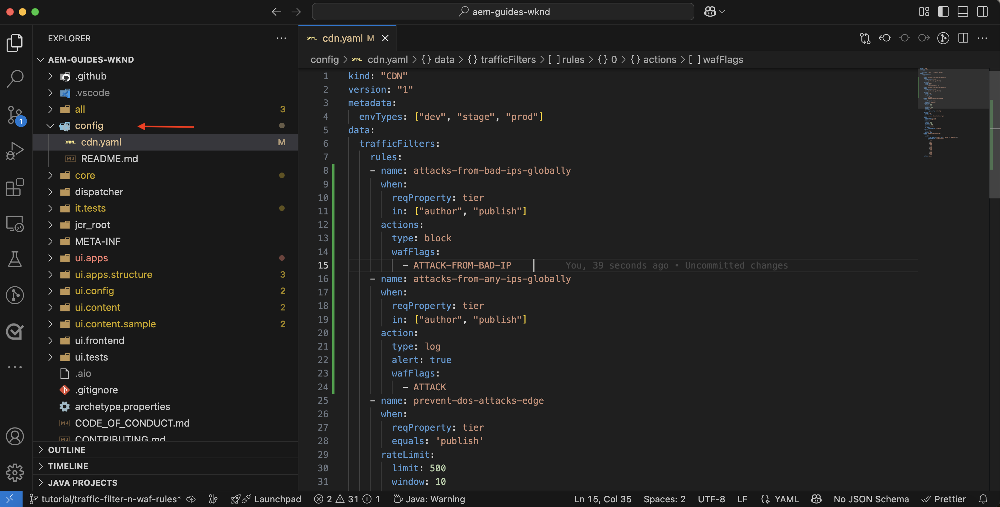
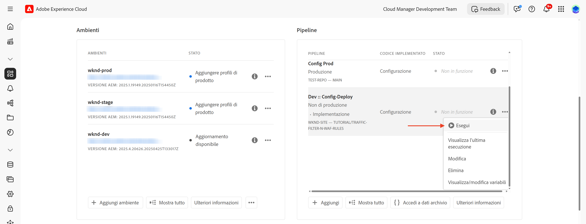

# Protezione dei siti web di AEM tramite le regole di WAF

Scopri come proteggere i siti web di AEM da minacce sofisticate, tra cui DoS, DDoS e abusi di bot utilizzando le **regole WAF (Web Applicatioin Firewall)** _consigliate da Adobe_ in AEM as a Cloud Service.

Gli attacchi sofisticati sono caratterizzati da un’elevata frequenza di richieste, pattern complessi e dall’utilizzo di tecniche avanzate per aggirare le misure di sicurezza tradizionali.

>[!IMPORTANT]
>
> Le regole del filtro del traffico WAF richiedono un’ulteriore licenza **Protezione WAF-DDoS** o **Sicurezza avanzata**. Le regole del filtro del traffico standard sono disponibili per impostazione predefinita per la clientela di Sites e Forms.


>[!VIDEO](https://video.tv.adobe.com/v/3469438/?quality=12&learn=on&captions=ita)

## Obiettivi di apprendimento

- Rivedi le regole di WAF consigliate da Adobe.
- Definisci, distribuisci, testa e analizza i risultati delle regole.
- Informazioni su quando e come perfezionare le regole in base ai risultati.
- Scopri come utilizzare il Centro azioni di AEM per rivedere gli avvisi generati dalle regole.

### Panoramica di implementazione

I passaggi di implementazione includono:

- Aggiunta delle regole WAF al file `/config/cdn.yaml` del progetto WKND di AEM.
- Conferma e invia le modifiche all’archivio Git di Cloud Manager.
- Distribuisci le modifiche nell’ambiente AEM utilizzando la pipeline di configurazione di Cloud Manager.
- Test delle regole con simulazione di un attacco DDoS tramite [Nikto](https://github.com/sullo/nikto/wiki).
- Analisi dei risultati mediante i registri CDN di AEMCS e lo strumento della dashboard ELK.

## Prerequisiti

Prima di procedere, assicurati di aver completato la configurazione richiesta come descritto nel tutorial [Come configurare il filtro del traffico e le regole di WAF](../setup.md). Inoltre, devi avere clonato e distribuito il [progetto WKND di AEM Sites](https://github.com/adobe/aem-guides-wknd) nel tuo ambiente AEM.

## Rivedere e definire le regole

Le regole del firewall per l’applicazione web (WAF) consigliate da Adobe sono essenziali per proteggere i siti web di AEM da minacce sofisticate, tra cui DoS, DDoS e abusi di bot. Gli attacchi sofisticati sono spesso caratterizzati da un’elevata frequenza di richieste, modelli complessi e l’utilizzo di tecniche avanzate (attacchi basati su protocolli o payload) per aggirare le misure di sicurezza tradizionali.

Di seguito è possibile rivedere le tre regole di WAF consigliate che devono essere aggiunte al file `cdn.yaml` nel progetto AEM WKND:

### &#x200B;1. Bloccare gli attacchi da IP dannosi noti

Questa regola **blocca** sia le richieste che sembrano sospette *che* quelle provenienti da indirizzi IP contrassegnati come dannosi. Poiché entrambi questi criteri sono soddisfatti, è possibile avere la certezza che il rischio di falsi positivi (blocco del traffico legittimo) sia molto basso. Gli IP notoriamente negativi sono identificati in base ai feed di intelligence sulle minacce e ad altre fonti.

Il flag WAF `ATTACK-FROM-BAD-IP` viene utilizzato per identificare queste richieste. Aggrega diversi flag WAF [elencati qui](https://experienceleague.adobe.com/it/docs/experience-manager-cloud-service/content/security/traffic-filter-rules-including-waf#waf-flags-list).

```yaml
kind: "CDN"
version: "1"
metadata:
  envTypes: ["dev", "stage", "prod"]
data:
  trafficFilters:
    rules:
    - name: attacks-from-bad-ips-globally
      when:
        reqProperty: tier
        in: ["author", "publish"]
      action:
        type: block
        wafFlags:
          - ATTACK-FROM-BAD-IP
```

### &#x200B;2. Registra (e successivamente blocca) gli attacchi da qualsiasi IP a livello globale

Questa regola **registra** richieste identificate come potenziali attacchi, anche se gli indirizzi IP non vengono trovati nei feed di intelligence sulle minacce.

Il flag WAF `ATTACK` viene utilizzato per identificare queste richieste. Simile a `ATTACK-FROM-BAD-IP`, aggrega diversi flag WAF.

Queste richieste sono probabilmente dannose, ma poiché gli indirizzi IP non vengono identificati nei feed di intelligence sulle minacce, sarebbe più prudente iniziare in modalità `log` anziché in modalità blocco. Analizza i registri per i falsi positivi e, una volta convalidati, **assicurati di passare alla modalità `block`**.

```yaml
...
    - name: attacks-from-any-ips-globally
      when:
        reqProperty: tier
        in: ["author", "publish"]
      action:
        type: log
        alert: true
        wafFlags:
          - ATTACK
```

In alternativa, è possibile scegliere di utilizzare immediatamente la modalità `block` se i requisiti aziendali sono tali da non voler consentire un rischio di traffico dannoso.

Queste regole consigliate di WAF forniscono un ulteriore livello di sicurezza contro le minacce note ed emergenti.



## Effettuare la migrazione alle regole WAF consigliate da Adobe più recenti

Prima dell’introduzione dei flag WAF `ATTACK-FROM-BAD-IP` e `ATTACK` (nel luglio 2025), le regole WAF consigliate erano le seguenti. Contenevano un elenco di flag WAF specifici per bloccare le richieste che corrispondevano a determinati criteri, come `SANS`, `TORNODE`, `NOUA`, ecc.

```yaml
...
data:
  trafficFilters:
    rules:
    ...
    # Enable WAF protections (only works if WAF is enabled for your environment)
      - name: block-waf-flags
        when:
          reqProperty: tier
          matches: "author|publish"
        action:
          type: block
          wafFlags:
            - SANS
            - TORNODE
            - NOUA
            - SCANNER
            - USERAGENT
            - PRIVATEFILE
            - ABNORMALPATH
            - TRAVERSAL
            - NULLBYTE
            - BACKDOOR
            - LOG4J-JNDI
            - SQLI
            - XSS
            - CODEINJECTION
            - CMDEXE
            - NO-CONTENT-TYPE
            - UTF8
...
```

La regola di cui sopra è ancora valida, ma è consigliabile eseguire la migrazione alle nuove regole che utilizzano i flag `ATTACK-FROM-BAD-IP` e `ATTACK` WAF _a condizione che non siano già stati personalizzati i `wafFlags` per soddisfare i requisiti aziendali_.

Puoi eseguire la migrazione alle nuove regole in modo che siano coerenti con le best practice, seguendo questi passaggi:

- Rivedi le regole di WAF esistenti nel file `cdn.yaml`, che potrebbero essere simili all’esempio precedente. Conferma che non esiste alcuna personalizzazione di `wafFlags` specifica per i tuoi requisiti aziendali.

- Sostituisci le regole WAF esistenti con le nuove regole WAF consigliate da Adobe che utilizzano i flag `ATTACK-FROM-BAD-IP` e `ATTACK`. Assicurati che tutte le regole siano in modalità di blocco.

Se `wafFlags` è stato personalizzato in precedenza, è comunque possibile eseguire la migrazione a queste nuove regole, ma in modo accurato, assicurandosi che tutte le personalizzazioni vengano mantenute nelle regole riviste.

La migrazione dovrebbe aiutare a semplificare le regole WAF, fornendo al contempo una solida protezione contro minacce sofisticate. Le nuove regole sono progettate per essere più efficaci e più facili da gestire.


## Distribuire le regole

Per distribuire le regole, segui questi passaggi:

- Conferma e invia le modifiche all’archivio Git di Cloud Manager.

- Implementa le modifiche nell’ambiente di sviluppo di AEM utilizzando la pipeline di configurazione di Cloud Manager [creata in precedenza](../setup.md#deploy-rules-using-adobe-cloud-manager).

  

## Test delle regole

Per verificare l’efficacia delle regole di WAF, simula un attacco utilizzando [Nikto](https://github.com/sullo/nikto), uno scanner del server web che rileva vulnerabilità e configurazioni errate. Il comando seguente attiva gli attacchi SQL injection sul sito web WKND di AEM, protetto dalle regole WAF.

```shell
$./nikto.pl -useragent "AttackSimulationAgent (Demo/1.0)" -D V -Tuning 9 -ssl -h https://publish-pXXXX-eYYYY.adobeaemcloud.com/us/en.html
```


Per informazioni sulla simulazione degli attacchi, consulta la documentazione [Nikto - Scan Tuning](https://github.com/sullo/nikto/wiki/Scan-Tuning), che spiega come specificare il tipo di attacchi di test da includere o escludere.

## Rivedere gli avvisi

Gli avvisi vengono generati quando vengono attivate le regole per il filtro del traffico. È possibile rivedere questi avvisi nel [Centro azioni AEM](https://experience.adobe.com/aem/actions-center).


## Analizzare i risultati

Per analizzare i risultati delle regole per il filtro del traffico, puoi utilizzare i registri CDN di AEMCS e lo strumento della dashboard ELK. Segui le istruzioni riportate nella sezione di configurazione per l’[acquisizione dei registri CDN](../setup.md#ingest-cdn-logs) per acquisire tali registri nello stack ELK.

Nella schermata seguente puoi visualizzare i registri CDN dell’ambiente di sviluppo AEM acquisiti nello stack ELK.


All’interno dell’applicazione ELK, la **dashboard WAF** dovrebbe mostrare le
richieste con flag e i valori corrispondenti nelle colonne IP client (cli_ip), host, URL, azione (waf_action) e nome della regola (waf_match).


Inoltre, i pannelli **Distribuzione flag WAF** e **Attacchi principali** mostrano ulteriori dettagli.


### Integrazione Splunk

La clientela che dispone dell’[inoltro del registro Splunk abilitato](https://experienceleague.adobe.com/it/docs/experience-manager-cloud-service/content/implementing/developing/logging#splunk-logs) può creare nuove dashboard per analizzare i modelli di traffico.

Per creare dashboard in Splunk, segui i passaggi in [Dashboard Splunk per l’analisi del registro CDN di AEMCS](https://github.com/adobe/AEMCS-CDN-Log-Analysis-Tooling/blob/main/Splunk/README.md#splunk-dashboards-for-aemcs-cdn-log-analysis).

## Quando e come perfezionare le regole

Il tuo obiettivo è quello di evitare il blocco del traffico legittimo, proteggendo al contempo i tuoi siti web AEM da minacce sofisticate. Le regole di WAF consigliate sono progettate come punto di partenza per la tua strategia di sicurezza.

Per perfezionare le regole, considera i seguenti passaggi:

- **Monitoraggio dei pattern di traffico**: utilizza i registri CDN e la dashboard ELK per monitorare i pattern di traffico e identificare eventuali anomalie o picchi di traffico. Presta attenzione ai pannelli _Distribuzione flag WAF_ e _Attacchi principali_ nella dashboard ELK per comprendere i tipi di attacchi rilevati.
- **Regola wafFlags**: se i flag `ATTACK` vengono attivati troppo frequentemente o
è necessario ottimizzare il vettore di attacco, puoi creare regole personalizzate con flag WAF specifici. Visualizza l’elenco completo dei [flag WAF](https://experienceleague.adobe.com/it/docs/experience-manager-cloud-service/content/security/traffic-filter-rules-including-waf#waf-flags-list) nella documentazione. Inizialmente, considera di provare le nuove regole personalizzate in modalità `log`.
- **Spostati sulle regole di blocco**: dopo aver convalidato i pattern di traffico e regolato i flag WAF, puoi prendere in considerazione il passaggio alle regole di blocco.

## Riepilogo

In questo tutorial, hai imparato a proteggere i siti web di AEM da minacce sofisticate, inclusi DoS, DDoS e abusi di bot utilizzando le regole del firewall per l’applicazione web (WAF) consigliate da Adobe.

## Casi d’uso: oltre le regole standard

Per scenari più avanzati, puoi esplorare i seguenti casi d’uso che mostrano come implementare regole per il filtro del traffico personalizzate in base a requisiti di business specifici:

<!-- CARDS
{target = _self}

* ../how-to/request-logging.md

* ../how-to/request-blocking.md

* ../how-to/request-transformation.md
-->
<!-- START CARDS HTML - DO NOT MODIFY BY HAND -->
<div class="columns">
    <div class="column is-half-tablet is-half-desktop is-one-third-widescreen" aria-label="Monitoring sensitive requests">
        <div class="card" style="height: 100%; display: flex; flex-direction: column; height: 100%;">
            <div class="card-image">
                <figure class="image x-is-16by9">
                    <a href="../how-to/request-logging.md" title="Monitoraggio delle richieste sensibili" target="_self" rel="referrer">
                        
                    </a>
                </figure>
            </div>
            <div class="card-content is-padded-small" style="display: flex; flex-direction: column; flex-grow: 1; justify-content: space-between;">
                <div class="top-card-content">
                    <p class="headline is-size-6 has-text-weight-bold">
                        <a href="../how-to/request-logging.md" target="_self" rel="referrer" title="Monitoraggio delle richieste sensibili">Monitoraggio delle richieste sensibili</a>
                    </p>
                    <p class="is-size-6">Scopri come monitorare le richieste sensibili registrandole utilizzando le regole per il filtro del traffico in AEM as a Cloud Service.</p>
                </div>
                <a href="../how-to/request-logging.md" target="_self" rel="referrer" class="spectrum-Button spectrum-Button--outline spectrum-Button--primary spectrum-Button--sizeM" style="align-self: flex-start; margin-top: 1rem;">
                    <span class="spectrum-Button-label has-no-wrap has-text-weight-bold">Ulteriori informazioni</span>
                </a>
            </div>
        </div>
    </div>
    <div class="column is-half-tablet is-half-desktop is-one-third-widescreen" aria-label="Restricting access">
        <div class="card" style="height: 100%; display: flex; flex-direction: column; height: 100%;">
            <div class="card-image">
                <figure class="image x-is-16by9">
                    <a href="../how-to/request-blocking.md" title="Limitazione dell’accesso" target="_self" rel="referrer">
                        
                    </a>
                </figure>
            </div>
            <div class="card-content is-padded-small" style="display: flex; flex-direction: column; flex-grow: 1; justify-content: space-between;">
                <div class="top-card-content">
                    <p class="headline is-size-6 has-text-weight-bold">
                        <a href="../how-to/request-blocking.md" target="_self" rel="referrer" title="Limitazione dell’accesso">Limitazione dell’accesso</a>
                    </p>
                    <p class="is-size-6">Scopri come limitare l’accesso bloccando richieste specifiche tramite le regole per il filtro del traffico in AEM as a Cloud Service.</p>
                </div>
                <a href="../how-to/request-blocking.md" target="_self" rel="referrer" class="spectrum-Button spectrum-Button--outline spectrum-Button--primary spectrum-Button--sizeM" style="align-self: flex-start; margin-top: 1rem;">
                    <span class="spectrum-Button-label has-no-wrap has-text-weight-bold">Ulteriori informazioni</span>
                </a>
            </div>
        </div>
    </div>
    <div class="column is-half-tablet is-half-desktop is-one-third-widescreen" aria-label="Normalizing requests">
        <div class="card" style="height: 100%; display: flex; flex-direction: column; height: 100%;">
            <div class="card-image">
                <figure class="image x-is-16by9">
                    <a href="../how-to/request-transformation.md" title="Normalizzare le richieste" target="_self" rel="referrer">
                        
                    </a>
                </figure>
            </div>
            <div class="card-content is-padded-small" style="display: flex; flex-direction: column; flex-grow: 1; justify-content: space-between;">
                <div class="top-card-content">
                    <p class="headline is-size-6 has-text-weight-bold">
                        <a href="../how-to/request-transformation.md" target="_self" rel="referrer" title="Normalizzare le richieste">Normalizzare le richieste</a>
                    </p>
                    <p class="is-size-6">Scopri come normalizzare le richieste trasformandole utilizzando le regole per il filtro del traffico in AEM as a Cloud Service.</p>
                </div>
                <a href="../how-to/request-transformation.md" target="_self" rel="referrer" class="spectrum-Button spectrum-Button--outline spectrum-Button--primary spectrum-Button--sizeM" style="align-self: flex-start; margin-top: 1rem;">
                    <span class="spectrum-Button-label has-no-wrap has-text-weight-bold">Ulteriori informazioni</span>
                </a>
            </div>
        </div>
    </div>
</div>
<!-- END CARDS HTML - DO NOT MODIFY BY HAND -->

## Risorse aggiuntive

- [Regole iniziali consigliate](https://experienceleague.adobe.com/it/docs/experience-manager-cloud-service/content/security/traffic-filter-rules-including-waf#recommended-nonwaf-starter-rules)
- [Elenco flag WAF](https://experienceleague.adobe.com/it/docs/experience-manager-cloud-service/content/security/traffic-filter-rules-including-waf#waf-flags-list)
