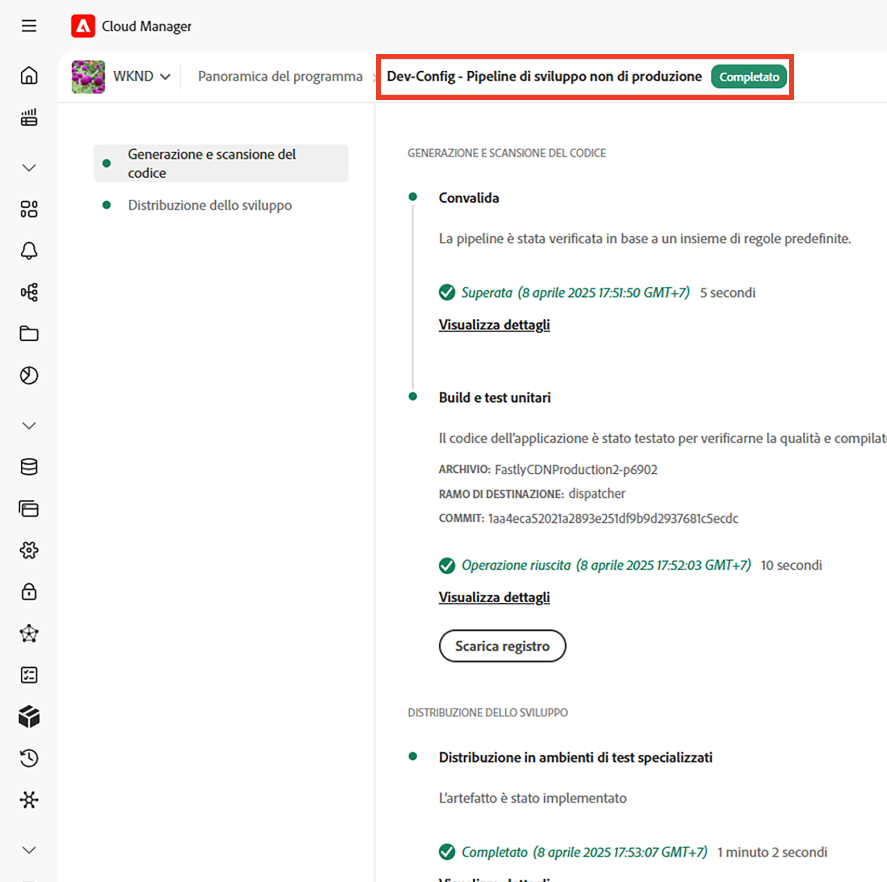
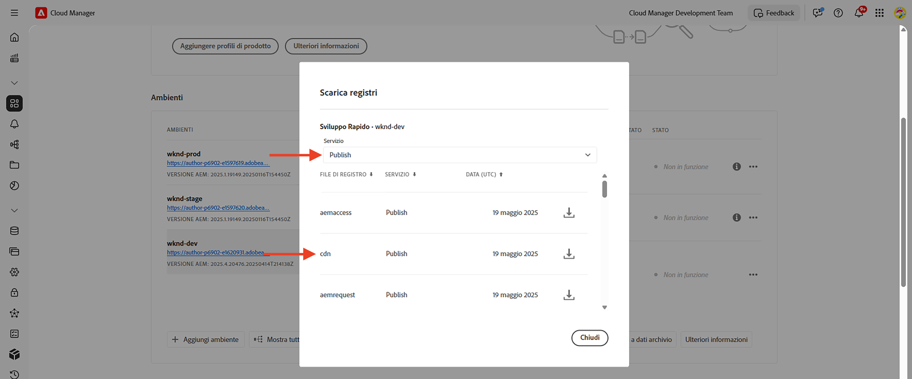
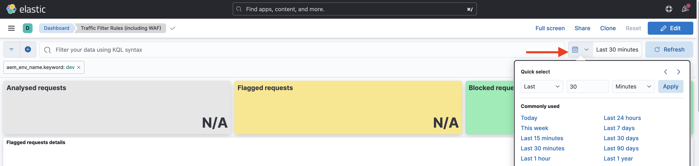
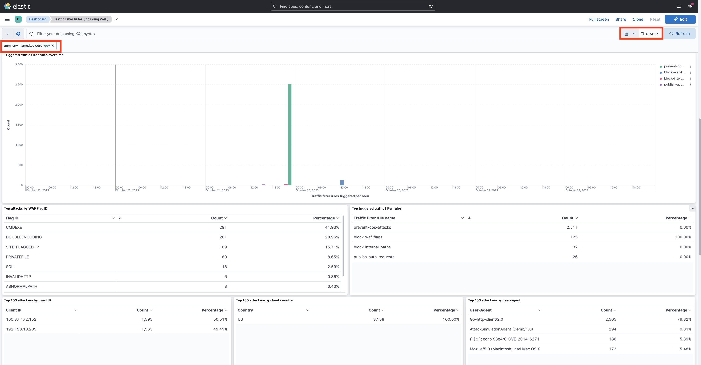

# Esempi e analisi dei risultati delle regole di filtro del traffico, incluse le regole WAF

Scopri come dichiarare vari tipi di regole di filtro del traffico e come analizzare i risultati utilizzando i registri CDN e gli strumenti della dashboard di Adobe Experience Manager as a Cloud Service (AEMCS).

In questa sezione verranno illustrati alcuni esempi pratici delle regole di filtro del traffico, incluse le regole WAF. Scoprirai come registrare, autorizzare e bloccare le richieste in base a URI (o percorso), indirizzo IP, numero di richieste e tipi di attacco diversi utilizzando il [progetto AEM del sito WKND](https://github.com/adobe/aem-guides-wknd#aem-wknd-sites-project).

Inoltre, scoprirai come utilizzare gli strumenti della dashboard per acquisire i registri CDN di AEMCS e visualizzare le metriche essenziali tramite le dashboard di esempio fornite da Adobe.

Per allinearti a requisiti specifici, puoi migliorare le dashboard e creare nuove dashboard personalizzate, per ottenere informazioni più approfondite e ottimizzare le configurazioni delle regole per i tuoi siti AEM.

>[!VIDEO](https://video.tv.adobe.com/v/3425404?quality=12&learn=on)

## Esempi

Esaminiamo vari esempi di regole di filtro del traffico, incluse le regole WAF. Assicurati di aver completato il processo di configurazione richiesto come descritto nel precedente capitolo su [come configurare](./how-to-setup.md) e di aver clonato il [progetto AEM del sito WKND](https://github.com/adobe/aem-guides-wknd#aem-wknd-sites-project).

### Registrare le richieste

Inizia con **la registrazione delle richieste dei percorsi di accesso e disconnessione di WKND** per il servizio AEM Publish.

- Aggiungi la regola seguente al file `/config/cdn.yaml` del progetto WKND.

```yaml
kind: CDN
version: '1'
metadata:
  envTypes:
    - dev
    - stage
    - prod
data:
  trafficFilters:
    rules:
    # On AEM Publish service log WKND Login and Logout requests
      - name: publish-auth-requests
        when:
          allOf:
            - reqProperty: tier
              matches: publish
            - reqProperty: path
              in:
                - /system/sling/login/j_security_check
                - /system/sling/logout
        action: log
```

- Conferma e invia le modifiche all’archivio Git di Cloud Manager.

- Implementa le modifiche nell’ambiente di sviluppo di AEM utilizzando la pipeline di configurazione `Dev-Config` di Cloud Manager [creata in precedenza](how-to-setup.md#deploy-rules-through-cloud-manager).

  

- Verifica la regola effettuando l’accesso e la disconnessione dal sito WKND del programma nel servizio di pubblicazione (ad esempio, `https://publish-pXXXX-eYYYY.adobeaemcloud.com/us/en.html`). È possibile utilizzare `asmith/asmith` come nome utente e password.

  

#### Analisi{#analyzing}

Analizziamo i risultati della regola `publish-auth-requests` scaricando i registri CDN di AEMCS da Cloud Manager e utilizzando gli [strumenti della dashboard](how-to-setup.md#analyze-results-using-elk-dashboard-tool), impostati nel capitolo precedente.

- Dalla scheda **Ambienti** di [Cloud Manager](https://my.cloudmanager.adobe.com/), scarica i registri CDN del servizio **Publish** di AEMCS.

  

  >[!TIP]
  >
  >    Le nuove richieste compariranno nei registri CDN entro 5 minuti.

- Copia il file di registro scaricato (ad esempio, `publish_cdn_2023-10-24.log` nella schermata seguente) nella cartella `logs/dev` del progetto dello strumento della dashboard Elastic.

  {width="800" zoomable="yes"}

- Aggiorna la pagina dello strumento della dashboard Elastic.
   - Nella sezione **Filtro globale**, in alto, modifica il filtro `aem_env_name.keyword` e seleziona il valore dell’ambiente `dev`.

     

   - Per modificare l’intervallo di tempo, fai clic sull’icona del calendario in alto a destra e seleziona l’intervallo di tempo desiderato.

     

- Rivedi i pannelli della dashboard aggiornati per le **richieste analizzate**, le **richieste contrassegnate** e i **dettagli delle richieste contrassegnate**. Per le voci di registro CDN corrispondenti, la dashboard dovrebbe mostrare i valori dell’IP client (cli_ip), dell’host, dell’URL, dell’azione (waf_action) e del nome della regola (waf_match) di ciascuna voce.

  


### Richieste di blocco

In questo esempio, aggiungiamo una pagina in la cartella _internal_ nel percorso `/content/wknd/internal` del progetto WKND implementato. Dichiara quindi una regola del filtro del traffico che **blocca il traffico** verso pagine secondarie da qualsiasi posizione diversa da un indirizzo IP specificato corrispondente all’organizzazione (ad esempio, una VPN aziendale).

Puoi creare una pagina interna personalizzata (ad esempio, `demo-page.html`) oppure utilizzare il [pacchetto allegato](./assets/demo-internal-pages-package.zip).

- Nel file `/config/cdn.yaml` del progetto WKND, aggiungi la seguente regola:

```yaml
kind: CDN
version: '1'
metadata:
  envTypes:
    - dev
    - stage
    - prod
data:
  trafficFilters:
    rules:
    ...

    # Block requests to (demo) internal only page/s from public IP address but allow from internal IP address.
    # Make sure to replace the IP address with your own IP address.
      - name: block-internal-paths
        when:
          allOf:
            - reqProperty: path
              matches: /content/wknd/internal
            - reqProperty: clientIp
              notIn: [192.150.10.0/24]
        action: block
```

- Conferma e invia le modifiche all’archivio Git di Cloud Manager.

- Distribuisci le modifiche all’ambiente di sviluppo AEM utilizzando la pipeline di configurazione [creata in precedenza](how-to-setup.md#deploy-rules-through-cloud-manager) `Dev-Config` in Cloud Manager.

- Verifica la regola accedendo alla pagina interna del sito WKND, ad esempio `https://publish-pXXXX-eYYYY.adobeaemcloud.com/content/wknd/internal/demo-page.html` o utilizzando il comando cURL seguente:

  ```bash
  $ curl -I https://publish-pXXXX-eYYYY.adobeaemcloud.com/content/wknd/internal/demo-page.html
  ```

- Ripeti il passaggio precedente sia dall’indirizzo IP utilizzato nella regola che da un indirizzo IP diverso (ad esempio, utilizzando il telefono cellulare).

#### Analisi

Per analizzare i risultati della regola `block-internal-paths`, segui gli stessi passaggi descritti nell’[esempio precedente](#analyzing).

Tuttavia, questa volta dovresti visualizzare le **richieste bloccate** e i valori corrispondenti nelle colonne IP client (cli_ip), host, URL, azione (waf_action) e nome della regola (waf_match).


### Impedire gli attacchi DoS

Adesso **gli attacchi DoS sono impediti** bloccando le richieste da un indirizzo IP che effettua 100 richieste al secondo, causandone il blocco per 5 minuti.

- Aggiungi la seguente ](https://experienceleague.adobe.com/docs/experience-manager-cloud-service/content/security/traffic-filter-rules-including-waf.html?lang=it#ratelimit-structure)regola del filtro del traffico con limite di frequenza[ nel file `/config/cdn.yaml` del progetto WKND.

```yaml
kind: CDN
version: '1'
metadata:
  envTypes:
    - dev
    - stage
    - prod
data:
  trafficFilters:
    rules:
    ...
    #  Prevent DoS attacks by blocking client for 5 minutes if they make more than 100 requests in 1 second.
      - name: prevent-dos-attacks
        when:
          reqProperty: path
          like: '*'
        rateLimit:
          limit: 100
          window: 1
          penalty: 300
          groupBy:
            - reqProperty: clientIp
        action: block
```

>[!WARNING]
>
>Per l’ambiente di produzione, collabora con il team di sicurezza web per determinare i valori appropriati per `rateLimit`,

- Conferma, invia e implementa le modifiche come indicato negli [esempi precedenti](#logging-requests).

- Per simulare l’attacco DoS, utilizza il comando [Vegeta](https://github.com/tsenart/vegeta) seguente.

  ```shell
  $ echo "GET https://publish-pXXXX-eYYYY.adobeaemcloud.com/us/en.html" | vegeta attack -rate=120 -duration=60s | vegeta report
  ```

  Questo comando effettua 120 richieste per 5 secondi e genera un rapporto. Come puoi vedere, il tasso di successo è del 32,5%; per il resto viene ricevuto un codice di risposta HTTP 406, a dimostrazione che il traffico era bloccato.

  

#### Analisi

Per analizzare i risultati della regola `prevent-dos-attacks`, segui gli stessi passaggi descritti nell’[esempio precedente](#analyzing).

Questa volta dovresti visualizzare molte **richieste bloccate** e i valori corrispondenti nelle colonne IP client (cli_ip), host, URL, azione (waf_action) e nome della regola (waf_match).


Inoltre, i pannelli **Primi 100 attacchi da parte di IP client, paese e agente utente** mostrano ulteriori dettagli che possono essere utilizzati per ottimizzare ulteriormente la configurazione delle regole.


Per ulteriori informazioni su come impedire gli attacchi DoS e DDoS, consulta il tutorial [Blocco degli attacchi DoS e DDoS tramite le regole del filtro del traffico](../blocking-dos-attack-using-traffic-filter-rules.md).

### Regole WAF

Gli esempi di regole del filtro del traffico finora possono essere configurate da tutta la clientela Sites e Forms.

Ora sarà esaminata l’esperienza di un cliente che ha ottenuto una licenza di protezione avanzata o WAF-DDoS, che consente di configurare regole avanzate per proteggere i siti web da attacchi più sofisticati.

Prima di continuare, abilita la protezione WAF-DDoS per il programma, come descritto nella documentazione sulle regole del filtro del traffico nella sezione [Passaggi di configurazione](https://experienceleague.adobe.com/docs/experience-manager-cloud-service/content/security/traffic-filter-rules-including-waf.html?lang=it#setup).

#### Senza WAFFlags

Esamina l’esperienza prima ancora che vengano dichiarate le regole WAF. Quando WAF-DDoS è abilitato nel programma, i registri CDN per impostazione predefinita registrano qualsiasi corrispondenza di traffico dannoso, in modo da avere le informazioni giuste per trovare le regole appropriate.

Inizia attaccando il sito WKND senza aggiungere una regola WAF (o utilizzando la proprietà `wafFlags`) e analizzando i risultati.

- Per simulare un attacco, utilizza il comando [Nikto](https://github.com/sullo/nikto) sottostante, che invia circa 700 richieste dannose in 6 minuti.

  ```shell
  $ ./nikto.pl -useragent "AttackSimulationAgent (Demo/1.0)" -D V -Tuning 9 -ssl -h https://publish-pXXXX-eYYYY.adobeaemcloud.com/us/en.html
  ```

  

  Per informazioni sulla simulazione degli attacchi, consulta la documentazione [Nikto - Scan Tuning](https://github.com/sullo/nikto/wiki/Scan-Tuning), che spiega come specificare il tipo di attacchi di test da includere o escludere.

##### Analisi

Per analizzare i risultati della simulazione dell’attacco, segui gli stessi passaggi descritti nell’[esempio precedente](#analyzing).

Tuttavia, questa volta dovresti visualizzare le **richieste con flag** e i valori corrispondenti nelle colonne IP client (cli_ip), host, URL, azione (waf_action) e nome della regola (waf_match). Queste informazioni consentono di analizzare i risultati e ottimizzare la configurazione della regola.


I pannelli **Distribuzione flag WAF** e **Attacchi principali** mostrano ulteriori dettagli che possono essere utilizzati per ottimizzare ulteriormente la configurazione della regola.


#### Con WAFFlags

Ora viene aggiunta una regola WAF che contiene la proprietà `wafFlags` come parte della proprietà `action` e **blocca le richieste di attacchi simulati**.

Dal punto di vista della sintassi, le regole WAF sono simili a quelle visualizzate in precedenza, tuttavia, la proprietà `action` fa riferimento a uno o più valori `wafFlags`. Per ulteriori informazioni su `wafFlags`, consulta la sezione [Elenco dei flag WAF](https://experienceleague.adobe.com/docs/experience-manager-cloud-service/content/security/traffic-filter-rules-including-waf.html?lang=it#waf-flags-list).

- Nel file `/config/cdn.yaml` del progetto WKND, aggiungi la seguente regola. Tieni presente che la regola `block-waf-flags` include alcuni dei wafFlags comparsi negli strumenti della dashboard quando è stata attaccata da traffico dannoso simulato. In effetti, è buona prassi nel tempo analizzare i registri per determinare quali nuove regole dichiarare, man mano che il panorama delle minacce si evolve.

```yaml
kind: CDN
version: '1'
metadata:
  envTypes:
    - dev
    - stage
    - prod
data:
  trafficFilters:
    rules:
    ...
    # Enable WAF protections (only works if WAF is enabled for your environment)
      - name: block-waf-flags
        when:
          reqProperty: tier
          matches: "author|publish"
        action:
          type: block
          wafFlags:
            - SANS
            - TORNODE
            - NOUA
            - SCANNER
            - USERAGENT
            - PRIVATEFILE
            - ABNORMALPATH
            - TRAVERSAL
            - NULLBYTE
            - BACKDOOR
            - LOG4J-JNDI
            - SQLI
            - XSS
            - CODEINJECTION
            - CMDEXE
            - NO-CONTENT-TYPE
            - UTF8
```

- Conferma, invia e implementa le modifiche come indicato negli [esempi precedenti](#logging-requests).

- Per simulare un attacco, utilizza lo stesso comando [Nikto](https://github.com/sullo/nikto) precedente.

  ```shell
  $ ./nikto.pl -useragent "AttackSimulationAgent (Demo/1.0)" -D V -Tuning 9 -ssl -h https://publish-pXXXX-eYYYY.adobeaemcloud.com/us/en.html
  ```

##### Analisi

Ripeti gli stessi passaggi descritti nell’[esempio precedente](#analyzing).

Questa volta dovresti visualizzare le voci in **Richieste bloccate** e i valori corrispondenti nelle colonne IP client (cli_ip), host, URL, azione (waf_action) e nome della regola (waf_match).


Inoltre, i pannelli **Distribuzione flag WAF** e **Attacchi principali** mostrano ulteriori dettagli.


### Analisi completa

Nelle sezioni di _analisi_ precedenti hai imparato ad analizzare i risultati di regole specifiche utilizzando lo strumento dashboard. Puoi esplorare ulteriormente l’analisi dei risultati utilizzando altri pannelli della dashboard, tra cui:


- Richieste analizzate, contrassegnate e bloccate
- Distribuzione dei contrassegni WAF nel tempo
- Attivazione delle regole del filtro del traffico nel tempo
- Principali attacchi per ID contrassegno WAF
- Principale filtro di traffico attivato
- Primi 100 autori di attacchi per IP client, paese e agente utente





## Passaggio successivo

Acquisisci familiarità con le [best practice](./best-practices.md) consigliate per ridurre il rischio di violazioni della sicurezza.

## Risorse aggiuntive

[Sintassi delle regole del filtro del traffico](https://experienceleague.adobe.com/docs/experience-manager-cloud-service/content/security/traffic-filter-rules-including-waf.html?lang=it#rules-syntax)

[Formato registro CDN](https://experienceleague.adobe.com/docs/experience-manager-cloud-service/content/security/traffic-filter-rules-including-waf.html?lang=it#cdn-log-format)

