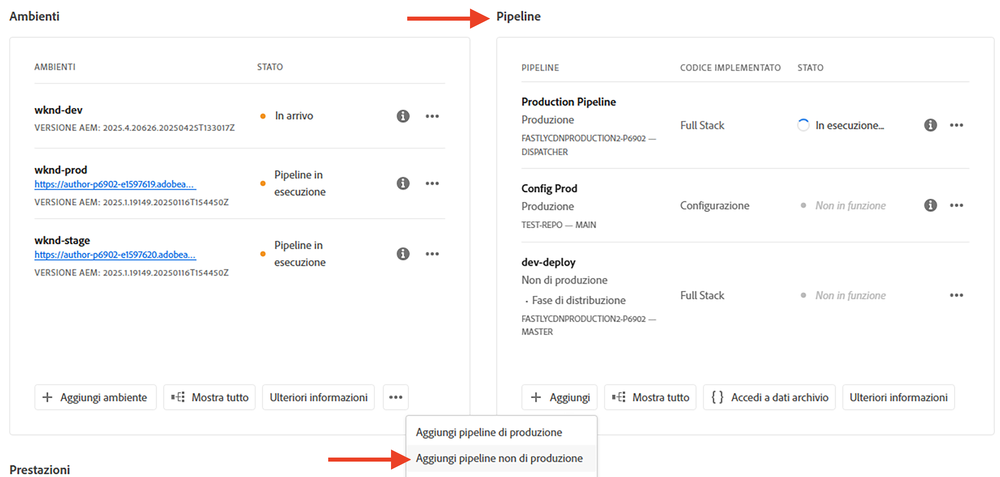
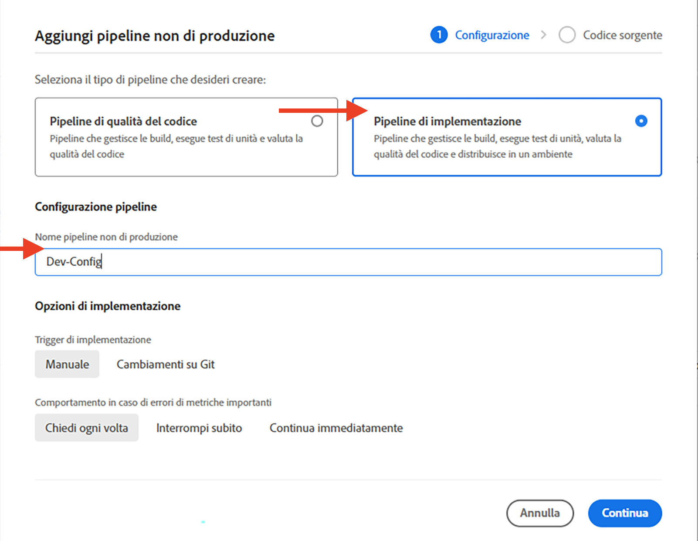
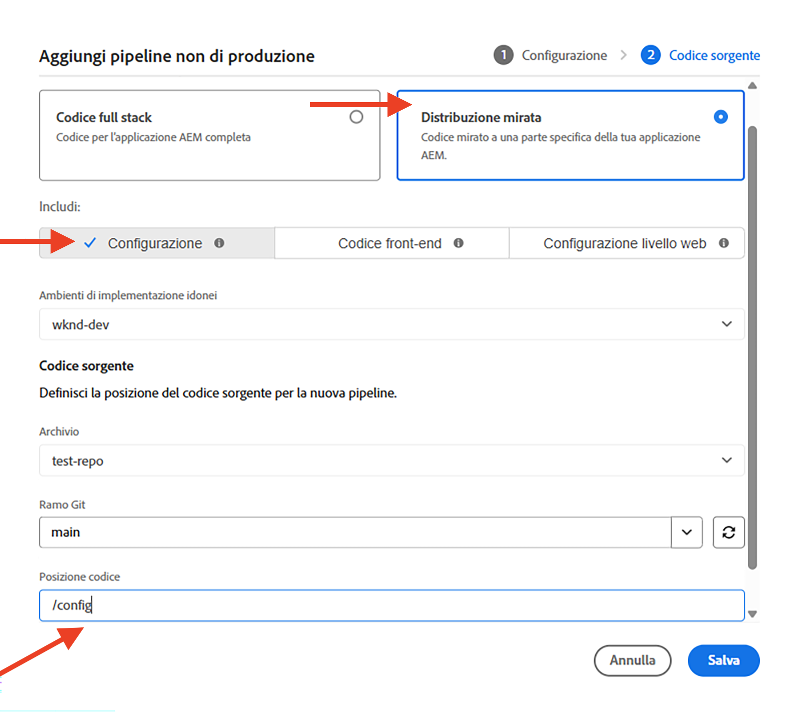

# Come impostare le regole del filtro del traffico, incluse le regole di WAF

Scopri **come impostare** le regole del filtro del traffico, incluse le regole di WAF. Scopri come creare, distribuire, testare e analizzare i risultati.

>[!VIDEO](https://video.tv.adobe.com/v/3425407?quality=12&learn=on)

## Configurazione

Il processo di configurazione prevede quanto segue:

- _creazione di regole_ con una struttura di progetto e un file di configurazione AEM appropriati.
- _distribuzione delle regole_ tramite la pipeline di configurazione di Adobe Cloud Manager.
- _verifica delle regole_ utilizzando vari strumenti per generare il traffico.
- _analisi dei risultati_ tramite registri CDN AEMCS e strumenti del dashboard.

### Creare regole nel progetto AEM

Per creare le regole, effettua le seguenti operazioni:

1. Al livello principale del progetto AEM, creare una cartella `config`.

1. Nella cartella `config` creare un nuovo file denominato `cdn.yaml`.

1. Aggiungere i metadati seguenti al file `cdn.yaml`:

```yaml
kind: CDN
version: '1'
metadata:
  envTypes:
    - dev
    - stage
    - prod
data:
  trafficFilters:
    rules:
```

Vedi un esempio del file `cdn.yaml` all&#39;interno del progetto AEM Guides WKND Sites:

{width="800" zoomable="yes"}

### Distribuire le regole tramite Cloud Manager {#deploy-rules-through-cloud-manager}

Per distribuire le regole, effettua le seguenti operazioni:

1. Accedi a Cloud Manager all’indirizzo [my.cloudmanager.adobe.com](https://my.cloudmanager.adobe.com/) e seleziona l’organizzazione e il programma appropriati.

1. Passa alla scheda _Pipeline_ dalla pagina _Panoramica del programma_, fai clic sul pulsante **+Aggiungi** e seleziona il tipo di pipeline desiderato.

   

   Nell&#39;esempio precedente, per scopi demo _Aggiungi pipeline non di produzione_ è selezionato poiché viene utilizzato un ambiente di sviluppo.

1. Nella finestra di dialogo _Aggiungi pipeline non di produzione_, scegli e immetti i seguenti dettagli:

   1. Passaggio di configurazione:

      - **Tipo**: pipeline di distribuzione
      - **Nome pipeline**: Dev-Config

      

   2. Passaggio codice Source:

      - **Codice da distribuire**: distribuzione di destinazione
      - **Includi**: Configurazione
      - **Ambiente di distribuzione**: nome dell&#39;ambiente, ad esempio wknd-program-dev.
      - **Archivio**: l&#39;archivio Git da cui la pipeline deve recuperare il codice, ad esempio `wknd-site`
      - **Ramo Git**: nome del ramo dell&#39;archivio Git.
      - **Posizione codice**: `/config`, corrispondente alla cartella di configurazione di primo livello creata nel passaggio precedente.

      

### Verifica le regole generando traffico

Per testare le regole, sono disponibili vari strumenti di terze parti e la tua organizzazione potrebbe avere uno strumento preferito. A scopo dimostrativo, utilizziamo i seguenti strumenti:

- [Curl](https://curl.se/) per test di base, ad esempio per richiamare un URL e controllare il codice di risposta.

- [Vegeta](https://github.com/tsenart/vegeta) per l&#39;esecuzione di Denial of Service (DOS). Segui le istruzioni di installazione da [Vegeta GitHub](https://github.com/tsenart/vegeta#install).

- [Nikto](https://github.com/sullo/nikto/wiki) per trovare potenziali problemi e vulnerabilità di sicurezza come XSS, SQL injection e altro ancora. Segui le istruzioni di installazione da [Nikto GitHub](https://github.com/sullo/nikto).

- Verificare che gli strumenti siano installati e disponibili nel terminale eseguendo i comandi seguenti:

  ```shell
  # Curl version check
  $ curl --version
  
  # Vegeta version check
  $ vegeta -version
  
  # Nikto version check
  $ cd <PATH-OF-CLONED-REPO>/program
  ./nikto.pl -Version
  ```

### Analizzare i risultati utilizzando gli strumenti del dashboard

Dopo aver creato, distribuito e testato le regole, puoi analizzare i risultati utilizzando i registri **CDN** e **AEMCS-CDN-Log-Analysis-Tooling**. Gli strumenti forniscono un set di dashboard per visualizzare i risultati per lo stack Splunk e ELK (Elasticsearch, Logstash e Kibana).

È possibile clonare gli strumenti dall&#39;archivio GitHub [AEMCS-CDN-Log-Analysis-Tooling](https://github.com/adobe/AEMCS-CDN-Log-Analysis-Tooling). Quindi, segui le istruzioni per installare e caricare le dashboard **CDN Traffic Dashboard** e **WAF Dashboard** per lo strumento di osservabilità preferito.

In questa esercitazione utilizzeremo lo stack ELK. Segui le istruzioni del contenitore Docker [ELK per l&#39;analisi del registro CDN di AEMCS](https://github.com/adobe/AEMCS-CDN-Log-Analysis-Tooling/blob/main/ELK/README.md) per configurare lo stack ELK.

- Dopo aver caricato il dashboard di esempio, la pagina dello strumento del dashboard elastico dovrebbe avere un aspetto simile a quella riportata di seguito:

  

>[!NOTE]
>
>    Poiché non sono ancora stati acquisiti registri CDN AEMCS, la dashboard è vuota.


## Passaggio successivo

Scopri come dichiarare le regole del filtro del traffico, incluse le regole di WAF nel capitolo [Esempi e analisi dei risultati](./examples-and-analysis.md), utilizzando il progetto AEM WKND Sites.
