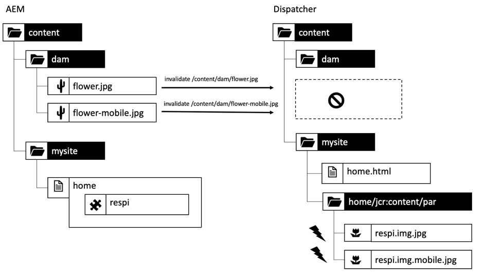

# Capitolo 1 - Concetti, modelli e strategie antipatcher

## Panoramica

Questo capitolo fornisce una breve introduzione sulla storia e le meccaniche di Dispatcher e illustra come questo influenzi il modo in cui uno sviluppatore di AEM progetterebbe i suoi componenti.

## Perché gli sviluppatori dovrebbero preoccuparsi dell&#39;infrastruttura

Dispatcher è una parte essenziale della maggior parte delle installazioni AEM, se non di tutte. Puoi trovare molti articoli online che illustrano come configurare Dispatcher, nonché suggerimenti e trucchi.

Tuttavia, queste informazioni partono sempre da un livello molto tecnico, supponendo che tu sappia già cosa desideri fare e quindi fornisca solo i dettagli su come ottenere ciò che desideri. Non abbiamo mai trovato documenti concettuali che descrivano _cosa è e perché è_ quando si tratta di cosa è possibile fare o non è possibile fare con Dispatcher.

### Antipattering: Dispatcher come post-pensiero

Questa mancanza di informazioni di base porta a una serie di anti-pattern che abbiamo visto in una serie di progetti AEM:

1. Poiché Dispatcher viene installato nel server web Apache, la sua configurazione è compito delle &quot;divinità Unix&quot; nel progetto. Uno &quot;sviluppatore Java mortale&quot; non ha bisogno di preoccuparsi di esso.

2. Lo sviluppatore Java deve assicurarsi che il suo codice funzioni... il dispatcher in seguito lo renderà magicamente veloce. Il dispatcher è sempre un ripensamento. Tuttavia, questo non funziona. Uno sviluppatore deve progettare il codice tenendo presente Dispatcher. E per farlo deve conoscere i suoi concetti di base.

### &quot;Prima fare funzionare - poi rendere veloce&quot; Non è sempre giusto

Potresti aver sentito i consigli sulla programmazione _&quot;Farlo funzionare, quindi velocizzarlo&quot;._. Non è del tutto sbagliato. Tuttavia, senza il contesto giusto, tende a essere male interpretata e non applicata correttamente.

Il consiglio dovrebbe evitare che lo sviluppatore ottimizzi anticipatamente il codice, che potrebbe non essere mai eseguito - o che viene eseguito così raramente, che un’ottimizzazione non avrebbe un impatto sufficiente per giustificare lo sforzo inserito nell’ottimizzazione. Inoltre, l’ottimizzazione potrebbe portare a codice più complesso e quindi introdurre bug. Quindi, se sei uno sviluppatore, non spendere troppo tempo sulla micro-ottimizzazione di ogni singola riga di codice. Assicurati di scegliere le strutture di dati, gli algoritmi e le librerie giuste e attendi l’analisi dei punti attivi di un profiler per vedere dove un’ottimizzazione più approfondita potrebbe aumentare le prestazioni complessive.

### Decisioni di architettura e artefatti

Tuttavia, il consiglio di &quot;prima farlo funzionare - poi farlo in fretta&quot; è completamente sbagliato quando si tratta di decisioni &quot;architettoniche&quot;. Cosa sono le decisioni architettoniche? In poche parole, sono decisioni costose, difficili e/o impossibili da cambiare in seguito. Tieni presente che &quot;costoso&quot; a volte equivale a &quot;impossibile&quot;.  Ad esempio, quando il progetto sta esaurendo il budget, è impossibile implementare costose modifiche. I cambiamenti infrastrutturali sono il primo tipo di cambiamenti in quella categoria che viene nella mente della maggior parte delle persone. Ma c&#39;è anche un altro tipo di artefatti &quot;architettonici&quot; che possono diventare molto negativi da cambiare:

1. Pezzi di codice nel &quot;centro&quot; di un’applicazione, su cui si basano molti altri pezzi. La modifica di queste, richiede che tutte le dipendenze vengano modificate e testate di nuovo contemporaneamente.

2. Gli artefatti, che sono coinvolti in alcuni scenari asincroni, dipendenti dal tempo in cui l&#39;input - e quindi il comportamento del sistema può variare in modo molto casuale. I cambiamenti possono avere effetti imprevedibili e possono essere difficili da testare.

3. Modelli di software che vengono utilizzati e riutilizzati più e più volte, in tutte le parti del sistema. Se il modello software risulta non ottimale, tutti gli artefatti che utilizzano il modello devono essere codificati nuovamente.

Ricordi? In cima a questa pagina abbiamo detto che Dispatcher è una parte essenziale di un’applicazione per l’AEM. L’accesso a un’applicazione web è molto casuale: gli utenti arrivano e partono in momenti imprevedibili. Alla fine: tutto il contenuto sarà (o dovrebbe) essere memorizzato nella cache in Dispatcher. Quindi, se presti molta attenzione, potresti aver capito che la memorizzazione in cache potrebbe essere vista come un artefatto &quot;architetturale&quot; e quindi dovrebbe essere compresa da tutti i membri del team, sviluppatori e amministratori allo stesso modo.

Non stiamo dicendo che uno sviluppatore debba effettivamente configurare Dispatcher. Devono conoscere i concetti, in particolare i confini, per assicurarsi che il loro codice possa essere utilizzato anche da Dispatcher.

Dispatcher non migliora magicamente la velocità del codice. Uno sviluppatore deve creare i propri componenti avendo in mente Dispatcher. Pertanto, ha bisogno di sapere come funziona.

## Memorizzazione in cache di Dispatcher - Principi di base

### Dispatcher come memorizzazione in cache Http - Load Balancer

Cos’è Dispatcher e perché viene chiamato &quot;Dispatcher&quot;, in primo luogo?

Il Dispatcher è

* Prima di tutto una cache

* Un proxy inverso

* Un modulo per il server web Apache httpd, che aggiunge funzionalità relative all’AEM alla versatilità di Apache e funziona senza problemi insieme a tutti gli altri moduli Apache (come SSL o anche SSI include come vedremo in seguito)

Nei primi giorni del web, ci si aspetta qualche centinaio di visitatori di un sito. La configurazione di un’istanza di Dispatcher ha &quot;inviato&quot; o bilanciato il carico di richieste a diversi server di pubblicazione AEM e ciò era in genere sufficiente, ovvero il nome &quot;Dispatcher&quot;. Al giorno d’oggi, tuttavia, questa configurazione non viene più utilizzata molto frequentemente.

Vedremo diversi modi per configurare i sistemi Dispatcher e Publish più avanti in questo articolo. Iniziamo con alcune nozioni di base sulla memorizzazione in cache http.


*Funzionalità di base di una cache di Dispatcher*

<br> 

Le nozioni di base del dispatcher sono illustrate qui. Dispatcher è un proxy inverso di memorizzazione nella cache semplice che consente di ricevere e creare richieste HTTP. Un normale ciclo di richiesta/risposta è simile al seguente:

1. Un utente richiede una pagina
2. Dispatcher controlla se dispone già di una versione di cui è stato eseguito il rendering della pagina. Supponiamo che sia la prima richiesta per questa pagina e che Dispatcher non possa trovare una copia locale memorizzata in cache.
3. Dispatcher richiede la pagina dal sistema di pubblicazione
4. Nel sistema di pubblicazione, la pagina viene riprodotta da un modello JSP o HTL
5. La pagina viene restituita a Dispatcher
6. Dispatcher memorizza in cache la pagina
7. Dispatcher restituisce la pagina al browser
8. Se la stessa pagina viene richiesta una seconda volta, può essere servita direttamente dalla cache di Dispatcher senza la necessità di eseguirne di nuovo il rendering sull’istanza Publish. In questo modo si risparmia il tempo di attesa per i cicli dell’utente e della CPU sull’istanza Publish.

Stavamo parlando di &quot;pagine&quot; nell&#39;ultima sezione. Ma lo stesso schema si applica anche ad altre risorse come immagini, file CSS, download di PDF e così via.

#### Memorizzazione In Cache Dei Dati

Il modulo Dispatcher sfrutta le funzionalità fornite dal server Apache che lo ospita. Risorse quali pagine di HTML, download e immagini vengono memorizzate come file semplici nel file system Apache. È così semplice.

Il nome del file è derivato dall’URL della risorsa richiesta. Se si richiede un file `/foo/bar.html` viene memorizzato, ad esempio, in /`var/cache/docroot/foo/bar.html`.

In linea di principio, se tutti i file vengono memorizzati nella cache e quindi memorizzati in modo statico in Dispatcher, puoi richiamare la spina del sistema di pubblicazione e Dispatcher funge da semplice server web. Ma questo serve solo per illustrare il principio. La vita reale è più complicata. Non è possibile memorizzare tutto in cache e la cache non è mai completamente &quot;piena&quot;, in quanto il numero di risorse può essere infinito a causa della natura dinamica del processo di rendering. Il modello di un file system statico consente di generare un’immagine approssimativa delle funzionalità del dispatcher. E aiuta a spiegare i limiti del dispatcher.

#### Struttura degli URL dell’AEM e mappatura del file system

Per comprendere il Dispatcher in modo più dettagliato, rivediamo la struttura di un semplice URL di esempio.  Vediamo l’esempio seguente,

`http://domain.com/path/to/resource/pagename.selectors.html/path/suffix.ext?parameter=value&amp;otherparameter=value#fragment`

* `http` indica il protocollo

* `domain.com` è il nome di dominio

* `path/to/resource` è il percorso in cui la risorsa viene memorizzata in CRX e successivamente nel file system del server Apache

Da qui, le cose sono un po&#39; diverse tra il file system dell&#39;AEM e quello di Apache.

Nell&#39;AEM,

* `pagename` è l’etichetta delle risorse

* `selectors` sta per un numero di selettori utilizzati in Sling per determinare come viene eseguito il rendering della risorsa. Un URL può avere un numero arbitrario di selettori. Sono separati da un punto. Una sezione di selettori potrebbe essere, ad esempio, simile a &quot;french.mobile.fancy&quot;. I selettori devono contenere solo lettere, cifre e trattini.

* `html` essendo l’ultimo dei &quot;selettori&quot;, si chiama estensione. In AEM/Sling determina anche in parte lo script di rendering.

* `path/suffix.ext` è un’espressione simile a un percorso che può essere un suffisso dell’URL.  Può essere utilizzato negli script AEM per controllare ulteriormente il rendering di una risorsa. In seguito verrà visualizzata un&#39;intera sezione relativa a questa parte. Per il momento, dovrebbe essere sufficiente sapere che puoi utilizzarlo come parametro aggiuntivo. I suffissi devono avere un&#39;estensione.

* `?parameter=value&otherparameter=value` è la sezione query dell’URL. Viene utilizzato per trasmettere parametri arbitrari all’AEM. Gli URL con parametri non possono essere memorizzati in cache e pertanto i parametri devono essere limitati ai casi in cui sono assolutamente necessari.

* `#fragment`, la parte frammento di un URL non viene passata all’AEM e viene utilizzata solo nel browser; nei framework JavaScript può essere utilizzata come &quot;parametri di routing&quot; o per passare a una determinata parte della pagina.

In Apache (*fai riferimento al diagramma seguente*),

* `pagename.selectors.html` viene utilizzato come nome del file nel file system della cache.

Se l’URL ha un suffisso `path/suffix.ext` allora,

* `pagename.selectors.html` viene creato come cartella

* `path` una cartella in `pagename.selectors.html` cartella

* `suffix.ext` è un file in `path` cartella. Nota: se il suffisso non ha un’estensione, il file non viene memorizzato in cache.


*Layout del file system dopo aver ottenuto gli URL da Dispatcher*

<br> 

#### Limitazioni di base

La mappatura tra un URL, la risorsa e il nome del file è piuttosto semplice.

Potresti tuttavia aver notato alcune trappole,

1. Gli URL possono diventare molto lunghi. Aggiunta della porzione &quot;percorso&quot; di un `/docroot` sul file system locale potrebbe facilmente superare i limiti di alcuni file system. L’esecuzione di Dispatcher in NTFS su Windows può essere problematico. È al sicuro con Linux, però.

2. Gli URL possono contenere caratteri speciali e umlaut. Questo generalmente non è un problema per il dispatcher. Tuttavia, tieni presente che l’URL viene interpretato in molti punti dell’applicazione. Nella maggior parte dei casi, abbiamo assistito a strani comportamenti di un’applicazione - solo per scoprire che un pezzo di codice raramente utilizzato (personalizzato) non è stato testato completamente per i caratteri speciali. Dovresti evitarli se puoi. E se non ci riesci, pianifica dei test approfonditi.

3. In CRX, le risorse dispongono di risorse secondarie. Ad esempio, una pagina avrà diverse sottopagine. Non è possibile trovare una corrispondenza in un file system perché i file system contengono file o cartelle.

#### Gli URL senza estensione non vengono memorizzati in cache

Gli URL devono sempre avere un’estensione. Anche se puoi distribuire URL senza estensioni in AEM. Questi URL non verranno memorizzati nella cache in Dispatcher.

**Esempi**

`http://domain.com/home.html` è **memorizzabile in cache**

`http://domain.com/home` è **non memorizzabile in cache**

La stessa regola si applica quando l’URL contiene un suffisso. Il suffisso deve avere un’estensione per essere memorizzabile in cache.

**Esempi**

`http://domain.com/home.html/path/suffix.html` è **memorizzabile in cache**

`http://domain.com/home.html/path/suffix` è **non memorizzabile in cache**

Potresti chiederti cosa succede se la parte risorsa non ha un’estensione, ma il suffisso ne ha una? Beh, in questo caso l’URL non ha alcun suffisso. Osserva il prossimo esempio:

**Esempio**

`http://domain.com/home/path/suffix.ext`

Il `/home/path/suffix` è il percorso della risorsa... quindi nell’URL non è presente alcun suffisso.

**Conclusione**

Aggiungi sempre estensioni sia al percorso che al suffisso. Le persone che sono consapevoli della SEO a volte sostengono che questa sia la classificazione dell’utente tra i risultati della ricerca. Tuttavia, una pagina non memorizzata nella cache sarebbe super lenta e sarebbe ulteriormente ridotta.

#### URL suffisso in conflitto

Considera di disporre di due URL validi

`http://domain.com/home.html`

e

`http://domain.com/home.html/suffix.html`

Sono assolutamente validi nell&#39;AEM. Non vedrai alcun problema sul tuo computer di sviluppo locale (senza un Dispatcher). Molto probabilmente non incontrerai alcun problema nei test UAT o di carico. Il problema che stiamo affrontando è così sottile che passa attraverso la maggior parte dei test.  Ti colpirà duramente quando sei al momento di picco e hai un tempo limitato per affrontarlo, probabilmente non hai accesso al server e non disponi di risorse per correggerlo. Siamo stati lì...

Allora... qual è il problema?

`home.html` in un file system può essere un file o una cartella. Non entrambi contemporaneamente all’AEM.

Se si richiede `home.html` innanzitutto, viene creato come file.

Richieste successive a `home.html/suffix.html` restituisce risultati validi, ma come file `home.html` &quot;blocca&quot; la posizione nel file system,  `home.html` non può essere creato una seconda volta come cartella e quindi `home.html/suffix.html` non è memorizzato in cache.


*Posizione di blocco dei file nel file system che impedisce la memorizzazione nella cache delle risorse secondarie*

<br> 

Se si fa il contrario, prima richiedere `home.html/suffix.html` allora `suffix.html` è memorizzato nella cache in una cartella `/home.html` all&#39;inizio. Tuttavia, questa cartella viene eliminata e sostituita da un file `home.html` quando successivamente richiedi `home.html` come risorsa.


*Eliminazione di una struttura di percorso quando un elemento padre viene recuperato come risorsa*

<br> 

Pertanto, il risultato di ciò che viene memorizzato in cache è completamente casuale e dipende dall’ordine delle richieste in arrivo. Ciò che rende le cose ancora più complicate è il fatto che di solito si ha più di un dispatcher. Inoltre, le prestazioni, la frequenza di accessi alla cache e il comportamento potrebbero variare in modo diverso da un Dispatcher all’altro. Se vuoi scoprire perché il tuo sito web non risponde, assicurati di guardare il Dispatcher corretto con lo sfortunato ordine di memorizzazione in cache. Se osservi Dispatcher che, per fortuna, aveva un modello di richiesta più favorevole, non potrai più provare a individuare il problema.

#### Evitare URL in conflitto

È possibile evitare &quot;URL in conflitto&quot;, in cui il nome di una cartella e il nome di un file &quot;competono&quot; per lo stesso percorso nel file system, quando si utilizza un’estensione diversa per la risorsa quando si dispone di un suffisso.

**Esempio**

* `http://domain.com/home.html`

* `http://domain.com/home.dir/suffix.html`

Entrambi sono perfettamente memorizzabili nella cache,


Scegliere un’estensione dedicata &quot;dir&quot; per una risorsa quando si richiede un suffisso o si evita completamente di utilizzarlo. Ci sono rari casi in cui sono utili. Ed è facile implementare questi casi correttamente.  Come vedremo nel prossimo capitolo, quando si parla di invalidamento e scaricamento della cache.

#### Richieste non memorizzabili in cache

Esaminiamo un breve riepilogo dell’ultimo capitolo, oltre ad altre eccezioni. Dispatcher può memorizzare in cache un URL se è configurato come memorizzabile in cache e se si tratta di una richiesta GET. Non può essere memorizzato nella cache in una delle seguenti eccezioni.

**Richieste memorizzabili in cache**

* La richiesta è configurata per essere memorizzabile in cache nella configurazione di Dispatcher
* La richiesta è una semplice richiesta GET

**Richieste o risposte non memorizzabili in cache**

* Richiesta negata nella cache dalla configurazione (percorso, modello, tipo MIME)
* Risposte che restituisce un’intestazione &quot;Dispatcher: no-cache&quot;
* Risposta che restituisce un’intestazione &quot;Cache-Control: no-cache|private&quot;
* Risposta che restituisce un’intestazione &quot;Pragma: no-cache&quot;
* Richiesta con parametri di query
* URL senza estensione
* URL con suffisso senza estensione
* Risposta che restituisce un codice di stato diverso da 200
* Richiesta POST

## Annullamento della validità e svuotamento della cache

### Panoramica

Nell’ultimo capitolo sono elencate numerose eccezioni che si verificano quando Dispatcher non è in grado di memorizzare in cache una richiesta. Ma ci sono altre cose da considerare: solo perché Dispatcher _può_ memorizzare in cache una richiesta, non significa necessariamente che _dovrebbe_.

Il punto è: la memorizzazione in cache di solito è facile. Dispatcher deve solo memorizzare il risultato di una risposta e restituirlo la volta successiva quando la stessa richiesta è in arrivo. Giusto? Sbagliato!

La parte difficile è la _invalidazione_ o _vampate_ della cache. Dispatcher deve scoprire quando una risorsa è cambiata ed è necessario eseguirne di nuovo il rendering.

Questo sembra essere un compito banale a prima vista... ma non lo è. Leggi l’articolo per scoprire alcune differenze complicate tra risorse singole e semplici e pagine che si basano su una struttura a maglie molto complesse di più risorse.

### Risorse semplici e scaricamento

Abbiamo impostato il nostro sistema AEM per creare in modo dinamico una rappresentazione in miniatura di ogni immagine, quando richiesta con uno speciale selettore &quot;thumb&quot;:

`/content/dam/path/to/image.thumb.png`

E, naturalmente, forniamo un URL per distribuire l’immagine originale con un URL senza selettore:

`/content/dam/path/to/image.png`

Se scaricassimo entrambi, la miniatura e l&#39;immagine originale, finiremo con qualcosa come,

```
/var/cache/dispatcher/docroot/content/dam/path/to/image.thumb.png

/var/cache/dispatcher/docroot/content/dam/path/to/image.png
```

nel file system del Dispatcher.

Ora l’utente carica e attiva una nuova versione di tale file. In ultima analisi, viene inviata una richiesta di annullamento della validità dal AEM al Dispatcher,

```
GET /invalidate
invalidate-path:  /content/dam/path/to/image

<no body>
```

L’invalidazione è così semplice: una semplice richiesta di GET a un URL speciale &quot;/invalidate&quot; sul Dispatcher. Non è necessario un corpo HTTP, il &quot;payload&quot; è solo l’intestazione &quot;invalidate-path&quot;. Inoltre, il percorso invalidate nell’intestazione è la risorsa nota all’AEM e non il file o i file memorizzati in cache da Dispatcher. L&#39;AEM sa solo delle risorse. Le estensioni, i selettori e i suffissi vengono utilizzati in fase di esecuzione quando viene richiesta una risorsa. L’AEM non esegue alcuna contabilità relativa ai selettori utilizzati in una risorsa, pertanto il percorso della risorsa è tutto ciò che sa con certezza quando attiva una risorsa.

Questo è sufficiente nel nostro caso. Se una risorsa è stata modificata, possiamo tranquillamente supporre che siano state modificate anche tutte le relative rappresentazioni. Nel nostro esempio, se l’immagine è stata modificata, viene riprodotta anche una nuova miniatura.

Dispatcher può eliminare in modo sicuro la risorsa con tutte le rappresentazioni memorizzate nella cache. Farà qualcosa come,

`$ rm /content/dam/path/to/image.*`

rimozione `image.png` e `image.thumb.png` e tutte le altre rappresentazioni che corrispondono a tale pattern.

Super semplice, infatti... purché si utilizzi una sola risorsa solo per rispondere a una richiesta.

### Riferimenti e contenuti mescolati

#### Il problema del contenuto mescolato

A differenza delle immagini o di altri file binari caricati su AEM, le pagine di HTML non sono animali solitari. Vivono in stormi e sono altamente interconnessi tra loro tramite collegamenti ipertestuali e riferimenti. Il semplice collegamento è innocuo, ma diventa difficile quando si parla di riferimenti ai contenuti. L’onnipresente navigazione superiore o i teaser sulle pagine sono riferimenti a contenuti.

#### Riferimenti ai contenuti e perché sono un problema

Vediamo un esempio semplice. Un&#39;agenzia di viaggi ha una pagina web che promuove un viaggio in Canada. Questa promozione è disponibile nella sezione teaser in altre due pagine, nella pagina &quot;Home&quot; e in una pagina &quot;Programmi speciali invernali&quot;.

Poiché entrambe le pagine visualizzano lo stesso teaser, non sarebbe necessario chiedere all’autore di creare il teaser più volte per ogni pagina in cui deve essere visualizzato. Al contrario, la pagina di destinazione &quot;Canada&quot; riserva una sezione nelle proprietà della pagina per fornire le informazioni al teaser - o meglio per fornire un URL che esegua il rendering di tutto il teaser:

`<sling:include resource="/content/home/destinations/canada" addSelectors="teaser" />`

oppure

`<sling:include resource="/content/home/destinations/canada/jcr:content/teaser" />`


Solo sull’AEM funziona come il fascino, ma se usi un Dispatcher sull’istanza Publish succede qualcosa di strano.

Immagina di aver pubblicato il sito web. Il titolo sulla pagina Canada è &quot;Canada&quot;. Quando un visitatore richiede la tua home page (che ha un riferimento teaser a quella pagina), il componente della pagina &quot;Canada&quot; esegue il rendering di un elemento simile a

```
<div class="teaser">
  <h3>Canada</h3>
  
</div>
```

*in* la home page. La home page viene memorizzata da Dispatcher come file .html statico, incluso il teaser e il relativo titolo nel file.

Ora l’addetto al marketing ha imparato che i titoli dei teaser dovrebbero essere actionable. Decide quindi di cambiare il titolo da &quot;Canada&quot; a &quot;Visit Canada&quot; (Visita il Canada) e aggiorna anche l&#39;immagine.

Pubblica la pagina &quot;Canada&quot; modificata e rivede la home page precedentemente pubblicata per vedere le sue modifiche. Ma... non è cambiato niente. Viene comunque visualizzato il vecchio teaser. Fa un doppio controllo sul &quot;Winter Special&quot;. Tale pagina non è mai stata richiesta in precedenza e pertanto non viene memorizzata nella cache statica di Dispatcher. Quindi, questa pagina è stata appena renderizzata da Publish e ora contiene il nuovo teaser &quot;Visit Canada&quot; (Visita Canada).


*Dispatcher: archiviazione del contenuto incluso non aggiornato nella home page*

<br> 

Cos&#39;è successo? Dispatcher memorizza una versione statica di una pagina contenente tutti i contenuti e i markup estratti da altre risorse durante il rendering.

Dispatcher, essendo un semplice server web basato su file system, è veloce ma anche relativamente semplice. Se una risorsa inclusa cambia, questo non accade. Si aggrappa ancora al contenuto presente al momento del rendering della pagina di inclusione.

La pagina &quot;Programma speciale per l’inverno&quot; non è ancora stata renderizzata, pertanto non esiste una versione statica di Dispatcher e viene visualizzata con il nuovo teaser poiché viene riprodotto di recente su richiesta.

Potresti pensare che Dispatcher tenga traccia di ogni risorsa toccata durante il rendering e lo scaricamento di tutte le pagine che hanno utilizzato questa risorsa, quando tale risorsa cambia. Tuttavia, Dispatcher non esegue il rendering delle pagine. Il rendering viene eseguito dal sistema di pubblicazione. Dispatcher non sa quali risorse vanno in un file .html sottoposto a rendering.

Non sei ancora convinto? Potreste pensare: *&quot;deve esserci un modo per implementare un qualche tipo di tracciamento delle dipendenze&quot;*. Beh, c&#39;è, o più accuratamente c&#39;è *è stato*. Comunicato 3 il bis-bis-bis-bisnonno dell&#39;AEM ha implementato un tracker di dipendenza nel _sessione_ utilizzato per il rendering di una pagina.

Durante una richiesta, ogni risorsa acquisita tramite questa sessione è stata tracciata come una dipendenza dell’URL di cui era in corso il rendering.

Ma si è scoperto che tenere traccia delle dipendenze era molto costoso. Le persone hanno presto scoperto che il sito web è più veloce se hanno disattivato completamente la funzione di tracciamento delle dipendenze e si sono affidate al rendering di tutte le pagine html dopo che una pagina html è stata modificata. Inoltre, anche tale regime non era perfetto, vi erano numerose insidie ed eccezioni in arrivo. In alcuni casi, non utilizzavi la sessione predefinita richieste per ottenere una risorsa, ma una sessione amministratore per ottenere alcune risorse di supporto per il rendering di una richiesta. Queste dipendenze di solito non venivano tracciate e portavano a problemi di testa e telefonate al team ops che chiedeva di svuotare manualmente la cache. Sei stato fortunato se avessero avuto una procedura standard per farlo. C&#39;erano altri errori lungo la strada, ma... smettiamola di ricordare. Questo ci porta molto indietro al 2005. In definitiva, questa funzione è stata disattivata nel comunicato 4 per impostazione predefinita e non è stata reinserita nel successivo CQ5 che è poi diventato AEM.

### Annullamento automatico della validità

#### Quando Il Flushing Completo È Più Economico Del Tracciamento Delle Dipendenze

Dal momento che CQ5 ci affidiamo completamente all’annullamento della validità, più o meno, dell’intero sito se solo una delle pagine cambia. Questa funzione è denominata &quot;Annullamento automatico della validità&quot;.

Ma ancora - come può essere, che gettare via e rieseguire il rendering di centinaia di pagine è più economico che fare un corretto tracciamento delle dipendenze e un rirendering parziale?

I motivi principali sono due:

1. In un sito web medio, viene spesso richiesto solo un piccolo sottoinsieme delle pagine. Quindi anche se elimini tutti i contenuti renderizzati, solo poche decine saranno effettivamente richieste subito dopo. Il rendering della coda lunga di pagine può essere distribuito nel tempo, quando vengono effettivamente richiesti. In realtà, il carico sulle pagine di rendering non è così alto come ci si potrebbe aspettare. Naturalmente, ci sono sempre eccezioni... discuteremo alcuni trucchi su come gestire loady equamente distribuito su siti web più grandi con cache di Dispatcher vuote, in seguito.

2. Tutte le pagine sono comunque connesse dalla navigazione principale. Quindi quasi tutte le pagine alla fine sono dipendenti l&#39;una dall&#39;altra. Ciò significa che anche il tracker più intelligente delle dipendenze scoprirà ciò che già sappiamo: se una delle pagine cambia, devi invalidare tutte le altre.

Non ci credi? Illustriamo l’ultimo punto.

Stiamo utilizzando lo stesso argomento dell’ultimo esempio con i teaser che fanno riferimento al contenuto di una pagina remota. Solo ora viene utilizzato un esempio più estremo: una navigazione principale con rendering automatico. Come per il teaser, il titolo della navigazione viene disegnato dalla pagina collegata o &quot;remota&quot; come riferimento di contenuto. I titoli di navigazione remota non vengono memorizzati nella pagina di cui è attualmente stato eseguito il rendering. Tieni presente che la navigazione viene riprodotta su ogni singola pagina del sito web. Pertanto, il titolo di una pagina viene utilizzato più e più volte su tutte le pagine che hanno una navigazione principale. E se desideri modificare il titolo di una navigazione, puoi farlo una sola volta sulla pagina remota, non su ogni singola pagina che fa riferimento a essa.

Nel nostro esempio, la navigazione unisce tutte le pagine utilizzando il &quot;NavTitle&quot; della pagina di destinazione per eseguire il rendering di un nome nella navigazione. Il titolo di navigazione per &quot;Islanda&quot; viene disegnato dalla pagina &quot;Islanda&quot; e visualizzato in ogni pagina che ha una navigazione principale.


*La navigazione principale unisce inevitabilmente il contenuto di tutte le pagine estraendo i relativi &quot;NavTitles&quot;*

<br> 

Se modifichi il NavTitle nella pagina Islanda da &quot;Islanda&quot; a &quot;Bella Islanda&quot;, il titolo cambia immediatamente in tutte le altre pagine del menu principale. Pertanto, le pagine sottoposte a rendering e memorizzate nella cache prima di tale modifica, diventano tutte obsolete e devono essere invalidate.

#### Implementazione dell’annullamento automatico della validità: il file .stat

Ora, se si dispone di un sito di grandi dimensioni con migliaia di pagine, ci vorrebbe un po&#39; di tempo per eseguire un ciclo tra tutte le pagine ed eliminarle fisicamente. Durante questo periodo Dispatcher poteva involontariamente distribuire contenuto non aggiornato. Ancora peggio, potrebbero verificarsi alcuni conflitti durante l’accesso ai file della cache, ad esempio una pagina viene richiesta mentre è in corso la sua eliminazione o una pagina viene eliminata di nuovo a causa di un secondo annullamento della validità che si è verificato dopo un’attivazione immediatamente successiva. Considera che casino sarebbe. Fortunatamente questo non è quello che succede. Dispatcher utilizza un trucco intelligente per evitare che: invece di eliminare centinaia e migliaia di file, inserisce un file semplice e vuoto nella directory principale del file system quando un file viene pubblicato e, di conseguenza, tutti i file dipendenti vengono considerati non validi. Questo file è denominato &quot;statfile&quot;. Lo statfile è un file vuoto - ciò che conta sullo statfile è solo la sua data di creazione.

Tutti i file nel dispatcher, che hanno una data di creazione precedente allo statfile, sono stati renderizzati prima dell’ultima attivazione (e invalidamento) e sono quindi considerati &quot;non validi&quot;. Sono ancora fisicamente presenti nel file system, ma Dispatcher li ignora. Sono &quot;obsoleti&quot;. Ogni volta che viene effettuata una richiesta a una risorsa non aggiornata, Dispatcher chiede al sistema AEM di eseguire nuovamente il rendering della pagina. La pagina appena sottoposta a rendering viene quindi memorizzata nel file system, ora con una nuova data di creazione ed è di nuovo aggiornata.


*La data di creazione del file .stat definisce quale contenuto è obsoleto e quale nuovo*

<br> 

Potresti chiederti perché si chiama &quot;.stat&quot;? E forse non &quot;.invalidato&quot;? Bene, puoi immaginare che l’inserimento di tale file nel file system aiuti Dispatcher a determinare quali risorse potrebbero *staticamente* essere serviti - come da un server web statico. Non è più necessario eseguire il rendering dinamico di questi file.

La vera natura del nome, tuttavia, è meno metaforica. Deriva dalla chiamata di sistema Unix `stat()`, che restituisce il tempo di modifica di un file (tra le altre proprietà).

#### Convalida semplice e automatica

Ma aspettate... prima abbiamo detto, che singole risorse vengono cancellate fisicamente. Ora si dice che uno statfile più recente le renderebbe virtualmente non valide agli occhi di Dispatcher. Perché allora l&#39;eliminazione fisica, prima?

La risposta è semplice. Di solito si utilizzano entrambe le strategie in parallelo, ma per diversi tipi di risorse. Le risorse binarie, come le immagini, sono autonome. Non sono connesse ad altre risorse, nel senso che hanno bisogno delle loro informazioni per essere rese.

Le pagine HTML, invece, sono altamente interdipendenti. Quindi, puoi applicare l’annullamento automatico della validità a questi. Questa è l’impostazione predefinita in Dispatcher. Tutti i file appartenenti a una risorsa invalidata vengono eliminati fisicamente. Inoltre, i file che terminano con &quot;.html&quot; vengono invalidati automaticamente.

Dispatcher decide in merito all’estensione del file, se applicare o meno lo schema di annullamento automatico della validità.

È possibile configurare le terminazioni dei file per l’annullamento automatico della validità. In teoria, puoi includere tutte le estensioni all’annullamento automatico della validità. Ma tenete presente che il prezzo è molto alto. Non vedrai risorse obsolete consegnate involontariamente, ma le prestazioni di consegna si riducono notevolmente a causa di un annullamento eccessivo della validità.

Si supponga, ad esempio, di implementare uno schema in cui i file PNG e i JPG vengono sottoposti a rendering in modo dinamico e dipendono da altre risorse. È possibile ridimensionare le immagini ad alta risoluzione a una risoluzione compatibile con il Web più piccola. Mentre ci sei, cambia anche il tasso di compressione. La risoluzione e il tasso di compressione in questo esempio non sono costanti fisse, ma parametri configurabili nel componente che utilizza l’immagine. Ora, se questo parametro viene modificato, devi invalidare le immagini.

Nessun problema - abbiamo appena appreso che potevamo aggiungere immagini all’annullamento automatico della validità e avere sempre immagini appena riprodotte ogni volta che qualcosa cambia.

#### Gettare via il bambino con l&#39;acqua

Esatto, e questo è un problema enorme. Leggete di nuovo l&#39;ultimo paragrafo. &quot;...immagini appena riprodotte ogni volta che cambia qualcosa.&quot; Come sai, un buon sito web viene modificato costantemente; aggiungendo nuovi contenuti qui, correggendo un errore di battitura lì, modificando un teaser da qualche altra parte. Ciò significa che tutte le immagini vengono invalidate costantemente e devono essere sottoposte a rendering. Non sottovalutatelo. Il rendering e il trasferimento dinamico dei dati immagine funzionano in millisecondi sul computer di sviluppo locale. L’ambiente di produzione deve farlo con una frequenza cento volte superiore, al secondo.

E siamo chiari qui, i file jpg devono essere renderizzati nuovamente, quando cambia una pagina HTML e viceversa. Esiste un solo &quot;bucket&quot; di file da invalidare automaticamente. Viene scaricato nel suo insieme. Senza la necessità di suddividerli in strutture più dettagliate.

Esiste un buon motivo per cui l’annullamento automatico della validità viene mantenuto su &quot;.html&quot; per impostazione predefinita. L’obiettivo è quello di mantenere quel bucket il più piccolo possibile. Non gettare il bambino con l&#39;acqua di balneazione semplicemente invalidando tutto - solo per essere sul lato sicuro.

Le risorse autonome devono essere distribuite nel percorso della risorsa. Questo aiuta molto l&#39;invalidazione. Semplificalo, non creare schemi di mappatura come &quot;resource /a/b/c&quot; is serving from &quot;/x/y/z&quot;. Fai funzionare i componenti con le impostazioni di annullamento automatico della validità predefinite di Dispatcher. Non cercare di ripristinare un componente progettato male con annullamento eccessivo della validità in Dispatcher.

##### Eccezioni all&#39;annullamento automatico della validità: annullamento della validità solo risorsa

La richiesta di annullamento della validità per Dispatcher viene in genere attivata dai sistemi di pubblicazione da un agente di replica.

Se si è certi delle proprie dipendenze, è possibile provare a creare un agente di replica di cui annullare la validità.

Sarebbe un po&#39; oltre questa guida per entrare nei dettagli, ma vogliamo darvi almeno alcuni suggerimenti.

1. Sai davvero cosa stai facendo. Ottenere l’annullamento della validità è davvero difficile. Questo è uno dei motivi per cui l’annullamento automatico della validità è così rigoroso; evitare di consegnare contenuti non aggiornati.

2. Se l’agente invia un’intestazione HTTP `CQ-Action-Scope: ResourceOnly`Ciò significa che questa singola richiesta di invalidazione non attiva un’invalidazione automatica. Questo ( [https://github.com/cqsupport/webinar-dispatchercache/tree/master/src/refetching-flush-agent/refetch-bundle](https://github.com/cqsupport/webinar-dispatchercache/tree/master/src/refetching-flush-agent/refetch-bundle)) potrebbe essere un buon punto di partenza per il tuo agente di replica.

3. `ResourceOnly`, impedisce solo l’annullamento automatico della validità. Per eseguire effettivamente la risoluzione delle dipendenze e gli invalidamenti necessari, è necessario attivare personalmente le richieste di invalidamento. È possibile che tu voglia controllare le regole di svuotamento del Dispatcher relative al pacchetto ([https://adobe-consulting-services.github.io/acs-aem-commons/features/dispatcher-flush-rules/index.html](https://adobe-consulting-services.github.io/acs-aem-commons/features/dispatcher-flush-rules/index.html)) per trovare ispirazione su come ciò possa realmente accadere.

Non è consigliabile creare uno schema di risoluzione delle dipendenze. C&#39;è solo troppo sforzo e poco guadagno - e come detto prima, c&#39;è troppo che vi sbaglierete.

È invece necessario individuare le risorse che non dipendono da altre risorse e che possono essere invalidate senza l’annullamento automatico della validità. Tuttavia, non è necessario utilizzare un agente di replica personalizzato. Crea una regola personalizzata nella configurazione di Dispatcher che escluda queste risorse dall’annullamento automatico della validità.

Abbiamo detto che la navigazione principale o i teaser sono una fonte per le dipendenze. Beh, se carichi la navigazione e i teaser in modo asincrono o li includi con uno script SSI in Apache, non avrai tale dipendenza da tracciare. Approfondiremo il caricamento asincrono dei componenti più avanti in questo documento, quando parleremo di &quot;Inclusioni dinamiche Sling&quot;.

Lo stesso vale per le finestre popup o per il contenuto caricato in un lightbox. Questi pezzi hanno anche raramente navigazione (o &quot;dipendenze&quot;) e possono essere invalidati come una singola risorsa.

## Creazione di componenti tenendo presente Dispatcher

### Applicazione della meccanica di Dispatcher in un esempio reale

Nell’ultimo capitolo abbiamo spiegato le nozioni di base della meccanica di Dispatcher, il suo funzionamento in generale e le sue limitazioni.

Ora vogliamo applicare queste meccaniche a un tipo di componenti che molto probabilmente troverai nei requisiti del tuo progetto. Il componente viene scelto appositamente per illustrare i problemi che dovrai affrontare prima o poi. Non abbiate paura - non tutte le componenti hanno bisogno della quantità di considerazione che presenteremo. Ma se vedi la necessità di costruire un tale componente, sei ben consapevole delle conseguenze e sai come gestirle.

### Motivo del componente di spooling (anti)

#### Il componente Immagine reattivo

Illustriamo un pattern comune (o anti-pattern) di un componente con binari interconnessi. Creeremo un componente &quot;respi&quot; per &quot;responsive-image&quot;. Questo componente deve essere in grado di adattare l’immagine visualizzata al dispositivo su cui viene visualizzata. Su desktop e tablet mostra la piena risoluzione dell&#39;immagine, su telefoni una versione più piccola con un ritaglio stretto - o forse anche un motivo completamente diverso (questo è chiamato &quot;art direction&quot; nel mondo reattivo).

Le risorse vengono caricate nell’area DAM dell’AEM e solo _con riferimento_ nel componente responsive-image.

Il componente respi si occupa sia del rendering del markup che della distribuzione dei dati dell’immagine binaria.

Il modo in cui lo implementiamo qui è un modello comune che abbiamo visto in molti progetti e anche uno dei componenti core dell&#39;AEM si basa su questo modello. Pertanto, è molto probabile che voi come sviluppatore possiate adattare quel modello. Ha i suoi punti dolci in termini di incapsulamento, ma richiede molto sforzo per essere pronto per Dispatcher. In seguito verranno illustrate diverse opzioni per mitigare il problema.

Chiamiamo il modello usato qui il &quot;modello spooler&quot;, perché il problema risale ai primi giorni del comunicato 3 dove c&#39;era un metodo &quot;spooler&quot; che poteva essere chiamato su una risorsa per trasmettere i suoi dati binari nella risposta.

Il termine originale &quot;spooling&quot; in realtà si riferisce a periferiche offline lente condivise, come le stampanti, quindi non viene applicato correttamente in questo punto. Ma ci piace il termine comunque perché è raramente nel mondo online quindi distinguibile. E ogni schema dovrebbe avere un nome distinguibile, giusto? Sta a te decidere se si tratta di un pattern o di un anti-pattern.

#### Implementazione

Ecco come viene implementato il componente immagine reattivo:

Il componente è costituito da due parti; la prima esegue il rendering del markup HTML dell&#39;immagine, la seconda esegue lo spool dei dati binari dell&#39;immagine di riferimento. Poiché questo è un sito web moderno con un design reattivo, non stiamo eseguendo il rendering di un semplice `` , ma un set di immagini in `<picture/>` tag. Per ogni dispositivo, carichiamo due immagini diverse in DAM e facciamo riferimento a esse dal nostro componente immagine.

Il componente dispone di tre script di rendering (implementati in JSP, HTL o come servlet), ciascuno indirizzato con un selettore dedicato:

1. `/respi.jsp` - senza selettore per il rendering del markup HTML
2. `/respi.img.java` per eseguire il rendering della versione desktop
3. `/respi.img.mobile.java` per eseguire il rendering della versione mobile.


Il componente viene inserito nel parsys della pagina home. La struttura risultante nel CRX è illustrata di seguito.


*Struttura delle risorse dell’immagine reattiva nel CRX*

<br> 

Il markup dei componenti viene visualizzato in questo modo,

```plain
  #GET /content/home.html

  <html>

  …

  <div class="responsive-image>

  <picture>
    <source src="/content/home/jcr:content/par/respi.img.mobile.jpg" …/>
    <source src="/content/home/jcr:content/par/respi.img.jpg …/>

    …

  </picture>
  </div>
  …
```

e... abbiamo finito con il nostro componente ben incapsulato.

#### Componente immagine reattiva in azione

Ora l’utente richiede la pagina e le risorse tramite Dispatcher. Questo comporta la presenza di file nel file system di Dispatcher, come illustrato di seguito.


*Struttura nella cache del componente immagine reattivo incapsulato*

<br> 

Considera che un utente carica e attiva una nuova versione delle due immagini fiore in DAM. L’AEM invierà la richiesta di annullamento della validità per

`/content/dam/flower.jpg`

e

`/content/dam/flower-mobile.jpg`

al Dispatcher. Queste richieste sono però vane. Il contenuto è stato memorizzato nella cache come file sotto la sottostruttura del componente. Questi file ora non sono aggiornati ma vengono comunque serviti su richieste.



*Mancata corrispondenza della struttura con contenuto non aggiornato*

<br> 

C&#39;è un&#39;altra cautela in questo approccio. Considera di utilizzare lo stesso flower.jpg su più pagine. La stessa risorsa verrà quindi memorizzata nella cache in più URL o file,

```
/content/home/products/jcr:content/par/respi.img.jpg

/content/home/offers/jcr:content/par/respi.img.jpg

/content/home/specials/jcr:content/par/respi.img.jpg

…
```

Ogni volta che viene richiesta una pagina nuova e non memorizzata nella cache, le risorse vengono recuperate dall’AEM con URL diversi. La consegna non può essere velocizzata da alcun caching di Dispatcher e da nessun caching del browser.

#### Punto di visualizzazione del motivo dello spooler

Esiste un’eccezione naturale, in cui questo pattern è utile anche nella sua forma semplice: se il binario viene memorizzato nel componente stesso e non in DAM. Tuttavia, questa opzione è utile solo per le immagini utilizzate una volta sul sito web; se non memorizzi le risorse in DAM, la gestione delle risorse risulta difficoltosa. Immagina semplicemente di esaurire la licenza d’uso per una particolare risorsa. Come puoi scoprire su quali componenti hai utilizzato la risorsa?

Vedi? La &quot;M&quot; in DAM sta per &quot;Gestione&quot;, come in Digital Asset Management. Non vorrai dare via quella funzione.

#### Conclusione

Dal punto di vista di uno sviluppatore di AEM il modello sembrava super elegante. Ma se si considera Dispatcher nell’equazione, si potrebbe essere d’accordo sul fatto che l’approccio ingenuo potrebbe non essere sufficiente.

Per il momento, lasciamo a voi la scelta di decidere se si tratta di uno schema o di un anti-schema. E forse hai già in mente alcune buone idee su come mitigare i problemi spiegati sopra? Bene. Poi dovresti essere ansioso di vedere come altri progetti hanno risolto questi problemi.

### Risoluzione dei problemi comuni di Dispatcher

#### Panoramica

Parliamo di come questo avrebbe potuto essere implementato in modo un po&#39; più semplice da memorizzare nella cache. Sono disponibili diverse opzioni. A volte non è possibile scegliere la soluzione migliore. Magari entri in un progetto già in esecuzione e hai un budget limitato per risolvere semplicemente il &quot;problema della cache&quot; a portata di mano e non abbastanza per eseguire un refactoring completo. Oppure si affronta un problema, che è un più complesso del componente immagine di esempio.

Nelle sezioni seguenti verranno illustrati i principi e le avvertenze.

Anche in questo caso, si basa su esperienze reali. Abbiamo già visto tutti questi schemi in natura, quindi non è un esercizio accademico. Questo è il motivo per cui vi stiamo mostrando alcuni anti-pattern, in modo da avere la possibilità di imparare dagli errori che altri hanno già fatto.

#### Cache killer

>[!WARNING]
>
>Questo è un anti-pattern. Non la usi. Mai.

Hai mai visto parametri di query come `?ck=398547283745`? Sono chiamati cache-killer (&quot;ck&quot;). L’idea è che, se aggiungi un parametro di query, la risorsa non verrà memorizzata in cache. Inoltre, se aggiungi un numero casuale come valore del parametro (come &quot;398547283745&quot;), l’URL diventa univoco e assicurati che nessun’altra cache tra il sistema AEM e lo schermo sia in grado di memorizzarlo. Di solito, i sospetti a metà tra una cache &quot;vernice&quot; e l’altra davanti a Dispatcher, a una rete CDN o persino alla cache del browser. Ancora una volta: non fatelo. Desideri che le risorse vengano memorizzate nella cache il più a lungo possibile. La cache è tua amica. Non uccidete gli amici.

#### Annullamento automatico della validità

>[!WARNING]
>
>Questo è un anti-pattern. Evita di utilizzarlo per le risorse digitali. Prova a mantenere la configurazione predefinita del Dispatcher, che > è l’annullamento automatico della validità solo per i file &quot;.html&quot;

A breve termine, puoi aggiungere &quot;.jpg&quot; e &quot;.png&quot; alla configurazione dell’annullamento automatico della validità in Dispatcher. Ciò significa che, ogni volta che si verifica un’invalidazione, è necessario eseguire nuovamente il rendering di &quot;.jpg&quot;, &quot;.png&quot; e &quot;.html&quot;.

Questo modello è molto facile da implementare se i proprietari di business si lamentano di non vedere i loro cambiamenti materializzati sul sito live abbastanza velocemente. Ma questo può solo farti guadagnare un po&#39; di tempo per trovare una soluzione più sofisticata.

Assicurati di comprendere l’enorme impatto sulle prestazioni. Questo rallenterà notevolmente il tuo sito web e potrebbe anche influire sulla stabilità, se il tuo sito è un sito web con un carico elevato e modifiche frequenti, ad esempio un portale di notizie.

#### Impronta digitale URL

L&#39;impronta digitale di un URL è simile a un cache-killer. Ma non lo è. Non è un numero casuale, ma un valore che caratterizza il contenuto della risorsa. Può trattarsi di un hash del contenuto della risorsa o, ancor più semplice, di una marca temporale in cui la risorsa è stata caricata, modificata o aggiornata.

Una marca temporale Unix è sufficiente per un’implementazione reale. Per una migliore leggibilità, utilizziamo un formato più leggibile in questa esercitazione: `2018 31.12 23:59 or fp-2018-31-12-23-59`.

L’impronta digitale non deve essere utilizzata come parametro di query, in quanto gli URL con parametri di query non possono essere memorizzati in cache. È possibile utilizzare un selettore o il suffisso per l&#39;impronta digitale.

Supponiamo che il file `/content/dam/flower.jpg` ha un `jcr:lastModified` data del 31 dicembre 2018, 23:59. L’URL con l’impronta digitale è `/content/home/jcr:content/par/respi.fp-2018-31-12-23-59.jpg`.

Questo URL rimane stabile, purché la risorsa di riferimento (`flower.jpg`) non viene modificato. Quindi può essere memorizzato nella cache per un periodo di tempo indefinito e non è un cache killer.

Nota: questo URL deve essere creato e gestito dal componente immagine reattivo. Non è una funzionalità AEM preconfigurata.

Questo è il concetto di base. Ci sono tuttavia alcuni dettagli che potrebbero facilmente essere trascurati.

Nel nostro esempio, il componente è stato renderizzato e memorizzato nella cache alle 23:59. Ora l’immagine è stata modificata, diciamo alle 00:00.  Il componente _sarebbe_ genera un nuovo URL con impronta digitale nel relativo markup.

Potresti pensarci. _dovrebbe_... ma non è così. Poiché è stato modificato solo il binario dell’immagine e la pagina inclusa non è stata toccata, non è necessario eseguire nuovamente il rendering del markup HTML. Quindi, Dispatcher invia alla pagina la vecchia impronta digitale e quindi la vecchia versione dell’immagine.


*Componente immagine più recente dell’immagine di riferimento, nessuna nuova impronta digitale sottoposta a rendering.*

<br> 

Ora, se hai riattivato la home page (o qualsiasi altra pagina del sito), lo statfile verrà aggiornato, Dispatcher considererà il file home.html obsoleto e lo rieseguirà con una nuova impronta digitale nel componente immagine.

Ma non abbiamo attivato la home page, giusto? E perché dovremmo attivare una pagina che non abbiamo toccato comunque? Inoltre, forse non disponiamo di diritti sufficienti per attivare le pagine o il flusso di lavoro di approvazione è così lungo e dispendioso in termini di tempo che non possiamo farlo con breve preavviso. Allora... cosa fare?

#### Lo strumento Lazy Admin - Diminuzione dei livelli di statfile

>[!WARNING]
>
>Questo è un anti-pattern. Utilizzalo solo a breve termine per guadagnare tempo e trovare una soluzione più sofisticata.

L&#39;amministratore pigro di solito &quot;_imposta l’annullamento automatico della validità su jpgs e il livello statfile su zero, il che è sempre utile per risolvere problemi di caching di tutti i tipi_.&quot; Troverai quei consigli nei forum tecnologici e aiuteranno con il tuo problema di invalidazione.

Finora non abbiamo discusso a livello di statfile. In pratica, l’annullamento automatico della validità funziona solo per i file nella stessa sottostruttura. Il problema, tuttavia, è che le pagine e le risorse di solito non risiedono nella stessa sottostruttura. Le pagine sono da qualche parte sotto `/content/mysite` considerando che gli attivi sono inferiori `/content/dam`.

Il &quot;livello statfile&quot; definisce dove si trovano i nodi principali in profondità delle sottostrutture. Nell’esempio precedente il livello sarebbe &quot;2&quot; (1=/content, 2=/mysite,dam)

L’idea di &quot;ridurre&quot; il livello di statfile a 0 consiste essenzialmente nel definire l’intera struttura /content come una sola sottostruttura in modo che le pagine e le risorse risiedano nello stesso dominio di invalidazione automatica. Quindi avremmo solo su grande albero a livello (alla radice del documento &quot;/&quot;). In questo modo, però, tutti i siti sul server vengono invalidati automaticamente ogni volta che viene pubblicato qualcosa, anche su siti completamente non correlati. Fidati di noi: questa è una cattiva idea nel lungo periodo, perché degraderai gravemente la frequenza di hit complessiva della cache. Tutto ciò che puoi fare è sperare che i server AEM abbiano abbastanza potenza di fuoco per funzionare senza cache.

Comprenderai i vantaggi di livelli di statfile più profondi un po&#39; più tardi.

#### Implementazione di un agente di invalidazione personalizzato

Comunque, dobbiamo informare in qualche modo Dispatcher di annullare la validità dei HTML-page se viene modificato un &quot;.jpg&quot; o &quot;.png&quot; per consentire il rendering con un nuovo URL.

Ciò che abbiamo visto nei progetti è, ad esempio, agenti di replica speciali sul sistema di pubblicazione che inviano richieste di invalidazione per un sito ogni volta che viene pubblicata un’immagine di quel sito.

In questo caso è molto utile se puoi derivare il percorso del sito dal percorso della risorsa assegnando un nome alla convenzione.

In generale, è consigliabile far corrispondere i siti e i percorsi delle risorse come segue:

**Esempio**

```
/content/dam/site-a
/content/dam/site-b

/content/site-a
/content/site-b
```

In questo modo, l’agente di Dispatcher Flush personalizzato potrebbe inviare facilmente una richiesta di annullamento della validità a /content/site-a quando viene rilevata una modifica in `/content/dam/site-a`.

In realtà, non importa quale percorso indichi al Dispatcher di invalidare, purché sia nello stesso sito, nella stessa &quot;sottostruttura&quot;. Non è nemmeno necessario utilizzare un percorso di risorse reale. Può anche essere &quot;virtuale&quot;:

```
GET /dispatcher-invalidate
Invalidate-path /content/mysite/dummy
```


1. Un listener nel sistema di pubblicazione viene attivato quando cambia un file in DAM

2. Il listener invia una richiesta di annullamento della validità a Dispatcher. A causa dell’annullamento automatico della validità, non importa quale percorso inviamo nell’annullamento automatico della validità, a meno che non si trovi nella home page del sito - o più preciso nel livello di statfile dei siti.

3. Lo statfile viene aggiornato.

4. La prossima volta che viene richiesta la pagina home, ne viene eseguito nuovamente il rendering. La nuova impronta digitale o data viene ricavata dalla proprietà lastModified dell&#39;immagine come selettore aggiuntivo

5. Questo crea implicitamente un riferimento a una nuova immagine

6. Se l’immagine viene effettivamente richiesta, viene creata e memorizzata una nuova rappresentazione in Dispatcher


#### La necessità di pulizia

Eh... Completato. Urrà!

Beh... non ancora del tutto.

Il percorso,

`/content/mysite/home/jcr:content/par/respi.img.fp-2018-31-12-23-59.jpg`

non si riferisce a nessuna delle risorse invalidate. Ricordi? Abbiamo solo invalidato una risorsa &quot;fittizia&quot; e ci siamo basati sull’annullamento automatico della validità per considerare &quot;home&quot; non valida. L&#39;immagine stessa potrebbe non essere mai _fisicamente_ eliminato. La cache crescerà e crescerà. Quando le immagini vengono modificate e attivate, ottengono nuovi nomi di file nel file system di Dispatcher.

Ci sono tre problemi per non eliminare fisicamente i file memorizzati in cache e mantenerli a tempo indefinito:

1. Si sta sprecando capacità di storage - ovviamente. Concesso: negli ultimi anni lo stoccaggio è diventato più economico e meno costoso. Ma la risoluzione delle immagini e le dimensioni dei file sono cresciute negli ultimi anni, con l&#39;avvento di display simili alla retina, affamati di immagini di qualità eccezionale.

2. Anche se i dischi rigidi sono diventati più economici, lo &quot;storage&quot; potrebbe non essere diventato più conveniente. Abbiamo visto una tendenza a non avere un disco rigido bare metal (economico) ma noleggio di storage virtuale su un NAS da parte del provider del centro dati. Questo tipo di storage è un po&#39; più affidabile e scalabile, ma anche un po&#39; più costoso. Potrebbe non essere utile sprecarla conservando rifiuti obsoleti. Questo non riguarda solo lo storage principale, ma anche i backup. Se disponi di una soluzione di backup preconfigurata, potresti non essere in grado di escludere le directory di cache. Alla fine si sta anche eseguendo il backup dei dati di Garbage.

3. Peggio ancora: potresti aver acquistato licenze di utilizzo per determinate immagini solo per un periodo di tempo limitato, per tutto il tempo necessario. Ora, se l&#39;immagine viene comunque archiviata dopo la scadenza di una licenza, potrebbe essere considerata una violazione del copyright. È possibile che l’immagine non venga più utilizzata nelle pagine web, ma Google continuerà a trovarla.

Quindi, alla fine, ti verrà in mente qualche collaboratore di pulizie per pulire tutti i file più vecchi di... diciamo una settimana per tenere questo tipo di rifiuti sotto controllo.

#### Impronte digitali URL abusive per attacchi Denial of Service

Ma aspettate, c&#39;è un altro difetto in questa soluzione:

Stiamo abusando di un selettore come parametro: fp-2018-31-12-23-59 viene generato dinamicamente come una sorta di &quot;cache-killer&quot;. Ma forse qualche ragazzino annoiato (o un crawler di motore di ricerca che si è scatenato) inizia a richiedere le pagine:

```
/content/mysite/home/jcr:content/par/img.fp-0000-00-00-00-00.jpg
/content/mysite/home/jcr:content/par/img.fp-0000-00-00-00-01.jpg
/content/mysite/home/jcr:content/par/img.fp-0000-00-00-00-02.jpg

…
```

Ogni richiesta ignora Dispatcher, causando un carico su un’istanza Publish. E, ancora peggio, crea un file in base a Dispatcher.

Quindi... invece di usare l&#39;impronta digitale come un semplice cache-killer, dovresti controllare la data jcr:lastModified dell&#39;immagine e restituire un 404 se non è la data prevista. Questo richiede un po&#39; di tempo e cicli della CPU sul sistema di pubblicazione... che è quello che volevi impedire in primo luogo.

#### Avvertenze relative alle impronte digitali degli URL nelle versioni ad alta frequenza

Puoi utilizzare lo schema di impronta digitale non solo per le risorse provenienti da DAM, ma anche per i file JS e CSS e le risorse correlate.

[Clientlibs con versione](https://adobe-consulting-services.github.io/acs-aem-commons/features/versioned-clientlibs/index.html) è un modulo che utilizza questo approccio.

Ma qui potresti trovarti di fronte a un’altra avvertenza: collegare l’URL al contenuto. Non è possibile modificare il contenuto senza modificare anche l’URL (ad esempio, aggiornare la data di modifica). Questo è ciò per cui le impronte digitali sono state progettate. Ma considera che stai implementando una nuova versione, con nuovi file CSS e JS e quindi nuovi URL con nuove impronte digitali. Tutte le pagine HTML contengono ancora riferimenti ai vecchi URL prestampati con le impronte digitali. Pertanto, per far funzionare la nuova versione in modo coerente, è necessario invalidare tutte le pagine HTML contemporaneamente per forzare un nuovo rendering con riferimenti ai file appena rilevati dalle impronte digitali. Se più siti si basano sulle stesse librerie, si può effettuare una notevole quantità di rendering - e in questo caso non è possibile sfruttare `statfiles`. Preparati quindi a visualizzare i picchi di carico sui sistemi Publish dopo un rollout. Considera una distribuzione blu-verde con riscaldamento della cache o forse una cache basata su TTL di fronte al Dispatcher ... le possibilità sono infinite.

#### Break Break

Wow - Ci sono molti dettagli da considerare, giusto? E si rifiuta di essere compreso, testato e debuggato facilmente. E tutto per una soluzione apparentemente elegante. Certo, è elegante, ma solo dal punto di vista dell&#39;AEM. Insieme al Dispatcher diventa brutto.

Tuttavia, questo non risolve un problema di base: se un’immagine viene utilizzata più volte su pagine diverse, vengono memorizzate nella cache sotto tali pagine. Non c&#39;è molta sinergia nella cache.

In generale, il rilevamento delle impronte digitali degli URL è un buon strumento da avere nel toolkit, ma devi applicarlo con cautela, perché può causare nuovi problemi e al contempo risolvere solo alcuni problemi esistenti.

Quindi... è stato un lungo capitolo. Ma abbiamo visto questo schema così spesso, che abbiamo sentito che è necessario darvi l&#39;intera immagine con tutti i pro e i contro. Le impronte digitali dell’URL risolvono alcuni dei problemi inerenti al pattern di spooler, ma lo sforzo di implementazione è piuttosto elevato e devi prendere in considerazione anche altre soluzioni più facili. Consigliamo di verificare sempre se è possibile basare gli URL sui percorsi delle risorse fornite e non disporre di un componente intermedio. Ci occuperemo di questo nel prossimo capitolo.

##### Risoluzione dipendenze runtime

Runtime Dependency Resolution è un concetto che abbiamo preso in considerazione in un progetto. Ma ripensarla è diventato piuttosto complesso e abbiamo deciso di non attuarlo.

Ecco l&#39;idea di base:

Dispatcher non è a conoscenza delle dipendenze delle risorse. È solo una serie di file singoli con poca semantica.

Anche l&#39;AEM sa poco sulle dipendenze. Manca di una semantica corretta o di un &quot;tracciatore delle dipendenze&quot;.

L&#39;AEM è a conoscenza di alcuni riferimenti. Utilizza questa conoscenza per avvisarti quando tenti di eliminare o spostare una pagina o una risorsa di riferimento. A tale scopo, esegue una query sulla ricerca interna al momento dell’eliminazione di una risorsa. I riferimenti ai contenuti hanno un modulo molto particolare. Sono espressioni di percorso che iniziano con &quot;/content&quot;. Pertanto, possono essere facilmente indicizzati full-text e interrogati quando necessario.

Nel nostro caso, avremmo bisogno di un agente di replica personalizzato sul sistema di pubblicazione, che attivi una ricerca per un percorso specifico quando quel percorso è stato modificato.

Diciamo che

`/content/dam/flower.jpg`

È stato modificato al momento della pubblicazione. L&#39;agente attiverebbe una ricerca per &quot;/content/dam/flower.jpg&quot; e troverebbe tutte le pagine che fanno riferimento a tali immagini.

Potrebbe quindi inviare una serie di richieste di invalidamento a Dispatcher. Uno per ogni pagina contenente la risorsa.

In teoria, dovrebbe funzionare. Ma solo per le dipendenze di primo livello. Non vorresti applicare tale schema per dipendenze a più livelli, ad esempio quando utilizzi l’immagine su un frammento di esperienza utilizzato in una pagina. In realtà, riteniamo che questo approccio sia troppo complesso - e ci potrebbero essere problemi di run-time. E in genere il consiglio migliore è quello di non fare il calcolo costoso nei gestori di eventi. E soprattutto la ricerca può diventare piuttosto costosa.

##### Conclusione

Ci auguriamo di aver discusso a fondo il pattern dello spooler in modo da aiutarti a decidere quando utilizzarlo e non utilizzarlo nella tua implementazione.

## Evitare i problemi di Dispatcher

### URL basati su risorse

Un modo molto più elegante per risolvere il problema della dipendenza è quello di non avere alcuna dipendenza. Evita le dipendenze artificiali che si verificano quando utilizzi una risorsa per fungerne semplicemente il proxy, come abbiamo fatto nell’ultimo esempio. Prova a vedere le risorse come entità &quot;solitarie&quot; il più spesso possibile.

Il nostro esempio è facilmente risolvibile:


*Spooling dell’immagine con un servlet associato all’immagine, non al componente.*

<br> 

Utilizziamo i percorsi delle risorse originali per eseguire il rendering dei dati. Per riprodurre l’immagine originale così com’è, possiamo semplicemente utilizzare il renderer predefinito AEM per le risorse.

Se è necessario eseguire un’elaborazione speciale per un componente specifico, viene registrato un servlet dedicato nel percorso e un selettore per eseguire la trasformazione per conto del componente. L&#39;abbiamo fatto qui esemplare con il &quot;.respi.&quot; selettore. È consigliabile tenere traccia dei nomi dei selettori utilizzati nello spazio URL globale (ad esempio `/content/dam`) e hanno una buona convenzione di denominazione per evitare conflitti di denominazione.

A proposito - non vediamo alcun problema con la coerenza del codice. Il servlet può essere definito nello stesso pacchetto Java del modello sling dei componenti.

Possiamo anche utilizzare selettori aggiuntivi nello spazio globale, ad esempio,

`/content/dam/flower.respi.thumbnail.jpg`

Facile, vero? Allora perché la gente ha modelli complicati come lo Spooler?

Beh, potremmo risolvere il problema evitando il riferimento al contenuto interno perché il componente esterno aggiungeva poco valore o informazioni al rendering della risorsa interna, e poteva facilmente essere codificato in un set di selettori statici che controllano la rappresentazione di una risorsa solitaria.

Tuttavia, esiste una classe di casi che non è possibile risolvere facilmente con un URL basato su risorse. Questo tipo di caso, denominato &quot;Componenti per iniezione di parametri&quot;, viene discusso nel capitolo successivo.

### Parametro per l&#39;inserimento di componenti

#### Panoramica

Lo spooler nell’ultimo capitolo era solo un sottile wrapper intorno a una risorsa. Ha causato più problemi che aiutare a risolverli.

Potremmo facilmente sostituire tale wrapping utilizzando un semplice selettore e aggiungere un servlet corrispondente per soddisfare tali richieste.

Ma cosa succede se il componente &quot;respi&quot; è più di un semplice proxy? Cosa succede se il componente contribuisce realmente al rendering del componente?

Introduciamo una piccola estensione del nostro componente &quot;respi&quot;, che è un po&#39; un cambio di gioco. Anche in questo caso, introdurremo prima alcune soluzioni ingenue per affrontare le nuove sfide e mostrare dove non sono all&#39;altezza.

#### Il componente Respi2

Il componente respi2 è un componente che visualizza un’immagine reattiva, così come il componente respi. Ma ha un piccolo componente aggiuntivo,


*Struttura CRX: componente respi2 che aggiunge una proprietà quality alla consegna*

<br> 

Le immagini sono jpeg e i jpeg possono essere compressi. Quando comprimete un&#39;immagine JPEG, si scambia la qualità in base alle dimensioni del file. La compressione è definita come un parametro numerico di &quot;qualità&quot; che va da &quot;1&quot; a &quot;100&quot;. &quot;1&quot; significa &quot;file piccoli ma di scarsa qualità&quot;, &quot;100&quot; significa &quot;file di qualità eccellente ma di grandi dimensioni&quot;. Quindi qual è il valore perfetto?

Come in tutte le cose informatiche, la risposta è: &quot;Dipende&quot;.

Qui dipende dal motivo. I motivi con bordi ad alto contrasto come motivi, tra cui testo scritto, foto di edifici, illustrazioni, schizzi o foto di scatole di prodotti (con contorni nitidi e testo scritto su di esso) di solito rientrano in tale categoria. I motivi con transizioni di colore e contrasto più morbide, come paesaggi o ritratti, possono essere compressi un po&#39; di più senza perdita di qualità visibile. Le fotografie naturalistiche di solito rientrano in tale categoria.

Inoltre, a seconda della posizione in cui viene utilizzata l’immagine, potrebbe essere utile utilizzare un parametro diverso. Una piccola miniatura in un teaser potrebbe sopportare una compressione migliore rispetto alla stessa immagine utilizzata in un banner hero a tutto schermo. Ciò significa che il parametro di qualità non è innato all’immagine, ma all’immagine e al contesto. E secondo i gusti dell&#39;autore.

In breve: non esiste un&#39;impostazione perfetta per tutte le immagini. Non esiste un modello universale. È meglio che lo decida l&#39;autore. Modificherà il parametro &quot;quality&quot; come proprietà nel componente fino a quando non sarà soddisfatto della qualità e non si sposterà oltre per non sacrificare la larghezza di banda.

Ora disponiamo di un file binario in DAM e di un componente che fornisce una proprietà di qualità. Come deve apparire l’URL? Quale componente è responsabile dello spooling?

#### Approccio ingenuo 1: passare le proprietà come parametri di query

>[!WARNING]
>
>Questo è un anti-pattern. Non la usi.

Nell’ultimo capitolo, l’URL dell’immagine di cui è stato eseguito il rendering dal componente era simile al seguente:

`/content/dam/flower.respi.jpg`

Manca solo il valore della qualità. Il componente sa quale proprietà viene immessa dall’autore... Potrebbe essere facilmente passata al servlet di rendering delle immagini come parametro di query quando viene eseguito il rendering del markup, ad esempio `flower.respi2.jpg?quality=60`:

```plain
  <div class="respi2">
  <picture>
    <source src="/content/dam/flower.respi2.jpg?quality=60" …/>
    …
  </picture>
  </div>
  …
```

Questa è una cattiva idea. Ricordi? Le richieste con parametri di query non sono memorizzabili in cache.

#### Approccio ingenuo 2: passare informazioni aggiuntive come selettore

>[!WARNING]
>
>Questo potrebbe diventare un anti-pattern. Usatelo con attenzione.


*Trasmissione delle proprietà dei componenti come selettori*

<br> 

Si tratta di una leggera variante dell’ultimo URL. Solo questa volta utilizziamo un selettore per passare la proprietà al servlet, in modo che il risultato sia memorizzabile in cache:

`/content/dam/flower.respi.q-60.jpg`

Questo è molto meglio, ma ricordate quel ragazzo-script cattivo dall&#39;ultimo capitolo che cerca tali modelli? Vedrebbe fino a che punto riesce a scavalcare i valori:

```plain
  /content/dam/flower.respi.q-60.jpg
  /content/dam/flower.respi.q-61.jpg
  /content/dam/flower.respi.q-62.jpg
  /content/dam/flower.respi.q-63.jpg
  …
```

Anche in questo caso, la cache viene ignorata e viene creato un carico sul sistema di pubblicazione. Quindi, potrebbe essere una cattiva idea. Puoi attenuare questo problema filtrando solo un piccolo sottoinsieme di parametri. Desideri consentire solo `q-20, q-40, q-60, q-80, q-100`.

#### Filtro di richieste non valide quando si utilizzano i selettori

Ridurre il numero di selettori è stato un buon inizio. Come regola empirica, devi sempre limitare il numero di parametri validi a un minimo assoluto. In questo modo è anche possibile sfruttare un firewall dell&#39;applicazione Web al di fuori dell&#39;AEM utilizzando un set statico di filtri senza conoscere a fondo il sistema AEM sottostante per proteggere i sistemi:

```
Allow: /content/dam/(-\_/a-z0-9)+/(-\_a-z0-9)+
       \.respi\.q-(20|40|60|80|100)\.jpg
```

Se non disponi di un firewall applicazione web, devi filtrare in Dispatcher o nello stesso AEM. Se lo fai nell’AEM, assicurati che

1. Il filtro è implementato in modo super efficiente, senza accedere troppo al CRX e sprecando memoria e tempo.

2. Il filtro risponde al messaggio di errore &quot;404 - Non trovato&quot;

Sottolineiamo ancora l&#39;ultimo punto. La conversazione HTTP sarà simile alla seguente:

```plain
  GET /content/dam/flower.respi.q-41.jpg

  Response: 404 – Not found
  << empty response body >>
```

Sono state inoltre visualizzate implementazioni che filtrano parametri non validi ma restituiscono un rendering di fallback valido quando viene utilizzato un parametro non valido. Supponiamo di consentire parametri solo da 20 a 100. I valori intermedi vengono mappati su quelli validi. Quindi,

`q-41, q-42, q-43, …`

risponderebbe sempre alla stessa immagine che avrebbe q-40:

```plain
  GET /content/dam/flower.respi.q-41.jpg

  Response: 200 – OK
  << flower.jpg with quality = 40 >>
```

Questo approccio non aiuta affatto. Queste richieste sono in realtà valide.  Consumano potenza di elaborazione e occupano spazio nella directory della cache del Dispatcher.

Meglio è restituire un `301 – Moved permanently`:

```plain
  GET /content/dam/flower.respi.q-41.jpg

  Response: 301 – Moved permanently
  Location: /content/dam/flower.respi.q-40.jpg
```

Qui AEM lo dice al browser. &quot;Non ho `q-41`. Ma ehi, puoi chiedermi di... `q-40` &quot;.

Questo aggiunge alla conversazione un ciclo di richiesta-risposta aggiuntivo, che è un po&#39; un sovraccarico, ma è più economico che eseguire l&#39;elaborazione completa su `q-41`. E puoi sfruttare il file già memorizzato nella cache in `q-40`. Devi capire, però, che le risposte 302 non sono memorizzate nella cache di Dispatcher. Stiamo parlando di logica eseguita nell’AEM. Continuamente. Quindi è meglio che lo rendiate sottile e veloce.

Personalmente, il 404 ci piace di più. Rende molto ovvio ciò che sta accadendo. Consente inoltre di rilevare gli errori nel sito Web durante l&#39;analisi dei file di registro. 301s può essere previsto, dove 404 dovrebbe sempre essere analizzato ed eliminato.

## Sicurezza - Escursione

### Filtraggio delle richieste

#### Dove filtrare meglio

Alla fine dell’ultimo capitolo abbiamo sottolineato la necessità di filtrare il traffico in entrata per i selettori noti. Rimane la domanda: dove dovrei filtrare le richieste?

Beh, dipende. Prima è meglio è.

#### Firewall applicazione Web

Se si dispone di un accessorio Web Application Firewall o &quot;WAF&quot; progettato per la sicurezza Web, è assolutamente necessario sfruttare queste funzionalità. Tuttavia, potresti scoprire che il WAF è gestito da persone con una conoscenza limitata dell’applicazione dei contenuti e che filtrano le richieste valide o lasciano passare troppe richieste dannose. Forse scoprirai che le persone che gestiscono la WAF sono assegnate a un reparto diverso con turni e pianificazioni di rilascio diversi, la comunicazione potrebbe non essere così stretta come con i tuoi diretti compagni di squadra e non sempre si ottengono i cambiamenti nel tempo, il che significa che alla fine lo sviluppo e la velocità dei contenuti soffrono.

Potresti finire con qualche regola generale o anche un inserisco nell&#39;elenco Bloccati di, che il tuo istinto dice, potrebbe essere reso più rigido.

#### Filtraggio di Dispatcher e pubblicazione

Il passaggio successivo consiste nell’aggiungere regole di filtro URL nel core Apache e/o in Dispatcher.

Qui puoi accedere solo agli URL. Puoi usare solo filtri basati su pattern. Se devi impostare un filtro più basato sul contenuto (ad esempio, consentire i file solo con una marca temporale corretta) o desideri che parte del filtro sia controllato sull’autore, finirai per scrivere qualcosa come un filtro servlet personalizzato.

#### Monitoraggio e debug

In pratica, avrai una certa sicurezza a ogni livello. Ma assicurati di disporre dei mezzi per scoprire a quale livello una richiesta è filtrata. Assicurati di avere accesso diretto al sistema di pubblicazione, a Dispatcher e ai file di registro su WAF per scoprire quale filtro nella catena blocca le richieste.

### Selettori e proliferazione dei selettori

L’approccio che utilizza i &quot;parametri di selezione&quot; nell’ultimo capitolo è rapido e semplice e può velocizzare i tempi di sviluppo dei nuovi componenti, ma ha dei limiti.

L’impostazione di una proprietà &quot;quality&quot; è solo un semplice esempio. Ma il servlet si aspetta anche che i parametri per &quot;larghezza&quot; siano più versatili.

Puoi ridurre il numero di URL validi riducendo il numero di possibili valori del selettore. Puoi fare lo stesso con la larghezza:

qualità = q-20, q-40, q-60, q-80, q-100

larghezza = w-100, w-200, w-400, w-800, w-1000, w-1200

Ma tutte le combinazioni sono ora URL validi:

```
/content/dam/flower.respi.q-40.w-200.jpg
/content/dam/flower.respi.q-60.w-400.jpg
…
```

Ora disponiamo già di 5x6=30 URL validi per una risorsa. Ogni proprietà aggiuntiva aumenta la complessità. E ci potrebbero essere delle proprietà che non possono essere ridotte a una quantità ragionevole di valori.

Anche questo approccio ha dei limiti.

#### Esposizione involontaria di un’API

Cosa sta succedendo qui? Se guardiamo con attenzione, vediamo che ci stiamo gradualmente spostando da un sito web staticamente renderizzato ad un sito altamente dinamico. E inavvertitamente stiamo visualizzando un&#39;API di rendering delle immagini sul browser del cliente che in realtà era destinato ad essere utilizzato solo dagli autori.

L’impostazione della qualità e delle dimensioni di un’immagine deve essere eseguita dall’autore che modifica la pagina. Avere le stesse funzionalità esposte da un servlet potrebbe essere visto come una funzione o come un vettore per un attacco Denial of Service. Quello che è in realtà, dipende dal contesto. Quanto è importante il sito Web? Quanto carico grava sui server? Quanto spazio di manovra resta? Quanto bilancio avete per l&#39;attuazione? Devi bilanciare questi fattori. Dovresti essere consapevole dei pro e dei contro.

## Motivo dello spooler: rivisto e riabilitato

### Evitare l’esposizione dell’API tramite lo spooler

Abbiamo screditato il pattern dello spooler nell&#39;ultimo capitolo. È ora di riabilitarla.


Il Pattern spooler evita il problema di esposizione di un’API di cui abbiamo parlato nell’ultimo capitolo. Le proprietà vengono memorizzate e incapsulate nel componente. Tutto ciò di cui abbiamo bisogno per accedere a queste proprietà è il percorso del componente. Non è necessario utilizzare l’URL come veicolo per trasmettere i parametri tra markup e rendering binario:

1. Il client esegue il rendering del markup HTML quando il componente viene richiesto all’interno del ciclo di richiesta principale

2. Il percorso del componente funge da backreference dal markup al componente

3. Il browser utilizza questo riferimento posteriore per richiedere il binario

4. Quando la richiesta arriva al componente, abbiamo tutte le proprietà in mano per ridimensionare, comprimere e sbobinare i dati binari

5. L&#39;immagine viene trasmessa attraverso il componente al browser client

Il modello spooler non è così male dopo tutto, ecco perché è così popolare. Se è solo una questione non particolarmente complessa quando si tratta di annullare la validità della cache...

### Lo spooler invertito - Il meglio di entrambi i mondi?

Questo ci porta alla domanda. Perché non possiamo ottenere il meglio da entrambi i mondi? La buona incapsulazione del pattern spooler e le proprietà di caching di un URL basato su risorse?

Dobbiamo ammettere che non l&#39;abbiamo visto in un vero progetto dal vivo. Osiamo comunque un piccolo esperimento - come punto di partenza per la vostra soluzione.

Questo modello verrà chiamato _Spooler invertito_.. Lo spooler invertito deve essere basato sulla risorsa immagini per avere tutte le proprietà di annullamento della validità della cache.

Ma non deve esporre alcun parametro. Tutte le proprietà devono essere racchiuse nel componente. Ma possiamo esporre il percorso dei componenti come riferimento opaco alle proprietà.

Questo porta a un URL nel formato:

`/content/dam/flower.respi3.content-mysite-home-jcrcontent-par-respi.jpg`

`/content/dam/flower` è il percorso della risorsa dell’immagine

`.respi3` è un selettore per selezionare il servlet corretto per distribuire l’immagine

`.content-mysite-home-jcrcontent-par-respi` è un selettore aggiuntivo. Codifica il percorso del componente che memorizza la proprietà necessaria per la trasformazione dell’immagine. I selettori sono limitati a un intervallo di caratteri più piccolo rispetto ai percorsi. Lo schema di codifica qui è semplicemente esemplare. sostituisce &quot;/&quot; con &quot;-&quot;. Non si tiene conto del fatto che il percorso stesso può contenere anche &quot;-&quot;. Un sistema di codifica più sofisticato sarebbe consigliato in un esempio reale. Base64 dovrebbe essere ok. Ma rende il debug un po&#39; più difficile.

`.jpg` è il suffisso file

### Conclusione

Wow... la discussione dello spooler è diventata più lunga e complicata del previsto. Vi dobbiamo una scusa. Ma abbiamo sentito che è necessario presentarvi una moltitudine di aspetti - buoni e cattivi - in modo da poter sviluppare qualche intuizione su ciò che funziona bene in Dispatcher-land e ciò che non lo fa.

## Statfile e Statfile-Level

### Nozioni di base

#### Introduzione

Abbiamo già brevemente menzionato _statfile_ prima. È correlato all’annullamento automatico della validità:

Tutti i file di cache nel file system di Dispatcher configurati per l’annullamento automatico della validità vengono considerati non validi se la data dell’ultima modifica è precedente alla `statfile's` data ultima modifica.

>[!NOTE]
>
>L’ultima data modificata di cui parliamo è il file memorizzato in cache, cioè la data in cui il file è stato richiesto dal browser del client e infine creato nel file system. Non è il `jcr:lastModified` data della risorsa.

Data dell&#39;ultima modifica dello statfile (`.stat`) è la data in cui la richiesta di invalidamento da AEM è stata ricevuta in Dispatcher.

Se disponi di più di un’istanza di Dispatcher, ciò può causare effetti strani. Se disponi di più di un’istanza di Dispatcher, il browser può avere una versione più recente. Oppure un’istanza di Dispatcher potrebbe pensare che la versione del browser rilasciata dall’altra istanza di Dispatcher sia obsoleta e invii inutilmente una nuova copia. Questi effetti non hanno un impatto significativo sulle prestazioni o sui requisiti funzionali. E si livelleranno nel tempo, quando il browser avrà la versione più recente. Tuttavia, può creare un po’ di confusione durante l’ottimizzazione e il debug del comportamento di caching del browser. Quindi siate avvisati.

#### Impostazione dei domini di invalidazione con /statfileslevel

Quando abbiamo introdotto l’invalidazione automatica e lo statfile abbiamo detto: *tutto* i file vengono considerati non validi in presenza di modifiche e se tutti i file sono comunque interdipendenti.

Non è del tutto accurato. In genere, tutti i file che condividono una directory principale di navigazione comune sono interdipendenti. Ma un&#39;istanza AEM può ospitare diversi siti web - *indipendente* siti web. Non condividendo una navigazione comune; infatti non condividendo nulla.

Non sarebbe un rifiuto per invalidare il Sito B perché c&#39;è una modifica nel Sito A? Sì, lo è. E non deve per forza essere così.

Dispatcher fornisce un modo semplice per separare i siti: `statfiles-level`.

È un numero che definisce da quale livello nel filesystem in poi, due sottoalberi sono considerati &quot;indipendenti&quot;.

Vediamo il caso predefinito in cui statfileslevel è 0.


`/statfileslevel "0":` Il `.stat` viene creato nella directory principale dei documenti. Il dominio di annullamento della validità si estende sull&#39;intera installazione, inclusi tutti i siti.

Qualunque file venga invalidato, `.stat` nella parte superiore della directory principale dei documenti di Dispatchers viene sempre aggiornato. Quindi quando invalidi `/content/site-b/home`, anche tutti i file in `/content/site-a` vengono invalidati anche in quanto sono più vecchi di `.stat` nella directory principale dei documenti. Chiaramente non quello di cui hai bisogno, quando annulli la validità `site-b`.

In questo esempio è preferibile impostare il `statfileslevel` a `1`.

Ora, se pubblichi - e quindi invalidi `/content/site-b/home` o qualsiasi altra risorsa di seguito `/content/site-b`, il `.stat` il file viene creato in `/content/site-b/`.

Contenuto di seguito `/content/site-a/` non è interessato. Questo contenuto verrebbe confrontato con un `.stat` file in `/content/site-a/`. Sono stati creati due domini di invalidazione separati.


*Il livello statfileslevel &quot;1&quot; crea domini di invalidazione diversi*

<br> 

Le installazioni di grandi dimensioni sono in genere strutturate in modo più complesso e profondo. Un sistema comune consiste nel strutturare i siti per marchio, paese e lingua. In tal caso, è possibile impostare statfileslevel ancora più alto. _1_ creerebbe domini di invalidazione per marchio, _2_ per paese e _3_ per lingua.

### Necessità di una struttura del sito omogenea

Il livello statfileslevel viene applicato in modo uniforme a tutti i siti della configurazione. Pertanto, è necessario che tutti i siti seguano la stessa struttura e inizino allo stesso livello.

Considera di avere alcuni marchi nel tuo portfolio che sono venduti solo su pochi piccoli mercati mentre altri sono venduti in tutto il mondo. I piccoli mercati hanno una sola lingua locale, mentre nel mercato globale ci sono paesi dove si parla più di una lingua:

```plain
  /content/tiny-local-brand/finland/home
  /content/tiny-local-brand/finland/products
  /content/tiny-local-brand/finland/about
                              ^
                          /statfileslevel "2"
  …

  /content/tiny-local-brand/norway
  …

  /content/shiny-global-brand/canada/en
  /content/shiny-global-brand/canada/fr
  /content/shiny-global-brand/switzerland/fr
  /content/shiny-global-brand/switzerland/de
  /content/shiny-global-brand/switzerland/it
                                          ^
                                /statfileslevel "3"
  ..
```

Il primo richiederebbe un `statfileslevel` di _2_, mentre quest&#39;ultimo richiede _3_.

Non è una situazione ideale. Se lo si imposta su _3_, l’annullamento automatico della validità non funzionerebbe all’interno dei siti più piccoli tra i rami secondari `/home`, `/products` e `/about`.

Impostandolo su _2_ significa che nei siti più grandi si sta dichiarando `/canada/en` e `/canada/fr` dipendenti, che potrebbero non essere. Pertanto, ogni invalidazione in `/en` invalida `/fr`. Questo determinerà una leggera diminuzione della frequenza di accessi alla cache, ma è comunque meglio che distribuire contenuto memorizzato nella cache non aggiornato.

La soluzione migliore, ovviamente, è quella di rendere le radici di tutti i siti ugualmente profonde:

```
/content/tiny-local-brand/finland/fi/home
/content/tiny-local-brand/finland/fi/products
/content/tiny-local-brand/finland/fi/about
…
/content/tiny-local-brand/norway/no/home
                                 ^
                        /statfileslevel "3"
```

### Collegamento tra siti

Qual è il livello giusto? Questo dipende dal numero di dipendenze che hai tra i siti. Le inclusioni che risolvi per il rendering di una pagina sono considerate &quot;dipendenze rigide&quot;. Abbiamo dimostrato una tale _inclusione_ quando abbiamo introdotto _Teaser_ all&#39;inizio di questa guida.

_Collegamenti ipertestuali_ sono una forma più morbida di dipendenze. È molto probabile che si creeranno collegamenti ipertestuali all&#39;interno di un sito Web... e non è improbabile che ci siano collegamenti tra i siti Web. I collegamenti ipertestuali semplici in genere non creano dipendenze tra siti Web. È sufficiente pensare a un collegamento esterno impostato dal sito a facebook... Non dovrai eseguire il rendering della pagina se cambia qualcosa su facebook e viceversa, giusto?

Una dipendenza si verifica quando si legge il contenuto dalla risorsa collegata (ad esempio, il titolo della navigazione). Tali dipendenze possono essere evitate se ti basi solo sui titoli di navigazione inseriti localmente e non disegnarli dalla pagina di destinazione (come faresti con i collegamenti esterni).

#### Una Dipendenza Imprevista

Tuttavia, potrebbe esserci una parte della tua configurazione, dove - presumibilmente indipendenti - siti si riuniscono. Vediamo uno scenario reale che abbiamo incontrato in uno dei nostri progetti.

Il cliente aveva una struttura del sito come quella descritta nell’ultimo capitolo:

```
/content/brand/country/language
```

Ad esempio:

```
/content/shiny-brand/switzerland/fr
/content/shiny-brand/switzerland/de

/content/shiny-brand/france/fr

/content/shiny-brand/germany/de
```

Ogni paese aveva il proprio dominio,

```
www.shiny-brand.ch

www.shiny-brand.fr

www.shiny-brand.de
```

Non c&#39;erano collegamenti navigabili tra i siti delle lingue e nessuna inclusione apparente, quindi abbiamo impostato statfileslevel su 3.

Tutti i siti contenevano sostanzialmente lo stesso contenuto. L&#39;unica grande differenza era la lingua.

Motori di ricerca come Google considerano &quot;ingannevole&quot; avere lo stesso contenuto su URL diversi. Un utente potrebbe voler cercare di ottenere una classificazione più alta o elencata più spesso creando farm che servono contenuti identici. I motori di ricerca riconoscono questi tentativi e classificano le pagine più in basso che semplicemente riciclano il contenuto.

È possibile evitare di essere di livello inferiore rendendo trasparente, che in realtà si dispone di più pagine con lo stesso contenuto e che non si sta tentando di &quot;giocare&quot; il sistema (vedi [&quot;Comunica a Google le versioni localizzate della pagina&quot;](https://support.google.com/webmasters/answer/189077?hl=en)) impostando `<link rel="alternate">` tag per ogni pagina correlata nella sezione di intestazione di ogni pagina:

```
# URL: www.shiny-brand.fr/fr/home/produits.html

<head>

  <link rel="alternate" 
        hreflang="fr-ch" 
        href="http://www.shiny-brand.ch/fr/home/produits.html">
  <link rel="alternate" 
        hreflang="de-ch" 
        href="http://www.shiny-brand.ch/de/home/produkte.html">
  <link rel="alternate" 
        hreflang="de-de" 
        href="http://www.shiny-brand.de/de/home/produkte.html">

</head>

----

# URL www.shiny-brand.de/de/home/produkte.html

<head>

  <link rel="alternate" 
        hreflang="fr-fr" 
        href="http://www.shiny-brand.fr/fr/home/produits.html">
  <link rel="alternate" 
        hreflang="fr-ch" 
        href="http://www.shiny-brand.ch/fr/home/produits.html">
  <link rel="alternate" 
        hreflang="de-ch"
         href="http://www.shiny-brand.ch/de/home/produits.html">

</head>
```


*Collegamento tra tutti*

<br> 

Alcuni esperti di SEO sostengono addirittura che questo potrebbe trasferire la reputazione o &quot;succo di collegamento&quot; da un sito web di alto livello in una lingua allo stesso sito web in una lingua diversa.

Questo schema ha creato non solo una serie di collegamenti, ma anche alcuni problemi. Numero di collegamenti necessari per _p_ in _n_ lingue è _p x n<sup>2</sup>-n)_: ogni pagina è collegata all’altra pagina (_n x n_) tranne a se stesso (_-n_). Questo schema viene applicato a ogni pagina. Se disponiamo di un sito di piccole dimensioni in 4 lingue con 20 pagine, ognuno di questi equivale a _240_ collegamenti.

Innanzitutto, non vuoi che un editor debba gestire manualmente questi collegamenti: devono essere generati automaticamente dal sistema.

In secondo luogo, dovrebbero essere accurati. Ogni volta che il sistema rileva un nuovo &quot;relativo&quot;, si desidera collegarlo da tutte le altre pagine con lo stesso contenuto (ma in una lingua diversa).

Nel nostro progetto, le nuove pagine relative venivano visualizzate frequentemente. Ma non si sono materializzati come collegamenti &quot;alternativi&quot;. Ad esempio, quando `de-de/produkte` è stata pubblicata sul sito tedesco, non è stata immediatamente visibile sugli altri siti.

Il motivo era che, nella nostra configurazione, i siti dovevano essere indipendenti. Pertanto, un cambiamento sul sito tedesco non ha comportato un annullamento della validità sul sito francese.

Sapete già da una soluzione come risolvere il problema. È sufficiente ridurre il livello statfileslevel a 2 per ampliare il dominio di invalidazione. Naturalmente, questo riduce anche il rapporto di hit della cache - soprattutto quando le pubblicazioni - e quindi gli invalidamenti si verificano più frequentemente.

Nel nostro caso è stato ancora più complicato:

Anche se avevamo lo stesso contenuto, i marchi non erano diversi in ogni paese.

`shiny-brand` è stato chiamato `marque-brillant` in Francia e `blitzmarke` in Germania:

```
/content/marque-brillant/france/fr
/content/shiny-brand/switzerland/fr
/content/shiny-brand/switzerland/de
/content/blitzmarke/germany/de
…
```

Questo avrebbe significato impostare `statfiles` livello a 1 - che avrebbe comportato un dominio di invalidazione troppo grande.

La ristrutturazione del sito avrebbe risolto questo problema. Unire tutti i marchi in un’unica radice comune. Ma non avevamo la capacità allora, e - questo ci avrebbe dato solo un livello 2.

Abbiamo deciso di attenerci al livello 3 e abbiamo pagato il prezzo di non avere sempre collegamenti &quot;alternativi&quot; aggiornati. Per attenuare questo problema, sul Dispatcher era in esecuzione un processo cron &quot;reaper&quot; che avrebbe comunque consentito di ripulire i file più vecchi di 1 settimana. Quindi alla fine tutte le pagine sono state riprodotte comunque ad un certo punto nel tempo. Ma questo è un compromesso che deve essere deciso individualmente in ogni progetto.

## Conclusione

Abbiamo trattato alcuni principi di base sul funzionamento generale di Dispatcher e vi abbiamo fornito alcuni esempi in cui potreste dover dedicare un po’ più di impegno all’implementazione per risolvere il problema e dove potreste voler fare dei compromessi.

Non sono stati forniti dettagli su come è configurato in Dispatcher. Volevamo capire i concetti di base e i problemi, senza perdere tempo per usare la console troppo presto. Inoltre, se si conoscono i concetti di base, è necessario conoscere le funzioni dei vari switch.

## Suggerimenti e trucchi di Dispatcher

Concluderemo la prima parte di questo libro con una raccolta casuale di suggerimenti e trucchi che potrebbero essere utili in una situazione o in un&#39;altra. Come abbiamo fatto in precedenza, non presentiamo la soluzione, ma l&#39;idea in modo da avere la possibilità di comprendere l&#39;idea e il concetto e collegare agli articoli che descrivono la configurazione effettiva in modo più dettagliato.

### Correggi tempi di invalidazione

Se si installa una funzione di creazione e pubblicazione dell’AEM preconfigurata, la topologia è un po’ strana. L’autore invia contemporaneamente il contenuto ai sistemi di pubblicazione e la richiesta di annullamento della validità ai Dispatcher. Poiché sia i sistemi Publish che Dispatcher sono separati dall’Autore dalle code, la tempistica può essere un po’ infelice. Il Dispatcher può ricevere la richiesta di annullamento della validità dall’Autore prima che il contenuto venga aggiornato nel sistema di pubblicazione.

Se nel frattempo un client richiede tale contenuto, Dispatcher richiederà e memorizzerà il contenuto non aggiornato.

Una configurazione più affidabile sta inviando la richiesta di annullamento della validità dai sistemi di pubblicazione _dopo_ hanno ricevuto il contenuto. L’articolo &quot;[Annullamento della validità della cache di Dispatcher da un’istanza Publish](https://helpx.adobe.com/experience-manager/dispatcher/using/page-invalidate.html#InvalidatingDispatcherCachefromaPublishingInstance)&quot; descrive i dettagli.

**Riferimenti**

[helpx.adobe.com - Annullamento della validità della cache di Dispatcher da un’istanza Publish](https://helpx.adobe.com/experience-manager/dispatcher/using/page-invalidate.html#InvalidatingDispatcherCachefromaPublishingInstance)

### Memorizzazione in cache di intestazioni e intestazioni HTTP

Nei vecchi tempi, Dispatcher memorizzava solo file semplici nel file system. Se hai bisogno di intestazioni HTTP per essere consegnato al cliente, l’hai fatto configurando Apache in base alle poche informazioni che hai avuto dal file o dalla posizione. Ciò era particolarmente fastidioso quando hai implementato un’applicazione web in AEM che si basava fortemente sulle intestazioni HTTP. Tutto funzionava correttamente nell’istanza solo AEM, ma non quando utilizzavi un Dispatcher.

Di solito hai iniziato a riapplicare le intestazioni mancanti alle risorse nel server Apache con `mod_headers` utilizzando le informazioni che puoi ottenere dal percorso e dal suffisso delle risorse. Ma questo non è stato sempre sufficiente.

Particolarmente fastidioso era, che anche con il Dispatcher il primo _non memorizzato in cache_ La risposta al browser proviene dal sistema di pubblicazione con una gamma completa di intestazioni, mentre le risposte successive vengono generate da Dispatcher con un set limitato di intestazioni.

A partire da Dispatcher 4.1.11, Dispatcher può memorizzare le intestazioni generate dai sistemi di pubblicazione.

In questo modo si evita di duplicare la logica di intestazione nel Dispatcher e si libera la piena potenza espressiva di HTTP e AEM.

**Riferimenti**

* [helpx.adobe.com - Memorizzazione in cache delle intestazioni di risposta](https://helpx.adobe.com/experience-manager/kb/dispatcher-cache-response-headers.html)

### Singole eccezioni alla memorizzazione in cache

Puoi memorizzare nella cache tutte le pagine e le immagini in generale, ma in alcuni casi fare eccezioni. Ad esempio, si desidera memorizzare in cache le immagini PNG, ma non le immagini PNG che visualizzano un captcha (che si suppone venga modificato a ogni richiesta). Il Dispatcher potrebbe non riconoscere un captcha come un captcha... ma l’AEM certamente lo fa. Può chiedere a Dispatcher di non memorizzare in cache quella richiesta inviando un’intestazione corrispondente insieme alla risposta:

```plain
  response.setHeader("Dispatcher", "no-cache");

  response.setHeader("Cache-Control: no-cache");

  response.setHeader("Cache-Control: private");

  response.setHeader("Pragma: no-cache");
```

Cache-Control e Pragma sono intestazioni HTTP ufficiali che vengono propagate e interpretate dai livelli superiori di caching, ad esempio una rete CDN. Il `Dispatcher` L’intestazione è solo un suggerimento che consente a Dispatcher di non memorizzare in cache. Può essere utilizzato per dire a Dispatcher di non memorizzare in cache, consentendo comunque ai livelli superiori di memorizzazione in cache di farlo. In realtà, è difficile trovare un caso in cui ciò possa essere utile. Ma siamo sicuri che ce ne siano, da qualche parte.

**Riferimenti**

* [Dispatcher - Nessuna cache](https://helpx.adobe.com/experience-manager/kb/DispatcherNoCache.html)

### Memorizzazione in cache del browser

La risposta http più veloce è la risposta fornita dal browser stesso. Dove la richiesta e la risposta non devono viaggiare su una rete per raggiungere un server web con un carico elevato.

Puoi aiutare il browser a decidere quando richiedere al server una nuova versione del file impostando una data di scadenza su una risorsa.

Di solito, lo si fa staticamente utilizzando Apache `mod_expires` o memorizzando Cache-Control e Expires Header provenienti da AEM, se hai bisogno di un controllo più individuale.

Un documento memorizzato nella cache del browser può avere tre livelli di aggiornamento.

1. _Fresco garantito_ - Il browser può utilizzare il documento memorizzato in cache.

2. _Potenzialmente non aggiornato_ - Il browser deve prima chiedere al server se il documento memorizzato in cache è ancora aggiornato,

3. _Non aggiornato_ - Il browser deve richiedere al server una nuova versione.

Il primo è garantito dalla data di scadenza impostata dal server. Se una risorsa non è scaduta, non è necessario chiedere nuovamente al server.

Se il documento è giunto alla data di scadenza, può essere comunque aggiornato. La data di scadenza viene impostata al momento della consegna del documento. Ma spesso non si sa in anticipo quando nuovi contenuti sono disponibili, quindi questa è solo una stima conservativa.

Per determinare se il documento nella cache del browser è ancora lo stesso che verrebbe consegnato in una nuova richiesta, il browser può utilizzare `Last-Modified` data del documento. Il browser chiede al server:

&quot;_Ho una versione del 10 giugno... ho bisogno di un aggiornamento?_&quot; E il server potrebbe rispondere con

&quot;_304 - La versione è ancora aggiornata_&quot; senza ritrasmettere la risorsa, altrimenti il server potrebbe rispondere con

&quot;_200 - qui è una versione più recente_&quot; nell’intestazione HTTP e il contenuto effettivo più recente nel corpo HTTP.

Per far funzionare questa seconda parte, assicurati di trasmettere `Last-Modified` data nel browser in modo che abbia un punto di riferimento per la richiesta di aggiornamenti.

Abbiamo spiegato in precedenza che quando `Last-Modified` La data viene generata da Dispatcher e può variare tra diverse richieste, perché il file memorizzato in cache, e la relativa data, viene generato quando il file viene richiesto dal browser. In alternativa, potrebbe essere possibile utilizzare i &quot;tag elettronici&quot;, ovvero numeri che identificano il contenuto effettivo (ad esempio, generando un codice hash) invece di una data.

&quot;[Supporto Etag](https://adobe-consulting-services.github.io/acs-aem-commons/features/etag/index.html)&quot; dal _Pacchetto ACS Commons_ utilizza questo approccio. Tuttavia, questo viene fornito con un prezzo: poiché l’E-Tag deve essere inviato come intestazione, ma il calcolo del codice hash richiede la lettura completa della risposta, la risposta deve essere completamente inserita nel buffer della memoria principale prima che possa essere consegnata. Questo può avere un impatto negativo sulla latenza quando il sito web ha maggiori probabilità di avere risorse non memorizzate in cache e, naturalmente, è necessario tenere d’occhio la memoria utilizzata dal sistema AEM.

Se utilizzi le impronte digitali degli URL, puoi impostare date di scadenza molto lunghe. Puoi memorizzare nella cache le risorse impronte digitali per sempre nel browser. Una nuova versione è contrassegnata con un nuovo URL e le versioni precedenti non devono mai essere aggiornate.

Abbiamo usato le impronte digitali degli URL quando abbiamo introdotto il pattern dello spooler. File statici provenienti da `/etc/design` (CSS, JS) vengono modificati raramente, rendendoli anche buoni candidati da utilizzare come impronte digitali.

Per i file normali di solito abbiamo impostato uno schema fisso, come ricontrollare HTML ogni 30 minuti, immagini ogni 4 ore e così via.

La memorizzazione nella cache del browser è estremamente utile nel sistema di authoring. Desideri memorizzare nella cache il più possibile nel browser per migliorare l’esperienza di modifica. Sfortunatamente, le risorse più costose, le pagine HTML non possono essere memorizzate nella cache... si suppone che cambino frequentemente nell’autore.

Le librerie granite, che compongono l’interfaccia utente dell’AEM, possono essere memorizzate nella cache per un periodo di tempo piuttosto lungo. Puoi anche memorizzare nella cache i file statici dei siti (font, CSS e JavaScript) nel browser. Immagini pari in `/content/dam` di solito possono essere memorizzati nella cache per circa 15 minuti in quanto non vengono modificati spesso come testo copiato sulle pagine. Le immagini non vengono modificate in modo interattivo nell&#39;AEM. Vengono modificati e approvati prima di essere caricati nell&#39;AEM. Pertanto, si può supporre che non vengano modificate con la stessa frequenza del testo.

La memorizzazione nella cache dei file dell’interfaccia utente, dei file della libreria Sites e delle immagini può velocizzare il ricaricamento delle pagine in modo significativo in modalità di modifica.


**Riferimenti**

*[developer.mozilla.org - Memorizzazione in cache](https://developer.mozilla.org/en-US/docs/Web/HTTP/Caching)

* [apache.org - Scadenza Mod](https://httpd.apache.org/docs/current/mod/mod_expires.html)

* [ACS Commons - Supporto Etag](https://adobe-consulting-services.github.io/acs-aem-commons/features/etag/index.html)

### Troncamento degli URL

Le risorse sono memorizzate in

`/content/brand/country/language/…`

Naturalmente, questo non è l’URL che desideri comunicare al cliente. Per motivi estetici, di leggibilità e SEO, potresti voler troncare la parte già rappresentata nel nome di dominio.

Se hai un dominio

`www.shiny-brand.fi`

di solito non è necessario mettere il marchio e il paese nel percorso. Invece di,

`www.shiny-brand.fi/content/shiny-brand/finland/fi/home.html`

vorresti avere,

`www.shiny-brand.fi/home.html`

Devi implementare questa mappatura sull&#39;AEM, perché l&#39;AEM deve sapere come eseguire il rendering dei collegamenti in base a quel formato troncato.

Ma non affidatevi solo all&#39;AEM. In questo caso, si otterrebbero percorsi come `/home.html` nella directory principale della cache. Ora, questa è la &quot;casa&quot; per il sito web finlandese o tedesco o canadese? E se è presente un file `/home.html` in Dispatcher, in che modo Dispatcher sa che questo deve essere invalidato quando viene inviata una richiesta di invalidazione per `/content/brand/fi/fi/home` entra.

Abbiamo visto un progetto che aveva docroot separati per ogni dominio. È stato un incubo eseguire il debug e la manutenzione - e in realtà non l&#39;abbiamo mai visto funzionare senza problemi.

Potremmo risolvere i problemi ristrutturando la cache. Disponevamo di un&#39;unica directory principale dei documenti per tutti i domini e le richieste di annullamento della validità potevano essere gestite 1:1 quando tutti i file sul server iniziavano con `/content`.

Anche il tronco era molto facile.  I collegamenti troncati generati dall’AEM sono dovuti a una configurazione `/etc/map`.

Ora quando una richiesta `/home.html` : per Dispatcher, la prima cosa che accade è applicare una regola di riscrittura che espande internamente il percorso.

La regola è stata impostata in modo statico in ogni configurazione vhost. In poche parole, le regole erano così,

```plain
  # vhost www.shiny-brand.fi

  RewriteRule "^(.\*\.html)" "/content/shiny-brand/finland/fi/$1"
```

Nel file system è ora disponibile `/content`percorsi basati su, che si troverebbero anche nell’ambiente di authoring e pubblicazione, il che ha contribuito notevolmente al debug. Per non parlare dell&#39;invalidazione corretta - questo non era più un problema.

Questo è stato fatto solo per gli URL &quot;visibili&quot;, ovvero per gli URL visualizzati nello slot URL del browser. Gli URL per le immagini, ad esempio, erano ancora URL puri &quot;/content&quot;. Riteniamo che abbellire l’URL &quot;principale&quot; sia sufficiente in termini di ottimizzazione dei motori di ricerca.

Avere una directory principale dei documenti comune aveva anche un&#39;altra bella funzione. In caso di problemi in Dispatcher, è possibile pulire l’intera cache eseguendo il comando,

`rm -rf /cache/dispatcher/*`

(operazione che potrebbe non essere possibile eseguire a picchi di carico elevati).

**Riferimenti**

* [apache.org - Mod riscrittura](https://httpd.apache.org/docs/2.4/mod/mod_rewrite.html)

* [helpx.adobe.com - Mappatura delle risorse](https://helpx.adobe.com/experience-manager/6-4/sites/deploying/using/resource-mapping.html)

### Gestione degli errori

Nelle classi AEM imparerai a programmare un gestore degli errori in Sling. Questo non è molto diverso dalla scrittura di un solito modello. Scrivi semplicemente un modello in JSP o HTL, giusto?

Sì, ma questa è solo la parte AEM. Ricorda: Dispatcher non memorizza in cache `404 – not found` o `500 – internal server error` risposte.

Se esegui il rendering dinamico di queste pagine su ogni richiesta (non riuscita), si verifica un carico elevato non necessario sui sistemi di pubblicazione.

Ciò che abbiamo trovato utile è non eseguire il rendering dell’intera pagina di errore quando si verifica un errore, ma solo una versione super semplificata e piccola, anche statica, di quella pagina, senza alcun ornamento o logica.

Questo ovviamente non è ciò che ha visto il cliente. In Dispatcher, ci siamo registrati `ErrorDocuments` così:

```
ErrorDocument 404 "/content/shiny-brand/fi/fi/edocs/error-404.html"
ErrorDocument 500 "/content/shiny-brand/fi/fi/edocs/error-500.html"
```

Ora il sistema AEM può semplicemente segnalare al Dispatcher che qualcosa non va e il Dispatcher può fornire una versione elegante e brillante del documento di errore.

A questo proposito, due sono le cose da considerare.

In primo luogo, `error-404.html` corrisponde sempre alla stessa pagina. Quindi, non esiste un messaggio individuale come &quot;La tua ricerca di&quot;_produkten_&quot; non ha prodotto alcun risultato&quot;. Ci potremmo convivere con facilità.

Secondo... beh, se notiamo un errore interno del server - o peggio, se notiamo un&#39;interruzione del sistema AEM, non c&#39;è modo di chiedere all&#39;AEM di visualizzare una pagina di errore, giusto? La richiesta successiva necessaria come definito nel `ErrorDocument` Anche la direttiva fallirebbe. Abbiamo risolto il problema eseguendo un cron-job che richiama periodicamente le pagine di errore dalle posizioni definite tramite `wget` e memorizzarle nei percorsi di file statici definiti nella `ErrorDocuments` direttiva.

**Riferimenti**

* [apache.org - Documenti di errore personalizzati](https://httpd.apache.org/docs/2.4/custom-error.html)

### Caching di contenuto protetto

Per impostazione predefinita, Dispatcher non controlla le autorizzazioni quando distribuisce una risorsa. È implementato come questo di proposito - per velocizzare il vostro sito web pubblico. Se desideri proteggere alcune risorse tramite un accesso, in pratica hai tre opzioni:

1. Protect la risorsa prima che la richiesta raggiunga la cache, ovvero da un gateway SSO (Single Sign On) davanti a Dispatcher o come modulo nel server Apache

2. Escludi le risorse sensibili dalla cache, in modo che vengano sempre distribuite dal sistema di pubblicazione.

3. Utilizzare il caching sensibile alle autorizzazioni in Dispatcher

E naturalmente, potete applicare la vostra combinazione di tutti e tre gli approcci.

**Opzione 1**. Un gateway &quot;SSO&quot; potrebbe comunque essere applicato dalla tua organizzazione. Se il tuo schema di accesso è a grana grossa, potresti non aver bisogno delle informazioni dell&#39;AEM per decidere se concedere o negare l&#39;accesso a una risorsa.

>[!NOTE]
>
>Questo modello richiede un _Gateway_ che _intercettazioni_ ogni richiesta ed esegue il _autorizzazione_ - la concessione o il rifiuto di richieste al Dispatcher. Se il sistema SSO è un _autenticatore_, che stabilisce solo l’identità di un utente che deve implementare l’opzione 3. Se leggi termini come &quot;SAML&quot; o &quot;OAauth&quot; nel manuale del sistema SSO, questo è un forte indicatore che devi implementare l’opzione 3.


**Opzione 2**. &quot;Non memorizzare in cache&quot; in genere è una cattiva idea. Se procedi in questo modo, assicurati che la quantità di traffico e il numero di risorse sensibili escluse siano limitati. In alternativa, assicurati di avere installata una cache in memoria nel sistema di pubblicazione, in modo che i sistemi di pubblicazione possano gestire il carico risultante, più di quanto previsto nella Parte III di questa serie.

**Opzione 3**. Il &quot;caching sensibile alle autorizzazioni&quot; è un approccio interessante. Dispatcher sta memorizzando nella cache una risorsa, ma prima di distribuirla chiede al sistema AEM se è in grado di farlo. Questo crea una richiesta aggiuntiva dal Dispatcher alla pubblicazione, ma in genere evita al sistema di pubblicazione di eseguire nuovamente il rendering di una pagina se è già memorizzata nella cache. Tuttavia, questo approccio richiede un’implementazione personalizzata. Trova i dettagli qui nell’articolo [Memorizzazione in cache sensibile alle autorizzazioni](https://helpx.adobe.com/experience-manager/dispatcher/using/permissions-cache.html).

**Riferimenti**

* [helpx.adobe.com - Memorizzazione in cache sensibile alle autorizzazioni](https://helpx.adobe.com/experience-manager/dispatcher/using/permissions-cache.html)

### Impostazione del periodo di tolleranza

Se annulli frequentemente la validità in breve successione, ad esempio tramite l’attivazione di una struttura o semplicemente per necessità di mantenere i contenuti aggiornati, può accadere che tu stia costantemente scaricando la cache e che i visitatori colpiscano quasi sempre una cache vuota.

Il diagramma seguente illustra una possibile tempistica per l’accesso a una singola pagina.  Il problema naturalmente peggiora quando il numero di pagine diverse richieste aumenta.


*Attivazioni frequenti che causano la mancata validità della cache per la maggior parte del tempo*

<br> 

Per mitigare il problema di questa &quot;tempesta di invalidazione della cache&quot;, come viene talvolta chiamata, puoi essere meno rigoroso sulle `statfile` interpretazione.

Puoi impostare Dispatcher per l’utilizzo di un’ `grace period` per annullare automaticamente la validità. Questo aggiungerebbe internamente un po’ di tempo al `statfiles` data di modifica.

Diciamo, il tuo `statfile` ha un orario di modifica di oggi alle 12:00 e `gracePeriod` è impostato su 2 minuti. Quindi tutti i file invalidati automaticamente sono considerati validi alle 12:01 e alle 12:02. Vengono nuovamente rappresentati dopo le 12:02.

La configurazione di riferimento propone una `gracePeriod` di due minuti per un buon motivo. Potresti pensare &quot;Due minuti? Non è quasi niente. Posso aspettare 10 minuti prima che il contenuto venga visualizzato...&quot;.  Quindi potresti essere tentato di impostare un periodo più lungo, diciamo 10 minuti, supponendo che il contenuto venga visualizzato almeno dopo questi 10 minuti.

>[!WARNING]
>
>Non è così `gracePeriod` funziona. Il periodo di tolleranza è _non_ il momento dopo il quale si garantisce che un documento sia invalidato, ma non si verifica alcun invalidamento. Ogni annullamento successivo che rientra in questo frame _prolunga_ l’intervallo di tempo, che può essere indefinitamente lungo.

Illustriamo come `gracePeriod` sta effettivamente lavorando con un esempio:

Si supponga che si stia utilizzando un sito multimediale e che il personale addetto all&#39;editing possa aggiornare regolarmente i contenuti ogni 5 minuti. Considera di impostare gracePeriod su 5 minuti.

Inizieremo con un rapido esempio alle 12:00.

12:00 - Statfile è impostato su 12:00. Tutti i file memorizzati in cache sono considerati validi fino alle 12:05.

12:01 - Si verifica un’invalidazione. Questo prolunga il tempo di grata alle 12:06

12:05 - Un altro editore pubblica il suo articolo - prolungare il tempo di grazia di un altro gracePeriod alle 12:10.

E così via... il contenuto non viene mai invalidato. Ogni invalidazione *entro* gracePeriod prolunga efficacemente il periodo di tolleranza. Il `gracePeriod` è progettato per resistere alla tempesta di invalidazione... ma prima o poi dovrai uscire sotto la pioggia... quindi, mantieni `gracePeriod` molto breve per evitare di nascondersi nel rifugio per sempre.

#### Un periodo di tolleranza deterministico

Vorremmo introdurre un&#39;altra idea su come superare una tempesta di invalidazione. È solo un&#39;idea. Non l&#39;abbiamo provato in produzione, ma abbiamo trovato il concetto abbastanza interessante da condividere l&#39;idea con voi.

Il `gracePeriod` può diventare imprevedibilmente lungo, se l’intervallo di replica regolare è più breve del `gracePeriod`.

L’idea alternativa è la seguente: Invalida solo in intervalli di tempo fissi. Il tempo che intercorre tra le due opzioni significa sempre fornire contenuto non aggiornato. L’invalidazione avverrà alla fine, ma una serie di invalidazioni verrà raccolta in un’unica invalidazione &quot;in blocco&quot;, in modo che Dispatcher abbia la possibilità di distribuire nel frattempo alcuni contenuti memorizzati nella cache e dare al sistema di pubblicazione un po’ di aria da respirare.

L’implementazione sarà simile alla seguente:

Utilizza uno &quot;script di invalidazione personalizzato&quot; (vedi riferimento) che viene eseguito dopo l’invalidazione. Questo script legge il `statfile's` data dell’ultima modifica e arrotondatala alla successiva interruzione dell’intervallo. Comando Unix shell `touch --time`, specificare un&#39;ora.

Ad esempio, se imposti il periodo di tolleranza su 30 secondi, Dispatcher arrotonderà l’ultima data modificata dello statfile ai successivi 30 secondi. Le richieste di annullamento della validità che si verificano tra appena impostato gli stessi 30 secondi interi successivi.


*Il rinvio dell’invalidazione al successivo periodo completo di 30 secondi aumenta il tasso di hit.*

<br> 

Gli hit della cache che si verificano tra la richiesta di invalidazione e lo slot di 30 secondi del turno successivo vengono quindi considerati obsoleti. Si è verificato un aggiornamento al momento della pubblicazione, ma Dispatcher utilizza ancora contenuti obsoleti.

Questo approccio potrebbe aiutare a definire periodi di tolleranza più lunghi senza dover temere che le richieste successive prolunghino il periodo in modo indeterministico. Anche se come abbiamo detto prima - è solo un&#39;idea e non abbiamo avuto la possibilità di testarla.

**Riferimenti**

[helpx.adobe.com - Configurazione del Dispatcher](https://helpx.adobe.com/it/experience-manager/dispatcher/using/dispatcher-configuration.html)

### Recupero automatico

Il tuo sito ha un pattern di accesso molto particolare. Hai un carico elevato di traffico in entrata e la maggior parte del traffico è concentrato su una piccola frazione delle tue pagine. La home page, le pagine di destinazione della campagna e le pagine di dettaglio del prodotto più visualizzate ricevono il 90% del traffico. Oppure, se gestisci un nuovo sito, gli articoli più recenti hanno un numero di traffico più alto rispetto a quelli più vecchi.

Ora è molto probabile che queste pagine siano memorizzate nella cache di Dispatcher, in quanto vengono richieste così di frequente.

Viene inviata una richiesta arbitraria di annullamento della validità a Dispatcher, causando l’annullamento della validità di tutte le pagine, inclusa quella più comune.

Di conseguenza, poiché queste pagine sono così popolari, ci sono nuove richieste in arrivo da diversi browser. Prendiamo la home page come esempio.

Poiché ora la cache non è valida, tutte le richieste alla home page che arrivano contemporaneamente vengono inoltrate al sistema di pubblicazione generando un carico elevato.


*Richieste parallele alla stessa risorsa in cache vuota: le richieste vengono inoltrate a Pubblica*

Con il recupero automatico puoi attenuarlo in qualche misura. La maggior parte delle pagine invalidate viene comunque fisicamente memorizzata nel Dispatcher dopo l’annullamento automatico della validità. Sono solo _considerato_ stantio. _Recupero automatico_ significa che devi comunque distribuire queste pagine non aggiornate per alcuni secondi durante l&#39;avvio di _un singolo_ richiesta al sistema di pubblicazione per recuperare nuovamente il contenuto non aggiornato:


*Distribuzione di contenuti non aggiornati durante il recupero in background*

<br> 

Per abilitare il recupero, è necessario comunicare a Dispatcher le risorse da recuperare dopo un’annullamento automatico della validità. Ricorda che qualsiasi pagina attivata annulla automaticamente anche tutte le altre pagine, incluse quelle più popolari.

Recuperare di nuovo significa in realtà comunicare al Dispatcher in ogni (!) richiesta di annullamento della validità per recuperare quelli più popolari e quali sono quelli più popolari.

A tal fine, inserisci un elenco di URL di risorse (URL effettivi, non solo percorsi) nel corpo delle richieste di invalidazione:

```
POST /dispatcher/invalidate.cache HTTP/1.1

CQ-Action: Activate
CQ-Handle: /content/my-brand/home/path/to/some/resource
Content-Type: Text/Plain
Content-Length: 207

/content/my-brand/home.html
/content/my-brand/campaigns/landing-page-1.html
/content/my-brand/campaigns/landing-page-2.html
/content/my-brand/products/product-1.html
/content/my-brand/products/product-2.html
```

Quando Dispatcher visualizza una richiesta di questo tipo, come al solito attiva l’annullamento automatico della validità e mette immediatamente in coda le richieste per recuperare nuovi contenuti dal sistema di pubblicazione.

Poiché ora utilizziamo un corpo della richiesta, è necessario impostare content-type e content-length in base allo standard HTTP.

Dispatcher contrassegna anche gli URL corrispondenti internamente in modo da sapere che può consegnare direttamente queste risorse anche se sono considerate non valide dall’annullamento automatico della validità.

Tutti gli URL elencati sono richiesti singolarmente. Quindi non dovete preoccuparvi di creare un carico di lavoro troppo elevato sui sistemi di pubblicazione. Tuttavia, non vorresti inserire troppi URL nell’elenco. Alla fine, la coda deve essere elaborata alla fine in un tempo limitato per non distribuire contenuto non aggiornato per troppo tempo. È sufficiente includere le 10 pagine a cui si accede più di frequente.

Se esamini la directory della cache del Dispatcher, vedrai i file temporanei contrassegnati con le marche temporali. Si tratta dei file attualmente caricati in background.

**Riferimenti**

[helpx.adobe.com - Annullamento della validità delle pagine in cache da AEM](https://helpx.adobe.com/experience-manager/dispatcher/using/page-invalidate.html)

### Schermatura del sistema di pubblicazione

Dispatcher offre un po’ di sicurezza aggiuntiva proteggendo il sistema di pubblicazione dalle richieste destinate solo a scopi di manutenzione. Ad esempio, non desideri esporti `/crx/de` o `/system/console` URL al pubblico.

L&#39;installazione di un firewall per applicazioni web (WAF) nel sistema non comporta alcun danno. Ma questo aggiunge un numero significativo al vostro budget e non tutti i progetti sono in una situazione in cui possono permettersi e - non dimentichiamolo - operare e mantenere un WAF.

Quello che vediamo spesso è un set di regole di riscrittura Apache nella configurazione di Dispatcher che impediscono l’accesso alle risorse più vulnerabili.

Ma puoi anche prendere in considerazione un approccio diverso:

In base alla configurazione di Dispatcher, il modulo Dispatcher è associato a una determinata directory:

```
<Directory />
  SetHandler dispatcher-handler
  …
</Directory>
```

Ma perché associare il gestore all’intera directory principale dei documenti, quando in seguito sarà necessario filtrare?

È innanzitutto possibile limitare l&#39;associazione del gestore. `SetHandler` associa un gestore a una directory; puoi associare il gestore a un URL o a un pattern URL:

```
<LocationMatch "^(/content|/etc/design|/dispatcher/invalidate.cache)/.\*">
  SetHandler dispatcher-handler
</LocationMatch>

<LocationMatch "^/dispatcher/invalidate.cache">
  SetHandler dispatcher-handler
</LocationMatch>

…
```

In questo caso, non dimenticare di associare sempre il gestore del dispatcher all’URL di annullamento della validità del Dispatcher, altrimenti non potrai inviare richieste di annullamento della validità dall’AEM al Dispatcher.

Un’altra alternativa per utilizzare Dispatcher come filtro consiste nell’impostare le direttive filtro nel `dispatcher.any`

```
/filter {
  /0001  { /glob "\*" /type "deny" }
  /0002  { /type "allow"  /url "/content\*"  }
```

Non stiamo imponendo l&#39;uso di una direttiva rispetto all&#39;altra, ma raccomandiamo un&#39;adeguata combinazione di tutte le direttive.

Ma proponiamo di considerare la possibilità di restringere lo spazio URL il più presto possibile nella catena, per quanto necessario, e di farlo nel modo più semplice possibile. Tieni presente che queste tecniche non sostituiscono una WAF su siti web altamente sensibili. Alcune persone chiamano queste tecniche &quot;il firewall dell&#39;uomo povero&quot; - per un motivo.

**Riferimenti**

[apache.org- direttiva sethandler](https://httpd.apache.org/docs/2.4/mod/core.html#sethandler)

[helpx.adobe.com - Configurazione dell’accesso al filtro dei contenuti](https://helpx.adobe.com/experience-manager/dispatcher/using/dispatcher-configuration.html#ConfiguringAccesstoContentfilter)

### Filtrare utilizzando espressioni regolari e globi

Nei primi giorni era possibile utilizzare solo &quot;globs&quot;, semplici segnaposto per definire i filtri nella configurazione di Dispatcher.

Fortunatamente questo è cambiato nelle versioni successive di Dispatcher. Ora è possibile utilizzare anche espressioni regolari POSIX e accedere a varie parti di una richiesta per definire un filtro. Per chi ha appena iniziato a utilizzare Dispatcher, ciò potrebbe essere dato per scontato. Ma se siete abituati ad avere solo globi, è una specie di sorpresa e facilmente può essere trascurata. Oltre alla sintassi di globs e regex è troppo simile. Confrontiamo due versioni che fanno lo stesso:

```
# Version A

/filter {
  /0001  { /glob "\*" /type "deny" }
  /0002  { /type "allow"  /url "/content\*"  }

# Version B

/filter {
  /0001  { /glob "\*" /type "deny" }
  /0002  { /type "allow"  /url '/content.\*'  }
```

Vedete la differenza?

La versione B utilizza le virgolette singole `'` per contrassegnare un _pattern di espressione regolare_. &quot;Qualsiasi carattere&quot; viene espresso utilizzando `.*`.

_Modelli globbing_, utilizza invece virgolette doppie `"` e puoi utilizzare solo segnaposto semplici come `*`.

Se conosci questa differenza, è banale, ma in caso contrario puoi combinare facilmente le virgolette e trascorrere un pomeriggio soleggiato a eseguire il debug della configurazione. Ora siete avvisati.

&quot;Riconosco `'/url'` nella configurazione ... Ma cos&#39;è? `'/glob'` nel filtro che potresti chiedere?

Tale direttiva rappresenta l’intera stringa di richiesta, inclusi il metodo e il percorso. Potrebbe significare

`"GET /content/foo/bar.html HTTP/1.1"`

questa è la stringa con cui verrebbe confrontato il tuo pattern. I principianti tendono a dimenticare la prima parte, la `method` (GET, POST, ...). Quindi, uno schema

`/0002  { /glob "/content/\*" /type "allow" }`

Avrebbe sempre esito negativo in quanto &quot;/content&quot; non corrisponde a &quot;GET&quot;. della richiesta.

Quindi, quando vuoi usare Globs,

`/0002  { /glob "GET /content/\*" /type "allow" }`

sarebbe corretto.

Per una regola di negazione iniziale, come

`/0001  { /glob "\*" /type "deny" }`

non c&#39;è problema. Ma per i successivi permessi, è meglio e più chiaro più espressivo e modo più sicuro utilizzare le singole parti di una richiesta:

```
/method
/url
/path
/selector
/extension
/suffix
```

Metti così:

```
/005  {

  /type "allow"
  /method "GET"
  /extension '(css|gif|ico|js|png|swf|jpe?g)' }
```

Tieni presente che puoi combinare espressioni regex e glob in una regola.

Un&#39;ultima parola sui &quot;numeri di riga&quot; come `/005` prima di ogni definizione,

Non hanno alcun significato! Puoi scegliere denominatori arbitrari per le regole. L&#39;utilizzo dei numeri non richiede molto sforzo per pensare a uno schema, ma tenete presente che l&#39;ordine è importante.

Se hai centinaia di regole come questa:

```
/001
/002
/003
…
/100
…
```

e vuoi inserirne uno tra /001 e /002 cosa succede ai numeri successivi? Sta aumentando il loro numero? Si stanno inserendo numeri intermedi?

```
/001
/001a
/002
/003
…
/100
…
```

O cosa succede se si cambia per riordinare /003 e /001, si cambiano i nomi e le identità o si è

```
/003
/002
/001
…
/100
…
```

La numerazione, pur sembrando una scelta semplice, raggiunge i suoi limiti nel lungo periodo. Siamo onesti, scegliere i numeri come identificatori è comunque un pessimo stile di programmazione.

Vorremmo proporre un approccio diverso: molto probabilmente non scoprirai identificatori significativi per ogni singola regola di filtro. Ma probabilmente hanno uno scopo più grande, quindi possono essere raggruppati in qualche modo secondo quello scopo. Ad esempio, &quot;configurazione di base&quot;, &quot;eccezioni specifiche dell’applicazione&quot;, &quot;eccezioni globali&quot; e &quot;sicurezza&quot;.

Puoi quindi denominare e raggruppare le regole di conseguenza e fornire al lettore della configurazione (tuo caro collega) un qualche orientamento nel file:

```plain
  # basic setup:

  /filter {

    # basic setup

    /basic_01  { /glob "\*"             /type "deny"  }
    /basic_02  { /glob "/content/\*"    /type "allow" }
    /basic_03  { /glob "/etc/design/\*" /type "allow" }

    /basic_04  { /extension '(json|xml)'  /type "deny"  }
    …


    # login

    /login_01 { /glob "/api/myapp/login/\*" /type "allow" }
    /login_02 { … }

    # global exceptions

    /global_01 { /method "POST" /url '.\*contact-form.html' }
```


È molto probabile che tu aggiunga una nuova regola a uno dei gruppi o che crei anche un nuovo gruppo. In tal caso, il numero di elementi da rinominare/rinumerare è limitato a tale gruppo.

>[!WARNING]
>
>Impostazioni più sofisticate dividono le regole di filtro in diversi file, inclusi dai file principali `dispatcher.any` file di configurazione. Un nuovo file, tuttavia, non introduce un nuovo spazio dei nomi. Quindi, se hai una regola &quot;001&quot; in un file e &quot;001&quot; in un altro, riceverai un errore. Un motivo in più per tirare fuori nomi semanticamente forti.

**Riferimenti**

[helpx.adobe.com - Progettazione di modelli per le proprietà glob](https://helpx.adobe.com/experience-manager/dispatcher/using/dispatcher-configuration.html#DesigningPatternsforglobProperties)

### Specifiche del protocollo

L&#39;ultimo consiglio non è reale, ma abbiamo pensato che valesse la pena condividerlo comunque con voi.

L’AEM e il Dispatcher funzionano nella maggior parte dei casi come preconfigurati. Pertanto, per sviluppare un’applicazione personalizzata, non troverai una specifica completa del protocollo Dispatcher relativa al protocollo di invalidazione. L&#39;informazione è pubblica, ma un po&#39; dispersa su un certo numero di risorse.

Cerchiamo di colmare il divario in una certa misura qui. Ecco come si presenta una richiesta di invalidazione:

```
POST /dispatcher/invalidate.cache HTTP/1.1
CQ-Action: <action>
CQ-Handle: <path-pattern>
[CQ-Action-Scope]
[Content-Type: Text/Plain]
[Content-Length: <bytes in request body>]

<newline>

<refetch-url-1>
<refetch-url-2>

…

<refetch-url-n>
```

`POST /dispatcher/invalidate.cache HTTP/1.1` - La prima riga è l’URL dell’endpoint di controllo Dispatcher e probabilmente non verrà modificata.

`CQ-Action: <action>` - Cosa dovrebbe accadere. `<action>` è:

* `Activate:` elimina `/path-pattern.*`
* `Deactive:` eliminare `/path-pattern.*`
ED eliminare `/path-pattern/*`
* `Delete:`   eliminare `/path-pattern.*`
ED eliminare `/path-pattern/*`
* `Test:`   Restituisci &quot;ok&quot; ma non eseguire alcuna operazione

`CQ-Handle: <path-pattern>` : percorso della risorsa di contenuto da invalidare. Nota: `<path-pattern>` è in realtà un &quot;percorso&quot; e non un &quot;modello&quot;.

`CQ-Action-Scope: ResourceOnly` - Facoltativo: se questa intestazione è impostata, il `.stat` non viene toccato.

```
[Content-Type: Text/Plain]
[Content-Length: <bytes in request body>]
```

Imposta queste intestazioni, se definisci un elenco di URL di recupero automatico. `<bytes in request body>` è il numero di caratteri nel corpo HTTP

`<newline>` - Se disponi di un corpo della richiesta, questo deve essere separato dall’intestazione da una riga vuota.

```
<refetch-url-1>
<refetch-url-2>
…
<refetch-url-n>
```

Elenca gli URL che desideri recuperare immediatamente dopo l’annullamento della validità.

## Risorse aggiuntive

Panoramica e introduzione al caching di Dispatcher: [https://helpx.adobe.com/experience-manager/dispatcher/using/dispatcher.html](https://helpx.adobe.com/experience-manager/dispatcher/using/dispatcher.html)

Spiegazione della documentazione di Dispatcher con tutte le direttive: [https://helpx.adobe.com/experience-manager/dispatcher/using/dispatcher-configuration.html](https://helpx.adobe.com/it/experience-manager/dispatcher/using/dispatcher-configuration.html)

Alcune domande frequenti: [https://helpx.adobe.com/experience-manager/using/dispatcher-faq.html](https://helpx.adobe.com/it/experience-manager/using/dispatcher-faq.html)

Registrazione di un webinar sull’ottimizzazione di Dispatcher - fortemente consigliato: [https://my.adobeconnect.com/p7th2gf8k43?proto=true](https://my.adobeconnect.com/p7th2gf8k43?proto=true)

Presentazione &quot;Il potere sottovalutato dell’invalidazione dei contenuti&quot;, conferenza &quot;adaptTo()&quot; a Potsdam 2018 [https://adapt.to/2018/en/schedule/the-underappreciated-power-of-content-invalidation.html](https://adapt.to/2018/en/schedule/the-underappreciated-power-of-content-invalidation.html)

Annullamento della validità delle pagine in cache da AEM: [https://helpx.adobe.com/experience-manager/dispatcher/using/page-invalidate.html](https://helpx.adobe.com/experience-manager/dispatcher/using/page-invalidate.html)

## Passaggio successivo

* [2 - Schema dell&#39;infrastruttura](chapter-2.md)
