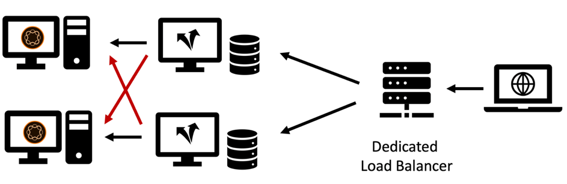

# Capitolo 2 - Infrastruttura

## Configurazione di un’infrastruttura di caching

Nel capitolo 1 di questa serie abbiamo introdotto la topologia di base di un sistema di pubblicazione e di un dispatcher. È possibile configurare un set di server Publish e Dispatcher in numerose varianti, a seconda del carico previsto, della topologia dei data center e delle proprietà di failover desiderate.

Descriveremo le topologie più comuni e i vantaggi e le situazioni in cui non sono sufficienti. L&#39;elenco - ovviamente - non può mai essere completo. L&#39;unico limite è la vostra immaginazione.

### Configurazione &quot;Legacy&quot;

All&#39;inizio, il numero di potenziali visitatori era limitato, l&#39;hardware costoso e i server web non erano visti come business critical come lo sono oggi. Una configurazione comune prevedeva che un Dispatcher fungesse da load balancer e da cache davanti a due o più sistemi Publish. Il server Apache nel nucleo di Dispatcher era molto stabile e, nella maggior parte delle impostazioni, abbastanza capace per soddisfare una quantità decente di richieste.

*Installazione di Dispatcher &quot;legacy&quot; - Non molto comune negli standard attuali*

  

Il dispatcher ha ricevuto il proprio nome da: in pratica stava inviando richieste. Questa configurazione non è più molto comune in quanto non è in grado di soddisfare i requisiti più elevati in termini di prestazioni e stabilità attualmente richiesti.

### Configurazione con più leghe

Oggi una topologia leggermente diversa è più comune. Una topologia a più gambe avrebbe un Dispatcher per server di pubblicazione. Un load balancer (hardware) dedicato si trova di fronte all’infrastruttura AEM e invia le richieste a queste due (o più) parti:

*Installazione moderna di Dispatcher &quot;Standard&quot; - Facile da gestire e mantenere*

  

Ecco le ragioni di questo tipo di configurazione,

1. I siti Web generano in media molto più traffico rispetto al passato. Quindi, c&#39;è la necessità di ampliare l&#39;&quot;infrastruttura Apache&quot;.

2. La configurazione &quot;Legacy&quot; non forniva ridondanza a livello di Dispatcher. Se il server Apache non funzionava, l’intero sito web non era raggiungibile.

3. I server Apache sono economici. Sono basati su open source e, se disponi di un centro dati virtuale, possono essere predisposti molto rapidamente.

4. Questa configurazione fornisce un modo semplice per uno scenario di aggiornamento &quot;continuo&quot; o &quot;scaglionato&quot;. È sufficiente arrestare Dispatcher 1 durante l&#39;installazione di un nuovo pacchetto software in Publish 1. Al termine dell&#39;installazione e se la pubblicazione 1 è stata testata con sufficiente fumo dalla rete interna, la cache viene pulita in Dispatcher 1 e riavviata mentre si utilizza Dispatcher 2 per la manutenzione di Publish 2.

5. In questa configurazione, l’annullamento della validità della cache diventa molto semplice e deterministico. Poiché un solo sistema Publish è connesso a un Dispatcher, esiste un solo Dispatcher da invalidare. L’ordine e la tempistica dell’annullamento della validità sono insignificanti.

### Impostazione di &quot;scalabilità orizzontale&quot;

I server Apache sono economici e facili da predisporre, perché non spingere di più la scalabilità di quel livello. Perché non ci sono due o più Dispatcher davanti a ciascun server di pubblicazione?

Installazione di 

Installazione di *&quot;Scale Out&quot;: presenta alcune aree dell&#39;applicazione, ma anche limitazioni e avvertenze*

  

Puoi assolutamente farlo! Esistono molti scenari di applicazione validi per questa configurazione. Ma ci sono anche alcune limitazioni e complessità che dovresti considerare.

#### Annullamento validità

Ogni sistema di pubblicazione è connesso a una moltitudine di istanze di Dispatcher e ogni istanza deve essere invalidata quando il contenuto viene modificato.

#### Manutenzione

Va da sé che la configurazione iniziale dei sistemi Dispatcher e Publish è un po&#39; più complessa. Tuttavia, tieni presente che anche lo sforzo di una versione &quot;continua&quot; è un po’ maggiore. I sistemi AEM possono e devono essere aggiornati durante l’esecuzione. Ma è saggio non farlo mentre stanno attivamente servendo le richieste. Di solito desideri aggiornare solo una parte dei sistemi di pubblicazione, mentre gli altri servono ancora attivamente il traffico e poi, dopo il test, passa all’altra parte. Se sei fortunato e puoi accedere al load balancer nel processo di distribuzione, puoi disabilitare il routing ai server in manutenzione qui. Se ti trovi in un load balancer condiviso senza accesso diretto, è preferibile chiudere i dispatcher della pubblicazione che desideri aggiornare. Più ce ne sono, più dovrai chiudere. Se il numero è elevato e si pianificano aggiornamenti frequenti, si consiglia di eseguire un’automazione. Se non si dispone di strumenti di automazione, la scalabilità è una cattiva idea in ogni caso.

In un progetto precedente abbiamo utilizzato un trucco diverso per rimuovere un sistema di pubblicazione dal bilanciamento del carico senza avere accesso diretto al load balancer stesso.

Il load-balancer solitamente esegue un ping, una particolare pagina per vedere se il server è in esecuzione. Una scelta banale di solito è quella di eseguire il ping della home page. Ma se vuoi usare il ping per segnalare al load-balancer di non bilanciare il traffico, puoi scegliere qualcos&#39;altro. Si crea un modello o un servlet dedicato che può essere configurato per rispondere con `"up"` o `"down"` (nel corpo o come codice di risposta http). La risposta di tale pagina, ovviamente, non deve essere memorizzata nella cache di Dispatcher, pertanto viene sempre recuperata appena dal sistema di pubblicazione. Ora, se configuri il load balancer per controllare questo modello o servlet, puoi facilmente far finta che l’opzione Pubblica non sia attiva. Non farebbe parte del bilanciamento del carico e può essere aggiornato.

#### Distribuzione mondiale

&quot;Distribuzione mondiale&quot; è una configurazione &quot;scalabile&quot; in cui sono presenti più Dispatcher davanti a ciascun sistema Publish, ora distribuito in tutto il mondo per essere più vicino al cliente e fornire prestazioni migliori. Naturalmente, in questo scenario non si dispone di un load balancer centrale, ma di uno schema di bilanciamento del carico basato su DNS e geo-IP.

>[!NOTE]
>
>In realtà, con questo approccio si sta creando una sorta di rete per la distribuzione dei contenuti (CDN); pertanto, è consigliabile acquistare una soluzione CDN preconfigurata invece di crearne una personalizzata. Creare e gestire una rete CDN personalizzata non è un’attività banale.

#### Ridimensionamento orizzontale

Anche in un centro dati locale, una topologia con scalabilità orizzontale con più istanze di Dispatcher davanti a ciascun sistema Publish presenta alcuni vantaggi. Se osservi dei colli di bottiglia delle prestazioni sui server Apache a causa del traffico elevato (e di una buona percentuale di hit della cache) e non riesci più a scalare l’hardware (aggiungendo CPU, RAM e dischi più veloci), puoi migliorare le prestazioni aggiungendo Dispatcher. Questa operazione è denominata &quot;ridimensionamento orizzontale&quot;. Tuttavia, questo ha dei limiti - soprattutto quando annulli frequentemente la validità del traffico. L’effetto verrà descritto nella sezione successiva.

#### Limiti della topologia di scalabilità orizzontale

L&#39;aggiunta di server proxy dovrebbe di norma aumentare le prestazioni. Esistono tuttavia scenari in cui l&#39;aggiunta di server può effettivamente ridurre le prestazioni. Come? Considera di avere un portale di notizie, in cui introdurre nuovi articoli e pagine ogni minuto. Un Dispatcher invalida tramite &quot;annullamento automatico della validità&quot;: ogni volta che una pagina viene pubblicata, tutte le pagine nella cache sullo stesso sito vengono invalidate. Questa è una funzione utile - l&#39;abbiamo trattata nel [Capitolo 1](chapter-1.md) di questa serie - ma significa anche che quando si apportano frequenti modifiche al sito Web, la cache viene invalidata molto spesso. Se disponi di una sola istanza Dispatcher per pubblicazione, il primo visitatore che richiede una pagina attiva una nuova memorizzazione in cache della pagina. Il secondo visitatore ottiene già la versione cache.

Se disponi di due istanze di Dispatcher, il secondo visitatore ha il 50% di possibilità di non memorizzare la pagina in cache e quindi riscontra una latenza più ampia quando viene eseguito di nuovo il rendering di quella pagina. Dispatcher più numerosi per ogni pubblicazione peggiorano ulteriormente le cose. In questo caso, il server di pubblicazione riceve un carico maggiore perché deve eseguire nuovamente il rendering della pagina separatamente per ogni Dispatcher.

*Prestazioni ridotte in uno scenario di scalabilità orizzontale con frequenti scaricamenti della cache.*

  

#### Mitigazione dei problemi di overscaling

Per attenuare i problemi, puoi utilizzare un’archiviazione condivisa centrale per tutti i Dispatcher o sincronizzare i file system dei server Apache. Possiamo fornire solo un’esperienza diretta limitata, ma dobbiamo essere preparati che questo aggiunga complessità al sistema e possa introdurre una nuova classe di errori.

Abbiamo fatto alcuni esperimenti con NFS, ma NFS introduce enormi problemi di prestazioni dovuti al blocco dei contenuti. Questo ha effettivamente diminuito le prestazioni complessive.

**Conclusione** - La condivisione di un file system comune tra diversi dispatcher NON è un approccio consigliato.

Se riscontri problemi di prestazioni, aumenta la scalabilità di Publish e Dispatcher allo stesso modo per evitare il picco di carico sulle istanze di Publisher. Non esiste una regola d’oro sul rapporto Pubblicazione/Dispatcher: dipende fortemente dalla distribuzione delle richieste e dalla frequenza delle pubblicazioni e degli invalidamenti della cache.

Se sei anche preoccupato per la latenza di un visitatore, prendi in considerazione l&#39;utilizzo di una rete di distribuzione del contenuto, il recupero della cache, il riscaldamento preventivo della cache, l&#39;impostazione di un tempo di tolleranza come descritto nel [Capitolo 1](chapter-1.md) di questa serie o fai riferimento ad alcune idee avanzate di [Parte 3](chapter-3.md).

### Configurazione di Cross Connected

Un’altra configurazione che abbiamo visto di tanto in tanto è la configurazione &quot;cross connected&quot;: le istanze Publish non dispongono di Dispatcher dedicati, ma tutti i Dispatcher sono connessi a tutti i sistemi Publish.

  

*Topologia cross-connected: maggiore ridondanza e complessità.*

A prima vista, questo fornisce un po&#39; più di ridondanza per un budget relativamente piccolo. Quando uno dei server Apache non è attivo, è comunque possibile che siano presenti due sistemi Publish che eseguono il rendering. Inoltre, in caso di arresto anomalo di uno dei sistemi di pubblicazione, sono presenti due Dispatcher che servono il carico memorizzato nella cache.

Questo però viene fornito con un prezzo.

Primo, togliere una gamba per il mantenimento è abbastanza complicato. In realtà, questo è lo scopo del progetto: essere più resilienti e rimanere operativi con tutti i mezzi possibili. Abbiamo visto piani di manutenzione complicati su come affrontare questo problema. Riconfigura prima Dispatcher 2, rimuovendo la connessione incrociata. Riavvio di Dispatcher 2. Arresto di Dispatcher 1, aggiornamento pubblicazione 1, ... e così via. Deve considerare attentamente se si possono raggiungere più di due gambe. Arriverete alla conclusione che in realtà aumenta la complessità, i costi ed è una fonte formidabile di errore umano. Sarebbe meglio automatizzare questa operazione. Verificate quindi se disponete delle risorse umane necessarie per includere questa attività di automazione nella programmazione del progetto. Anche se con questo si potrebbero risparmiare alcuni costi hardware, si potrebbe spendere il doppio per il personale IT.

In secondo luogo, potresti avere un’applicazione utente in esecuzione su AEM che richiede un accesso. Utilizza le sessioni permanenti per garantire che un utente sia sempre servito dalla stessa istanza di AEM in modo da poter mantenere lo stato della sessione su tale istanza. Con questa configurazione con connessione incrociata, devi assicurarti che le sessioni permanenti funzionino correttamente sul load balancer e sui Dispatcher. Non è impossibile, ma è necessario tenerne conto e aggiungere ore aggiuntive di configurazione e test, che potrebbero livellare il risparmio pianificato con il risparmio di hardware.

### Conclusione

Si sconsiglia di utilizzare questo schema di connessione incrociata come opzione predefinita. Tuttavia, se decidi di utilizzarla, dovrai valutare attentamente i rischi e i costi nascosti e pianificare l’inclusione dell’automazione della configurazione come parte del progetto.

## Passaggio successivo

* [3 - Argomenti avanzati sulla memorizzazione in cache](chapter-3.md)
