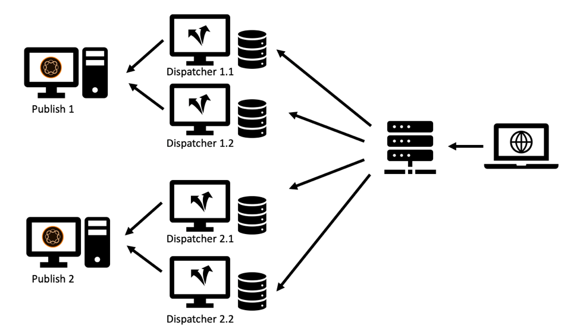

# Capitolo 2 - Infrastruttura

## Impostazione di un&#39;infrastruttura di cache

Abbiamo introdotto la topologia di base di un sistema di pubblicazione e di un dispatcher nel Capitolo 1 di questa serie. Un set di server Publish e Dispatcher può essere configurato in molte varianti, a seconda del carico previsto, della topologia del datacenter e delle proprietà di failover desiderate.

Disegneremo le topologie più comuni e descriveremo i vantaggi e i luoghi in cui essi sono inferiori. La lista - ovviamente - non può mai essere completa. L&#39;unico limite è la tua immaginazione.

### Impostazione &quot;Legacy&quot;

All&#39;inizio, il numero di potenziali visitatori era limitato, l&#39;hardware era costoso e i server Web non erano considerati particolarmente importanti come oggi. Una configurazione comune prevedeva un dispatcher che fungesse da sistema di bilanciamento del carico e dalla cache davanti a due o più sistemi di pubblicazione. Il server Apache al centro del Dispatcher era molto stabile e - nella maggior parte delle impostazioni - abbastanza in grado di servire una buona quantità di richieste.

*Installazione del dispatcher &quot;Legacy&quot; - Non molto comune per gli standard attuali*

  

Questo è il punto in cui il dispatcher ha ricevuto il suo nome da: Praticamente inviava richieste. Questa configurazione non è più molto comune, in quanto non è in grado di soddisfare i requisiti più elevati di prestazioni e stabilità richiesti oggi.

### Configurazione con più gambe

Oggi una topologia leggermente diversa è più comune. Una topologia a più gambe avrebbe un dispatcher per server di pubblicazione. Un sistema di bilanciamento del carico dedicato (hardware) si trova davanti all&#39;infrastruttura AEM che invia le richieste a queste due o più gambe:

*Moderna configurazione del dispatcher standard - Facile da gestire e mantenere*

  

Ecco i motivi per questo tipo di configurazione,

1. I siti Web in media servono molto più traffico di quanto non abbiano in passato. È quindi necessario ampliare l&#39;infrastruttura Apache.

2. L&#39;impostazione &quot;Legacy&quot; non forniva ridondanza a livello di Dispatcher. Se Apache Server è stato disattivato, l&#39;intero sito Web non era raggiungibile.

3. I server Apache sono economici. Sono basati su open source e, dato che avete un centro dati virtuale, possono essere forniti molto velocemente.

4. Questa configurazione fornisce un modo semplice per uno scenario di aggiornamento &quot;a scorrimento&quot; o &quot;sfalsato&quot;. È sufficiente arrestare il dispatcher 1 durante l&#39;installazione di un nuovo pacchetto software in Pubblica 1. Al termine dell’installazione e dopo aver testato abbastanza il test del fumo di Publish 1 dalla rete interna, si pulisce la cache sul Dispatcher 1 e si avvia di nuovo, tenendo premuto il Dispatcher 2 per la manutenzione di Publish 2.

5. L&#39;annullamento della validità della cache diventa molto semplice e deterministico in questa configurazione. Poiché un solo sistema di pubblicazione è connesso a un dispatcher, è presente un solo dispatcher da annullare la validità. L&#39;ordine e la tempistica dell&#39;annullamento della validità sono insignificanti.

### Impostazione &quot;Scala in uscita&quot;

I server Apache sono economici e facili da fornire, perché non spingere il ridimensionamento di quel livello un po &#39;di più. Perché non avere due o più dispatcher davanti a ciascun server di pubblicazione?

*Impostazione &quot;Scala&quot; - Presenta alcune aree applicative ma anche limitazioni e avvertenze*

  

Potete assolutamente farlo! E ci sono molti scenari applicativi validi per questa configurazione. Ma ci sono anche alcuni limiti e complessità che dovreste considerare.

#### Annullamento

Ogni sistema di pubblicazione è connesso a una moltitudine di dispatcher, ciascuno dei quali deve essere invalidato quando il contenuto è stato modificato.

#### Manutenzione

Va da sé che la configurazione iniziale dei sistemi Dispatcher e Publish è un po&#39; più complessa. Ma tenete anche presente che lo sforzo di una versione &quot;continua&quot; è anche un po&#39; più alto. AEM sistemi possono e devono essere aggiornati durante l&#39;esecuzione. Ma è saggio non farlo mentre stanno attivamente rispondendo alle richieste. In genere si desidera aggiornare solo una parte dei sistemi di pubblicazione, mentre gli altri continuano a servire attivamente il traffico e quindi, dopo il test, passare all&#39;altra parte. Se siete fortunati e potete accedere al sistema di bilanciamento del carico nel processo di distribuzione, potete disattivare il routing ai server in manutenzione qui. Se utilizzate un sistema di bilanciamento del carico condiviso senza accesso diretto, è preferibile arrestare i dispatcher della pubblicazione da aggiornare. Più ci sono, più dovrete chiudere. Se è presente un numero elevato e state pianificando aggiornamenti frequenti, è consigliabile un po&#39; di automazione. Se non disponete di strumenti di automazione, il ridimensionamento è comunque una cattiva idea.

In un progetto precedente abbiamo usato un trucco diverso per rimuovere un sistema di pubblicazione dal bilanciamento del carico senza avere accesso diretto al sistema di bilanciamento del carico stesso.

Il sistema di bilanciamento del carico in genere &quot;ping&quot;, una pagina specifica per verificare se il server è in esecuzione. Una scelta banale di solito è il ping della homepage. Ma se si vuole usare il ping per segnalare al sistema di bilanciamento del carico di non bilanciare il traffico si sceglierebbe qualcos&#39;altro. Potete creare un modello o un servlet dedicato che possa essere configurato per rispondere con `"up"` o `"down"` (nel corpo o come codice di risposta http). La risposta di tale pagina, ovviamente, non deve essere memorizzata nella cache del dispatcher, pertanto viene sempre recuperata di recente dal sistema di pubblicazione. Ora, se configurate il sistema di bilanciamento del carico per controllare questo modello o servlet, potete facilmente lasciare che Pubblica &quot;finga&quot; che sia giù. Non fa parte del bilanciamento del carico e può essere aggiornato.

#### Distribuzione mondiale

&quot;Distribuzione mondiale&quot; è una configurazione di &quot;scalabilità orizzontale&quot; in cui sono presenti più dispatcher davanti a ciascun sistema di pubblicazione, ora distribuiti in tutto il mondo per essere più vicini al cliente e fornire prestazioni migliori. Naturalmente, in questo scenario non si dispone di un sistema centrale di bilanciamento del carico, ma di uno schema di bilanciamento del carico basato su DNS e geo-IP.

>[!NOTE]
>
>In realtà, si sta creando una sorta di rete di distribuzione dei contenuti (CDN) con questo approccio, quindi è opportuno considerare l&#39;acquisto di una soluzione CDN preconfigurata invece di crearne una personalizzata. La creazione e la manutenzione di una CDN personalizzata non è un&#39;attività fondamentale.

#### Ridimensionamento orizzontale

Anche in un datacenter locale, una topologia &quot;Scala in uscita&quot; con più Dispatcher davanti a ciascun sistema di pubblicazione presenta alcuni vantaggi. Se i colli di bottiglia delle prestazioni sui server Apache dovuti al traffico elevato (e a un buon tasso di hit della cache) e non è più possibile scalare l&#39;hardware (aggiungendo CPU, RAM e dischi più veloci), è possibile migliorare le prestazioni aggiungendo Dispatcher. Questa operazione è denominata &quot;ridimensionamento orizzontale&quot;. Tuttavia, questo ha dei limiti, soprattutto quando il traffico viene spesso invalidato. Descriveremo l&#39;effetto nella sezione successiva.

#### Limiti della topologia di riduzione

L&#39;aggiunta di server proxy dovrebbe in genere migliorare le prestazioni. Tuttavia, in alcuni casi, l&#39;aggiunta di server può ridurre le prestazioni. Come? Considerate di disporre di un portale di notizie, dove potrete inserire nuovi articoli e pagine ogni minuto. Un dispatcher invalida con l&#39;opzione di &quot;annullamento automatico della validità&quot;: Ogni volta che una pagina viene pubblicata, tutte le pagine nella cache dello stesso sito vengono invalidate. Questa è una caratteristica utile - abbiamo trattato questo nel [Capitolo 1](chapter-1.md) di questa serie - ma significa anche, che quando si hanno frequenti modifiche sul sito web si sta invalidando la cache molto spesso. Se disponete di un’unica istanza Dispatcher per Publish, il primo visitatore che richiede una pagina attiva un nuovo caching della pagina stessa. Il secondo visitatore ottiene già la versione memorizzata nella cache.

Se si dispone di due dispatcher, il secondo visitatore ha una probabilità del 50% che la pagina non sia memorizzata nella cache e quindi una latenza maggiore si verificherebbe quando la pagina viene riprodotta. La presenza di un numero ancora maggiore di dispatcher per pubblicazione rende le cose ancora peggiori. Il server di pubblicazione riceve un carico maggiore perché deve eseguire nuovamente il rendering della pagina per ciascun dispatcher separatamente.

*Diminuzione delle prestazioni in uno scenario di scalabilità orizzontale con flussi frequenti della cache.*

  

#### Mitigazione dei problemi di scalabilità eccessiva

È possibile utilizzare uno storage condiviso centrale per tutti i dispatcher o sincronizzare i file system dei server Apache per attenuare i problemi. Possiamo fornire solo un&#39;esperienza di prima mano limitata, ma essere preparati che questo aggiunge alla complessità del sistema e può introdurre una nuova classe di errori.

Abbiamo fatto alcuni esperimenti con NFS - ma NFS introduce enormi problemi di prestazioni a causa del blocco dei contenuti. Ciò ha effettivamente diminuito le prestazioni complessive.

**Conclusione** - La condivisione di un file system comune tra più dispatcher NON è un approccio consigliato.

In caso di problemi di prestazioni, ridimensionate i programmi di pubblicazione e i dispatcher in modo uniforme per evitare il carico massimo sulle istanze di Publisher. Non esiste una regola d&#39;oro sul rapporto Pubblica/Dispatcher - dipende molto dalla distribuzione delle richieste e dalla frequenza delle pubblicazioni e degli invalidamenti della cache.

Se siete anche preoccupati per la latenza vissuta da un visitatore, prendete in considerazione l&#39;utilizzo di una rete di distribuzione dei contenuti, il recupero della cache, il riscaldamento preventivo della cache, l&#39;impostazione di un tempo di tolleranza come descritto nel [capitolo 1](chapter-1.md) di questa serie o fate riferimento ad alcune idee avanzate della [Parte 3](chapter-3.md).

### Impostazione &quot;Cross Connected&quot;

Un&#39;altra configurazione che abbiamo visto di tanto in tanto è la configurazione &quot;interconnessa&quot;: Le istanze di pubblicazione non dispongono di dispatcher dedicati, ma tutti i dispatcher sono connessi a tutti i sistemi di pubblicazione.

  

*Topologia interconnessa: Maggiore ridondanza e complessità.*

A prima vista, questo offre una maggiore ridondanza per un budget relativamente ridotto. Se uno dei server Apache è disattivato, potete comunque disporre di due sistemi Publish che eseguono il rendering. Inoltre, se uno dei sistemi di pubblicazione si arresta in modo anomalo, il carico memorizzato nella cache è sempre composto da due dispatcher.

Questo però ha un prezzo.

Innanzitutto, prendere una gamba per la manutenzione è abbastanza ingombrante. In realtà, questo è ciò per cui è stato concepito questo regime; essere più resiliente e rimanere in funzione con tutti i mezzi possibili. Abbiamo visto piani di manutenzione complicati su come affrontarli. Riconfigurare prima il dispatcher 2, rimuovendo la connessione incrociata. Riavvio del dispatcher 2. Arresto del dispatcher 1, aggiornamento di Publish 1, ... e così via. Si dovrebbe considerare attentamente se questo si ingrandisce fino a più di due gambe. Arriverete alla conclusione, che in realtà aumenta la complessità, i costi ed è una formidabile fonte di errore umano. Sarebbe meglio automatizzare questo. Quindi, meglio controllare, se si dispone di risorse umane per includere questo compito di automazione nel programma del progetto. Anche se con questo si potrebbero risparmiare alcuni costi hardware, si potrebbe spendere il doppio per il personale IT.

In secondo luogo, è possibile che sul AEM sia in esecuzione un&#39;applicazione utente che richiede un login. Potete utilizzare le sessioni permanenti per garantire che un utente venga sempre servito dalla stessa istanza AEM in modo da poter mantenere lo stato di sessione nell’istanza. Avendo questa configurazione interconnessa, è necessario assicurarsi che le sessioni appiccicose funzionino correttamente sul sistema di bilanciamento del carico e sui dispatcher. Non impossibile - ma bisogna essere consapevoli di questo e aggiungere ulteriori ore di configurazione e test, che - di nuovo - potrebbero livellare i risparmi pianificati risparmiando hardware.

### Conclusione

Non è consigliabile utilizzare questo schema di connessione incrociata come opzione predefinita. Tuttavia, se decidi di utilizzarlo, dovrai valutare attentamente i rischi e i costi nascosti e pianificare l&#39;inclusione dell&#39;automazione della configurazione nel progetto.

## Passaggio successivo

* [3 - Argomenti avanzati di memorizzazione nella cache](chapter-3.md)
