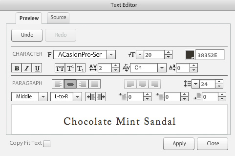

# Introduzione ai modelli di base {#basic-templates}

In termini Dynamic Media Classic, un modello è un documento che può essere modificato dinamicamente tramite l’URL dopo la pubblicazione del modello. Dynamic Media Classic offre modelli di base, modelli basati su immagini denominati dal server immagini e costituiti da immagini e testo renderizzato.

Uno degli aspetti più potenti dei modelli è la presenza di punti di integrazione diretti che consentono di collegarli al database. Pertanto, non solo è possibile elaborare un&#39;immagine e ridimensionarla, ma è anche possibile eseguire una query nel database per trovare elementi nuovi o di vendita e farli apparire come una sovrapposizione sull&#39;immagine. È possibile richiedere una descrizione dell&#39;elemento e farla apparire come un&#39;etichetta in un tipo di carattere scelto e layout. Le possibilità sono illimitate.

I modelli di base possono essere implementati in molti modi diversi, da semplici a complessi. Ad esempio:

- Merchandising di base. Utilizza etichette come &quot;spedizione gratuita&quot; se quel prodotto ha spedizione gratuita. Queste etichette vengono configurate dal team merchandise in Photoshop e il Web utilizza la logica per sapere quando applicarle all&#39;immagine.
- Merchandising avanzato. Ogni modello ha più variabili e può mostrare più di un’opzione alla volta. Utilizza un database, un inventario e regole aziendali per determinare quando mostrare un prodotto come &quot;Just In&quot;, &quot;Clearance&quot; o &quot;Sold Out&quot;. Puoi anche utilizzare la trasparenza dietro al prodotto per mostrarlo su sfondi diversi, ad esempio in stanze diverse. Gli stessi modelli e/o risorse possono essere riutilizzati nella pagina dei dettagli del prodotto per mostrare una versione più grande o ingrandibile dello stesso prodotto su sfondi diversi.

È importante comprendere che Dynamic Media Classic fornisce solo la parte visiva di queste applicazioni basate su modelli. Le aziende Dynamic Media Classic o i loro partner di integrazione devono fornire le regole aziendali, il database e le competenze di sviluppo per la creazione delle applicazioni. Non esiste un’applicazione modello &quot;incorporata&quot;; i designer impostano il modello in Dynamic Media Classic e gli sviluppatori utilizzano le chiamate URL per modificare le variabili nel modello.

Entro la fine di questa sezione dell’esercitazione saprai come:

- Carica un Photoshop PSD in Dynamic Media Classic per utilizzarlo come base di un modello.
- Crea un semplice modello di base per merchandising costituito da livelli immagine.
- Aggiungete livelli di testo e rendeteli variabili mediante l&#39;uso di parametri.
- Crea un URL di modello e modifica l’immagine in modo dinamico tramite il browser web.

>[!NOTE]
>
>Tutti gli URL in questo capitolo sono solo a scopo illustrativo; non sono collegamenti live.

## Panoramica dei modelli di base

La definizione di un modello di base (o semplicemente &quot;modello&quot;, in breve) è un’immagine a livelli indirizzabile agli URL. Il risultato finale è un&#39;immagine, ma che può essere modificata dall&#39;URL. Può essere costituito da foto, testo o immagini, qualsiasi combinazione di risorse P-TIFF in Dynamic Media Classic.

I modelli sono molto simili ai file di Photoshop PSD, in quanto hanno un flusso di lavoro simile e funzionalità simili.

- Entrambi sono costituiti da livelli simili a fogli di acetato impilato. Potete comporre immagini parzialmente trasparenti e vedere attraverso le aree trasparenti di un livello i livelli sottostanti.
- I livelli possono essere spostati e ruotati per riposizionare il contenuto e i metodi di opacità e fusione possono essere modificati per rendere il contenuto parzialmente trasparente.
- Potete creare livelli basati su testo. La qualità può essere molto elevata perché Image Server utilizza lo stesso motore di testo di Photoshop e Illustrator.
- Gli stili di livello semplici possono essere applicati a ciascun livello per creare effetti speciali, ad esempio ombre esterne o bagliori.

Tuttavia, a differenza dei PSD Photoshop, i livelli possono essere completamente dinamici e controllati tramite un URL sul server immagini.

- Puoi aggiungere variabili a tutte le proprietà del modello, per modificarne facilmente la composizione al volo.
- Le variabili denominate parametri consentono di esporre solo la parte del modello che si desidera modificare.

È sufficiente aggiungere un segnaposto per ogni livello che varia anziché inserire tutti i livelli in un unico file come in Photoshop, e mostrarli e nasconderli (anche se è possibile farlo, se lo si preferisce).

Utilizzando un segnaposto, potete scambiare dinamicamente il contenuto di un livello con un&#39;altra risorsa pubblicata e assumerà automaticamente le stesse proprietà (ad esempio dimensione e rotazione) del livello sostituito.

Poiché i modelli di base sono generalmente progettati in Photoshop ma distribuiti tramite un URL, un progetto di modello richiede una combinazione di competenze tecniche e di progettazione. In genere si presuppone che la persona che esegue il lavoro del modello creativo sia un designer di Photoshop e che la persona che implementa il modello sia uno sviluppatore web. I team creativi e di sviluppo devono collaborare strettamente per il successo del modello.

I progetti modello possono essere relativamente semplici o estremamente complessi a seconda delle regole e delle esigenze aziendali dell’applicazione. I modelli di base vengono chiamati dal server immagini. Tuttavia, a causa della flessibilità dell’ambiente Dynamic Media Classic, è possibile nidificare modelli anche all’interno di altri modelli, consentendo di creare immagini abbastanza complesse che possono essere collegate da variabili comunemente denominate.

- Ulteriori informazioni su [Nozioni di base sui modelli](https://experienceleague.adobe.com/docs/dynamic-media-classic/using/template-basics/quick-start-template-basics.html).
- Scopri come creare un [Modello di base](https://experienceleague.adobe.com/docs/dynamic-media-classic/using/template-basics/creating-template.html#creating_a_template).

## Creazione di un modello di base

Quando si utilizza un modello di base, in genere si seguono i passaggi del flusso di lavoro descritti nel diagramma seguente. I passaggi contrassegnati da linee tratteggiate sono facoltativi se si utilizzano livelli di testo dinamici e sono indicati nelle istruzioni seguenti come &quot;Flusso di lavoro testo&quot;. Se non si utilizza il testo, seguire solo il percorso principale.

_Il flusso di lavoro Modello di base._

1. Progetta e crea le risorse. La maggior parte degli utenti esegue questa operazione in Adobe Photoshop. Progetta le risorse nelle dimensioni esatte necessarie: se si tratta di un’immagine di 200 pixel per una pagina di miniature, impostala su 200 pixel. Se avete bisogno di ingrandirla, progettatela ad una dimensione di circa 2000 pixel. Utilizzate Photoshop (e/o Illustrator salvati come bitmap) per creare le risorse e Dynamic Media Classic per assemblare le parti, gestire i livelli e aggiungere variabili.
2. Dopo aver progettato le risorse grafiche, caricale in Dynamic Media Classic. Invece di caricare singole risorse da PSD, ti consigliamo di caricare l’intero file di PSD a livelli e di fare in modo che Dynamic Media Classic crei un file per livello, utilizzando **Mantieni livelli** opzione al caricamento (vedi di seguito per ulteriori dettagli). _Flusso di lavoro per testo: se crei testo dinamico, carica anche i font. Il testo dinamico è variabile e controllato tramite l’URL. Se il testo è statico o contiene solo poche frasi brevi che non cambiano, ad esempio tag che indicano &quot;Nuovo&quot; o &quot;Vendita&quot; anziché &quot;X% Off&quot; e la X è un numero variabile, si consiglia di eseguire il pre-rendering del testo in Photoshop e di caricarlo come livelli rasterizzati come immagini. È più semplice e consente di applicare al testo lo stile desiderato._
3. Creare il modello in Dynamic Media Classic utilizzando l&#39;editor di nozioni di base del modello del menu Genera e aggiungere livelli immagine. Flusso di lavoro per testo: crea livelli di testo nello stesso editor. Questo passaggio è necessario quando si crea un modello manualmente in Dynamic Media Classic. Scegliete una dimensione dell&#39;area di lavoro che corrisponda alla progettazione, trascinate le immagini sull&#39;area di lavoro e impostate le proprietà del livello (dimensioni, rotazione, opacità, ecc.). Non state inserendo tutti i livelli possibili sul modello, solo un segnaposto per livello immagine. _Flusso di lavoro per il testo: puoi creare livelli di testo con lo strumento Testo, in modo analogo a come si creano livelli di testo in Photoshop. Potete scegliere un carattere e il relativo stile utilizzando le stesse opzioni disponibili con lo strumento testo Photoshop._ Un altro flusso di lavoro consiste nel caricare un PSD e far sì che Dynamic Media Classic generi un modello &quot;gratuito&quot;, e possa anche ricreare livelli di testo. Questo aspetto verrà discusso più dettagliatamente in seguito.
4. Una volta creati i livelli, aggiungi parametri (variabili) a qualsiasi proprietà di qualsiasi livello che desideri controllare tramite l’URL, inclusa l’origine del livello (l’immagine stessa ). _Flusso di lavoro per il testo: puoi anche aggiungere parametri ai livelli di testo, sia per controllare il contenuto del testo e le dimensioni e la posizione del livello stesso, sia per tutte le opzioni di formattazione come il colore del font, le dimensioni del font, il tracciamento orizzontale, ecc._
5. Crea un predefinito immagine che corrisponda alle dimensioni del modello. È consigliabile eseguire questa operazione in modo che il modello venga sempre chiamato a una dimensione 1:1 e anche per aggiungere nitidezza a qualsiasi livello di immagine di grandi dimensioni che venga ridimensionato per adattarsi al modello. Se stai creando un modello da ingrandire, questo passaggio non è necessario.
6. Pubblica, copia l’URL dall’anteprima Dynamic Media Classic e testalo in un browser.

## Preparazione e caricamento delle risorse dei modelli in Dynamic Media Classic

Prima di caricare le risorse modello in Dynamic Media Classic, devi completare alcuni passaggi preparatori.

### Preparazione di PSD per il caricamento

Prima di caricare il file Photoshop in Dynamic Media Classic, semplifica i livelli in Photoshop per semplificare l’utilizzo e garantire la massima compatibilità con il server immagini. Il file PSD è spesso costituito da molti elementi che Dynamic Media Classic non riconosce e può anche essere difficile da gestire. Assicurati di salvare un backup del master PSD nel caso sia necessario modificare successivamente l’originale. Caricherai la copia semplificata, e non la pagina mastro.

1. Semplificate la struttura dei livelli unendo/appiattendo i livelli correlati che devono essere attivati/disattivati insieme in un unico livello. Ad esempio, l&#39;etichetta &quot;NUOVO&quot; e il banner blu vengono uniti in un singolo livello in modo da poterli mostrare o nascondere con un solo clic.
   
2. Alcuni tipi di livelli ed effetti di livello non sono supportati da Dynamic Media Classic o dal server immagini e devono essere rasterizzati prima del caricamento. In caso contrario, gli effetti potrebbero essere ignorati o i livelli eliminati. Rasterizzare un livello significa convertire se è modificabile in non modificabile. Per rasterizzare gli effetti di livello o i livelli di testo, create un livello vuoto, selezionate entrambi e unite utilizzando **Livelli > Unisci livelli** o CTRL + E/CMD + E.

   - Dynamic Media Classic non può raggruppare o collegare livelli. Tutti i livelli di un gruppo o di un insieme collegato vengono convertiti in livelli separati che non sono più raggruppati/collegati.
   - Le maschere di livello vengono convertite in trasparenza al momento del caricamento.
   - I livelli di regolazione non sono supportati e vengono eliminati.
   - I livelli di riempimento, ad esempio i livelli Colore tinta unita, vengono rasterizzati.
   - I livelli Oggetto avanzato e i livelli vettoriali vengono rasterizzati nelle immagini normali al caricamento e i filtri avanzati vengono applicati e rasterizzati.
   - Anche i livelli di testo verranno rasterizzati, a meno che non si utilizzi l&#39;opzione Estrai testo. Per ulteriori informazioni, vedere di seguito.
   - La maggior parte degli effetti di livello viene ignorata e sono supportati solo alcuni metodi di fusione. In caso di dubbi, aggiungete effetti semplici in Dynamic Media Classic (ad esempio ombre interne o esterne, bagliori interni o esterni) oppure utilizzate un livello vuoto per unire e rasterizzare l&#39;effetto in Photoshop.

### Utilizzo dei font

Se è necessario generare testo dinamico, verranno caricati e pubblicati anche i tipi di carattere. L&#39;unico font incluso in Dynamic Media Classic è Arial.

È responsabilità di ogni azienda ottenere una licenza per l&#39;utilizzo di un tipo di carattere sul web: il semplice fatto di avere un tipo di carattere installato sul computer non ti dà il diritto di utilizzarlo commercialmente sul web e la tua azienda potrebbe andare incontro ad azioni legali da parte dell&#39;editore del tipo di carattere se utilizzato senza autorizzazione. Inoltre, le condizioni di licenza variano: ad esempio, potrebbe essere necessario disporre di licenze separate per la stampa rispetto alla visualizzazione a schermo.

Dynamic Media Classic supporta i caratteri OTF (Standard OpenType), TTF (TrueType) e PostScript Type 1. Mac: non sono supportati solo i tipi di carattere per valigie, i file di raccolta dei tipi di carattere, i tipi di carattere di sistema di Windows e i tipi di carattere proprietari dei computer (come i tipi di carattere utilizzati dalle macchine per l&#39;incisione o il ricamo). Sarà quindi necessario convertirli in uno dei formati di carattere standard o sostituirli con un tipo di carattere simile da utilizzare in Dynamic Media Classic e sul server immagini.

Dopo il caricamento in Dynamic Media Classic dei font, come qualsiasi altra risorsa, è necessario pubblicarli anche nel server immagini. Un errore molto comune del modello consiste nel dimenticare di pubblicare i tipi di carattere, che si tradurrà in un errore di immagine: il server immagini non sostituirà un altro tipo di carattere. Inoltre, se desideri utilizzare il **Estrai testo** durante il caricamento, è necessario caricare i file dei caratteri prima di caricare il PSD che utilizza tali caratteri. Il **Estrai testo** La funzione tenterà di ricreare il testo come livello di testo modificabile e inserirlo all&#39;interno di un modello di Dynamic Media Classic. Questo argomento viene discusso nel prossimo argomento, Opzioni di PSD.

Tenere presente che i tipi di carattere hanno più nomi interni spesso diversi dal nome del file esterno. Puoi visualizzarne tutti i diversi nomi nella pagina Dettagli della risorsa in Dynamic Media Classic. Di seguito sono riportati i nomi dei caratteri Adobe Caslon Pro Semibold, elencati nella scheda Metadati di Dynamic Media Classic:

_Scheda Metadati nella pagina Dettagli di un tipo di carattere in Dynamic Media Classic._

Dynamic Media Classic utilizza il nome file di questo tipo di carattere (ACaslonPro-Semibold) come ID risorsa, ma non è questo il nome utilizzato dal modello. Il modello utilizza il nome RTF (Rich Text Format), riportato in basso. RTF è la &quot;lingua&quot; nativa del motore di testo di Image Server.

Se devi modificare i font tramite l’URL, devi chiamare il nome RTF del font (non l’ID risorsa), altrimenti riceverai un errore. In questo caso, il nome corretto per questo tipo di carattere sarà &quot;Adobe Caslon Pro&quot;. Per ulteriori informazioni sui font e sul formato RTF, consulta l’argomento RTF e Parametri di testo, di seguito.

I formati di file di font più comuni sui sistemi Windows e Mac sono OpenType e TrueType. L&#39;OpenType ha estensione OTF, mentre TrueType è TTF. Entrambi i formati funzionano bene anche in Dynamic Media Classic.

### Selezione Delle Opzioni Durante Il Caricamento Del PSD

Non è necessario caricare un file Photoshop (PSD) per creare un modello; un modello può essere creato da qualsiasi risorsa di immagine in Dynamic Media Classic. Tuttavia, il caricamento di un PSD può semplificare l’authoring, in quanto in genere queste risorse sono già presenti in un PSD con livelli. Inoltre, Dynamic Media Classic genera automaticamente un modello quando carichi un PSD con livelli.

- **Mantieni livelli.** Questa è l&#39;opzione più importante. Questo comunica a Dynamic Media Classic di creare una risorsa immagine per livello Photoshop. Se questa opzione è deselezionata, tutte le altre opzioni sono disattivate e il PSD viene appiattito in una singola immagine.
- **Crea** **Modello.** Questa opzione accetta i vari livelli generati e crea automaticamente un modello combinandoli nuovamente. Un inconveniente nell’utilizzo della maschera generata automaticamente è che Dynamic Media Classic inserisce tutti i livelli in un unico file, mentre è necessario un solo segnaposto per livello. È facile eliminare i livelli aggiuntivi, ma se ne hanno molti è più veloce ricrearli. Assicurati di rinominare il nuovo modello; in caso contrario, verrà sovrascritto la prossima volta che ricarichi lo stesso PSD.
- **Estrai testo.** In questo modo i livelli di testo nel PSD vengono ricreati come livelli di testo nel modello utilizzando il font caricato. Questo passaggio è necessario se il testo si trova in un percorso in Photoshop e si desidera mantenerlo nel modello. Questa funzione richiede l’utilizzo di **Crea modello** , in quanto il testo estratto può essere creato solo da un modello generato al momento del caricamento.
- **Estendi livelli a dimensione sfondo.** Questa impostazione rende ogni livello delle stesse dimensioni dell&#39;area di lavoro PSD generale. Questo è molto utile per i livelli che rimarranno sempre fissi nella posizione: in caso contrario, quando si scambiano le immagini nello stesso livello, potrebbe essere necessario riposizionarle.
- **Denominazione livelli.** Questo spiega a Dynamic Media Classic come denominare ogni risorsa generata per livello. Consigliamo: **Photoshop** **e livello** **Nome** o PHOTOSHOP e **Layer** **Numero**. Entrambe le opzioni utilizzano il nome del PSD come prima parte del nome e aggiungono il nome o il numero del livello alla fine. Ad esempio, se hai un PSD denominato &quot;shirt.psd&quot; e contiene livelli denominati &quot;front&quot;, &quot;sleeves&quot; e &quot;collar&quot;, se effettui il caricamento utilizzando **PHOTOSHOP e** Layer **Nome** Dynamic Media Classic genera gli ID risorsa &quot;shirt_front&quot;, &quot;shirt_sleeves&quot; e &quot;shirt_collar&quot;. L’utilizzo di una di queste opzioni consente di garantire che il nome sia univoco in Dynamic Media Classic.

## Creazione di un modello con livelli immagine

Anche se Dynamic Media Classic può creare automaticamente un modello da un PSD con livelli, è necessario sapere come generare il modello manualmente. Come spiegato in precedenza, in alcuni casi non è necessario utilizzare il modello creato da Dynamic Media Classic.

### Interfaccia utente di base dei modelli

Iniziamo ora a familiarizzare con l’interfaccia di editing.

Nel centro a sinistra è visualizzata l&#39;area di lavoro con un&#39;anteprima del modello finale. Sul lato destro sono presenti i pannelli Livelli e Proprietà livello. Queste sono le aree in cui si lavora di più.

_Crea modello: pagina Nozioni di base._

- **Anteprima/Area di lavoro.** La finestra principale. Qui è possibile spostare, ridimensionare e ruotare i livelli con il mouse. I profili dei livelli vengono visualizzati come linee tratteggiate.
- **Livelli.** È simile al pannello livelli di Photoshop. I livelli aggiunti al modello verranno visualizzati qui. I livelli vengono impilati dall&#39;alto verso il basso: il livello superiore nel pannello Livelli viene visualizzato sopra gli altri sotto di esso nell&#39;elenco.
- **Proprietà livello.** Qui è possibile regolare tutte le proprietà di un livello utilizzando i controlli numerici. Selezionate un livello, quindi regolatene le proprietà.
- **Composito** **URL.** Nella parte inferiore dell’interfaccia utente si trova l’area URL composito. Questo non verrà discusso in questa sezione del tutorial, tuttavia qui vedrai il tuo modello decostruito come una serie di modificatori URL di Image Server. Quest&#39;area è modificabile. Se si ha familiarità con i comandi di Image Server, è possibile modificare manualmente il modello qui. Tuttavia è possibile romperlo anche. Come Photoshop, la numerazione dei livelli inizia da 0. L&#39;area di lavoro è il livello 0 e il primo livello aggiunto è il livello 1. I metodi di fusione determinano il modo in cui i pixel di un livello si fondono con i pixel sottostanti. Potete creare una serie di effetti speciali utilizzando i metodi di fusione.

#### Utilizzo dell’Editor nozioni di base sui modelli

Di seguito sono riportati i passaggi del flusso di lavoro per avviare il modello di base:

1. In Dynamic Media Classic, vai a **Genera > Nozioni di base sui modelli**. Non è possibile selezionare nulla oppure iniziare selezionando un&#39;immagine, che diventa il primo livello del modello.
2. Scegli una dimensione e premi **OK**. Questa dimensione deve corrispondere a quella progettata in Photoshop. L’editor modelli verrà caricato.
3. Se non hai selezionato un’immagine al passaggio 1, cerca o individua un’immagine nel pannello delle risorse a sinistra e trascinala sull’area di lavoro.

   - L’immagine viene automaticamente ridimensionata in base alle dimensioni dell’area di lavoro. Se prevedi di scambiare le immagini ad alta risoluzione, in genere inserisci una delle tue immagini P-TIFF di grandi dimensioni (2000 px) e utilizzala come segnaposto.
   - Questo dovrebbe essere il livello più in basso del modello, tuttavia è possibile riordinare i livelli in un secondo momento.

4. Ridimensionare o riposizionare il livello direttamente nell&#39;area di lavoro oppure regolando le impostazioni nel pannello Proprietà livello.
5. Trascinate livelli immagine aggiuntivi in base alle esigenze. Se desiderate aggiungere anche gli effetti dei livelli. Consulta l’argomento _Aggiunta di effetti livello_, di seguito.
6. Clic **Salva**, scegli una posizione e assegna un nome al modello. È possibile visualizzare in anteprima, ma a questo punto il modello apparirà esattamente come un&#39;immagine Photoshop appiattita, non è ancora modificabile.

### Aggiunta di effetti livello

Il server immagini supporta alcuni effetti di livello programmatici, ovvero effetti speciali che modificano l&#39;aspetto del contenuto di un livello. Funzionano in modo simile agli effetti livello in Photoshop. Vengono attaccate a un livello, ma controllate indipendentemente da esso. Potete regolarli o rimuoverli senza apportare una modifica permanente al livello stesso.

- **Ombra esterna**. Applica un&#39;ombreggiatura al di fuori dei limiti del livello, posizionata da un offset pixel x e y.
- **Ombra interna**. Applica un&#39;ombreggiatura all&#39;interno dei limiti del livello, posizionata da un offset pixel x e y.
- **Bagliore esterno**. Applica un effetto alone in modo uniforme intorno a tutti gli spigoli del livello.
- **Bagliore interno**. Applica un effetto alone in modo uniforme all&#39;interno di tutti gli spigoli del livello.

_Un livello con e senza ombra esterna_

Per aggiungere un effetto, fare clic su **Aggiungi effetto** e scegliete un effetto dal menu. Come per i livelli normali, potete selezionare un effetto nel pannello Livelli e utilizzare il pannello Proprietà livello per regolarne le impostazioni.

Gli effetti ombra vengono spostati orizzontalmente o verticalmente dal livello, mentre gli effetti alone vengono applicati uniformemente in tutte le direzioni. Gli effetti interni agiscono sopra le parti opache del livello, mentre gli effetti esterni influiscono solo sulle aree trasparenti.

Ulteriori informazioni su[Aggiunta di effetti livello](https://experienceleague.adobe.com/docs/dynamic-media-classic/using/template-basics/creating-template.html#using-shadow-and-glow-effects-on-layers).

### Aggiunta di parametri

Se combinate i livelli e li salvate, il risultato non sarà diverso da un&#39;immagine Photoshop appiattita. Ciò che rende i modelli speciali è la possibilità di aggiungere parametri alle proprietà di ciascun livello, in modo che possano essere modificati dinamicamente tramite l’URL.

In termini Dynamic Media Classic, un parametro è una variabile che può essere collegata a una proprietà del modello in modo da poter essere manipolata tramite un URL. Quando aggiungete un parametro a un livello, Dynamic Media Classic espone tale proprietà nell&#39;URL prefissando il nome del parametro con un simbolo di dollaro ($). Ad esempio, se create un parametro denominato &quot;size&quot; per modificare le dimensioni di un livello, Dynamic Media Classic rinominerà il parametro $size.

Se non si aggiunge un parametro per una proprietà, questa rimane nascosta nel database di Dynamic Media Classic e non viene visualizzata nell&#39;URL.

Senza parametri, in genere gli URL sono molto più lunghi, soprattutto se si utilizza anche testo dinamico. Il testo aggiunge molte decine di caratteri in più a ogni URL.

Infine, il set iniziale di parametri diventa i valori predefiniti delle proprietà nel modello. Se si crea il modello, si aggiungono i parametri e quindi si chiama l&#39;URL senza i relativi parametri, il server immagini creerà l&#39;immagine con tutte le impostazioni predefinite salvate nel modello. I parametri sono necessari solo se si desidera modificare una proprietà. Se non è necessario modificare una proprietà, non è necessario impostare un parametro.

#### Creazione di parametri

Questo è il flusso di lavoro per la creazione dei parametri:

1. Fai clic su **Parametri** accanto al nome del livello per il quale si desidera creare i parametri. Viene visualizzata la schermata Parametri. Elenca ogni proprietà del livello e il relativo valore.
1. Seleziona la **On** accanto al nome di ogni proprietà che si desidera trasformare in un parametro. Viene visualizzato un nome di parametro predefinito. Puoi aggiungere parametri solo alle proprietà che sono cambiate dal loro stato predefinito.

   - Ad esempio, se aggiungete un livello e lo mantenete nella posizione xy predefinita di 0,0, Dynamic Media Classic non esporrà un **Posizione** proprietà. Per risolvere il problema, spostate il livello di almeno un pixel. Ora Dynamic Media Classic esporrà **Posizione** come proprietà puoi parametrizzare.
   - Per aggiungere un parametro alla proprietà mostra/nascondi (che attiva e disattiva il livello ), fate clic sul pulsante **Spettacolo** o **Nascondi livello** per disattivare il livello (se lo si desidera, è possibile riattivarlo in seguito). Dynamic Media Classic ora esporrà un **Nascondi** che possono essere parametrizzate.

1. Rinomina i nomi dei parametri predefiniti con un nome più facile da identificare nell’URL. Ad esempio, se desiderate aggiungere un parametro per modificare il livello del banner sopra un&#39;immagine, modificate il nome di default &quot;layer_2_src&quot; in &quot;banner&quot;.
1. Premi **Chiudi** per uscire dalla schermata Parametri.
1. Ripetere questo processo per gli altri livelli facendo clic sul pulsante **Parametri** e l&#39;aggiunta e la ridenominazione dei parametri.
1. Al termine, salva le modifiche.

>[!TIP]
>
>Rinomina i parametri in modo che abbiano un significato significativo e sviluppa una convenzione di denominazione per standardizzare tali nomi. Assicurati che la convenzione di denominazione sia concordata in anticipo dai team di progettazione e sviluppo.
>
>Impossibile aggiungere un parametro perché la proprietà non è visualizzata? È sufficiente modificare la proprietà del livello dal suo valore predefinito (spostando, ridimensionando, nascondendo, ecc.). A questo punto la proprietà dovrebbe essere esposta.

Ulteriori informazioni su [Parametri modello](https://experienceleague.adobe.com/docs/dynamic-media-classic/using/template-basics/creating-template-parameters.html).

## Creazione di un modello con livelli di testo

Ora imparerete a creare un modello di base che includa i livelli di testo.

### Informazioni sul testo dinamico

Ora sai come creare un modello base utilizzando i livelli immagine. Per molte applicazioni questo è tutto ciò che serve. Come è stato visto nell&#39;esercizio precedente, i livelli con testo semplice (ad esempio &quot;Vendita&quot; e &quot;Nuovo&quot;) possono essere rasterizzati e trattati come immagini perché il testo non deve essere modificato.

Tuttavia, se fosse necessario:

- Aggiungi un’etichetta per indicare &quot;25% Off&quot; (Sconto del 25%), con il valore del 25% che è variabile
- Aggiungi un’etichetta di testo con il nome del prodotto sopra l’immagine
- Localizzare i livelli in lingue diverse a seconda del paese in cui viene visualizzato il modello

In tal caso, aggiungete alcuni livelli di testo dinamici con parametri per controllare il testo e/o la formattazione.

Per creare testo, è necessario caricare alcuni tipi di carattere. In caso contrario, per impostazione predefinita Dynamic Media Classic verrà utilizzato Arial. I font devono anche essere pubblicati sul server immagini, altrimenti genererà un errore nel momento in cui tenterà di eseguire il rendering di qualsiasi testo che utilizzi quel font.

### Parametri RTF e di testo

Per aggiungere variabili al testo utilizzando lo strumento di base dei modelli, è necessario comprendere il rendering del testo. Il server immagini genera il testo utilizzando il motore di testo di Adobe, lo stesso motore utilizzato da Photoshop e Illustrator, e lo compone come livello nell&#39;immagine finale. Per comunicare con il motore, il server immagini utilizza il formato RTF (Rich Text Format).

RTF è una specifica di formato di file sviluppata da Microsoft per specificare la formattazione dei documenti. Si tratta di un linguaggio di markup standard utilizzato dalla maggior parte dei software di elaborazione testi e di posta elettronica. Se si scrive in un URL &amp;text=\b1 Hello, il server immagini genera un&#39;immagine con la parola &quot;Hello&quot; in grassetto, perché \b1 è il comando RTF per rendere il testo in grassetto.

La buona notizia è che Dynamic Media Classic genera l&#39;RTF per voi. Ogni volta che si digita del testo in un modello e si aggiunge della formattazione, Dynamic Media Classic scrive automaticamente il codice RTF nel modello. Il motivo per cui lo citiamo è perché si stanno aggiungendo parametri direttamente al RTF stesso, quindi è importante che tu abbia familiarità con esso.

#### Creazione di livelli di testo

Potete creare livelli di testo in un modello in Dynamic Media Classic nei due modi seguenti:

1. Strumento Testo in Dynamic Media Classic. Questo metodo verrà discusso di seguito. L’editor nozioni di base modello dispone di uno strumento che consente di creare una casella di testo, immettere testo e formattare il testo. Dynamic Media Classic genera il file RTF in base alle esigenze e lo inserisce in un livello separato.
2. Estrai testo (al caricamento). L&#39;altro metodo consiste nel creare il livello testo in Photoshop e salvarlo nel PSD come livello testo normale (invece di rasterizzarlo come livello immagine). Quindi carica il file in Dynamic Media Classic e utilizza **Estrai testo** opzione. Dynamic Media Classic convertirà ogni livello di testo Photoshop in un livello di testo Image Server utilizzando i comandi RTF. Se si utilizza questo metodo, assicurarsi di caricare i font in Dynamic Media Classic, altrimenti Dynamic Media Classic sostituirà un font predefinito al momento del caricamento e non sarà possibile sostituire nuovamente il font corretto.

### Editor di testo

Il testo viene immesso tramite l&#39;Editor di testo. L’editor di testo è un’interfaccia WYSIWYG che consente di immettere e formattare il testo utilizzando controlli di formattazione simili a quelli di Photoshop o Illustrator.

_Editor testo nozioni di base modello._

La maggior parte del lavoro verrà svolto in **Anteprima** , che consente di immettere il testo e di visualizzarlo come apparirà nel modello. È inoltre disponibile un **Sorgente** , utilizzato per modificare manualmente il file RTF, se necessario.

Il flusso di lavoro generale consiste nell’utilizzare **Anteprima** per digitare del testo.

Selezionare quindi il testo e scegliere una formattazione come il colore del carattere, la dimensione del carattere o la giustificazione utilizzando i controlli nella parte superiore. Dopo aver formattato il testo nel modo desiderato, fare clic su **Applica** per visualizzare l&#39;aggiornamento nell&#39;anteprima dell&#39;area di lavoro. Chiudete quindi l&#39;Editor di testo per tornare alla finestra principale Nozioni di base modello.

#### Utilizzo dell’Editor di testo

Di seguito sono riportati i passaggi del flusso di lavoro per l’aggiunta di testo all’interno della pagina di creazione delle nozioni di base sui modelli:

1. Fai clic su **Testo** nella parte superiore della pagina di build.
2. Trascinare fuori una casella di testo in cui si desidera visualizzare il testo. La finestra Editor di testo si apre in una finestra modale. Il modello verrà visualizzato in background, ma non potrà essere modificato fino a quando non terminerai la modifica del testo.
3. Digitare il testo di esempio che si desidera visualizzare al primo caricamento del modello. Ad esempio, se crei una casella di testo per un’immagine e-mail personalizzata, il testo potrebbe indicare &quot;Hi Name. Ora è il momento di risparmiare!&quot; In seguito, aggiungerai un parametro di testo per sostituire Nome con un valore inviato sull’URL. Il testo verrà visualizzato nel modello sotto la finestra solo dopo aver fatto clic su **Applica**.
4. Per formattare il testo, selezionarlo trascinando con il mouse e scegliere un controllo di formattazione nell&#39;interfaccia utente.

   - Sono disponibili molte opzioni di formattazione. Alcuni dei più comuni sono il carattere (faccia), la dimensione e il colore del carattere, nonché la giustificazione sinistra/centro/destra.
   - Non dimenticare di selezionare prima il testo. In caso contrario, non sarà possibile applicare alcuna formattazione.
   - Per scegliere un carattere diverso, assicurarsi di selezionare il testo e aprire il menu Carattere. L’editor mostrerà un elenco di tutti i font caricati in Dynamic Media Classic. Se nel computer è installato anche un tipo di carattere, questo verrà visualizzato in nero. Se non è installato nel computer, verrà visualizzato in rosso. Tuttavia, verrà comunque riprodotto nella finestra di anteprima quando fai clic su **Applica**. È sufficiente caricare i tipi di carattere in Dynamic Media Classic per renderli disponibili a chiunque utilizzi Dynamic Media Classic. Dopo la pubblicazione, il server immagini utilizzerà questi tipi di carattere per generare il testo. Gli utenti non dovranno installare alcun tipo di carattere per visualizzare il testo creato, in quanto fa parte di un&#39;immagine.
   - A differenza di Photoshop e Illustrator, il server immagini può allineare il testo verticalmente nella casella di testo. L&#39;impostazione predefinita è l&#39;allineamento in alto. Per modificare questa impostazione, selezionare il testo e scegliere **In mezzo** o **In basso** dal **Allineamento verticale** menu.
   - Se si rende il testo troppo grande per la casella (o se la casella di testo è troppo piccola), tutto o parte di esso verrà ritagliato e scomparirà. Ridurre la dimensione del carattere o ingrandire la casella.

5. Clic **Applica** per rendere effettive le modifiche nella finestra area di lavoro. Devi fare clic su **Applica**, altrimenti le modifiche andranno perse.
6. Al termine, fai clic su **Chiudi**. Se desiderate tornare alla modalità di modifica, fate doppio clic sul livello di testo per riaprire l&#39;Editor di testo.

L&#39;editor di testo visualizza in anteprima la dimensione esatta del carattere se questo è installato localmente nel sistema.

### Aggiunta di parametri ai livelli di testo

Ora seguiamo un processo simile per l&#39;aggiunta di parametri di testo, come abbiamo fatto per i parametri dei livelli. I livelli di testo possono anche prendere parametri di livello per dimensioni, posizione e così via; tuttavia, possono prendere parametri aggiuntivi che consentono di controllare qualsiasi aspetto del RTF.

A differenza dei parametri di livello, selezionate solo il valore da modificare e aggiungete un parametro a tale valore, anziché aggiungere un parametro all&#39;intera proprietà.

RTF di esempio:

Quando si esamina il file RTF, è necessario capire dove si desidera modificare ogni impostazione. Nell’RTF qui sopra, alcune potrebbero avere un senso e puoi vedere da dove viene la formattazione.

Potete vedere la frase Sandalo al cioccolato — è il testo stesso.

- Esiste un riferimento al carattere Riccardo povero, dove vengono selezionati i caratteri.
- È possibile visualizzare un valore RGB: \red56\green53\blue4, che corrisponde al colore del testo.
- Anche se la dimensione del carattere è 20, non viene visualizzato il numero 20. Viene tuttavia visualizzato un comando \fs40. Per qualche motivo, RTF misura i caratteri come punti intermedi. \fs40 è quindi la dimensione del carattere.

Sebbene siano disponibili informazioni sufficienti per creare i parametri, nella documentazione di Image Server è disponibile un riferimento completo di tutti i comandi RTF. Visita il [Documentazione di Image Server](https://experienceleague.adobe.com/docs/dynamic-media-developer-resources/image-serving-api/image-serving-api/http-protocol-reference/text-formatting/c-text-formatting.html#concept-0d3136db7f6f49668274541cd4b6364c).

#### Aggiunta di parametri ai livelli di testo

Ecco i passaggi per aggiungere parametri ai livelli di testo.

1. Fai clic su **Parametri** (una &quot;P&quot;) accanto al nome del livello di testo per il quale si desidera creare i parametri. Viene visualizzata la schermata Parametri. Il **Comune** scheda elenca ogni proprietà sul livello e il relativo valore. Qui puoi aggiungere parametri di livello regolari.
1. Fai clic sul pulsante **Testo** scheda. Qui puoi vedere il file RTF nella parte superiore; i parametri che aggiungi si trovano sotto di esso.
1. Per aggiungere un parametro, evidenziate prima il valore da modificare e fate clic sul pulsante **Aggiungi parametro** pulsante. Accertatevi di selezionare solo i valori per i comandi e non l&#39;intero comando. Ad esempio, per impostare un parametro per il nome del font nel file RTF di esempio qui sopra, evidenzierei solo &quot;Poor Richard&quot; e aggiungerei un parametro a questo, ma non anche il &quot;\f0&quot;. Quando fai clic su **Aggiungi parametro** , viene visualizzato nell&#39;elenco seguente e il valore del parametro viene visualizzato in rosso nel file RTF mentre è ancora selezionato. Se devi rimuovere un parametro, fai clic sulla casella di controllo accanto a **On** per disattivare tale parametro, che scompare.
1. Fai clic su per rinominare il parametro con un nome più significativo.
1. Al termine, il file RTF viene evidenziato in verde, dove sono presenti dei parametri, e i relativi nomi e valori sono elencati di seguito.
1. Clic **Chiudi** per uscire dalla schermata Parametri. Quindi premere **Salva** , per salvare il modello. Se la modifica è terminata, premere **Chiudi** per uscire dalla pagina Nozioni di base sui modelli.
1. Clic **Anteprima** per testare il modello in Dynamic Media Classic. Per verificare i parametri di testo, digitate nuovo testo o nuovi valori nella finestra di anteprima. Per modificare il carattere, è necessario digitare il nome RTF esatto del carattere.

>[!TIP]
>
>Per aggiungere parametri al colore del testo, aggiungete separatamente i parametri per il rosso, il verde e il blu. Ad esempio, se il file RTF è `\red56\green53\blue46`, si aggiungono parametri separati di rosso, verde e blu per i valori 56, 53 e 46. Nell’URL, puoi modificare il colore chiamando tutti e tre: `&$red=56&$green=53&$blue=46`.

Scopri come [Creare parametri di testo dinamici](https://experienceleague.adobe.com/docs/dynamic-media-classic/using/template-basics/creating-template-parameters.html#creating-dynamic-text-parameters).

## Pubblicazione e creazione di URL di modelli

### Creare un predefinito immagine

La creazione di un predefinito per il modello non è un passaggio obbligatorio. Come best practice, consigliamo di chiamare sempre il modello con dimensioni 1:1 e di aggiungere nitidezza a qualsiasi livello di immagine di grandi dimensioni che venga ridimensionato per adattarsi al modello. Se si chiama un&#39;immagine senza un predefinito, il server immagini potrebbe ridimensionarla arbitrariamente alle dimensioni predefinite (circa 400 pixel) e non applicherà la nitidezza predefinita.

Un predefinito immagine per un modello non contiene informazioni speciali. Se disponi già di un predefinito per un’immagine statica della stessa dimensione, puoi utilizzarlo.

### Pubblicazione

Per visualizzare le modifiche inviate live al server immagini, è necessario eseguire una pubblicazione. Tieni presente cosa deve essere pubblicato: i vari livelli delle risorse immagine, i font per il testo dinamico e il modello stesso. Analogamente ad altre risorse rich media di Dynamic Media Classic come i set di immagini e i set 360 gradi, un modello base è una costruzione artificiale: è una riga nel database che fa riferimento alle immagini e ai font utilizzando una serie di comandi Image Server. Quando pubblichi il modello, tutto ciò che fai è aggiornare i dati sul server immagini.

Ulteriori informazioni su [Pubblicazione del modello](https://experienceleague.adobe.com/docs/dynamic-media-classic/using/template-basics/publishing-templates.html).

### Costruzione URL modello

Un modello di base ha la stessa sintassi URL essenziale di una normale chiamata di immagine, come spiegato in precedenza. In genere, un modello include più modificatori, ovvero comandi separati da una e commerciale (&amp;), ad esempio parametri con valori. Tuttavia, la differenza principale consiste nel fatto che si chiama il modello come immagine principale, invece di chiamare un’immagine statica.

A differenza dei predefiniti per immagini, che hanno un simbolo del dollaro ($) su ciascun lato del nome del predefinito, i parametri hanno un singolo simbolo del dollaro all&#39;inizio. L&#39;apposizione di quei segni sul dollaro è importante.

**Corretto:**

`$text=46-inch LCD HDTV`

**Errato:**

`$text$=46-inch LCD HDTV`

`$text=46-inch LCD HDTV$`

`text=46-inch LCD HDTV`

Come indicato in precedenza, i parametri vengono utilizzati per modificare il modello. Se si chiama il modello senza parametri, verranno ripristinate le impostazioni predefinite progettate nello strumento di creazione Nozioni di base del modello. Se non è necessario modificare una proprietà, non è necessario impostare un parametro.

_Esempi di un modello senza parametri di impostazione (sopra) e con parametri (sotto)._
